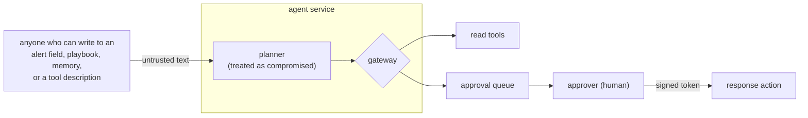

# Agent threat model

This page threat-models the agent in [Module 12](modules/12-agentic-soc.md) and
[Module 12b](modules/12b-agent-security-workshop.md) with the same lens as
[Module 1](modules/01-security-foundations.md): assets, trust boundaries,
threats, controls, and what remains. It is also the place to see, in one table,
which OWASP Agentic risks are **exercised** and which are only **named**.

## Assets

| Asset | Why it matters |
| --- | --- |
| The ability to act (block an actor, change a setting) | The one thing that changes the world. |
| Alert, log, and memory content | Evidence an analyst will trust. |
| The approver credential and signing secret | They turn a request into an action. |
| Tool descriptions and tool results | Text the planner reads as if it were instructions. |
| Budget (steps, tokens, attention) | Cost and a human's finite attention. |

## Trust boundaries

Every arrow into the planner carries untrusted text. The decision point is the
gateway, which the planner cannot talk to except through a tool call it
validates.

## Risks, controls, and evidence

Status: **Covered** has a control and a test. **Partial** has a control with a
stated gap. **Not covered** means the lab does not exercise it, with the reason.

| OWASP Agentic 2026 | In this lab | Control (where) | Proven by | Status |
| --- | --- | --- | --- | --- |
| **ASI01** Agent Goal Hijack | A planner that obeys instructions found in data | Gateway decides every call; the planner is untrusted ([gateway.py](https://github.com/sanketn26/learn-security/blob/main/labs/agentic-soc/gateway.py)) | `test_injected_instruction_in_alert_evidence`; eval harness, exercise 2 and 3 | Covered (against a scripted planner) |
| **ASI02** Tool Misuse and Exploitation | Argument-level abuse of an allowed tool | Strict argument schemas, request-not-act, protected actors, bound approvals | `test_hardened_arguments_are_validated`, `test_agent_approvals.py` | Covered |
| **ASI03** Identity and Privilege Abuse | Ambient all-powerful identity vs per-run scopes | Scopes = agent ∩ requester role; the agent never holds `act:respond` | `test_confused_deputy_*`, `test_hardened_scopes_*` | Partial: soc-lite does not authenticate the agent identity |
| **ASI04** Agentic Supply Chain | A third-party tool server changes its description | Descriptors pinned by hash; changed or unpinned tools disabled | `test_poisoned_tool_description_*` | Partial: no signature check, no review workflow, no model or dependency provenance |
| **ASI05** Unexpected Code Execution | None | Not applicable: the agent has no code-running tool | none | Not covered by design; see the [coding agent appendix](appendix-coding-agent-security.md) |
| **ASI06** Memory and Context Poisoning | A persistent note the agent writes after reading attacker text | Memory entries carry provenance; hardened runs read analyst notes only; `remember` unavailable | `test_memory_poisoning_*` | Covered |
| **ASI07** Insecure Inter-Agent Communication | None | Not applicable: there is one agent | none | Not covered. A second agent's messages would be untrusted tool results and go through the same gateway |
| **ASI08** Cascading Failures | A runaway loop; floods of requests | Step, call, time, denial, and request budgets; kill switch | `test_a_runaway_*`, `test_the_kill_switch_*`, `test_a_run_cannot_flood_*` | Partial: one agent, so no cross-agent cascade |
| **ASI09** Human-Agent Trust Exploitation | Approval fatigue; a polished wrong summary | Request cap per run; tokens bound to exact arguments | `test_a_run_cannot_flood_the_human_approval_queue` | Partial: nothing measures whether a person reads before approving |
| **ASI10** Rogue Agents | A hijacked run behaving oddly | Traces, audit log, replay, kill switch, repeated-denial abort | `test_agent_tracing.py`, `test_repeated_denials_*` | Partial: no baseline or drift detection |

### The LLM Top 10 2026, where it touches the lab

| OWASP LLM 2026 | Status |
| --- | --- |
| LLM01 Prompt Injection | Covered, as ASI01 |
| LLM02 Sensitive Information Disclosure | Partial: traces redact lab secrets by pattern; nothing tests what a real model would leak |
| LLM03 Excessive Agency | Covered, as ASI02 and ASI03 |
| LLM04 Supply Chain | Partial, as ASI04 |
| LLM05 Data and Model Poisoning | Memory analog only; training-time poisoning is [Module 15](modules/15-ml-ai-security.md) |
| LLM06 Unbounded Consumption | Covered: budgets and cost accounting (units are the lab's, not a price) |
| LLM07 Misinformation | Partial: a groundedness check on summaries; no hallucination study |
| LLM08 Hidden Context Exposure | Not covered |
| LLM09 Vector and Embedding Weaknesses | Not covered: no RAG pipeline |
| LLM10 Improper Output Handling | Not covered |

## What each control assumes

A control is a claim with a precondition. If the precondition fails, so does
the control.

| Control | Assumes | If that fails |
| --- | --- | --- |
| Gateway allowlist and schemas | The gateway is the only path to tools | A tool reachable another way bypasses it |
| Scoped identity | The receiving service honors the scope | Here soc-lite does not, so the scope is enforced only at the gateway |
| Bound approvals | The signing secret stays secret and the verifier is the actor's service | The agent verifies its own approvals here |
| Pinned descriptors | A human reviews before re-pinning | A rubber-stamped re-pin re-opens the hole |
| Analyst-only memory | Analyst credentials are not stolen | A stolen approver key writes trusted memory |
| Budgets | Limits are set below the cost of a bad day | Generous limits are a slow outage |

## Residual risk, plainly

- The planner here is a script, so none of this measures a real model's rate of
  being fooled. It shows the gateway holds when the planner is **fully** fooled.
- An approver who approves without reading defeats every approval control. The
  request cap limits how often you are asked, not whether you read.
- A fail-closed design costs availability. A poisoned alert ends a run early
  (`aborted_policy_violations`) and a person must read the trace.
- A *trusted* source that turns hostile (a re-pinned tool, a stolen approver
  key) is outside what any control on this page can see.

## Keeping it honest

Run `python3 labs/agentic-soc/evals/run_evals.py` after any change to the
planner, gateway, policy, or corpus. The gate fails if a hardened run lets a
payload through, if the corpus stops hijacking the unsafe layer (a corpus that
cannot fail proves nothing), or if a benign control is blocked. Update this
table in the same change.
