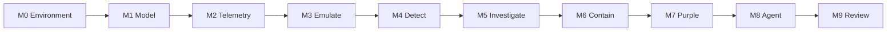

# Capstone — Operate a small defensive security platform

Alice has a valid login. She asks for note 2, which is Bob’s payroll draft.
The API returns 200 and the body.

By the end of the modules you can explain why that happened, spot it in the
logs, and fire an alert on it. The capstone asks you to prove it end to end
on one system. You model the platform, attack it inside the lab, detect it,
investigate, contain, check that the fix actually held, and let a
policy-bound agent help without letting it act alone.

You aren’t building a platform from scratch. `notes-api`, soc-lite, the
attack simulator and the agent are all provided. The work is operating them
and writing up what you find. Most of it you started in Modules 1–13. The
capstone collects that work, finishes it, and adds three detections you
write yourself.

Looking for a Python engineering project without an LLM component? Choose the
independent [vulnerability scanner capstone](vulnerability-scanner.md), which
progresses from inventory to focused checks, validated paths, and repair verification.

## What you hand in

Not sure where to start? [How to work through](howto.md) maps each
milestone to the module where you already began it.

Nine items, all in your local [work folder](work/README.md)
(`docs/capstone/work/`, gitignored). Start each one by copying its
[template](templates/README.md) into `work/`. Never edit a template in place.

| Milestone | You do | Hand in | Template · example | Started in | Done when |
| --- | --- | --- | --- | --- | --- |
| M0 Environment | `make lab-up`; read [ethics](../ethics.md) | — | — | Setup | Lab binds only to 127.0.0.1; health endpoints 200; `simulate.py` refuses a non-local `--base`; `/fetch` to an outside host returns 400 |
| M1 Model | Turn your Module 1 diagram into a threat model of the whole stack | `threat-model.md` | [template](templates/threat-model.md) · [Helix](reference/threat-model-example.md) | Module 1 | Names assets, trust boundaries, and residual risk |
| M2 Telemetry | Check the events you need exist and carry the right fields. Fix gaps; don’t rebuild logging | cited in `attack-coverage.md` and `incident-report.md` | — | Module 7 | Login, AuthZ, fetch, and search events have UTC time, event name, actor, object, and `trace_id` |
| M3 Emulate | `simulate.py --scenario all` | — | — | Modules 8–9 | Runs against loopback only |
| M4 Detect | Keep DET-001–005 and write **three** new rules against events no rule covers yet. Give every rule a replay fixture | `rules.yaml` + `fixtures/` + `attack-coverage.md` | [template](templates/attack-coverage.md), [fixtures](templates/replay-fixture.md) · [Helix](reference/attack-coverage-example.md) | Modules 8, 11 | Eight rules fire on sim traffic, or each miss is documented with a fix. Every fixture fires on its abnormal case and stays quiet on normal traffic. Every mapping has tactic, technique ID, confidence, and limitation |
| M5 Investigate | Open a case; build a UTC timeline; weigh competing hypotheses; `preserve-logs.sh` | `incident-report.md` | [template](templates/incident-report.md) · [Helix](reference/incident-report-example.md) | Modules 10–11 | Case exists with timeline entries; the evidence snapshot is unchanged after preservation; RCA names a control defect |
| M6 Contain | Preserve → contain → verify; redeploy with `LAB_MODE=false` or patch the code, then retest | `containment-runbook.md` | [template](templates/containment-runbook.md) · [Helix](reference/containment-runbook-example.md) | Module 11 | The runbook records the sequence you actually ran, evidence is preserved before containment, and at least one control change is retested |
| M7 Purple | One hypothesis, re-test, TP/FN/TN, one improved rule or control | `purple-report.md` | [template](templates/purple-report.md) · [Helix](reference/purple-report-example.md) | Module 9 | Records the before/after difference in detection or control |
| M8 Agent | `/investigate`; show a denied action, then an approved one | `agent-run.json` | [template](templates/agent-run.md) | Module 12 | 403 without `approval=APPROVE`; tools outside the allowlist denied; instruction-like text in evidence ignored |
| M9 Review | At least five architecture findings, plus one decision record for a control you chose | `architecture-review.md` + `security-decision-record.md` | [template](templates/architecture-review.md) · [Helix](reference/architecture-review-example.md); [template](templates/security-decision-record.md) · [Helix](reference/security-decision-record-example.md) | Module 13 | Five or more findings; the decision record names an alternative you considered and the residual risk |

**Your three detections.** The app already emits `authz_failure` (invalid
token, admin-blocked), `fetch_blocked_safety_rail`, `ssrf_blocked`,
`search_error`, and `note_create`. No rule covers any of them. Write your
three rules against those events in `labs/detections/rules.yaml`, using the
Module 11 DET-001 walkthrough as the model. A rule without a fixture hasn’t
been tested. You just believe it works.

**Replay fixtures.** For each of the eight rules, save two JSONL files in
`work/fixtures/`: one where the rule should fire and one where it should stay
quiet. The fire file must produce the rule ID. The quiet file must produce
nothing.

**Agent run.** Save the `/investigate` response you used as
`work/agent-run.json`. If you used a hosted LLM, redact it first.

Don’t commit the optional evidence tarball. It contains dummy secrets.

## How long it takes

**12–20 hours** if you kept your module work in `work/`, **25–30 hours**
if you’re starting cold. [How to work through](howto.md) breaks that down
by milestone and shows which module each piece comes from.

In a 13-week cohort this is week 13. In the intensive format it takes the
last three days.

## To pass

Score **80 or more** on the rubric **and** meet every “Done when” in the
table. On top of that: no real secrets and no testing outside scope.

## Rubric (100 points)

Each criterion is marked from one milestone’s hand-in.

| Criterion | Points | Marked from | Full marks |
| --- | --- | --- | --- |
| Threat model clarity | 10 | M1 `threat-model.md` | Assets, STRIDE-or-equivalent, residual risk |
| Telemetry quality | 10 | M2, as cited in `attack-coverage.md` and `incident-report.md` | UTC, event names, actor, object, trace_id |
| Detection quality | 15 | M4 `rules.yaml` + `fixtures/` | Eight rules with fixtures, not all IOC-only, documented FPs |
| ATT&CK discipline | 10 | M4 `attack-coverage.md` | Confidence and “why wrong”; no matrix theatre |
| Investigation | 15 | M5 `incident-report.md` | Timeline, hypotheses, impact, RCA |
| Response & recovery | 10 | M6 `containment-runbook.md` | Approval gate; runbook with evidence-before-containment order; retest |
| Purple validation | 10 | M7 `purple-report.md` | Hypothesis, evidence, delta |
| Agent safety | 10 | M8 `agent-run.json` | Policy, untrusted evidence, no unbounded tools |
| Architecture writing | 10 | M9 `architecture-review.md` + `security-decision-record.md` | Trade-offs, what not to automate, one decision record |

## Worked example (Helix Tickets)

The [Helix Tickets example](reference/README.md) is a small incident on a
different product. It shows what a finished timeline, runbook, and review
look like. Wrong product, right shape: if your work mentions Dana,
`HELIX_DEBUG`, or ticket 42, you’ve modelled the wrong system.

## Core failure scenarios

Each of these is already part of a “Done when” above. Run them all before
you hand in.

| Scenario | Expect | Milestone |
| --- | --- | --- |
| Alice reads `/notes/2` in LAB_MODE | DET-002; data in body | M3/M4 |
| Same after LAB_MODE=false | 404; no DET-002 success event | M6 |
| Six bad passwords | DET-001 | M4 |
| Fetch mock-imds in LAB_MODE | dummy JSON; DET-003 | M4 |
| Fetch `http://example.com` | safety rail 400 | M0 |
| `simulate.py --base http://8.8.8.8` | script exits | M0 |
| Agent action `approval=nope` | 403 | M8 |
| Agent action not in allowlist | 403 | M8 |
| Instruction-like text in evidence | stripped or ignored | M8 |

## Stretch scenarios and goals

Not scored. These are what a production SOC has to survive. Pick any that
interest you once the core is done. Modules 14–17 lead into several of
them.

| Scenario | Expect |
| --- | --- |
| One required field absent from an event | rejected/quarantined or explicitly marked partial; no silent match |
| Malformed JSON log line | pipeline continues; parse error becomes observable |
| Producer clock skew of five minutes | timeline flags skew; ordering does not silently claim certainty |
| Duplicate event delivery | idempotent ingest or documented duplicate suppression |
| Collector unavailable, then restored | buffered/lost interval measured; recovery documented |
| Stolen dummy session token replay | actor appears valid; behavior/object context drives detection |
| Suspicious but legitimate bulk API use | false positive recorded and rule tuned without hiding true abuse |
| Synthetic dependency alert | owner and reachability are enriched before severity decision |
| Container starts as root or privileged | posture check fails; workload does not pass production review |
| Threat-intel/enrichment source unavailable | investigation continues with lower confidence; no invented result |
| Misleading synthetic evidence contradicts primary log | conflict is surfaced; evidence trust is stated |
| Agent recommends an unsafe action | policy denies it even if a human types ambiguous approval |
| Allowed agent tool returns an error | action is not reported successful; tool error is audited |
| Action verification fails | workflow stops and proposes/executes the documented simulated rollback |
| Partial telemetry from one source only | scope and confidence remain explicitly limited |

Stretch goals:

- Run replay fixtures in CI, not just locally.
- Push past eight detections toward the full event surface (10-20 total).
- Non-root USER in notes-api Dockerfile.
- Rate-limit `/login`.
- Optional kind deploy with a NetworkPolicy denying metadata.
- Groundedness checks: fail `/investigate` if mapping not in catalog.
- OpenTelemetry traces exported to a file (not a full vendor APM).

## Scope and ethics

**Authorized lab use only.** Scope is this repository’s compose stack on
loopback ports. No real cloud accounts, no employer systems, no malware.

- Dummy credentials never go near a real IdP or cloud.
- No persistence, no ransomware simulation, no data destruction labs.
- Hosted LLMs: lab data only, and assume the provider logs it.
- If your repo is public, publish reports without raw dummy secrets.
- Cleanup: `make lab-reset` at the end.
