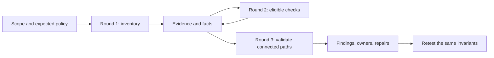

# Capstone 2 — Build an evidence-driven vulnerability scanner

Build a Python scanner for Acme Notes that works through successive rounds:
**scan the obvious → investigate what the evidence enables → connect weaknesses
→ validate impact → repair and retest**. The output is a defensible engineering
report, with reproducible evidence and explicit limits.

This is an independent alternative to the [defensive platform capstone](README.md).
Assume proficiency in Python: packaging, HTTP clients, typing, exceptions,
testing, and basic concurrency. There are no Python lessons and **no LLMs,
prompts, embeddings, or agent framework** in this project. Implement the
scheduling, checks, correlation, and reporting with ordinary code and explicit
rules. Budget 25–35 hours; doing both capstones adds this time to the course.

## How to work through this capstone

This is a human reasoning exercise. Write your hypotheses, design the checks,
and defend the conclusions yourself. Do not use an LLM to generate the scanner,
choose probes, infer chains, or write your analysis. Documentation, debuggers,
and ordinary libraries are welcome. Code volume and finding count earn no
credit by themselves.

Before implementing a check, write a short investigation journal entry:

1. **Invariant:** Who should be able to do what, to which resource? Where
   does that policy come from?
2. **Hypothesis:** What do you think is broken, and what have you actually
   observed so far?
3. **Alternative:** What legitimate behavior or measurement error could
   produce the same observation?
4. **Experiment:** What is the smallest next request that distinguishes
   those explanations? Predict its outcomes before running it.
5. **Revision:** What changed your mind? What remains unknown? What would
   you need before making a stronger claim?

Keep the original predictions when they turn out wrong. A well-supported
retraction is stronger work than a confident claim that survives only because
you never tried to disprove it.

The implementation hints below are deliberately staged and collapsed. Try
each task and write your prediction before opening its hint. Create your own
files as you go; there is no complete reference scanner to copy.

## The engineering question

An exposed API description is an observation. A low-privilege identity reading
another user's private note is a demonstrated boundary failure. An injection
that reveals foreign note IDs, followed by an unauthorized read of those IDs,
is a connected path with a larger consequence than either symptom alone.

Your scanner must preserve those distinctions. Every next request needs a
reason: which fact enabled it, what hypothesis it tests, and what result would
contradict the hypothesis. A failed request is not evidence of a secure system.



## Course knowledge you will use

| Course material | Scanner responsibility |
| --- | --- |
| 1: foundations | Define assets, expected access, boundaries, and impact |
| 2: network and OS | Inventory only scoped listeners; distinguish reachability from weakness |
| 3 and 6: identity and cryptography | Separate identities; inspect session properties without confusing decoding with signature verification |
| 4: application and API | Test object/function authorization and injection using controls |
| 5: cloud and containers | Validate server-side reachability to mock metadata; inspect supplied Compose configuration |
| 7 and 11: logs and investigation | Preserve evidence, correlate events, handle missing telemetry |
| 8 and 9: ATT&CK and purple work | Describe observed behavior precisely; repeat tests after repairs |
| 13 and 16: architecture and availability | Prioritize broken boundaries, control request budgets, explain residual risk |

Modules 10, 12, 14, 15, and 17 are optional for this capstone. Complete the
modules listed above in course order before starting.

## Target, scope, and setup

Use the existing `notes-api` and `mock-imds`. Start just those services from
the repository root; the scanner does not need `agentic-soc`:

```bash
docker compose -f labs/compose.yaml up -d --build notes-api mock-imds
curl http://127.0.0.1:8080/.well-known/lab
```

Use a fresh lab dataset and the documented dummy Alice, Bob, and admin
accounts from the [lab guide](../lab-guide.md). Provision credentials through
local configuration excluded from Git, such as a `.env` file (already ignored
by this repository). Keep a separate client/session for
each identity. Define expected access in a fixture: each ordinary user can
read their own notes, cannot read the other's private notes, and cannot list
admin users. Admin access is the positive control, not an attacker capability.

The scope manifest must specify exact origins, permitted paths and methods,
identities, owned test objects, allowed server-side fetch destinations
(including a benign non-metadata control destination), and request limits. Direct scanner traffic goes only to the declared loopback
origin. The explicitly permitted `mock-imds` URL is a destination passed to
`/fetch`, not a new direct scan target. Keep the application's safety rails.

Implement one shared transport enforcing:

- Exact scheme/host/port matching before every request. For this capstone,
  accept literal loopback addresses and reject arbitrary hostnames.
- No automatic redirects, inherited HTTP proxies, or discovery-based scope
  expansion. OpenAPI server URLs and response links are untrusted input.
- A default global limit of 2 requests/second, concurrency of 2, a 5-second
  request deadline, 256 KiB response limit, and 200 requests per run. Count
  logins and retries; allow at most one retry for transient read failures.
- A bounded queue and total run deadline; cancellation preserves partial
  results. Stop on exhausted budgets or repeated service failures.
- Redaction of authorization headers, cookies, passwords, tokens, note bodies,
  and mock credentials before writing evidence or reports.

This is **authorized local lab use only**. No address-range sweeps, password
spraying, destructive payloads, credential replay into cloud accounts, or
load testing. Those actions are unnecessary to demonstrate these invariants.

### Step 1 — Build the request boundary

**Build first:** create `scope.py` and `transport.py`. Route all requests
through one function. Decide which requests must be rejected before any
network activity. Write those cases down, then implement them.

**Checkpoint:** an out-of-scope origin and a redirect cannot cause a second
network request. A budget counts the controls as well as the probes.

??? hint "After attempting Step 1: start with an exact origin comparison"
    This fragment belongs inside your scope validator. It is only one part
    of the transport contract above:

    ```python
    from urllib.parse import urlsplit

    def origin(url: str) -> tuple[str, str, int]:
        parsed = urlsplit(url)
        if parsed.scheme not in {"http", "https"} or not parsed.hostname:
            raise ValueError("Unsupported URL")
        if parsed.username is not None or parsed.password is not None:
            raise ValueError("Credentials do not belong in target URLs")
        default_port = 443 if parsed.scheme == "https" else 80
        return parsed.scheme, parsed.hostname, parsed.port or default_port
    ```

    Compare this result to your manifest's literal loopback origin **before**
    dispatch. Add path/method validation yourself. Configure your client to
    disable redirects and environment proxies. Do not assume parsing a URL
    authorizes it.

    **Think:** how will you prove rejection happened before dispatch? What
    happens if a permitted response links to an unpermitted origin?

## Round 1 — Scan the obvious

Create a baseline from the scope manifest and low-impact requests. Record the
lab marker, service health, exposed OpenAPI document, route/method inventory,
authentication requirements, and the behavior of an ordinary request.
Inventory the supplied Compose file as a separately labeled configuration
source: port bindings, network membership, and service privileges.

Implement at least four inventory checks: lab identity/reachability, API
schema exposure, authentication baseline, and Compose posture. An unavailable
schema must not halt the scan: use the explicitly scoped route fixture and
record that discovery was incomplete.

Do not equate an open port, `/docs`, a version string, or a missing browser
header with a confirmed exploitable vulnerability. State the relevant policy
and deployment context. Plain HTTP on this isolated loopback lab is not proof
that a production deployment exposes credentials. Supplied source/configuration
is useful context, but it does not prove runtime exploitability. For example,
`compose.yaml` ships a default `JWT_SECRET`. Report it as a configuration
finding. You may validate it as your independent third path by signing a
dummy lab token for the local API only, and only if you record the
hypothesis, controls, and claim boundary first.

**Deliverable:** an inventory with source, timestamp, identity, confidence,
and evidence IDs; a baseline request/response summary for each tested route.

### Step 2 — Keep an observation smaller than a conclusion

**Build first:** create `models.py` and your first inventory check. Feed it
three local response fixtures: a schema document, HTTP 200 with an error
object, and a timeout. Predict which facts each may produce.

**Checkpoint:** the latter two cannot produce a route-discovery fact, and
none of the three proves an authorization vulnerability.

??? hint "After attempting Step 2: record provenance before interpretation"
    Start with a small immutable record, then extend it for the implementation
    contract later in this brief:

    ```python
    from dataclasses import dataclass

    @dataclass(frozen=True)
    class Observation:
        evidence_id: str
        run_id: str
        target: str
        actor: str
        check_id: str
        status_code: int | None
        summary: str  # Selected, redacted evidence; never a raw response dump.
    ```

    Keep the check result separate from the observation. A 200 response
    establishes only the HTTP status until you validate the expected shape
    and meaning of its content. Use `None` for a missing HTTP response;
    do not manufacture a status code for a timeout.

    **Think:** what minimum redacted assertion evidence lets another person
    challenge your conclusion without receiving the protected data?

## Round 2 — Let evidence select the next checks

Each check declares required facts, the invariant, a bounded probe, a positive
control, expected contradictory evidence, and the facts it can produce.
Schedule only checks whose prerequisites are satisfied. Record why every
other check was skipped. Missing credentials mean `skipped`, not `passed`.

| Check | Prerequisites | Validation and control |
| --- | --- | --- |
| Object authorization | Two ordinary identities and known ownership | Bob can read his private fixture note; Alice must not receive that same note's protected content |
| Function authorization | Ordinary and admin sessions | Admin can list `/admin/users`; ordinary users must be denied |
| Search isolation/injection | Authenticated search and seeded ownership | Compare a normal search and a bounded lab injection case; verify whether foreign-owner rows appear; a syntax error alone is insufficient |
| Server-side metadata access | Authenticated `/fetch` and permitted mock destination | Compare a benign non-metadata fetch (for example `http://notes-api:8080/health`) with the mock metadata fixture; inspect nested status and body, not just the outer HTTP 200 |
| Session expiration policy | A dummy session and an explicit expiry requirement | Report missing expiry as a token-policy finding; decoding claims alone does not establish signature acceptance or impersonation |

Implement all five. Use the existing local attack simulator
(`labs/attack-sim/simulate.py`) as a reference for lab cases, but author your
own controls and assertions.
Do not make scanner decisions from `LAB_MODE`, an application's event label,
or a known vulnerable source branch. Those describe the fixture; the check
must measure behavior.

A control must still be valid after the repair. The hardened `/fetch` blocks
every `mock-imds` and `metadata.internal` request, including that service's
health route, so a mock-service control would fail in hardened mode and leave
the check permanently inconclusive. Choose a benign destination the hardened
application still permits.

Use these result states consistently: `confirmed`, `not_observed`,
`inconclusive`, `skipped`, and `error`. `not_observed` requires that the relevant
controls worked and the tested invariant held. A timeout, failed login,
malformed response, or missing object cannot earn that state.

### Step 3 — Make missing knowledge stop a check

**Build first:** create `scheduler.py`. Describe the prerequisites of your
object-authorization check before implementing its probe. Shuffle the order
of your checks and verify that execution still follows evidence dependencies.

**Checkpoint:** discovering a note route cannot run the authorization check
without identities and known ownership. The report says why it was skipped.

??? hint "After attempting Step 3: eligibility is a set operation"
    This fragment assumes you have already selected facts for the correct
    run, target, and identity. You must implement that selection:

    ```python
    required = {"note_read_route", "two_sessions", "known_ownership"}
    missing = required - available_fact_names
    if missing:
        # Record a skipped result with the missing prerequisites.
        ...
    else:
        # Queue the check through your bounded scheduler.
        ...
    ```

    Reconsider pending checks only when new facts arrive. Track completed
    check/input combinations. Stop when no pending check can become eligible.
    A skipped check does not create a fact that its invariant holds.

    **Think:** can a fact from the admin control accidentally enable an
    ordinary user's probe? How will the fact representation prevent that?

### Step 4 — Implement one controlled validation

**Build first:** implement the object-authorization check before adding the
other four. Write the expected access policy and a successful owner control.
Then implement the cross-user probe and compare protected-content evidence.

**Checkpoint:** test denied access, unauthorized content, an error envelope
with HTTP 200, and a missing fixture object. Only one establishes disclosure.
The hardened application denies a foreign note with the same `404 not found`
it returns for a missing object. That response alone cannot tell denial from
absence; your owner control is what gives it meaning.

??? hint "After attempting Step 4: establish the control before the verdict"
    Use this small decision fragment inside your own check. Define the
    predicates from the access policy and response semantics yourself:

    ```python
    if not owner_control_valid:
        status = "inconclusive"
    elif foreign_private_content_returned:
        status = "confirmed"
    elif non_disclosure_observed:
        status = "not_observed"
    else:
        status = "inconclusive"
    ```

    These booleans are conclusions you must support with evidence, not
    aliases for HTTP status comparisons. Keep request failures distinct from
    application denials. Check that the object is actually private under the
    supplied policy.

    **Think:** if the owner control succeeds before the probe but fails after
    it, could deletion or changing state explain the result? State what your
    test assumes about fixture stability.

## Round 3 — Chain things up

Represent identities, endpoints, objects, and capabilities as typed facts.
Connect them with explicit rules that join on the same target, identity,
object, and run. A list of unrelated findings with a higher severity is not
a chain. Every edge needs evidence and every transition needs satisfied
preconditions. Facts from an admin control must never become capabilities of
Alice. Keep fixture-only knowledge distinct from information discovered by
an ordinary user.

Use these two paths as calibration cases in the existing lab. Before
implementing either, draw the boundaries and predict the evidence yourself:

| Path | Required evidence | Claim boundary |
| --- | --- | --- |
| Search injection → foreign note identifier → unauthorized note read | An injection response reveals a foreign-owner ID to Alice; use that returned ID in Alice's read; compare ownership and protected content with Bob's control | Confirms enumeration plus cross-user disclosure. A fixture ID used directly proves the read flaw, but not this discovery chain |
| Server-side fetch → internal mock metadata → dummy credential exposure | Alice's fetch reaches the permitted mock metadata route and returns the expected credential-shaped fixture; retain redacted structural evidence | Confirms exposure of mock credentials. No real cloud access, permissions, or account compromise is demonstrated |

For the metadata path, distinguish a reachability capability from an additional
independent vulnerability: several steps can arise from one SSRF weakness.
The mock metadata response is intentionally synthetic. Do not invent a cloud
privilege-escalation step that the lab cannot test.

A rule should produce a candidate path from facts, then schedule any missing
validation through the same transport and budgets. Require fresh validation
before marking the path confirmed. Terminate when there are no new eligible
checks, or a budget is exhausted. Deduplicate by check, target, identity, and
input object; bound chain depth (for example, four edges) to prevent cycles.

For each path, explain the cheapest control that breaks it and what remains
if only that control is fixed. Blocking object reads can break full-note
exposure while injection still leaks titles and IDs. Blocking metadata fetch
can break the credential path without proving all server-side fetching safe.

**Deliverable:** two evidence-backed paths, plus negative fixtures showing
that each path disappears when an essential edge is absent. Also test an
identity mismatch and stale evidence from a previous run.

### Step 5 — Join evidence, then try to break the join

**Build first:** create `chains.py`. Write the search-to-read rule using
explicit identity, resource, and run relationships. Before a positive test,
write cases for different users, different objects, and different runs.

**Checkpoint:** each mismatch prevents a confirmed path, even when both
individual observations look suspicious.

??? hint "After attempting Step 5: a shared service is not a sufficient join"
    Suppose you designed two typed facts, `discovery` and `read`. A necessary
    join might look like this; adapt field names to your own records:

    ```python
    same_context = (
        discovery.run_id == read.run_id
        and discovery.target == read.target
        and discovery.actor == read.actor
    )
    same_object = discovery.object_id == read.object_id
    candidate = same_context and same_object
    ```

    This produces a **candidate**, not a confirmed path. You still need
    evidence that discovery exposed the identifier to that actor, the read
    crossed the expected boundary, and validation is fresh. A fixture-known
    identifier does not prove the actor discovered it through injection.

    **Think:** where do fact provenance and the rule's prerequisite evidence
    live? How will the report explain why a tempting chain was rejected?

## Independent investigation — earn the conclusion

Propose a third path from the course material. State each prerequisite and
which observation would invalidate it before you build anything. It may
combine existing lab behavior, or use a small local fixture you author with
both vulnerable and corrected variants. Label added behavior as your fixture;
do not claim the supplied lab already implements it.

A rigorously disproved path earns full credit. You must run discriminating
checks, identify the missing or blocked edge, and narrow your claim. An
untested speculative diagram does not count. Your fixture must encode an
access policy independently of the scanner so that you are not simply testing
your code against its own assumptions.

Work through these decisions in your journal before reading your run output:

- You have 12 requests left, an exposed API schema, a search error, and an
  expired session. Which checks do you spend the budget on, in what order,
  and which conclusions must wait? Explain the information each request buys.
- Alice receives HTTP 200 for Bob’s note. Is it private, shared, cached, an
  error envelope, or truly unauthorized content? Design a control that
  distinguishes your leading explanation from its strongest alternative.
- Two checks report weaknesses on the same service. What exact capability
  does the first provide that the second needs? If neither needs the other,
  explain why calling them a chain would mislead the repair owner.
- The application logs say “injection,” but the response contains only
  Alice’s records. Which claim does each source support? What further
  experiment could resolve the disagreement?
- After a fix, the scanner finds nothing because login is broken. Show how
  your reporting prevents this apparent improvement from being accepted.
- A repair breaks the chain but leaves a weaker disclosure. Should the
  ticket close? Separate the original invariant, remaining risk, and the
  evidence an owner would need to accept that risk.

Finally, deliberately try to fool your own scanner with one misleading
fixture: a successful status carrying an error, a shared object, stale
evidence, or an identity mix-up. Record the false conclusion your first
design could have reached and how you prevented it without hiding true cases.

## Implementation contract

Suggested learner-owned layout (you create these files):

```text
scanner/
  pyproject.toml
  src/scanner/
    cli.py
    scope.py
    transport.py
    models.py
    scheduler.py
    checks/
    chains.py
    reporting.py
  fixtures/
  tests/
```

Use typed records for observations, findings, and paths. At minimum, persist:

| Record | Required fields |
| --- | --- |
| Run | Run ID, UTC start/end, target, configuration digest without credentials, check versions, budgets used, completion state |
| Observation | Evidence ID, run ID, source type, check ID, actor alias, resource ID, request summary, response status, redacted assertion evidence, timestamp |
| Finding | Stable ID, invariant, status, affected asset, evidence references, confidence, impact, severity rationale, owner, remediation, retest procedure |
| Path | Rule/version, ordered fact/edge references, identity, prerequisites, validation status, demonstrated impact, untested assumptions, breaking control |

Stable finding IDs should survive reruns; evidence IDs belong to a specific
run. Separate confidence in the observation from impact and remediation
priority. Explain severity using access needed, exposed data, reachability,
and compensating controls. Avoid invented CVSS scores or banner-only CVE
matches. CWE can describe a weakness; ATT&CK describes observed behavior and
is not a vulnerability severity scale.

Expose a CLI for inventory, full scan, offline report generation, and comparing
two runs. Emit machine-readable JSON and a Markdown report from the same
records. Document exit codes that distinguish findings, clean completion, and
incomplete execution. Offline reporting must not make network requests.

## Repair and retest

1. Preserve the first run's redacted evidence and report outside Docker volumes.
2. Fix one boundary at a time, or use `LAB_MODE=false` for the full hardened
   comparison. Record exactly which controls changed.
3. When switching modes, reset the lab data so password verifiers are reseeded
   for that mode. The following commands delete local lab volumes, including
   logs and cases; preserve your evidence first:

   ```bash
   docker compose -f labs/compose.yaml down -v
   LAB_MODE=false docker compose -f labs/compose.yaml up -d --build notes-api mock-imds
   ```

4. Obtain fresh sessions and rerun the same ownership fixtures and invariants.
   Verify ordinary authorized behavior still works. Continue checks using
   scoped routes even though hardened mode disables OpenAPI discovery.
5. Compare findings as resolved, persistent, new, or unverified. Mark a finding
   resolved only when its equivalent check completed with valid controls;
   disappearance caused by skipped work is unverified.

### Step 6 — Make a disappearing finding earn its resolution

**Build first:** create `reporting.py` and run comparison. Compare a vulnerable
run against a hardened run, then against a run where login fails. Predict
which findings can be called resolved before examining the output.

**Checkpoint:** the login failure yields unverified findings, even if the
new run contains zero confirmed vulnerabilities.

??? hint "After attempting Step 6: compare completed checks, not finding counts"
    After matching the same invariant, target, identity role, and fixture:

    ```python
    if equivalent_check_completed and controls_valid:
        if current_status == "not_observed":
            disposition = "resolved"
        elif current_status == "confirmed":
            disposition = "persistent"
        else:
            disposition = "unverified"
    else:
        disposition = "unverified"
    ```

    Implement matching, new findings, and missing checks yourself. Include
    the evidence references that justify every disposition. A changed rule
    version may require review before results are comparable.

    **Think:** could a changed fixture make a real vulnerability disappear
    from the comparison? How will you distinguish a repair from lost coverage?

### Step 7 — Work without a hint

Complete the independent third-path investigation, the misleading fixture,
and the engineering handoff. There is no implementation fragment for this
step. Use your journal to explain which experiment you chose, which competing
explanation it ruled out, and what evidence would change your conclusion.

## Milestones and submission

| Milestone | Budget | Done when |
| --- | --- | --- |
| Scope and model | 3–4 h | Manifest, ownership fixture, invariants, transport contract |
| Inventory | 4–5 h | Four inventory checks and evidence records |
| Focused checks | 6–8 h | Five checks with positive, negative, and failure cases |
| Chaining | 5–7 h | Two validated paths, scheduler bounds, broken-edge fixtures |
| Repair and report | 7–11 h | Hardened rerun, comparison, tests, engineering handoff |

Submit your investigation journal (including revised hypotheses), your third
path investigation, scanner source and usage instructions, sanitized scope/ownership
fixtures, deterministic tests, both run reports and their JSON records, a
path diagram, and a short architecture/decision note. In that note explain
what your scanner cannot establish and one rule you deliberately did not
automate. Include no raw credentials or unrestricted response dumps.

## Acceptance criteria

- [ ] Runs entirely without an LLM, hosted service, or agentic-soc.
- [ ] Scope and budgets apply to every request, including controls and retries.
- [ ] Four inventory checks and five focused checks meet the contracts above.
- [ ] Every focused check has vulnerable, hardened, and inconclusive/error fixtures.
- [ ] Predictions, competing explanations, and revised conclusions appear in the journal.
- [ ] An independently proposed third path is confirmed or disproved with evidence.
- [ ] A misleading fixture challenges the scanner without suppressing true findings.
- [ ] Both chains have evidence for every edge and a negative broken-edge case.
- [ ] Cross-identity, stale, and unrelated facts cannot form confirmed paths.
- [ ] Redirects, proxy environment variables, oversized bodies, timeouts,
      malformed JSON, missing credentials, and budget exhaustion have tests.
- [ ] Reports preserve uncertainty, redact secrets, and reproduce offline.
- [ ] Vulnerable and hardened integration runs demonstrate working controls;
      missing coverage cannot be reported as a successful repair.
- [ ] The final report names owners, repairs, demonstrated impact, and residual risk.

## Rubric (100 points)

| Criterion | Points | Full marks |
| --- | ---: | --- |
| Scope and transport | 15 | Central enforcement, bounded execution, tested rejection paths |
| Inventory and evidence | 15 | Useful baseline, provenance, redaction, clear observation/finding distinction |
| Focused validation | 20 | Five controlled checks; failures never count as secure results |
| Chaining and independent reasoning | 25 | Calibrated paths, third-path investigation, competing hypotheses, correct joins, negative cases |
| Repair verification | 15 | Comparable reruns, authorized behavior preserved, honest coverage delta |
| Engineering judgment and handoff | 10 | Journal revisions, discriminating experiments, actionable report, limitations and trade-offs |

Pass at **80 or more with every acceptance criterion met**. Finding more
issues does not compensate for unsupported claims or missing controls.

For the review, demonstrate one confirmed path, remove one edge, and explain
why the conclusion changes. Then show a timeout case and explain why the
scanner refuses to call it a fix. Defend your independent investigation and
name the evidence that would change your conclusion. A reviewer should change
one assumption (identity, ownership, reachability, or freshness) and ask you
to predict the result before rerunning the check.
