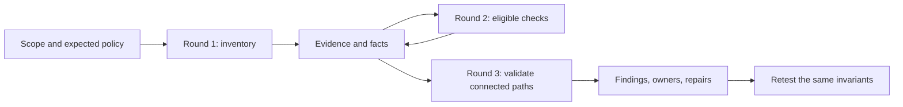

# Capstone 2 — Build an evidence-driven vulnerability scanner

Build a Python scanner for Acme Notes that works through successive rounds:
**scan the obvious → investigate what the evidence enables → connect weaknesses
→ validate impact → repair and retest**. The output is a defensible engineering
report, with reproducible evidence and explicit limits.

This is an independent alternative to the [defensive platform capstone](README.md).
Assume proficiency in Python: packaging, HTTP clients, typing, exceptions,
testing, and basic concurrency. There are no Python lessons and **no LLMs,
prompts, embeddings, or agent framework** in this project. Implement the
scheduling, checks, correlation, and reporting with ordinary code and explicit
rules. Budget 25–35 hours; doing both capstones adds this time to the course.

## How to work through this capstone

This is a human reasoning exercise. Write your hypotheses, design the checks,
and defend the conclusions yourself. Do not use an LLM to generate the scanner,
choose probes, infer chains, or write your analysis. Documentation, debuggers,
and ordinary libraries are welcome. Code volume and finding count earn no
credit by themselves.

Before implementing a check, write a short investigation journal entry:

1. **Invariant:** Who should be able to do what, to which resource? Where
   does that policy come from?
2. **Hypothesis:** What do you think is broken, and what have you actually
   observed so far?
3. **Alternative:** What legitimate behavior or measurement error could
   produce the same observation?
4. **Experiment:** What is the smallest next request that distinguishes
   those explanations? Predict its outcomes before running it.
5. **Revision:** What changed your mind? What remains unknown? What would
   you need before making a stronger claim?

Keep the original predictions when they turn out wrong. A well-supported
retraction is stronger work than a confident claim that survives only because
you never tried to disprove it.

The implementation hints below are deliberately staged and collapsed. Try
each task and write your prediction before opening its hint. Create your own
files as you go; there is no complete reference scanner to copy.

## The engineering question

An exposed API description is an observation. A low-privilege identity reading
another user's private note is a demonstrated boundary failure. An injection
that reveals foreign note IDs, followed by an unauthorized read of those IDs,
is a connected path with a larger consequence than either symptom alone.

Your scanner must preserve those distinctions. Every next request needs a
reason: which fact enabled it, what hypothesis it tests, and what result would
contradict the hypothesis. A failed request is not evidence of a secure system.



## Course knowledge you will use

| Course material | Scanner responsibility |
| --- | --- |
| 1: foundations | Define assets, expected access, boundaries, and impact |
| 2: network and OS | Inventory only scoped listeners; distinguish reachability from weakness |
| 3 and 6: identity and cryptography | Separate identities; inspect session properties without confusing decoding with signature verification |
| 4: application and API | Test object/function authorization and injection using controls; classify response headers without treating a missing header as an exploit |
| 5: cloud and containers | Validate server-side reachability to mock metadata; read the supplied Compose file as configuration |
| 7 and 11: logs and investigation | Preserve evidence, correlate events, handle missing telemetry |
| 8 and 9: ATT&CK and purple work | Describe observed behavior precisely; repeat tests after repairs |
| 13 and 16: architecture and availability | Prioritize broken boundaries; keep the scanner's own request budget separate from whether `/login` throttles callers |

Modules 10, 12, 14, 15, and 17 are optional for this capstone. Complete the
modules listed above in course order before starting.

## Target, scope, and setup

Use the existing `notes-api` and `mock-imds`. Start just those services from
the repository root; the scanner does not need `agentic-soc`:

```bash
docker compose -f labs/compose.yaml up -d --build notes-api mock-imds
curl http://127.0.0.1:8080/.well-known/lab
```

Use a fresh lab dataset and the documented dummy Alice, Bob, and admin
accounts from the [lab guide](../lab-guide.md). Provision credentials through
local configuration excluded from Git, such as a `.env` file (already ignored
by this repository). Keep a separate client/session for
each identity. Define expected access in a fixture: each ordinary user can
read their own notes, cannot read the other's private notes, and cannot list
admin users. Admin access is the positive control, not an attacker capability.

The scope manifest must specify exact origins, permitted paths and methods,
identities, owned test objects, allowed server-side fetch destinations
(including a benign non-metadata control destination), and request limits. Direct scanner traffic goes only to the declared loopback
origin. The explicitly permitted `mock-imds` URL is a destination passed to
`/fetch`, not a new direct scan target. Keep the application's safety rails.

Implement one shared transport enforcing:

- Exact scheme/host/port matching before every request. For this capstone,
  accept literal loopback addresses and reject arbitrary hostnames.
- No automatic redirects, inherited HTTP proxies, or discovery-based scope
  expansion. OpenAPI server URLs and response links are untrusted input.
- A default global limit of 2 requests/second, concurrency of 2, a 5-second
  request deadline, 256 KiB response limit, and 200 requests per run. Count
  logins and retries; allow at most one retry for transient read failures.
- A bounded queue and total run deadline; cancellation preserves partial
  results. Stop on exhausted budgets or repeated service failures.
- Redaction of authorization headers, cookies, passwords, tokens, note bodies,
  and mock credentials before writing evidence or reports.

This is **authorized local lab use only**. No address-range sweeps, password
spraying, destructive payloads, credential replay into cloud accounts, or
load testing. Those actions are unnecessary to demonstrate these invariants.

Trying the access you should not have, against this API, is the work. You
stop when the attempt has confirmed, contradicted, or failed to test one
invariant you can hand to the person who would fix it. A longer list of
payloads is not a better scan.

### Step 1 — Build the request boundary

**Build first:** create `scope.py` and `transport.py`. Route all requests
through one function. Decide which requests must be rejected before any
network activity. Write those cases down, then implement them.

**Checkpoint:** an out-of-scope origin and a redirect cannot cause a second
network request. A budget counts the controls as well as the probes.

??? hint "After attempting Step 1: start with an exact origin comparison"
    This fragment belongs inside your scope validator. It is only one part
    of the transport contract above:

    ```python
    from urllib.parse import urlsplit

    def origin(url: str) -> tuple[str, str, int]:
        parsed = urlsplit(url)
        if parsed.scheme not in {"http", "https"} or not parsed.hostname:
            raise ValueError("Unsupported URL")
        if parsed.username is not None or parsed.password is not None:
            raise ValueError("Credentials do not belong in target URLs")
        default_port = 443 if parsed.scheme == "https" else 80
        return parsed.scheme, parsed.hostname, parsed.port or default_port
    ```

    Compare this result to your manifest's literal loopback origin **before**
    dispatch. Add path/method validation yourself. Configure your client to
    disable redirects and environment proxies. Do not assume parsing a URL
    authorizes it.

    **Think:** how will you prove rejection happened before dispatch? What
    happens if a permitted response links to an unpermitted origin?

??? hint "After attempting Step 1: the request never leaves the process"
    Stop the lab and run your test suite. Does any test still pass? If
    every test needs the API running, you have only tested the case where
    scope says yes.

    ??? note "Shape: the fixtures that need no network"
        - `http://example.com/notes` is rejected before the client is built.
        - A response from `http://127.0.0.1:8080/notes` whose `Location` is
          `http://169.254.169.254/` ends the exchange. Assert the client was
          called once.
        - `http://notes.example/` inside a response body stays data. The
          manifest decides what is in scope.
        - With `HTTP_PROXY` set in the test environment, the client still
          connects directly.
        - A 300 KiB body arrives as 256 KiB plus a `truncated` flag, and the
          scanner stops reading at the cap.
        - A request that times out still costs one unit of the 200. Logins
          and controls cost one too. A `401` is an answer, so it is never
          retried. Timeouts and connection errors get one retry at most.
        - A fixture with `Authorization: Bearer lab-token` and a JSON field
          holding `LABFAKEACCESSKEYID` saves an observation that says both
          were present and contains neither value.

    ??? example "Sketch: rejection in front of the socket"
        Names match `httpx`. Your client may differ. Finish the redaction
        yourself:

        ```python
        LIMIT = 256 * 1024

        def __init__(self, scope, budget):
            self.scope, self.budget = scope, budget
            # Client-level settings: they apply to every request, retries included.
            self.client = httpx.Client(trust_env=False, follow_redirects=False, timeout=5)

        def send(self, method: str, url: str) -> Observation:
            self.scope.reject_unless_allowed(url)  # must run before any client call
            self.budget.consume(1)  # before dispatch, so a timeout is still counted
            chunks, size, truncated = [], 0, False
            with self.client.stream(method, url) as response:
                for chunk in response.iter_bytes():
                    if size + len(chunk) > LIMIT:
                        chunks.append(chunk[: LIMIT - size])
                        truncated = True
                        break  # stop reading; the cap limits what we receive
                    chunks.append(chunk)
                    size += len(chunk)
            return redact(Observation(...))  # status, headers, truncated, selected fields
        ```

        `consume` raises `BudgetExhausted` when nothing is left, so no path
        reaches the client without paying.

    **Think:** if two checks share one transport, which test proves a bug in
    the second check cannot bypass the budget?

## Round 1 — Scan the obvious

Create a baseline from the scope manifest and low-impact requests. Record the
lab marker, service health, exposed OpenAPI document, route/method inventory,
authentication requirements, and the behavior of an ordinary request.
Inventory the supplied Compose file as a separately labeled configuration
source: port bindings, network membership, and service privileges.

Implement these inventory checks: lab identity/reachability, API schema
exposure, authentication baseline, response headers, and Compose posture. An
unavailable schema must not halt the scan: use the explicitly scoped route
fixture and record that discovery was incomplete.

**Response headers.** From one scoped response you already received (`/health`
is enough), classify each of `Strict-Transport-Security`,
`Content-Security-Policy`, `X-Content-Type-Options`, `X-Frame-Options`,
`Referrer-Policy`, and `Permissions-Policy` as `missing`, `weak`, or `set`.
Weak means the header is present and does not do the job. `max-age=0` is
weak. A `default-src *` policy is weak. Do not letter-grade the result, and
do not request any origin except the scoped loopback API. Implement the
classification in the scanner. Do not call the target application and trust
its own opinion of its headers.

In the supplied lab, vulnerable mode sends `max-age=0` and omits the other
five. Hardened mode sends a non-zero `max-age` and
`Content-Security-Policy: default-src 'none'` because this service returns
JSON, not a page. The lab speaks plain HTTP to loopback, where a browser
ignores HSTS. Report the bytes the app emits, and say that they reach a
browser once a TLS proxy forwards them. That sentence is the claim boundary
for every header finding in this capstone.

**Compose posture.** Read `labs/compose.yaml` as configuration, in a record
kept separate from runtime observations. Record whether published ports bind
`127.0.0.1` or every interface, whether any service sets `privileged` or
mounts the Docker socket, and whether `JWT_SECRET` has a default in the file.
The supplied file binds loopback, sets neither `privileged` nor a socket
mount, and does ship a default `JWT_SECRET`. Record those absences. Absence
of a socket mount is not a finding that the host is hardened. The default
secret is a configuration finding. Whether a token signed with it is
accepted is a separate claim. You may validate that claim as your independent third path
by signing a dummy lab token for the local API only, and only if you record
the hypothesis, controls, and claim boundary first.

An open port, `/docs`, a version string, a header classification, and a
Compose default are inventory. None of them is a confirmed exploitable
vulnerability on its own. State the policy
and the deployment context. Plain HTTP on this isolated loopback lab is not
proof that a production deployment exposes credentials. Supplied
configuration is useful context. It does not prove runtime exploitability.

??? hint "After attempting the header check: classify the bytes, then stop"
    Open the observation you saved for `/health`. Does it contain the
    response headers, or only a status and a body? You can't classify
    headers you didn't keep.

    ??? note "Shape: a predicate per header, written before you look"
        Look names up case-insensitively. An absent name and a blank value
        are both `missing`. For the rest:

        | Header | `set` when |
        | --- | --- |
        | `Strict-Transport-Security` | `max-age=` parses to a positive integer. Missing, non-numeric, or `0` is `weak` |
        | `Content-Security-Policy` | Split on `;`. The first directive named `default-src` exists and no token in its source list is `*`. The words `default-src` appearing somewhere in the text are not enough |
        | `X-Content-Type-Options` | `nosniff` |
        | `X-Frame-Options` | `DENY` or `SAMEORIGIN` |
        | `Referrer-Policy` | The last recognized token is one of `no-referrer`, `same-origin`, `origin`, `strict-origin`, `origin-when-cross-origin`, `strict-origin-when-cross-origin`. Browsers ignore unrecognized values, so `garbage` is `weak`. `unsafe-url` and `no-referrer-when-downgrade` leak the full URL and are `weak` too |
        | `Permissions-Policy` | Any non-empty value |

        Write the table in the scanner rather than importing
        `describe_response_headers` from `notes-api`. The target does not get
        to grade itself.

        Expect `weak` for HSTS and `missing` for the other five in
        vulnerable mode, and `set` for all six in hardened mode. If
        hardened mode still shows `max-age=0`, the container was not
        recreated with `LAB_MODE=false`. That's a setup mistake, so fix it
        and don't record it as a second finding. Use the loopback caveat
        from **Response headers** above as the finding's claim boundary.

    ??? example "Sketch: HSTS, and the loop for the other five"
        ```python
        NAMES = (
            "strict-transport-security",
            "content-security-policy",
            "x-content-type-options",
            "x-frame-options",
            "referrer-policy",
            "permissions-policy",
        )

        def classify_hsts(value: str | None) -> str:
            if value is None or not value.strip():
                return "missing"
            seconds = ...  # integer after max-age=, or None when it is absent
            if seconds is None or seconds <= 0:
                return "weak"
            return "set"

        def classify_headers(headers: dict[str, str]) -> dict[str, str]:
            folded = {name.lower(): value for name, value in headers.items()}
            return {name: ... for name in NAMES}  # one of missing, weak, set
        ```

??? hint "After attempting the Compose check: absence is a recorded fact"
    Add `# privileged: true` as a comment to a copy of the Compose file.
    Does your check now report a privileged service? If it does, it is
    reading text instead of configuration.

    ??? note "Shape: walk the mappings, record what is absent"
        Parse the file as YAML and walk each service.

        - A published port such as `127.0.0.1:8080:8080` names its bind
          host before the first colon. `8080:8080` has none, which means
          every interface. This check reads the file only. Don't open a
          socket to confirm the port.
        - `privileged` and a `docker.sock` mount are recorded even when
          they're absent, as "not set in this file". The daemon itself
          wasn't inspected, so that is all the record can say.
        - `JWT_SECRET: ${JWT_SECRET:-...}` means a default is written in
          the file. Record the key and that a default exists. Leave the
          value out of the report, and leave signing a token with it to the
          third path.

    ??? example "Sketch: the walk"
        ```python
        def bind_host(published: str) -> str:
            # "127.0.0.1:8080:8080" has a host. "8080:8080" does not.
            ...

        def default_is_written(env_value: str) -> bool:
            # True for ${JWT_SECRET:-something}. Never return the something.
            ...

        for service in compose["services"].values():
            privileged = service.get("privileged") is True
            mounts = service.get("volumes") or []
            socket = any("docker.sock" in str(mount) for mount in mounts)
            published = [bind_host(str(port)) for port in service.get("ports") or []]
            # Record privileged, socket, and published hosts even when false or empty.
            ...
        ```

    **Think:** in production, the scanner and the API share neither a clock
    nor a filesystem. What sentence in the report keeps a reader from
    treating this file as proof of what the running process loaded?

**Deliverable:** an inventory with source, timestamp, identity, confidence,
and evidence IDs; a baseline request/response summary for each tested route.

### Step 2 — Keep an observation smaller than a conclusion

**Build first:** create `models.py` and your first inventory check. Feed it
three local response fixtures: a schema document, HTTP 200 with an error
object, and a timeout. Predict which facts each may produce.

**Checkpoint:** the latter two cannot produce a route-discovery fact, and
none of the three proves an authorization vulnerability.

??? hint "After attempting Step 2: record provenance before interpretation"
    Start with a small immutable record, then extend it for the implementation
    contract later in this brief:

    ```python
    from dataclasses import dataclass

    @dataclass(frozen=True)
    class Observation:
        evidence_id: str
        run_id: str
        target: str
        actor: str
        check_id: str
        status_code: int | None
        summary: str  # Selected, redacted evidence; never a raw response dump.
    ```

    Keep the check result separate from the observation. A 200 response
    establishes only the HTTP status until you validate the expected shape
    and meaning of its content. Use `None` for a missing HTTP response;
    do not manufacture a status code for a timeout.

    Give a header classification and a Compose fact a different source type
    from an HTTP probe. A `weak` HSTS value does not satisfy
    `known_ownership`, and a default `JWT_SECRET` in the file does not
    satisfy `two_sessions`. If those inventory records unlock Round 2 by
    accident, the scheduler is joining on the wrong set.

    **Think:** what minimum redacted assertion evidence lets another person
    challenge your conclusion without receiving the protected data?

## Round 2 — Let evidence select the next checks

Each check declares required facts, the invariant, a bounded probe, a positive
control, expected contradictory evidence, and the facts it can produce.
Schedule only checks whose prerequisites are satisfied. Record why every
other check was skipped. Missing credentials mean `skipped`, not `passed`.

| Check | Prerequisites | Validation and control |
| --- | --- | --- |
| Object authorization | Two ordinary identities and known ownership | You request Bob's private note as Alice. Bob's own read of that note is the control. Alice must not receive its protected content. A denial with no working owner control is not a pass |
| Function authorization | Ordinary and admin sessions | Admin can list `/admin/users`; ordinary users must be denied |
| Search isolation/injection | Authenticated search and seeded ownership | Compare a normal search and a bounded lab injection case; verify whether foreign-owner rows appear; a syntax error alone is insufficient |
| Server-side metadata access | Authenticated `/fetch` and permitted mock destination | Compare a benign non-metadata fetch (for example `http://notes-api:8080/health`) with the mock metadata fixture; inspect nested status and body, not just the outer HTTP 200 |
| Session expiration policy | A dummy session and an explicit expiry requirement | Report missing expiry as a token-policy finding; decoding claims alone does not establish signature acceptance or impersonation |
| Login throttling | The login route is inside the manifest | One failed login for a username that is not a fixture user returns the lab's normal rejection (401). Send exactly four more failures for that same username. `confirmed` when none of the five is throttled (no 429 and no other documented lock response) and the single failure still shows the route is alive. `not_observed` only when a later attempt is throttled and that single failure is still a normal rejection. Those five requests are the whole probe: no loops, and never a fixture user's password. Hardened mode adds no limit, so the finding stays `persistent` until you add one and rerun the same five |

Implement all six. Use the existing local attack simulator
(`labs/attack-sim/simulate.py`) as a reference for lab cases, but author your
own controls and assertions.
Do not make scanner decisions from `LAB_MODE`, an application's event label,
or a known vulnerable source branch. Those describe the fixture; the check
must measure behavior.

??? hint "After a focused check will not settle: one control, then the probe"
    Before the next request, write the invariant as one sentence, then run
    the control on its own. Did the control succeed? If it didn't, the
    probe's result can't tell you anything, whatever it returns.

    ??? note "Shape: the control and the deciding observation for each check"
        **Function authorization.** Control: the admin session receives the
        user list from `GET /admin/users`. Probe: Alice's session on the same
        path. Vulnerable mode gives Alice the list. Hardened mode gives her
        403. The deciding evidence is Alice's body compared with the
        admin's, so a bare 200 doesn't settle it. Make sure the probe carries
        Alice's token.

        **Search.** Control: an ordinary `q` that matches a title Alice owns
        (`grocery`). Probe: the one lab string
        `' OR owner = 'bob' OR title LIKE '`. The deciding evidence is a row
        whose `owner` is someone other than Alice. A 400 `bad query` means
        the statement broke, which shows the input reached SQL and nothing
        more. In hardened mode the lab string is a literal pattern and
        matches nothing.

        **Metadata fetch.** The outer response is the notes API. The inner
        `status` and `body` are the server-side fetch, and an outer 200 can
        wrap a failed inner call. The control is
        `http://notes-api:8080/health`, which hardened mode still allows.
        Every `mock-imds` URL is blocked after the repair, including its
        health path, so it can't serve as the control. A credential-shaped
        field is the evidence. Redact the key text before saving.

        **Session expiry.** Decode the payload of a token the server just
        issued. Vulnerable mode omits `exp`. Hardened mode sets `exp` about
        fifteen minutes ahead, plus `iss` and `aud`. This check doesn't
        verify the signature, and the finding says so. Waiting for a token
        to expire or building your own token belongs elsewhere.

        **Login throttling.** Use an invented username that isn't Alice,
        Bob, or admin. The first `POST /login` must return 401 before you
        send four more, five in total. A 422 means your JSON didn't match
        the schema, so the result is `error`. The scanner pauses between
        its own requests, so compare status codes, not elapsed time.
        Hardened mode still returns 401 five times, so the finding stays
        `persistent` until you add a limit and those five requests show it.

    ??? example "Sketch: the verdict functions"
        ```python
        def function_auth(admin_status, admin_names, alice_status, alice_names) -> str:
            if admin_status != 200 or not admin_names:
                return "inconclusive"  # the control did not prove the route works
            if alice_status == 200 and set(alice_names) >= set(admin_names):
                return "confirmed"
            if alice_status == 403:
                return "not_observed"
            return "inconclusive"

        LAB_Q = "' OR owner = 'bob' OR title LIKE '"

        def search_status(control_rows, probe_status, probe_rows, actor) -> str:
            if not any(row.get("owner") == actor for row in control_rows):
                return "inconclusive"
            rows = probe_rows or []
            if any(row.get("owner") not in {None, actor} for row in rows):
                return "confirmed"
            if probe_status == 400:
                return "inconclusive"  # the statement broke; impact was not shown
            if probe_status == 200 and probe_rows is not None:
                return "not_observed"
            return "inconclusive"  # timeout, missing body, or any other status

        def fetch_impact(control_ok: bool, outer_status: int, payload: dict) -> str:
            if not control_ok or outer_status != 200 or "status" not in payload:
                return "inconclusive"
            credential_shaped = ...  # your predicate; do not keep the matched text
            if payload["status"] == 200 and credential_shaped:
                return "confirmed"
            return "not_observed"

        import base64, json

        def issued_token_has_exp(token: str) -> bool | None:
            try:
                segment = token.split(".")[1]
                segment += "=" * (-len(segment) % 4)
                claims = json.loads(base64.urlsafe_b64decode(segment))
            except (IndexError, ValueError, json.JSONDecodeError):
                return None  # inconclusive, not "no expiry"
            # Signature was not checked. The finding has to say that.
            return isinstance(claims.get("exp"), int)

        def throttle_status(codes: list[int]) -> str:
            if 422 in codes:
                return "error"  # the body did not match the schema
            if len(codes) != 5 or codes[0] != 401:
                return "inconclusive"
            if any(code == 429 for code in codes):
                return "not_observed"  # also accept the lock body you defined
            if all(code == 401 for code in codes):
                return "confirmed"
            return "inconclusive"
        ```

    **Think:** which of these six checks still has a working control when
    `LAB_MODE=false`? If a check's control stops working after the repair,
    you can't compare its before and after results.

A control must still be valid after the repair. The hardened `/fetch` blocks
every `mock-imds` and `metadata.internal` request, including that service's
health route, so a mock-service control would fail in hardened mode and leave
the check permanently inconclusive. Choose a benign destination the hardened
application still permits.

Use these result states consistently: `confirmed`, `not_observed`,
`inconclusive`, `skipped`, and `error`. `not_observed` requires that the relevant
controls worked and the tested invariant held. A timeout, failed login,
malformed response, or missing object cannot earn that state.

### Step 3 — Make missing knowledge stop a check

**Build first:** create `scheduler.py`. Describe the prerequisites of your
object-authorization check before implementing its probe. Shuffle the order
of your checks and verify that execution still follows evidence dependencies.

**Checkpoint:** discovering a note route cannot run the authorization check
without identities and known ownership. The report says why it was skipped.

??? hint "After attempting Step 3: eligibility is a set operation"
    This fragment assumes you have already selected facts for the correct
    run, target, and identity. You must implement that selection:

    ```python
    required = {"note_read_route", "two_sessions", "known_ownership"}
    missing = required - available_fact_names
    if missing:
        # Record a skipped result with the missing prerequisites.
        ...
    else:
        # Queue the check through your bounded scheduler.
        ...
    ```

    Reconsider pending checks only when new facts arrive. Track completed
    check/input combinations. Stop when no pending check can become eligible.
    A skipped check does not create a fact that its invariant holds.

    **Think:** can a fact from the admin control accidentally enable an
    ordinary user's probe? How will the fact representation prevent that?

### Step 4 — Implement one controlled validation

**Build first:** implement the object-authorization check before adding the
other five. Write the expected access policy and a successful owner control.
Then implement the cross-user probe and compare protected-content evidence.

**Checkpoint:** test denied access, unauthorized content, an error envelope
with HTTP 200, and a missing fixture object. Only one establishes disclosure.
The hardened application denies a foreign note with the same `404 not found`
it returns for a missing object. That response alone cannot tell denial from
absence; your owner control is what gives it meaning.

??? hint "After attempting Step 4: establish the control before the verdict"
    Use this small decision fragment inside your own check. Define the
    predicates from the access policy and response semantics yourself:

    ```python
    if not owner_control_valid:
        status = "inconclusive"
    elif foreign_private_content_returned:
        status = "confirmed"
    elif non_disclosure_observed:
        status = "not_observed"
    else:
        status = "inconclusive"
    ```

    These booleans are conclusions you must support with evidence, not
    aliases for HTTP status comparisons. Keep request failures distinct from
    application denials. Check that the object is actually private under the
    supplied policy.

    **Think:** if the owner control succeeds before the probe but fails after
    it, could deletion or changing state explain the result? State what your
    test assumes about fixture stability.

### Worked example — one journal entry

This is the reasoning the rubric scores, shown on the search check. Your
entries don't have to look like this. They need the same parts.

> **Invariant.** Alice's search returns only notes Alice owns.
>
> **Prediction.** In vulnerable mode, a quote in `q` breaks out of the
> `LIKE` pattern. I expect Bob's rows.
>
> **First try.** I sent `q='`. The API returned 400 `bad query`. I nearly
> wrote `confirmed`. The first predicate agreed with me, which was the bug.
> A 400 shows that my input reached SQL. It doesn't show any row Alice
> shouldn't see. Two explanations fit: the input is concatenated into SQL, or
> the input is parameterized and something else rejects quotes. The 400
> can't tell those apart.
>
> **Control.** `q=grocery` returned one row, `Alice grocery list`, with owner
> `alice`. The route works for Alice, so a result from the probe will mean
> something.
>
> **Probe.** `q=' OR owner = 'bob' OR title LIKE '` returned three rows,
> owners `alice`, `bob`, and `admin`. A foreign owner in the rows is the
> evidence. Status: `confirmed`. I saved the owners and ids and redacted the
> bodies.
>
> **Revision.** The predicate now keys on foreign owners and treats a 400
> as `inconclusive`. Added fixture: a 400 with a working control must not
> come back `confirmed`.
>
> **Hardened rerun.** Control still returns Alice's row. Probe returns zero
> rows. `not_observed`, disposition `resolved`. What would change my mind:
> a foreign row for any other quote placement. I have tested one string, not
> every string.

## Round 3 — Chain things up

Represent identities, endpoints, objects, and capabilities as typed facts.
Connect them with explicit rules that join on the same target, identity,
object, and run. A list of unrelated findings with a higher severity is not
a chain. Every edge needs evidence and every transition needs satisfied
preconditions. Facts from an admin control must never become capabilities of
Alice. Keep fixture-only knowledge distinct from information discovered by
an ordinary user.

Use these two paths as calibration cases in the existing lab. Before
implementing either, draw the boundaries and predict the evidence yourself:

| Path | Required evidence | Claim boundary |
| --- | --- | --- |
| Search injection → foreign note identifier → unauthorized note read | An injection response reveals a foreign-owner ID to Alice; use that returned ID in Alice's read; compare ownership and protected content with Bob's control | Confirms enumeration plus cross-user disclosure. A fixture ID used directly proves the read flaw, but not this discovery chain |
| Server-side fetch → internal mock metadata → dummy credential exposure | Alice's fetch reaches the permitted mock metadata route and returns the expected credential-shaped fixture; retain redacted structural evidence | Confirms exposure of mock credentials. No real cloud access, permissions, or account compromise is demonstrated |

For the metadata path, distinguish a reachability capability from an additional
independent vulnerability: several steps can arise from one SSRF weakness.
The mock metadata response is intentionally synthetic. Do not invent a cloud
privilege-escalation step that the lab cannot test.

A rule should produce a candidate path from facts, then schedule any missing
validation through the same transport and budgets. Require fresh validation
before marking the path confirmed. Terminate when there are no new eligible
checks, or a budget is exhausted. Deduplicate by check, target, identity, and
input object; bound chain depth (for example, four edges) to prevent cycles.

For each path, explain the cheapest control that breaks it and what remains
if only that control is fixed. Blocking object reads can break full-note
exposure while injection still leaks titles and IDs. Blocking metadata fetch
can break the credential path without proving all server-side fetching safe.

**Deliverable:** two evidence-backed paths, plus negative fixtures showing
that each path disappears when an essential edge is absent. Also test an
identity mismatch and stale evidence from a previous run.

### Step 5 — Join evidence, then try to break the join

**Build first:** create `chains.py`. Write the search-to-read rule using
explicit identity, resource, and run relationships. Before a positive test,
write cases for different users, different objects, and different runs.

**Checkpoint:** each mismatch prevents a confirmed path, even when both
individual observations look suspicious.

??? hint "After attempting Step 5: a shared service is not a sufficient join"
    Suppose you designed two typed facts, `discovery` and `read`. A necessary
    join might look like this; adapt field names to your own records:

    ```python
    same_context = (
        discovery.run_id == read.run_id
        and discovery.target == read.target
        and discovery.actor == read.actor
    )
    same_object = discovery.object_id == read.object_id
    candidate = same_context and same_object
    ```

    This produces a **candidate**, not a confirmed path. You still need
    evidence that discovery exposed the identifier to that actor, the read
    crossed the expected boundary, and validation is fresh. A fixture-known
    identifier does not prove the actor discovered it through injection.

    **Think:** where do fact provenance and the rule's prerequisite evidence
    live? How will the report explain why a tempting chain was rejected?

??? hint "After attempting the metadata path: one weakness, several facts"
    Draw the path before you code it. How many facts is it, and which of
    them did you observe in this run?

    ??? note "Shape: four facts joined on actor, run, and target"
        Alice holds a session. Alice can call `/fetch`. The fetched URL is
        the mock metadata path. The inner body is credential-shaped. That's
        four facts and one weakness. Joined on Alice, this run, and this
        target, they make a candidate. It becomes confirmed when you perform
        the fetch yourself in this run. A journal line saying "the lab has
        SSRF" doesn't count as a fact.

        The negative fixtures are where people stall. Each of these must fail
        to confirm:

        - The inner body has no credential shape, even though `/fetch`
          returned 200.
        - The admin session did the fetch and Alice's session read the body.
        - The observation carries an old run id.

        The cheapest break is refusing metadata destinations. After that
        break, a non-metadata `/fetch` still works. Put that remainder in the
        report, and stop the path at the lab boundary: there is no step from
        the dummy key to a cloud API.

    ??? example "Sketch: the join"
        ```python
        candidate = (
            session.actor == fetch.actor == body.actor
            and session.run_id == fetch.run_id == body.run_id
            and session.target == fetch.target
            and fetch.url_is_metadata
            and body.credential_shaped
        )
        confirmed = candidate and fetch.validated_in_this_run
        ```

    **Think:** if you delete the "credential-shaped body" fact but leave the
    other three, what status does the path get, and which sentence tells the
    owner the fetch itself may still be open?

## Independent investigation — earn the conclusion

Propose a third path from the course material. State each prerequisite and
which observation would invalidate it before you build anything. It may
combine existing lab behavior, or use a small local fixture you author with
both vulnerable and corrected variants. Label added behavior as your fixture;
do not claim the supplied lab already implements it.

A rigorously disproved path earns full credit. You must run discriminating
checks, identify the missing or blocked edge, and narrow your claim. An
untested speculative diagram does not count. Your fixture must encode an
access policy independently of the scanner so that you are not simply testing
your code against its own assumptions.

Work through these decisions in your journal before reading your run output:

- You have 12 requests left, an exposed API schema, a search error, and an
  expired session. Which checks do you spend the budget on, in what order,
  and which conclusions must wait? Explain the information each request buys.
- Alice receives HTTP 200 for Bob’s note. Is it private, shared, cached, an
  error envelope, or truly unauthorized content? Design a control that
  distinguishes your leading explanation from its strongest alternative.
- Two checks report weaknesses on the same service. What exact capability
  does the first provide that the second needs? If neither needs the other,
  explain why calling them a chain would mislead the repair owner.
- The application logs say “injection,” but the response contains only
  Alice’s records. Which claim does each source support? What further
  experiment could resolve the disagreement?
- After a fix, the scanner finds nothing because login is broken. Show how
  your reporting prevents this apparent improvement from being accepted.
- A repair breaks the chain but leaves a weaker disclosure. Should the
  ticket close? Separate the original invariant, remaining risk, and the
  evidence an owner would need to accept that risk.

Finally, deliberately try to fool your own scanner with one misleading
fixture: a successful status carrying an error, a shared object, stale
evidence, or an identity mix-up. Record the false conclusion your first
design could have reached and how you prevented it without hiding true cases.

## Implementation contract

Suggested learner-owned layout (you create these files):

```text
scanner/
  pyproject.toml
  src/scanner/
    cli.py
    scope.py
    transport.py
    models.py
    scheduler.py
    checks/
    chains.py
    reporting.py
  fixtures/
  tests/
```

Use typed records for observations, findings, and paths. At minimum, persist:

| Record | Required fields |
| --- | --- |
| Run | Run ID, UTC start/end, target, configuration digest without credentials, check versions, budgets used, completion state |
| Observation | Evidence ID, run ID, source type, check ID, actor alias, resource ID, request summary, response status, redacted assertion evidence, timestamp |
| Finding | Stable ID, invariant, status, affected asset, evidence references, confidence, impact, severity rationale, owner, remediation, retest procedure |
| Path | Rule/version, ordered fact/edge references, identity, prerequisites, validation status, demonstrated impact, untested assumptions, breaking control |

Stable finding IDs should survive reruns; evidence IDs belong to a specific
run. Separate confidence in the observation from impact and remediation
priority. Explain severity using access needed, exposed data, reachability,
and compensating controls. Avoid invented CVSS scores or banner-only CVE
matches. CWE can describe a weakness; ATT&CK describes observed behavior and
is not a vulnerability severity scale.

Expose a CLI for inventory, full scan, offline report generation, and comparing
two runs. Emit machine-readable JSON and a Markdown report from the same
records. Document exit codes that distinguish findings, clean completion, and
incomplete execution. Offline reporting must not make network requests.

??? hint "After the report and the CLI disagree: one record, two renderings"
    Run the scan twice on the same fixtures and compare the two JSON files.
    Did each finding keep its id? If every id changed, the comparison will
    show every finding as new.

    ??? note "Shape: ids, exit codes, and where redaction happens"
        - Render the Markdown from the saved JSON. If you format them
          separately, they'll drift apart. A test that renders a fixture
          file with the network disabled covers offline reporting.
        - A finding id is built from invariant, asset, and identity role, so
          it stays the same across runs. An evidence id belongs to one
          observation in one run.
        - Use three exit codes: complete with nothing confirmed, complete
          with something confirmed, and incomplete (budget exhausted, login
          down, transport error). "Vulnerable" and "could not tell" get
          different codes.
        - Redact where bytes become a record, recursively. The inner body of
          `/fetch` is where a dummy key hides after the outer headers are
          clean.

    ??? example "Sketch: stable ids, exit code, recursive redaction"
        ```python
        def finding_id(invariant: str, asset: str, role: str) -> str:
            return f"{invariant}|{asset}|{role}"  # stable. Evidence ids are not.

        def exit_code(completion: str, statuses: list[str]) -> int:
            if completion != "complete":
                return 2
            if "confirmed" in statuses:
                return 1
            return 0

        def redact(value, key: str = ""):
            if key.lower() in {"authorization", "password", "token", "body"}:
                return "[redacted]"
            if isinstance(value, dict):
                return {name: redact(item, name) for name, item in value.items()}
            if isinstance(value, str) and "LABFAKE" in value:
                return "[redacted]"
            return value
        ```

        `body` hides note text and the inner fetch body. Keep `owner`
        visible, because the authorization check needs it. Extend the set
        to the fields you actually store. A fixture with a nested `body`
        shows whether you only redacted the top level.

    **Think:** which test fails if a future check adds a new secret-shaped
    field and the redaction list only names headers?

## Repair and retest

1. Preserve the first run's redacted evidence and report outside Docker volumes.
2. Fix one boundary at a time, or use `LAB_MODE=false` for the full hardened
   comparison. Record exactly which controls changed.
3. When switching modes, reset the lab data so password verifiers are reseeded
   for that mode. The following commands delete local lab volumes, including
   logs and cases; preserve your evidence first:

   ```bash
   docker compose -f labs/compose.yaml down -v
   LAB_MODE=false docker compose -f labs/compose.yaml up -d --build notes-api mock-imds
   ```

4. Obtain fresh sessions and rerun the same ownership fixtures and invariants.
   Verify ordinary authorized behavior still works. Continue checks using
   scoped routes even though hardened mode disables OpenAPI discovery.
5. Compare findings as resolved, persistent, new, or unverified. Mark a finding
   resolved only when its equivalent check completed with valid controls;
   disappearance caused by skipped work is unverified.

### Step 6 — Make a disappearing finding earn its resolution

**Build first:** create `reporting.py` and run comparison. Compare a vulnerable
run against a hardened run, then against a run where login fails. Predict
which findings can be called resolved before examining the output.

**Checkpoint:** the login failure yields unverified findings, even if the
new run contains zero confirmed vulnerabilities.

??? hint "After attempting Step 6: compare completed checks, not finding counts"
    After matching the same invariant, target, identity role, and fixture:

    ```python
    if equivalent_check_completed and controls_valid:
        if current_status == "not_observed":
            disposition = "resolved"
        elif current_status == "confirmed":
            disposition = "persistent"
        else:
            disposition = "unverified"
    else:
        disposition = "unverified"
    ```

    Implement matching, new findings, and missing checks yourself. Include
    the evidence references that justify every disposition. A changed rule
    version may require review before results are comparable.

    **Think:** could a changed fixture make a real vulnerability disappear
    from the comparison? How will you distinguish a repair from lost coverage?

??? hint "After the hardened rerun looks too clean: name what that mode changes"
    The new report shows zero confirmed findings. Did login succeed? If the
    passwords were hashed for the other mode, every focused check was
    `skipped` or `error`, and none of them was tested.

    ??? note "Shape: the split to expect when only the mode changed"
        Recreate the container and reseed before the rerun. OpenAPI is gone
        in hardened mode, so the schema inventory records incomplete
        discovery and the checks continue from the route fixture.

        | Check | Hardened rerun, same fixtures |
        | --- | --- |
        | Response headers | `not_observed` once all six classify as `set`. `resolved` |
        | Compose default secret | Still `confirmed`. The file did not change. `persistent` |
        | Object and function authorization | `not_observed` if the owner and admin controls still succeed. `resolved` |
        | Search foreign rows | `not_observed` for the same lab string. `resolved` |
        | Metadata inner credential | `not_observed` if the non-metadata control still returns. Otherwise `inconclusive`, and the comparison is `unverified` |
        | Issued token has `exp` | `not_observed`. `resolved` |
        | Login throttling | Still `confirmed`. `persistent`, until you add a limit and rerun the same five requests |

    **Think:** the headers changed and the login throttle didn't. What does
    the report tell the owner to fix next, and what does it decline to call
    done?

### Step 7 — Investigate without a supplied path

Complete the independent third-path investigation, the misleading fixture,
and the engineering handoff. This hint does not name the path. Use the
journal to explain which experiment you chose, which competing explanation
it ruled out, and what evidence would change your conclusion.

??? hint "After you are stuck choosing a third path: write the disproof first"
    Finish this sentence before you send any new request: "I would stop
    believing this if ___." If you can't fill the blank, you don't have a
    hypothesis yet.

    ??? note "Shape: the claim, the misleading fixture, the refused rule"
        **Third path.** Pick one connected claim the two calibration paths
        don't already confirm, and keep it inside the lab. A path whose
        middle hop never happens in this application, or is blocked by the
        safety rail in both modes, makes a good disproof once you run it. A
        skipped check doesn't count as a disproof. Record the missing edge
        and narrow the claim.

        If you add behavior, put it in your fixture, label it, and keep a
        corrected variant next to it. The scanner never reads the fixture's
        expected answer.

        **Misleading fixture.** Use one request you already know how to
        judge: a 200 whose body is an error, a note the policy marks shared,
        or an observation with yesterday's `run_id`. Assert the false
        conclusion your first predicate made. Then assert the revised
        predicate avoids it and still confirms a truly foreign private
        note.

        **Handoff.** Name one rule you chose not to automate, what it would
        have concluded, and a case where it would be wrong. A header letter
        grade and a CVE match on a version string are both examples of that
        kind of rule.

    ??? example "Sketch: the claim record and the misleading-fixture test"
        ```python
        third = {
            "claim": "...",
            "edges": ["...", "..."],
            "dies_if": "middle request is 400 and the control beside it still succeeds",
        }
        assert third["dies_if"]  # fill this in before you write the probe

        def test_error_envelope_is_not_a_disclosure():
            observation = Observation(status_code=200, summary='{"detail":"not found"}')
            assert judge(observation).status != "confirmed"
            # A real foreign private note must still come back confirmed.
            ...
        ```

    **Think:** spend what remains of the 200-request budget on a control
    that decides between two explanations you already wrote down. A probe
    that decides nothing wastes the requests.

## Milestones and submission

| Milestone | Budget | Done when |
| --- | --- | --- |
| Scope and model | 3–4 h | Manifest, ownership fixture, invariants, transport contract |
| Inventory | 4–5 h | Five inventory checks and evidence records |
| Focused checks | 6–8 h | Six checks with positive, negative, and failure cases |
| Chaining | 5–7 h | Two validated paths, scheduler bounds, broken-edge fixtures |
| Repair and report | 7–11 h | Hardened rerun, comparison, tests, engineering handoff |

Submit your investigation journal (including revised hypotheses), your third
path investigation, scanner source and usage instructions, sanitized scope/ownership
fixtures, deterministic tests, both run reports and their JSON records, a
path diagram, and a short architecture/decision note. In that note explain
what your scanner cannot establish and one rule you deliberately did not
automate. Include no raw credentials or unrestricted response dumps.

## Acceptance criteria

- [ ] Runs entirely without an LLM, hosted service, or agentic-soc.
- [ ] Scope and budgets apply to every request, including controls and retries.
- [ ] Five inventory checks and six focused checks meet the contracts above.
- [ ] Every focused check has vulnerable, hardened, and inconclusive/error fixtures.
- [ ] Predictions, competing explanations, and revised conclusions appear in the journal.
- [ ] An independently proposed third path is confirmed or disproved with evidence.
- [ ] A misleading fixture challenges the scanner without suppressing true findings.
- [ ] Both chains have evidence for every edge and a negative broken-edge case.
- [ ] Cross-identity, stale, and unrelated facts cannot form confirmed paths.
- [ ] Redirects, proxy environment variables, oversized bodies, timeouts,
      malformed JSON, missing credentials, and budget exhaustion have tests.
- [ ] Reports preserve uncertainty, redact secrets, and reproduce offline.
- [ ] Vulnerable and hardened integration runs demonstrate working controls;
      missing coverage cannot be reported as a successful repair.
- [ ] The final report names owners, repairs, demonstrated impact, and residual risk.

## Rubric (100 points)

| Criterion | Points | Full marks |
| --- | ---: | --- |
| Scope and transport | 15 | Central enforcement, bounded execution, tested rejection paths |
| Inventory and evidence | 15 | Useful baseline, provenance, redaction, clear observation/finding distinction |
| Focused validation | 20 | Six controlled checks; failures never count as secure results |
| Chaining and independent reasoning | 25 | Calibrated paths, third-path investigation, competing hypotheses, correct joins, negative cases |
| Repair verification | 15 | Comparable reruns, authorized behavior preserved, honest coverage delta |
| Engineering judgment and handoff | 10 | Journal revisions, discriminating experiments, actionable report, limitations and trade-offs |

Pass at **80 or more with every acceptance criterion met**. Finding more
issues does not compensate for unsupported claims or missing controls.

For the review, demonstrate one confirmed path, remove one edge, and explain
why the conclusion changes. Then show a timeout case and explain why the
scanner refuses to call it a fix. Defend your independent investigation and
name the evidence that would change your conclusion. A reviewer should change
one assumption (identity, ownership, reachability, or freshness) and ask you
to predict the result before rerunning the check.
