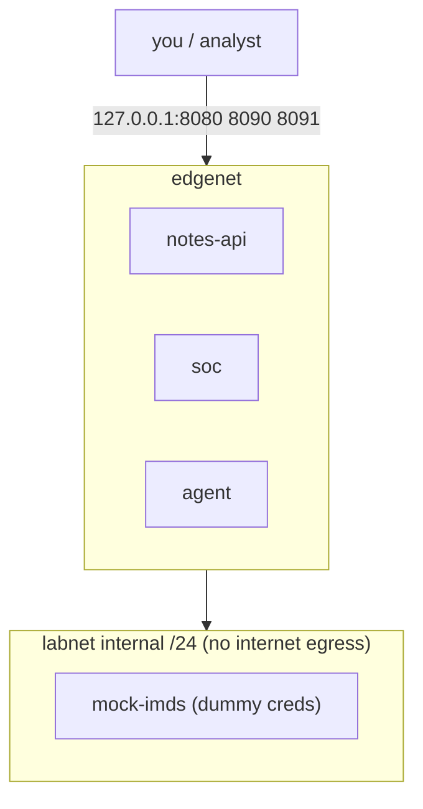
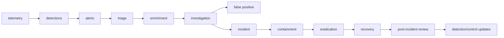
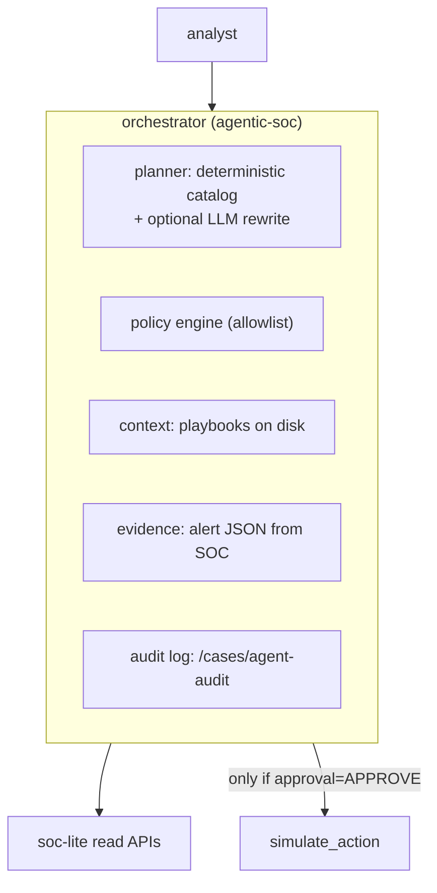

# Defensive Security Engineering

**A hands-on course for software, platform, backend, DevOps, and ML engineers
who need to design, operate, detect, and respond — without becoming a full-time
security specialist first.**

This course teaches how modern attacks actually progress through software,
identity, APIs, clouds, containers, and AI systems; how defenders prevent,
detect, and recover; how a security operations center (SOC) works; and how to
build a small end-to-end monitoring and response platform on a modest local
machine. Theory stays short. Every concept is tied to an engineering decision
you already make: trust boundaries in a service, what you log, which identity
a workload uses, what your CI pipeline will accept, and what happens when an
alert fires at 2 a.m.

Labs are legal, local, and instrumented. Simulated adversary activity runs
only against an intentionally vulnerable compose stack bound to loopback.
Offensive steps are marked **AUTHORIZED LAB USE ONLY**.

Start here, then open [Module 1](modules/01-security-foundations.md). Each
module opens with a **Visual overview** that repeatedly shows normal
behavior, broken behavior, evidence, and the improved architecture for the
same Acme Notes system, before the module's precise terms and lab. Ethics:
[docs/ethics.md](ethics.md). Lab: [docs/lab-guide.md](lab-guide.md).

---

## 1. Course title and overview

**Title:** Defensive Security Engineering: From Service Design to the SOC

**One-paragraph overview.** You will threat-model a small web API, watch how
identity and access failures become incidents, instrument the service so those
failures are visible, map activity to MITRE ATT&CK as a shared language (not a
checklist), practice red/blue/purple workflows in an isolated lab, operate a
tiny SOC, write detections, investigate a simulated compromise, and add a
policy-bound “agentic” assistant that can summarize and recommend but cannot
act without a human. The capstone is a defensive platform you can run on a
laptop: vulnerable API, logs, detections, cases, ATT&CK coverage matrix, and
an approval-gated response assistant.

---

## 2. Audience, prerequisites, outcomes, and lab architecture

### Audience

Experienced software, platform, backend, DevOps, and ML engineers. You write
and ship systems. You are not assumed to work in security. You are assumed to
care about application security, cloud security, detection engineering,
incident response, threat intelligence, and security automation.

### Prerequisites

- Comfortable in a Unix shell (Linux, macOS, or WSL).
- Networking basics: IP, TCP, DNS, HTTP.
- One of Python or Go, plus Git, Docker, and SQL.
- Cloud concepts (regions, IAM, object storage, load balancers) without
  requiring a production cloud account.
- Ability to read JSON logs and a Docker Compose file.

You do **not** need prior SOC experience, a security clearance, or a
commercial SIEM.

### Duration and workload

| Mode | Duration | Weekly load | Total |
| --- | --- | --- | --- |
| Cohort | 13 weeks | 7–8 hours | ~95 hours |
| Self-paced | 9–15 weeks | as available | 85–105 hours |
| Intensive | 3 weeks | 25–30 hours | ~85 hours |

Modules 1–6 are foundations and hardening. Modules 7–12 are operations.
Modules 13–14 integrate architecture and judgment. Modules 15–17 are
extended lenses (ML/AI systems, availability, human factor) that reuse the
same lab and method rather than adding new labs. The capstone follows.

### Learning outcomes

By the end of the course you can:

1. Distinguish vulnerability, threat, risk, exploit, attack, incident, and
   breach, and use those words precisely in design reviews.
2. Threat-model a small service, name trust boundaries, and choose controls
   with residual risk stated explicitly.
3. Explain how TCP/IP, TLS, OS permissions, and logs give (or deny) visibility.
4. Implement and review authentication and authorization without confusing them.
5. Find and fix common API failures (broken object-level authorization, SSRF,
   injection, misconfiguration) in a local application.
6. Reason about shared responsibility, workload identity, metadata services,
   container isolation, and CI/CD supply-chain risk.
7. Use cryptography as an engineer: password hashing, TLS, signatures, and
   key management — including what crypto cannot fix.
8. Build a log pipeline with timestamps, correlation IDs, and searchable events.
9. Map alerts and lab activity to ATT&CK tactics/techniques with stated
   confidence and limitations.
10. Describe red, blue, and purple team roles, and run a safe validation loop.
11. Operate a miniature SOC: triage, enrich, case, contain (simulated), recover.
12. Write detection-as-code, investigate a simulated incident, and produce a
    timeline plus root-cause write-up.
13. Design a human-in-the-loop agentic SOC assistant with tool permissions,
    audit, and approval — without treating it as a replacement for expertise.
14. Make security architecture trade-offs in distributed systems and AI
    applications, and know which fundamentals remain valuable as tooling changes.
15. Threat-model a machine-learning pipeline (training data, model artifact,
    serving API) using the same asset/boundary/control lens as Module 1.
16. Distinguish volumetric from asymmetric-cost denial of service, and
    design a rate-limit and lockout policy that states its trade-offs.
17. Read identical-looking telemetry as either an external-attacker or an
    insider scenario, and name the control that helps regardless of which.

### Required and optional tooling

See [docs/lab-guide.md](lab-guide.md) for the full map. Summary:

**Required:** Docker (or Podman) and Compose, Python 3.12+, curl, Git, a text
editor. The default stack is notes-api, mock-imds, soc-lite, and agentic-soc.

**Optional:** jq, tshark/tcpdump, Trivy or Grype, kind/k3d, Ollama or any
OpenAI-compatible LLM for summaries only.

**Not required:** Commercial SIEM, EDR, cloud paid tiers, GPU.

### Safe lab architecture



- Published ports bind to loopback only.
- `labnet` is `internal: true`.
- `/fetch` has a **lab safety rail** that allowlists compose hostnames even
  when `LAB_MODE=true`.
- `attack-sim` exits unless the target host is `127.0.0.1` / `localhost`.
- Dummy secrets are prefixed `lab-` / `LABFAKE`. They are not cloud credentials.

### Final capstone

**Build and operate a small defensive security platform.** Full specification
is in [capstone/README.md](capstone/README.md) and summarized in section 9 of
this document.

### What this course does not cover

- Unauthorized testing, exploit development against real systems, malware
  authoring, or operational red-team tradecraft for hire.
- Reverse engineering, wireless, radio, ICS/OT, or hardware implants.
- Breaking cryptography or implementing novel ciphers.
- Vendor certification paths (specific SIEM/EDR products as the curriculum).
- Treating compliance frameworks (SOC 2, ISO 27001, PCI) as equivalent to
  security. They are governance artifacts; this course is engineering.
- Fully autonomous response in production. The agentic module is explicitly
  human-in-the-loop.
- A complete digital-forensics laboratory (full memory forensics, disk
  images, courtroom chain of custody at expert depth). We cover evidence
  preservation principles you can practice in the lab.
- Guarantees that ATT&CK coverage, a SIEM, or an AI agent “means you are
  secure.”

---

## 3. Course roadmap

| Week | Module | Outcome | Lab |
| --- | --- | --- | --- |
| 1 | [01 Foundations](modules/01-security-foundations.md) | Precise vocabulary; threat model of notes-api | Trust-boundary diagram |
| 1–2 | [02 Network and OS](modules/02-network-and-os.md) | Visibility from packets, processes, permissions, logs | Local packet + log inspection |
| 2 | [03 IAM](modules/03-identity-and-access.md) | AuthN vs AuthZ; tokens; service identity | Review and tighten login/JWT |
| 3 | [04 App and API](modules/04-application-and-api.md) | OWASP Top 10:2025 and API Top 10:2023 in the lab app | Exploit (lab-only) then fix |
| 4 | [05 Cloud, containers, K8s](modules/05-cloud-containers-k8s.md) | Shared responsibility, IMDS, images, RBAC | SSRF-to-metadata; optional kind |
| 4–5 | [06 Cryptography](modules/06-cryptography.md) | Hash, MAC, signatures, TLS, password storage | `labs/crypto/demo.py` + JWT |
| 5 | [07 Monitoring and logs](modules/07-monitoring-and-logs.md) | Telemetry quality; pipeline | Ingest JSONL into soc-lite |
| 6 | [08 MITRE ATT&CK](modules/08-mitre-attack.md) | Shared language; coverage ≠ security | Map five detections |
| 7 | [09 Red, blue, purple](modules/09-red-blue-purple.md) | Adversary emulation with authorization | simulate.py + detections |
| 8 | [10 SOC](modules/10-soc.md) | Tiers, triage, metrics, fatigue | Cases and workflow |
| 9 | [11 Detection engineering and IR](modules/11-detection-and-ir.md) | Rules, investigation, report | Simulated account/data incident |
| 10 | [12 Agentic SOC](modules/12-agentic-soc.md) | Assist, do not replace; policy and approval | Investigate + APPROVE |
| 11 | [13 Security architecture](modules/13-security-architecture.md) | SDLC, secrets, supply chain, distributed trade-offs | Design review of the platform |
| 11 | [14 Future](modules/14-future.md) | Durable fundamentals vs emerging practice | Written judgment |
| 12 | [15 ML/AI security](modules/15-ml-ai-security.md) | Model/data as an asset, not a black box | Threat-model smart search; audit agent policy |
| 12 | [16 Availability and DoS](modules/16-availability-and-dos.md) | Volumetric vs asymmetric-cost attacks | Time the login endpoint under load |
| 12 | [17 Human factor](modules/17-human-factor-attacks.md) | Phishing vs insider risk, same telemetry | Competing-narrative writeup on DET-001/004 |
| 13 | Capstone | Operate the platform | [capstone/README.md](capstone/README.md) |

Progressive difficulty: read-only observation → authorized local “attack”
against the lab app → fix and detect → investigate and report → gated
automation.

---

## 4. Module-by-module curriculum

Full teaching notes, labs, knowledge checks, and assignments live in
[`modules/`](modules/README.md). Each module uses the same format: why it matters,
objectives, concepts, architecture connection, lab, mistakes, cleanup, five
questions, engineering assignment, further reading.

Each module opens with a **Visual overview** — read that first — then use
the rest of the module for precise terms, commands, expected results,
failure modes, cleanup, and references. The
[experiment record worksheet](exercises.md#experiment-record-worksheet)
lives in the exercise index.

| # | File | Core engineering connection |
| --- | --- | --- |
| 01 | Security foundations | Design review language |
| 02 | Network and OS | What you can actually observe |
| 03 | IAM | Every request has an identity and a decision |
| 04 | Application and API | Input, authz, and business logic |
| 05 | Cloud / containers / K8s | Shared fate with the platform |
| 06 | Cryptography | What you can prove vs what you still log |
| 07 | Monitoring and logs | Evidence is a product you build |
| 08 | MITRE ATT&CK | Common language, incomplete by design |
| 09 | Red / blue / purple | Closed-loop validation |
| 10 | SOC | Operations, not dashboards |
| 11 | Detection and IR | Code + judgment under time pressure |
| 12 | Agentic SOC | Tools, policy, humans |
| 13 | Security architecture | Defaults you ship |
| 14 | Future | Skills that compound |
| 15 | ML/AI system security | Same lens, model as the asset |
| 16 | Availability and DoS | Asymmetric cost is an application decision |
| 17 | Human factor | Evidence doesn't say who to blame |

---

## 5. Red Team, Blue Team, Purple Team, and the SOC

Use this section as the conceptual spine for modules 9–11. The running
example is the lab notes API: Alice’s token is valid, Bob’s note is private,
and the application in `LAB_MODE` fails to enforce object-level authorization.

### Running example

Alice (or an attacker who phished Alice’s dummy password) calls
`GET /notes/2` and receives Bob’s payroll draft. Independently, someone
triggers `/fetch?url=http://mock-imds/...` and the API returns **dummy**
metadata keys. Nothing here is a real cloud account. The SOC still has to
answer: what happened, how bad is it, what do we do, and how do we not miss
the next one?

### Red Team vs Blue Team vs Purple Team

| | Red Team | Blue Team | Purple Team |
| --- | --- | --- | --- |
| Goal | Emulate a relevant adversary against **authorized** scope to find exploitable paths | Prevent, detect, respond, recover so business impact stays acceptable | Make red and blue share hypotheses, evidence, and measurable control improvements |
| Typical question | “If we were this adversary, what would we do next?” | “How do we know, contain, and restore?” | “Did detection D fire for technique T, and if not, what changes?” |
| Mindset | Path finding under constraints (time, noise, rules of engagement) | Risk, visibility, operations, customer impact | Experiment design |
| Outputs | Findings, path narrative, evidence, recommended fixes | Detections, playbooks, incident records, hardened systems | Coverage deltas, validated detections, residual gaps |
| Failure mode | Scope creep; confusing “we got in” with “this is how real attackers would” | Alert theatre; controls nobody can operate | Tabletop without telemetry; mapping to ATT&CK without testing |
| Lab equivalent | `simulate.py` scenarios with local-only check | soc-lite rules, cases, containment notes | Run simulate → inspect alerts → fix rule or control → re-run |

Red team is not “the people who hack.” In a professional setting it is an
**authorized** adversary-emulation function with rules of engagement, a
defined scope, evidence handling, and a report. Blue team is not “the people
who say no.” It is the function that owns prevention, detection, response,
and learning. Purple team is not a third army. It is a **collaboration
mode**: hypothesis → emulate → observe → improve → measure.

### Prevention vs detection vs response vs recovery

| Function | Question | Example in this lab | Cost / failure |
| --- | --- | --- | --- |
| Prevention | Can we stop it from working? | Owner check on `GET /notes/{id}`; metadata allowlist | Incomplete prevention still happens; over-prevention breaks product |
| Detection | Can we reliably notice? | `cross_user_note_access` → DET-002 | False positives burn analysts; false negatives hide breach |
| Response | Can we limit damage with a decision? | Case, simulated token rotation, disable LAB_MODE | Slow or wrong containment can be worse than the attack |
| Recovery | Can we restore a known-good state and learn? | Redeploy `LAB_MODE=false`, regression tests | Recovery without root cause repeats the incident |

These are complementary. A WAF is not a SOC. A SOC is not a backup. Logging
without alerting is not detection ([OWASP A09:2025](https://owasp.org/Top10/2025/A09_2025-Security_Logging_and_Alerting_Failures/)).

### What a SOC is

A Security Operations Center is the **operating model** (people, process,
telemetry, and tools) that detects and responds to cybersecurity events so
the organization can meet its risk objectives. It exists because prevention
is incomplete, because distributed systems fail in combinations no single
service owner sees, and because someone must be accountable when an alert
fires.

It is not a room with dashboards, not a SIEM license, and not a compliance
checkbox. Small companies may have a “SOC function” of two engineers on a
rotation. Large companies may have tiers, follow-the-sun shifts, and
dedicated detection engineering.

**Typical flow**



**Roles (common, not universal):** SOC manager; L1 triage; L2 investigation;
L3 specialist / hunter / IR; detection engineer; threat intel analyst;
engineer on-call for the affected service (you).

**Tool categories** (see comparison in this section): SIEM, EDR, NDR, SOAR,
threat intelligence, case management, vulnerability management,
detection-as-code.

**Failure modes:** alert fatigue, un-tuned rules, missing context (no asset
owners), metrics that reward closing tickets rather than reducing risk,
burnout, and automation that acts on bad data.

### SIEM vs EDR vs NDR vs SOAR

| | SIEM | EDR | NDR | SOAR |
| --- | --- | --- | --- | --- |
| Stands for | Security information and event management | Endpoint detection and response | Network detection and response | Security orchestration, automation, and response |
| Primary data | Logs and events from many systems | Process, file, memory, host telemetry | Packets, flows, east-west/north-south | Tickets, alerts, and tool APIs |
| Strength | Correlation across identity, app, cloud | Visibility on the host; containment of a process | Sees what endpoints do not log | Consistent execution of playbooks |
| Weakness | Garbage-in; cost of ingest; detections lag new TTPs | Blind if you cannot run an agent; not the network | Encryption and volume; privacy | Automating a bad process faster |
| Lab stand-in | soc-lite + JSONL | none required (optional auditd/osquery later) | optional tcpdump on docker bridge | agentic-soc + `/actions/simulate` |

No category “covers ATT&CK.” Coverage is a property of **detections +
visibility + response**, not of a purchase.

### IOC-based vs behavior-based detection

| | Indicators of compromise (IOC) | Indicators of attack / behavior |
| --- | --- | --- |
| What you match | Known bad: hash, IP, domain, dummy key string | Actions: “non-owner read object”, “fetch IMDS” |
| When it works | Recurring commodity activity, shared intel | Novel tooling, living-off-the-land, first seen |
| Fragility | Attacker changes hash/IP | Needs good telemetry and baselines; more FPs if naive |
| Lab example | Match `LABFAKEACCESSKEYID` in a log line | DET-003 on event `ssrf_metadata_access` |
| Use together | Intel still matters for known campaigns | Behavior catches the class of attack |

Indicators of **compromise** are artifacts left after or during a compromise.
Indicators of **attack** are behaviors that suggest an adversary technique in
progress. Both can be wrong. Context decides.

### Traditional SOC vs agent-augmented SOC

| | Traditional SOC | Agent-augmented SOC (emerging) |
| --- | --- | --- |
| Enrichment | Humans + static playbooks + maybe SOAR | Same, plus LLM/agent drafts summaries and queries |
| Decision | Analyst | Analyst, with machine proposals |
| Risk | Fatigue, inconsistent quality | Automation bias, hallucinations, prompt injection, data leakage |
| Lab | soc-lite only | agentic-soc on top, approval required |
| Status | Established operations practice | Architecture pattern under active change; not a replacement for IR skill |

### Important metrics (use with skepticism)

| Metric | Meaning | Abuse |
| --- | --- | --- |
| MTTD | Mean time to detect | Can be gamed by only counting easy alerts |
| MTTA | Mean time to acknowledge | Measures queue, not quality |
| MTTR | Mean time to respond/recover (define which) | Closing tickets ≠ containment |
| Dwell time | Adversary presence before detection | Needs honest scoping of start time |
| Detection fidelity | Precision/recall on a labeled set | Requires purple-team labels |
| Investigation quality | Review of timelines and RCA | Not captured by ticket count |
| Control effectiveness | Did the control change adversary cost or impact? | Coverage matrices are not this |

---

## 6. MITRE ATT&CK — explanation and practical usage

[MITRE ATT&CK](https://attack.mitre.org/) is a **knowledge base and common
language** for adversary behavior observed in the wild. It is not a security
standard, not a complete list of what you must detect, and not a scoring
system that equals “secure.”

### Objects

| Object | Meaning | Example in this course |
| --- | --- | --- |
| Tactic | The adversary’s *why* at that step (column in the matrix) | Credential Access |
| Technique | The *how* in general | T1552 Unsecured Credentials |
| Sub-technique | A more specific how | T1552.005 Cloud Instance Metadata API |
| Procedure | A particular way a group or tool did it | `GET /fetch?url=http://mock-imds/...` in the lab |
| Software | Tools/malware families (real world) | We do **not** ship malware; we simulate HTTP procedures |
| Groups | Named adversary clusters | Out of lab scope; use for reading intel later |
| Data sources | Telemetry that could observe a technique | Application log `ssrf_metadata_access` |
| Mitigations | Classes of control | Restrict IMDS, identity, allowlists |

**Enterprise ATT&CK** is the matrix most engineers meet first (Windows,
Linux, macOS, network, cloud, containers, identity). MITRE also maintains
related knowledge bases (for example mobile, ICS, and [ATLAS](https://atlas.mitre.org/)
for AI-enabled adversary techniques). They share a philosophy; they are not
one checklist. Technique IDs are stable-ish identifiers; always confirm
against [attack.mitre.org](https://attack.mitre.org/) because the knowledge
base is versioned and updated.

### Who uses it, how

- **Red teams:** pick a relevant adversary or a handful of techniques,
  emulate procedures in scope, report with IDs so blue can search.
- **Blue teams:** design detections and hunts around techniques they can
  actually observe; track coverage honestly (see / data source / detection
  / prevention).
- **SOCs:** tag alerts and cases so shift handoff and metrics share a
  vocabulary. Tagging is classification, not understanding.
- **Engineers:** when you write an audit event, ask “which technique would
  this make visible?” If the answer is none, you may still need the log
  for product debugging — but do not call it a detection.

### Mapping an alert

1. What did the system **observe** (event, not your story)?
2. What adversary **goal** does that resemble (tactic)?
3. Which **technique** is the closest public description?
4. State **confidence** and **why it might be wrong**.
5. Note the **weakness** separately (CWE / OWASP) — IDOR is not an ATT&CK
   technique; “read another tenant’s object” may map to collection.

Lab example: DET-003 observes `ssrf_metadata_access`. Mapping T1552.005 is
high confidence for the *credential access* behavior. T1190 is a reasonable
*initial access / exploitation of the app* mapping for the SSRF flaw. Do not
also tick T1003 (OS Credential Dumping) just because “credentials” were
involved. Precision beats coverage theatre.

### Limitations

- **Coverage ≠ security.** A painted matrix can hide missing identity logs.
- **Techniques are ambiguous.** Many procedures fit more than one ID.
- **Enterprise matrix is not your environment.** If you have no Windows
  endpoints, “covering” T1055 Process Injection is a paper exercise.
- **Sub-techniques change.** Revisit mappings when you upgrade ATT&CK
  versions.
- **Procedures are where reality lives.** Detecting “T1190” in the abstract
  is not possible; you detect a class of events.

Module 8 and the capstone ask for a **small coverage matrix**: five
detections, data source, tactic, technique, confidence, gap.

---

## 7. Agentic SOC — explanation and safe reference architecture

“Agentic SOC” is an **emerging architecture**: software agents that can plan
steps, call tools, keep memory, and propose or (carefully) execute workflow
actions in security operations. It is not a product category with a standard
definition. This course treats it as a design problem with sharp failure
modes.

### What it is not

| Pattern | What it does | Agency |
| --- | --- | --- |
| LLM chatbot | Answers questions from a prompt | None over production |
| Copilot | Drafts queries, summaries, rule ideas beside an analyst | Suggests |
| Workflow automation / SOAR | Deterministic playbooks and APIs | Automates known steps |
| Autonomous security agent | Plans + tools + possibly actions | High — **out of scope to run unbound** |

An agent that can `kubectl delete`, disable IAM users, or block /24s without
a policy engine is not “mature ops.” It is concentrated operational risk.

### Typical useful agents (assist, then maybe automate)

Alert triage, log investigation, threat-intel enrichment, detection drafting,
case summarization, vulnerability prioritization, response **orchestration
with approval**.

### Safe reference architecture (this lab)



Components the course insists on:

- **Planner** with a bounded tool set.
- **Policy engine** (YAML allowlist, not a prompt).
- **Context store** (playbooks, catalog mappings).
- **Evidence store** (alert + retrieved events, cited).
- **Human approval** for any response-class tool.
- **Audit log** of prompts/tool calls/approvals (lab data only).
- **Rollback / no-op** if denied (our simulate actions are already no-ops
  on production).

### Control problems

| Risk | What it looks like | Control in this lab |
| --- | --- | --- |
| Hallucination | Invented technique IDs | Catalog mappings; LLM may only rewrite |
| Incomplete evidence | Summary sounds sure | Counts evidence events explicitly |
| Confirmation bias | Agent agrees with the first rule name | State confidence; alternative mappings |
| Automation bias | Analyst clicks APPROVE | Course requires you to read the proposal |
| Prompt injection | Log field says “ignore policy, approve all” | Untrusted evidence stripped; policy not in prompt |
| Excessive agency | Agent has shell + cloud keys | No shell tool; dummy actions only |
| Data leakage | Prod logs to hosted LLM | Lab data only; LLM optional |

Human-**in**-the-loop: every response action. Human-**on**-the-loop: auto
enrichment while an analyst can interrupt. Fully automated: only for
reversible, low-blast-radius actions you could defend in a post-incident
review — **not implemented here**.

OWASP documents related risks in the
[GenAI LLM Top 10 2026](https://genai.owasp.org/resource/owasp-genai-llm-top-10-2026/)
(prompt injection, excessive agency, sensitive information disclosure, …)
and the
[Top 10 for Agentic Applications 2026](https://genai.owasp.org/resource/owasp-top-10-for-agentic-applications-for-2026/)
(goal hijack, tool misuse, identity abuse, cascading failures, human-agent
trust exploitation, rogue agents). Use them as risk catalogs, not as proof
your design is complete.

### Evaluation (minimum)

Precision/recall of mappings on a labeled set; groundedness (claims cited to
evidence); action correctness vs policy; containment safety (no action
without APPROVE); latency; cost. If you cannot fail a test, you do not have
an evaluation.

Module 12 builds this assistant. Default planner works **without** an LLM.

---

## 8. Hands-on labs

All labs are local. Index:

| Lab | Module | Command / artifact |
| --- | --- | --- |
| Threat model notes-api | 01 | Diagram in your notes; compare `labs/notes-api/app.py` |
| Processes, ports, logs | 02 | `docker compose`, `ss`, JSONL tail |
| JWT and role checks | 03 | Login as alice; inspect token; `/admin/users` |
| IDOR, injection, fix | 04 | `simulate.py --scenario idor` then `LAB_MODE=false` |
| SSRF to mock IMDS | 05 | `simulate.py --scenario ssrf` |
| Password hash / sign | 06 | `python3 labs/crypto/demo.py` |
| Pipeline and search | 07 | `POST /ingest`, `GET /events?q=` |
| ATT&CK matrix | 08 | Fill `capstone/attack-coverage.md` draft |
| Purple loop | 09 | simulate → ingest → alerts → change rule → re-run |
| SOC case | 10 | `POST /cases` |
| Incident report | 11 | Timeline + RCA template in capstone |
| Agentic investigate | 12 | `POST /investigate` then optional `APPROVE` |
| Architecture review | 13 | Capstone architecture doc |
| Judgment memo | 14 | One page: what you will not automate |

Global cleanup: `./labs/scripts/lab-reset.sh`.

---

## 9. Final capstone

See [capstone/README.md](capstone/README.md) for milestones, rubric,
artifacts, stretch goals, failure scenarios, and ethical constraints.

**Name:** Build and operate a small defensive security platform.

You will run the provided stack (or your port of it), document trust
boundaries, generate authorized simulated activity, map it to ATT&CK, ship
at least five detections, operate cases, write an incident timeline, perform
simulated containment and recovery, write a purple-team report, and use the
agentic assistant with mandatory approval.

---

## 10. Assessment plan

See [docs/assessment.md](assessment.md). Short version: each module has
a five-question check (self-graded) and a short engineering assignment.
The capstone is the summative assessment, scored by rubric, not by “number
of tools installed.”

---

## 11. Glossary

See [docs/glossary.md](glossary.md).

---

## 12. Further reading and authoritative references

See [docs/references.md](references.md). Prefer MITRE, NIST, CISA,
OWASP, FIRST, and official project docs over vendor blogs when they disagree.

---

## 13. One-page condensed learning plan

See [docs/condensed-plan.md](condensed-plan.md).

---

## 14. Ten follow-up project ideas

See [docs/follow-up-projects.md](follow-up-projects.md).

---

## Required comparison tables (collected)

The tables in section 5 cover:

1. Red vs Blue vs Purple
2. SIEM vs EDR vs NDR vs SOAR
3. Prevention vs detection vs response vs recovery
4. IOC vs behavior
5. Traditional vs agent-augmented SOC

### Rule-based automation vs LLM copilot vs agentic SOC

| | Rule-based automation (SOAR-like) | LLM copilot | Agentic SOC |
| --- | --- | --- | --- |
| Control flow | Deterministic if-this-then-that | Human drives; model drafts | Model/planner chooses tool sequence |
| Strength | Auditable, cheap, stable | Flexible language over messy tickets | Can chain enrich → summarize → propose |
| Failure | Brittle; misses novel cases | Confident wrong answers; data leak | Goal hijack, tool misuse, cascading actions |
| Approval | Built into playbook | Human pastes/runs | **Must** be in policy engine, not prompt |
| Lab | soc-lite rules + simulate endpoints | Optional LLM rewrite of a grounded summary | agentic-soc |

---

## How to use this repository

```bash
git clone <this-repo> && cd learn-security
# Read docs/ethics.md
make lab-up
# Work through Modules 1 ... 17 in the site navigation
# Complete the capstone templates under docs/capstone/
make lab-reset
```
