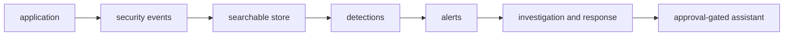

# Defensive Security Engineering

Learn security by following one small application from design review to
incident response. You do not need prior cybersecurity or SOC experience.

This course starts with familiar engineering ideas—requests, processes,
identities, databases, and logs—and adds one security question at a time:

> What does this component trust, how could that assumption fail, and what
> evidence would the failure leave?

## Start in three steps

1. Read [Onboarding](onboarding.md). It translates the course vocabulary into
   software-engineering language and tells you what you can safely skip.
2. Complete [Setup and first lab](setup.md). It includes a no-Docker preview,
   so setup is not a gate to understanding the system.
3. Begin [Module 1](modules/01-security-foundations.md). Each module opens
   with a **Visual overview** — read that first, then the module text.

!!! warning "Authorized lab use only"
    Run offensive-looking exercises only against this repository's local,
    intentionally vulnerable lab. Never reuse them against systems you do not
    own and have explicit permission to test.

## What you will build

By the capstone, you will be able to explain the complete chain from software
behavior to vulnerability, attacker action, telemetry, detection,
investigation, response, and architectural repair.

## Choose your next page

| If you are... | Go to... |
| --- | --- |
| New to security terminology | [Onboarding](onboarding.md) |
| Ready to install and test the lab | [Setup](setup.md) |
| Short on time | [Learning paths](learning-paths.md) |
| Looking for a practical task | [Exercise index](exercises.md) |
| Returning to the course | [Modules overview](modules/README.md) |

