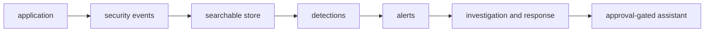

---
hide:
  - toc
---

  

    Visual overview first · Then the module · Then the lab
    <h1>Learn defensive security without a SOC job first.</h1>
    
Follow one small application from design review to incident response. You do not need prior cybersecurity or SOC experience — this course starts with ideas you already know as a software engineer (requests, processes, identities, databases, logs) and adds one security question at a time: what does this component trust, how could that assumption fail, and what evidence would the failure leave?

    

      <a class="course-button course-button--primary" href="modules/01-security-foundations/">Start module 1 →</a>
      <a class="course-button course-button--secondary" href="onboarding/">Read onboarding first</a>
      <a class="course-button course-button--coffee" href="https://buymeacoffee.com/sanketn">☕ Support this course</a>
    

    
17 modules across 4 parts · 1 capstone project · runs entirely on 127.0.0.1, no cloud bill

  

  

    
<i></i><i></i><i></i>learn-security / roadmap

    

      
01 Security foundations — trust boundaries

      
08 MITRE ATT&CK — name the behavior

      
11 Detection and incident response

      
13 Security architecture — narrower boundaries

      
 Acme Notes lab, one system throughout

    

  

  
<strong>17</strong>Modules across 4 parts

  
<strong>1</strong>Capstone platform

  
<strong>$0</strong>Cloud spend (local lab)

  
<strong>127.0.0.1</strong>Everything stays on loopback

!!! warning "Authorized lab use only"
    Run offensive-looking exercises only against this repository's local,
    intentionally vulnerable lab. Never reuse them against systems you do not
    own and have explicit permission to test.

## Pick your part

-   :material-shield-lock-outline: **Part I — Understand the System**

    ---

    6 modules. Foundations, network and OS, identity, application/API,
    cloud/containers, cryptography.

    The trust boundaries every later module refers back to.

    [Start module 1 →](modules/01-security-foundations.md)

-   :material-eye-outline: **Part II — See and Defend the System**

    ---

    5 modules. Monitoring, MITRE ATT&CK, red/blue/purple, SOC, detection
    and incident response.

    How you'd actually notice and respond.

    [Start module 7 →](modules/07-monitoring-and-logs.md)

-   :material-drafting-compass: **Part III — Design What Comes Next**

    ---

    3 modules. Agentic SOC, security architecture, future directions.

    Move from reacting to designing the system that resists the failure.

    [Start module 12 →](modules/12-agentic-soc.md)

-   :material-layers-outline: **Part IV — Extended Lenses**

    ---

    3 modules. ML/AI system security, availability and DoS, human-factor
    attacks.

    Apply the same trust-and-evidence frame beyond the core stack.

    [Start module 15 →](modules/15-ml-ai-security.md)

## Start in three steps

1. Read [Onboarding](onboarding.md). It translates the course vocabulary into
   software-engineering language and tells you what you can safely skip.
2. Complete [Setup and first lab](setup.md). It includes a no-Docker preview,
   so setup is not a gate to understanding the system.
3. Begin [Module 1](modules/01-security-foundations.md). Each module opens
   with a **Visual overview** — read that first, then the module text.

## What you will build

By the capstone, you will be able to explain the complete chain from software
behavior to vulnerability, attacker action, telemetry, detection,
investigation, response, and architectural repair.

[Capstone brief →](capstone/README.md){ .md-button .md-button--primary }
[Full course guide →](course.md){ .md-button }

## Choose your next page

| If you are... | Go to... |
| --- | --- |
| New to security terminology | [Onboarding](onboarding.md) |
| Ready to install and test the lab | [Setup](setup.md) |
| Short on time | [Learning paths](learning-paths.md) |
| Looking for a practical task | [Exercise index](exercises.md) |
| Returning to the course | [Modules overview](modules/README.md) |
