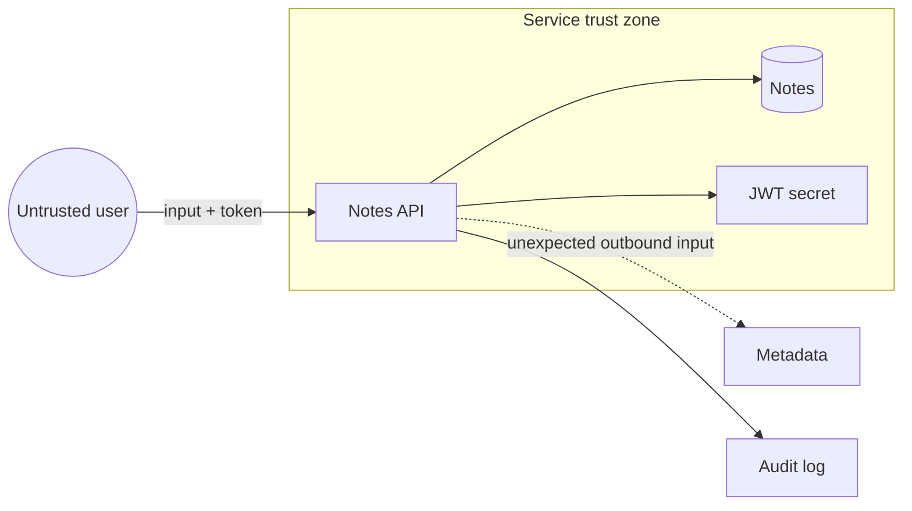

# Module 1 — Security foundations

## Why it matters to a software engineer

You already make security decisions: who can call an endpoint, where secrets
live, what “done” means in a design review. Security work is those decisions
made explicit, with an adversary and a business impact in mind. Without shared
vocabulary, teams argue past each other (“is this a vulnerability or a risk?”)
and ship controls that do not match the actual threat.

## Visual overview



!!! note "Intuition"
    Before you learn the vocabulary (asset, threat, risk...), learn to see
    the picture: an untrusted arrow coming in, a trusted zone it lands in,
    and a dotted line showing where that zone should *not* be able to reach.
    Almost every vulnerability in this course is a version of "an arrow that
    should have stopped at the boundary didn't."

| Lens | Concrete question |
| --- | --- |
| Asset | What would hurt if disclosed, changed, or unavailable? |
| Attack surface | Which routes, dependencies, identities, and admin paths are reachable? |
| Boundary | Where does trust or ownership change? |
| Vulnerability | Which weakness exists? |
| Threat | Who or what could cause harm? |
| Risk | How likely and harmful is that scenario here? |
| Control | What changes likelihood or impact? |
| Residual risk | What remains after the control? |

```text
Before: Internet --> API (LAB_MODE) --> every note + metadata + broad secret
After:  Internet --> gateway --> authorized object only
                              +--> metadata denied
                              +--> scoped identity + protected audit stream
```

!!! tip "Hint"
    Walk the table top to bottom on any system you look at, in order. Skipping
    straight to "what's the vulnerability?" without first naming the asset and
    the boundary is the single most common way people misjudge how serious a
    finding actually is — you cannot rate risk on something you haven't first
    identified as an asset.

Attacker view: find an input whose implied trust exceeds the caller's actual
authority. Defender view: observe identity, object, decision, source, and
outcome. Engineering lesson: a trust boundary without an enforced decision is
only a line on a diagram.

## Learning objectives

- Use CIA, identity, and risk language precisely.
- Draw trust boundaries and attack surface for a small web service.
- Choose controls and state residual risk.
- Apply least privilege, defense in depth, secure defaults, and zero trust as
  *design constraints*, not slogans.

## Key concepts

**Confidentiality, integrity, availability (CIA).**
Confidentiality: only the intended parties can read Bob’s note.
Integrity: Bob’s note is not silently altered.
Availability: the notes API answers when authorized users need it.
Most incidents hit more than one. Ransomware hits C and A; a corrupt deploy
hits I and A.

**Vulnerability, threat, risk, exploit, attack, incident, breach.**

| Term | Meaning | Lab example |
| --- | --- | --- |
| Vulnerability | A weakness that can be abused | `GET /notes/{id}` skips owner check in `LAB_MODE` |
| Threat | A potential cause of harm (who/what might try) | Stolen Alice session used to read other notes |
| Risk | Effect of uncertainty on objectives: likelihood × impact, in context | IDOR on payroll-like notes → data exposure |
| Exploit | A specific method that uses a vulnerability | HTTP GET with Alice’s token and Bob’s id |
| Attack | An attempt to abuse a system | Running `simulate.py --scenario idor` (authorized) |
| Incident | A suspected or confirmed adverse event you must handle | DET-002 fires; case opened |
| Breach | A confirmed disclosure or compromise meeting your legal/policy bar | In the lab we *simulate* reporting; we do not have real PII |

Risk is not “CVSS 9.8.” CVSS estimates technical severity of a vulnerability.
Risk includes your data, your users, your detection, and your ability to
respond. [NIST CSF 2.0](https://www.nist.gov/cyberframework) organizes work as
Govern, Identify, Protect, Detect, Respond, Recover — useful as a map, not a
certificate of completeness.

**Classes of vulnerability.** "Vulnerability" is one word covering several
different failure origins, and the class changes both who should have
caught it and what kind of control fixes it:

| Class | What actually broke | Example | Primary CIA impact | Fixed by |
| --- | --- | --- | --- | --- |
| Design flaw | The security model itself is wrong or missing a decision | No object-ownership check was ever designed for `GET /notes/{id}` | C (wrong reader gets data) | Redesign the authorization model (Module 3) |
| Implementation bug | The design was sound; the code doesn't match it | String-concatenated SQL instead of the parameterized query the design called for | C, I | Fix the code; test the property, not just the symptom (Module 4) |
| Configuration / operational | Design and code are fine; how it's deployed isn't | `LAB_MODE=true` shipped to production; a debug endpoint left reachable | C, I, A | Secure defaults, deployment review (Module 13) |
| Cryptographic | A cryptographic primitive or its usage is wrong | Fast hash for passwords; predictable IV; no certificate validation | C, I | Correct primitive and usage (Module 6) |
| Availability / resource | The system has no bound on cost or capacity | No rate limit; unbounded request body; algorithmic complexity | A | Rate limiting, bounded work (Module 16) |
| Process / human | The weakness is in a decision a person made, not in the system | Phished credential; insider misuse of legitimate access | C, I, A | Least privilege, phishing-resistant MFA (Module 17) |

A memory-safety class also exists (buffer overflow, use-after-free, type
confusion) — the historic root cause of a huge share of critical CVEs in
C/C++ codebases. Memory-safe languages (Python, Go, Java, Rust, JavaScript,
and most others you would write this course's application code in) prevent
direct pointer arithmetic and bounds mistakes by design, so this course does
not include a memory-corruption exercise. Their interpreters/runtimes and
native extensions are still commonly implemented in memory-unsafe languages
and can contain such flaws themselves. This distinction is one reason the
industry is moving toward memory-safe languages for new systems code.

**CWE vs CVE.** [CWE](https://cwe.mitre.org/) (Common Weakness Enumeration)
names the *class* — CWE-89 is "SQL Injection" as a category. [CVE](https://cve.mitre.org/)
names one *instance* — a specific vulnerability in a specific version of a
specific product. The table above is a small, informal CWE; production
vulnerability management usually references CWE IDs directly. Same
relationship as "threat" (a class of harm) vs. "the specific incident that
happened to you."

**Asset.** Something of value: Bob’s note, the JWT signing secret, availability
of `/login`, analyst time, your reputation. Threat-model assets, not only hosts.

**Trust boundary.** A place where the level of trust changes: browser → API,
API → sqlite, API → mock-imds, analyst laptop → compose ports. Anything
crossing a boundary is untrusted until your code decides otherwise.

**Attack surface.** The set of reachable interfaces: HTTP routes, debug
endpoints, CI, dependencies, admin functions, metadata service. Reducing
surface is often cheaper than detecting abuse of a surface you did not need.

**Control.** A measure that changes risk: owner check, TLS, rate limit, log +
alert, backup. Controls fail. Plan for that.

**Residual risk.** Risk that remains after controls. “We parameterize SQL but
still have no object-level tests” is a residual-risk statement. “We’re
OWASP-compliant” is not.

**Least privilege.** Every identity (user, service, CI job, AI agent) gets only
the permissions required for the task, for the shortest time. Alice’s token
must not imply “read all notes.”

**Defense in depth.** Independent controls so one failure is not game over:
authn, authz, allowlist, detection, backups. Depth is not five identical WAFs.

**Secure defaults.** The system should be safe if nobody tweaks it. `LAB_MODE`
defaults to true *in this lab so you can learn*; a real product defaults to
authorization on, debug off, metadata blocked.

**Zero trust.** A strategy: do not treat network location as proof of
authorization. Authenticate and authorize each request, assume breach, limit
blast radius. It is not a product, and it does not mean “trust nothing so
thoroughly that the app cannot run.”

**Threat modeling.** A structured way to ask: what are we building, what can go
wrong, what are we going to do, did we do a good job? Methods (STRIDE, PASTA,
attack trees) are optional. The activity is not.

STRIDE (spoofing, tampering, repudiation, information disclosure, denial of
service, elevation of privilege) is a mnemonic for “what can go wrong,” from
Microsoft’s public threat-modeling practice. Use it if it helps you enumerate;
do not force every box.

## Architecture connection

A typical service:

```
[user] --TLS--> [ingress] --> [notes-api] --> [sqlite]
                     |              |
                     |              +--> [mock-imds]   # should never happen
                     v
                  [logs] --> [soc-lite]
```

Each arrow is a trust boundary. If ingress “is on the VPC,” that does not
authorize `GET /notes/2`. If the API can fetch IMDS, the metadata service is
on the attack surface even if no public route exists.

## Hands-on lab — threat-model the notes API

**AUTHORIZED LAB USE ONLY** if you start the stack. Modeling on paper is
always in scope.

### Prerequisites

Docker, course repo. Read [docs/ethics.md](../ethics.md).

### Steps

1. Start the lab: `./labs/scripts/lab-up.sh`
2. Open `labs/notes-api/app.py` and list HTTP routes.
3. Draw a trust-boundary diagram (paper or text). Include: user, notes-api,
   sqlite file, JWT secret env var, mock-imds, soc-lite, your workstation.
4. For each boundary, write one threat and one control. Example:

   | Boundary | Threat | Control | Residual risk |
   | --- | --- | --- | --- |
   | User → API | Stolen token | Short JWT TTL, TLS (prod) | Device malware still wins |
   | API object access | IDOR | Owner check | Admin compromise |
   | API → IMDS | SSRF | Deny metadata host | Other internal SSRF |

5. Mark assets: notes bodies, password hashes, JWT secret, dummy IMDS keys.
6. Write one insecure-default finding (`LAB_MODE`, JWT `exp` missing, SHA-256
   passwords).
7. State residual risk in one sentence: *If we only add detection and never
   owner checks, we will reliably notice theft after it happens.*

### Expected observations

`GET /health` shows `"lab_mode": true`. `.well-known/lab` states authorized
lab use. You can name at least five surfaces (login, notes by id, search,
admin users, fetch).

### Security lessons

Threat models that list “hackers” without assets are useless. Controls that
are not assigned to a boundary are wishes. Residual risk is the point of the
meeting, not a footnote.

### Common mistakes

- Drawing only boxes, no data flows.
- Treating Docker as a trust boundary that magically authorizes processes
  inside it.
- Confusing “encrypted in transit” with “authorized.”
- Copying a STRIDE table with empty rows and calling it done.

### Cleanup

`./labs/scripts/lab-down.sh` if you are done for the day.

## Knowledge check

1. A scanner reports SQL injection (CVSS 9.8) on an internal admin tool that
   has no sensitive data and is SSO-gated. Is that a vulnerability, a risk, or
   both?
2. Why is “the request came from inside the cluster” not authorization?
3. Name a control that helps confidentiality but not availability.
4. What is residual risk after you add logging but do not fix IDOR?
5. How does least privilege apply to a CI job that builds images?

**Answers:** (1) Both: the weakness exists; risk may be lower than a
customer-facing IDOR — you still fix injection. (2) Network location is not
an identity; cluster-local still includes every compromised pod. (3) Encryption
at rest, redaction. (4) You detect theft; data already left. (5) The job gets
push rights only to the intended repo/tag, short-lived OIDC, no prod data.

## Engineering assignment

Write a one-page threat model for a service you own at work **without** testing
it. Assets, boundaries, top five threats, controls, residual risk. Do not
include real secrets. If you cannot use work, threat-model `notes-api`.

## Further reading

- [NIST CSF 2.0](https://www.nist.gov/cyberframework)
- [OWASP Threat Modeling](https://owasp.org/www-community/Threat_Modeling)
- [CISA Secure by Design](https://www.cisa.gov/securebydesign)
- [NIST SP 800-30 Rev. 1 risk assessment](https://csrc.nist.gov/publications/detail/sp/800-30/rev-1/final)
