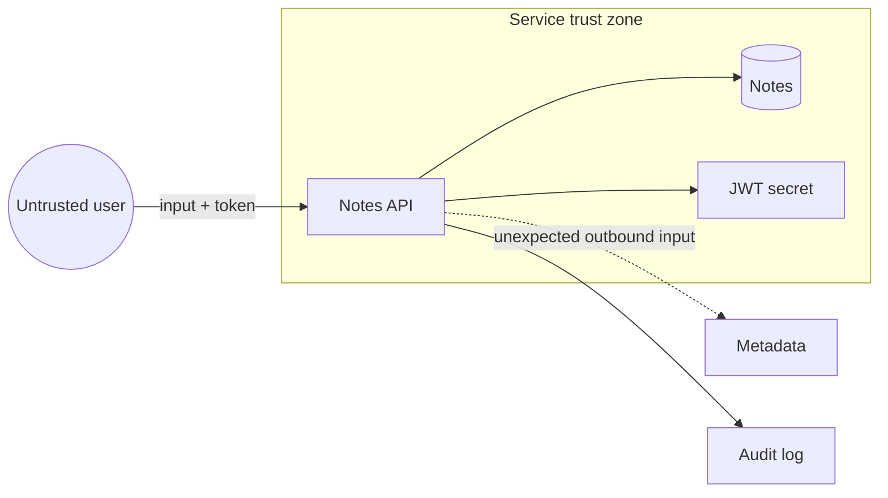

# Module 1 — Security foundations

Alice has a valid login. She asks for note 2.

```http
GET /notes/2 HTTP/1.1
Authorization: Bearer <alice's token>
```

```json
{"id": 2, "owner": "bob", "title": "Bob payroll draft", "body": "dummy payroll token lab-secret-bob-note", "visibility": "private"}
```

HTTP 200. Bob’s payroll draft is now on Alice’s screen. In a real company
that is a compensation leak, and it’s the kind of thing that ends up in a
disclosure letter.

Nothing here needed malware, a kernel exploit, or a stolen laptop. The
token was real. The request was well-formed. The server did exactly what
its code says. Something is still wrong. What *is* the thing that’s wrong,
and where would you even draw it?

This module gives you the words for that, and a picture you can draw in
five boxes. The lab is drawing it on the system you are about to run.

## Why it matters to a software engineer

You already make these decisions: who can call an endpoint, where secrets
live, what “done” means in a design review. Security work is making them
explicit, with an adversary and a business impact in mind. Without shared
words, teams argue past each other (“is this a vulnerability or a risk?”)
and ship controls that don’t match the actual threat.

## Visual overview



!!! note "Intuition"
    Point at the arrow from the untrusted user into the API. The token
    proved *who* is on that arrow. It said nothing about *which note* they
    get. The second decision, “is this note yours?”, belongs at the next
    box, and in `LAB_MODE` nobody makes it. That’s the whole bug. Most bugs
    in this course are the same shape: an arrow that should have stopped at
    a box went straight through.

| Lens | Concrete question |
| --- | --- |
| Asset | What would hurt if disclosed, changed, or unavailable? |
| Attack surface | Which routes, dependencies, identities, and admin paths are reachable? |
| Boundary | Where does trust or ownership change? |
| Control | What changes likelihood or impact? |
| Residual risk | What remains after the control? |

```text
Before: Internet --> API (LAB_MODE) --> every note + metadata + broad secret
After:  Internet --> gateway --> authorized object only
                              +--> metadata denied
                              +--> scoped identity + protected audit stream
```

!!! tip "Hint"
    Walk the table top to bottom, in order, on any system you look at. If
    you jump straight to “what’s the vulnerability?” before naming the asset
    and the boundary, you will misjudge how serious a finding is. You can’t
    rate the risk to something you haven’t named as an asset.

Attacker view: find an input whose implied trust exceeds the caller’s actual
authority. Defender view: observe identity, object, decision, source, and
outcome. Engineering lesson: a trust boundary without an enforced decision is
only a line on a diagram.

## Learning objectives

- Use CIA, identity, and risk language precisely.
- Draw trust boundaries and attack surface for a small web service.
- Choose controls and state residual risk.
- Apply least privilege, defense in depth, secure defaults, and zero trust as
  *design constraints*, not slogans.

## Five words for the lab

You need these five to draw the diagram. The rest of the vocabulary comes
[after the lab](#the-rest-of-the-vocabulary), once you have a picture to
hang it on.

**Asset.** Something of value: Bob’s note, the JWT signing secret, availability
of `/login`, analyst time, your reputation. Threat-model assets, not only hosts.

**Trust boundary.** A place where the level of trust changes: browser → API,
API → sqlite, API → mock-imds, analyst laptop → compose ports. Anything
crossing a boundary is untrusted until your code decides otherwise.

**Attack surface.** The set of reachable interfaces: HTTP routes, debug
endpoints, CI, dependencies, admin functions, metadata service. Reducing
surface is often cheaper than detecting abuse of a surface you did not need.
The lab API’s surface includes `/login`, `/notes`, `/notes/{id}`, `/search`,
`/admin/users`, `/fetch`, `/whoami`, `/health`, `/.well-known/lab`, and in
`LAB_MODE` also `/docs` and `/openapi.json`. Production diagrams in this
module that start at “Internet” are the *shape* of a real service; this lab
publishes only `127.0.0.1`.

**Control.** A measure that changes risk: owner check, TLS, rate limit, log +
alert, backup. Controls fail. Plan for that.

**Residual risk.** Risk that remains after controls. “We parameterize SQL but
still have no object-level tests” is a residual-risk statement. “We’re
OWASP-compliant” is not.

## Worked scene — following note 2 across the boxes

Take the opening request slowly, one boundary at a time.

1. **User → API.** *Expect:* a decision about identity. *Got:* the JWT
   verifies, and the caller is `alice`. That boundary did its job.
2. **API → note row.** *Expect:* a decision about ownership, “is `owner`
   equal to the caller?” *Got:* the row loads and is returned. In
   `LAB_MODE` no check runs. This is the missing decision.
3. **API → audit log.** *Expect:* a record a defender can use. *Got:*

    ```json
    {"event":"cross_user_note_access","service":"notes-api","actor":"alice","note_id":2,"owner":"bob","lab_mode":true}
    ```

    The log knows it was the wrong owner. That line exists only because
    someone decided to log `owner` next to `actor`.
4. **What that implies.** The asset is Bob’s note. The boundary that
   failed is API → object, not user → API. The only control today is a log
   line, so the residual risk is that you’ll *notice* the theft, after the
   body has already left. With `LAB_MODE=false` the same request returns 404
   and logs `authz_failure` with `reason: idor_blocked` instead.

That is a threat model of one request. The lab does the same for the whole
service.

## Architecture connection

A typical service:

```
[user] --TLS--> [ingress] --> [notes-api] --> [sqlite]
                     |              |
                     |              +--> [mock-imds]   # should never happen
                     v
                  [logs] --> [soc-lite]
```

Each arrow is a trust boundary. If ingress “is on the VPC,” that does not
authorize `GET /notes/2`. If the API can fetch IMDS, the metadata service is
on the attack surface even if no public route exists.

## Hands-on lab — threat-model the notes API

**AUTHORIZED LAB USE ONLY** if you start the stack. Modeling on paper is
always in scope.

### Prerequisites

Docker, course repo. Read [docs/ethics.md](../ethics.md).


### Before you run this

Write down three answers before you open anything:

1. Which boundary does `GET /notes/2` cross with no decision made at it?
2. Which processes can read the JWT signing secret?
3. Can notes-api reach mock-imds? Should it?

Then start the lab and draw. If your diagram disagrees with your answers,
which assumption was wrong?

### Steps

1. Start the lab: `./labs/scripts/lab-up.sh`
2. Open `labs/notes-api/app.py` and list HTTP routes.
3. Draw a trust-boundary diagram (paper or text). Include: user, notes-api,
   sqlite file, JWT secret env var, mock-imds, soc-lite, your workstation.
4. For each boundary, write one threat and one control. Example:

   | Boundary | Threat | Control | Residual risk |
   | --- | --- | --- | --- |
   | User → API | Stolen token | Short JWT TTL, TLS (prod) | Device malware still wins |
   | API object access | IDOR | Owner check | Admin compromise |
   | API → IMDS | SSRF | Deny metadata host | Other internal SSRF |

5. Mark assets: notes bodies, password hashes, JWT secret, dummy IMDS keys.
6. Write one insecure-default finding (`LAB_MODE`, JWT `exp` missing, SHA-256
   passwords).
7. State residual risk in one sentence: *If we only add detection and never
   owner checks, we will reliably notice theft after it happens.*
8. Run the 10-minute drill in
   [How defenders think](../how-defenders-think.md) on notes-api: delete one
   surface on paper (`/fetch` or `/docs`), name the blast radius of a stolen
   Alice token, and write one quarantine switch you wish existed.

The worked scene quotes a real log line, but don’t try to fire DET-002
until Module 7. This lab is the diagram.

### Expected observations

`GET /health` shows `"lab_mode": true`. `.well-known/lab` states authorized
lab use. You can name at least five surfaces (login, notes by id, search,
admin users, fetch).

### Security lessons

Threat models that list “hackers” without assets are useless. Controls that
are not assigned to a boundary are wishes. Residual risk is the point of the
meeting, not a footnote.

### Common mistakes

- Drawing only boxes, no data flows.
- Treating Docker as a trust boundary that magically authorizes processes
  inside it.
- Confusing “encrypted in transit” with “authorized.”
- Copying a STRIDE table with empty rows and calling it done.

### Keep for the capstone

Copy the [threat-model template](../capstone/templates/threat-model.md) to
`docs/capstone/work/threat-model.md` and put today’s diagram, boundaries, and
residual-risk sentence in it. This file becomes the capstone’s M1 item.

### Cleanup

`./labs/scripts/lab-down.sh` if you are done for the day.

## The rest of the vocabulary

Now that you have drawn the boxes, here is the rest of the language people
will use about them. Three more lenses slot in between *boundary* and
*control* in the table from the start of the module:

| Lens | Concrete question |
| --- | --- |
| Vulnerability | Which weakness exists? |
| Threat | Who or what could cause harm? |
| Risk | How likely and harmful is that scenario here? |

**Confidentiality, integrity, availability (CIA).**
Confidentiality: only the intended parties can read Bob’s note.
Integrity: Bob’s note is not silently altered.
Availability: the notes API answers when authorized users need it.
Most incidents hit more than one. Crypto-ransomware hits **integrity**
(unauthorized encryption) and **availability** (you cannot use the files).
Double extortion adds **confidentiality** when data is also stolen. A corrupt
deploy hits I and A.

**Vulnerability, threat, risk, exploit, attack, incident, breach.**

| Term | Meaning | Lab example |
| --- | --- | --- |
| Vulnerability | A weakness that can be abused | `GET /notes/{id}` skips owner check in `LAB_MODE` |
| Threat | A potential cause of harm (who/what might try) | Stolen Alice session used to read other notes |
| Risk | Effect of uncertainty on objectives: likelihood × impact, in context | IDOR on payroll-like notes → data exposure |
| Exploit | A specific method that uses a vulnerability | HTTP GET with Alice’s token and Bob’s id |
| Attack | An attempt to abuse a system | Running `simulate.py --scenario idor` (authorized) |
| Incident | A suspected or confirmed adverse event you must handle | DET-002 fires; case opened |
| Breach | A confirmed disclosure or compromise meeting your legal/policy bar | In the lab we *simulate* reporting; we do not have real PII |

Risk is not “CVSS 9.8.” CVSS estimates technical severity of a vulnerability.
Risk includes your data, your users, your detection, and your ability to
respond. [NIST CSF 2.0](https://www.nist.gov/cyberframework) organizes work as
Govern, Identify, Protect, Detect, Respond, Recover — useful as a map, not a
certificate of completeness.

**Classes of vulnerability.** "Vulnerability" is one word covering several
different failure origins, and the class changes both who should have
caught it and what kind of control fixes it:

| Class | What actually broke | Example | Primary CIA impact | Fixed by |
| --- | --- | --- | --- | --- |
| Design flaw | The security model itself is wrong or missing a decision | No object-ownership check was ever designed for `GET /notes/{id}` | C (wrong reader gets data) | Redesign the authorization model (Module 3) |
| Implementation bug | The design was sound; the code doesn't match it | String-concatenated SQL instead of the parameterized query the design called for | C, I | Fix the code; test the property, not just the symptom (Module 4) |
| Configuration / operational | Design and code are fine; how it's deployed isn't | `LAB_MODE=true` shipped to production; a debug endpoint left reachable | C, I, A | Secure defaults, deployment review (Module 13) |
| Cryptographic | A cryptographic primitive or its usage is wrong | Fast hash for passwords; predictable IV; no certificate validation | C, I | Correct primitive and usage (Module 6) |
| Availability / resource | The system has no bound on cost or capacity | No rate limit; unbounded request body; algorithmic complexity | A | Rate limiting, bounded work (Module 16) |
| Process / human | The weakness is in a decision a person made, not in the system | Phished credential; insider misuse of legitimate access | C, I, A | Least privilege, phishing-resistant MFA (Module 17) |

A memory-safety class also exists (buffer overflow, use-after-free, type
confusion) — the historic root cause of a huge share of critical CVEs in
C/C++ codebases. Memory-safe languages (Python, Go, Java, Rust, JavaScript,
and most others you would write this course's application code in) prevent
direct pointer arithmetic and bounds mistakes by design, so this course does
not include a memory-corruption exercise. Their interpreters/runtimes and
native extensions are still commonly implemented in memory-unsafe languages
and can contain such flaws themselves. This distinction is one reason the
industry is moving toward memory-safe languages for new systems code.

**CWE vs CVE.** [CWE](https://cwe.mitre.org/) (Common Weakness Enumeration)
names the *class* — CWE-89 is "SQL Injection" as a category. [CVE](https://cve.mitre.org/)
names one *instance* — a specific vulnerability in a specific version of a
specific product. The table above is an informal *origin* taxonomy (design vs implementation vs
operations). It is **not** CWE. [CWE](https://cwe.mitre.org/) IDs name
specific weakness types (CWE-89 SQL injection, CWE-639 authorization bypass
through user-controlled key). Production vulnerability management usually
references those IDs. CWE:CVE is class:instance, like “SQL injection” vs
“CVE-2024-… in product X version Y.”


**Bulkhead.** A partition so one flooded compartment does not sink the ship:
object AuthZ, a network that cannot reach IMDS, logs off the app host, an
agent that cannot act without approval. Defense in depth is *independent*
bulkheads, not five identical walls. See
[How defenders think](../how-defenders-think.md).

**Control.** A measure that changes risk: owner check, TLS, rate limit, log +
alert, backup. Controls fail. Plan for that.

**Residual risk.** Risk that remains after controls. “We parameterize SQL but
still have no object-level tests” is a residual-risk statement. “We’re
OWASP-compliant” is not.

**Least privilege.** Every identity (user, service, CI job, AI agent) gets only
the permissions required for the task, for the shortest time. Alice’s token
must not imply “read all notes.”

**Defense in depth.** Independent controls so one failure is not game over:
authn, authz, allowlist, detection, backups. Depth is not five identical WAFs.

**Secure defaults.** The system should be safe if nobody tweaks it. `LAB_MODE`
defaults to true *in this lab so you can learn*; a real product defaults to
authorization on, debug off, metadata blocked.

**Zero trust.** A strategy: do not treat network location as proof of
authorization. Authenticate and authorize each request, assume breach, limit
blast radius. It is not a product, and it does not mean “trust nothing so
thoroughly that the app cannot run.”

**Threat modeling.** A structured way to ask: what are we building, what can go
wrong, what are we going to do, did we do a good job? Methods (STRIDE, PASTA,
attack trees) are optional. The activity is not.

STRIDE (spoofing, tampering, repudiation, information disclosure, denial of
service, elevation of privilege) is a mnemonic for “what can go wrong,” from
Microsoft’s public threat-modeling practice. Use it if it helps you enumerate;
do not force every box. PASTA is a seven-stage process that starts from
business objectives; an attack tree is a diagram of AND/OR paths to a goal.
The activity (what can go wrong, what will we do) matters more than the
brand of worksheet.

IDOR / BOLA means a valid identity is allowed to touch the *wrong object*
(Alice’s token, Bob’s note). SSRF means the server is tricked into fetching
a URL using *its* network position. IMDS is the instance metadata service
that hands cloud credentials to a workload. JWT is a signed bundle of claims,
not encryption. Those four are taught in Modules 3–5; they appear here so
the diagram is readable.

sqlite in this lab is a **file in the same container**, not a network hop.
The API→DB arrow is still a trust boundary (the process can read every row);
it is not the same kind of boundary as API→mock-imds (a TCP call).

## Knowledge check

1. A scanner reports SQL injection (CVSS 9.8) on an internal admin tool that
   has no sensitive data and is SSO-gated. Is that a vulnerability, a risk, or
   both?
2. Why is “the request came from inside the cluster” not authorization?
3. Name a control that helps confidentiality but not availability.
4. What is residual risk after you add logging but do not fix IDOR?
5. How does least privilege apply to a CI job that builds images?

**Answers:** (1) Both: the weakness exists; risk may be lower than a
customer-facing IDOR — you still fix injection. (2) Network location is not
an identity; cluster-local still includes every compromised pod. (3) Encryption
at rest, redaction. (4) You detect theft; data already left. (5) The job gets
push rights only to the intended repo/tag, short-lived OIDC, no prod data.

## Exit criteria

You pass this module when you can do all of these on this material:

- ✓ Draw a trust-boundary diagram for a small service and name the asset
  at risk on each boundary.
- ✓ State a security invariant in one sentence, without using the word
  "vulnerability."
- ✓ Classify a given weakness into design, implementation, configuration,
  cryptographic, availability, or process origin — and say who should have
  caught it.
- ✓ Predict what evidence a violated invariant should leave behind before
  being shown the log.
- ✓ Distinguish prevention (a bulkhead) from detection (an alert) for a
  given control.
- ✓ Write a residual-risk statement that is not "we're OWASP-compliant."
- ✓ Propose one control and name what it does *not* fix.
- ✓ Defend one tradeoff: why least privilege costs more up front than a
  broad grant, and why that cost is worth paying.

## Engineering assignment

Write a one-page threat model for a service you own at work **without** testing
it. Assets, boundaries, top five threats, controls, residual risk. Do not
include real secrets. If you cannot use work, threat-model `notes-api`.

## Self-check

Answer before expanding. These are the [assessment](../assessment.md) moves
on this module's Acme Notes lab, not trivia.

??? question "Explain: What is the security invariant for GET /notes/{id}?"
    A caller may read a note only if they are the owner (or have been
    explicitly delegated). A valid token proves who is calling; it does not
    satisfy the invariant by itself.

??? question "Predict: You add audit logs but no owner check. Alice reads Bob's note. What appears, and what does not change?"
    You should see an audit line with actor, object, and (if you logged it)
    owner mismatch. The HTTP response still returns Bob's body. Detection
    notices theft after it happens; residual risk is unchanged.

??? question "Diagnose: LAB_MODE=true, JWT `exp` missing, SHA-256 password hashes. Which origin class is each?"
    `LAB_MODE` is a configuration/teaching switch. Missing `exp` is a
    session-design defect. SHA-256 password storage is the wrong crypto
    primitive (implementation/design). Docker is not a class that "causes"
    any of them.

??? question "Design: For the API → mock-imds boundary, name one prevention and one detection."
    Prevention: the app must not fetch metadata (egress allowlist, no
    network route, delete `/fetch`). Detection: an event when the app
    *attempts* that fetch, including when the rail blocks it. Either
    control alone leaves residual risk.

??? question "Defend: If the only new control is a DET-002-style alert, what is residual risk?"
    You will reliably notice cross-user reads after data left. Containment
    is "stop further reads / rotate the token"; it does not un-send Bob's
    note. The bulkhead is still the owner check.

## Before you leave

- **Diagnose** — name the failed invariant from this module's diagram, not from a CVE name.
- **Build** — complete the threat-model lab (boundaries, one insecure default, residual-risk sentence).
- **Exit criteria** — meet [this module’s list](#exit-criteria).

How these are graded: [assessment](../assessment.md).

## Further reading

- [NIST CSF 2.0](https://www.nist.gov/cyberframework)
- [OWASP Threat Modeling](https://owasp.org/www-community/Threat_Modeling)
- [CISA Secure by Design](https://www.cisa.gov/securebydesign)
- [NIST SP 800-30 Rev. 1 risk assessment](https://csrc.nist.gov/publications/detail/sp/800-30/rev-1/final)
