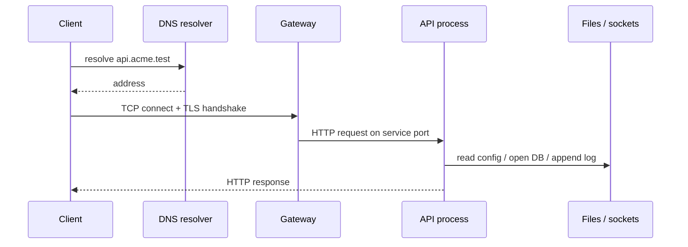

# Module 2 — Networking and operating-system fundamentals

## Why it matters to a software engineer

Incidents are reconstructed from packets, processes, files, and logs. If you
cannot explain what a TCP connection, a listening port, a uid, or a timestamp
means, you cannot investigate your own service. Cloud and Kubernetes add
layers; they do not remove Linux or IP.

## Visual overview



!!! note "Intuition"
    One HTTP request is really four or five separate systems briefly agreeing
    to cooperate: a name lookup, a network handshake, a process doing file and
    socket I/O, and eventually a human-meaningful response. Each of those
    systems keeps its *own* logs, and none of them alone tells the whole
    story — which is exactly why the "one view usually misses" row below
    matters so much.

```text
user/uid --owns--> process --opens--> socket
                         +--reads--> file / env
                         +--writes-> application log
```

| View | Sees well | Usually misses |
| --- | --- | --- |
| Network | endpoints, timing, bytes, DNS, TLS metadata | encrypted body, object authorization |
| Host | process, uid, files, syscalls, local sockets | upstream intent and full distributed path |
| Application | route, actor, object, decision, business result | kernel activity unless instrumented |

Normal: one DNS answer, TLS session, authorized read, 200. Abnormal: repeated
login failures or API→metadata traffic. Evidence: DNS/network metadata,
gateway access log, process/socket state, application audit event. Improvement:
deny needless egress and join views with UTC timestamps and correlation IDs.

!!! tip "Hint"
    If you can only instrument one layer, instrument the application layer
    first — it is the only one of the three that knows *who* did *what* to
    *which object*. Network and host telemetry tell you a request happened;
    only the app layer tells you whether it should have been allowed.

## Learning objectives

- Explain TCP/IP, DNS, HTTP(S), TLS, routing, ports, proxies, and firewalls
  as they affect service design and visibility.
- Connect processes, files, permissions, users, environment variables,
  system calls, and logs.
- Capture **local** evidence (compose network and container logs) safely.

## Key concepts

**TCP/IP.** Packets are routed by IP. Transport protocols (TCP and UDP)
add ports, and TCP adds a handshake and a byte stream. Your API is a
process bound to `0.0.0.0:8080` inside a container, published to
`127.0.0.1:8080` on the host. That publish path is a trust boundary: only
loopback should reach it in this lab.

**DNS.** Names to addresses. Attacks against DNS (spoofing, cache poisoning,
malicious names in SSRF) are common. In the lab, `mock-imds` is a Docker DNS
name on `labnet`.

**HTTP/S and TLS.** HTTP is the application protocol. TLS provides
confidentiality and integrity of the hop and, with certificates, server
(and optionally client) authentication. TLS does not authorize Alice to read
Bob’s note. HTTP methods, paths, headers, and bodies are your app’s surface.

**Routing, ports, proxies, firewalls.** A firewall or security group is a
packet filter, not an identity system. A reverse proxy may terminate TLS and
add headers (`X-Forwarded-For`) that your app must not trust blindly for
authorization.

**Processes, files, permissions, users.** On Linux, a process runs as a user,
with a filesystem view, environment, and capabilities. Secrets in env vars
are visible to that process and often to anyone who can `docker inspect` or
read `/proc`. File modes (`0600` vs `0644`) still matter for sqlite and keys.

**System calls.** User code asks the kernel to do things (`open`, `connect`,
`execve`). EDR products watch these. You will not run a full EDR here; know
that “the app made an outbound GET to IMDS” is a `connect` + write to a
socket.

**Logs.** stdout, files, journald, syslog. They are not evidence until they
have timestamps, integrity, and retention you can defend. Container logs
disappear if you `docker compose down -v` carelessly during an investigation.

**Visibility.**

```
 host            docker-proxy         container
 127.0.0.1:8080 ------------------>  0.0.0.0:8080 notes-api
                                         |
                                         +-- connect() --> mock-imds:80
                                         +-- append JSONL  /logs
```

If you only watch an infrastructure dashboard (metrics, optional Grafana
later — not in this compose file), you may miss that the process still has
a network path to metadata.

## Architecture connection

Service mesh, ingress, and NetworkPolicy are filters on this same model.
East-west TLS is hop security. Authorization still belongs in the service
(or a policy engine that the service actually enforces).

## Hands-on lab — local visibility

**AUTHORIZED LAB USE ONLY.** Capture only on the lab compose network or
loopback. Do not scan your campus, cloud, or neighbors.

### Prerequisites

Lab up. Optional: `ss` or `netstat`, `docker logs`.

### Steps

1. `./labs/scripts/lab-up.sh`
2. On the host, confirm the bind is loopback:

   ```bash
   # Linux
   ss -ltnp | grep 8080
   # macOS
   lsof -nP -iTCP:8080 -sTCP:LISTEN
   ```

3. `docker inspect lab-notes-api --format '{{json .NetworkSettings.Networks}}'`
   — note `labnet` IP `172.30.0.20`. “Internal” is a **network** property:

   ```bash
   docker network inspect learn-security-labnet --format '{{.Internal}} {{json .IPAM.Config}}'
   ```

4. The slim image may not include `ps`. Use:

   ```bash
   docker exec lab-notes-api id
   docker exec lab-notes-api ls -l /data /logs
   ```

5. Login and generate one event:

   ```bash
   TOKEN=$(curl -s http://127.0.0.1:8080/login -H 'Content-Type: application/json' \
     -d '{"username":"alice","password":"alice-lab-password"}' | python3 -c "import sys,json; print(json.load(sys.stdin)['token'])")
   curl -s http://127.0.0.1:8080/notes -H "Authorization: Bearer $TOKEN"
   ```

6. `docker exec lab-notes-api tail -n 5 /logs/notes-api.jsonl`
7. Optional packets (loopback only):

   ```bash
   # Linux loopback is lo; macOS is lo0. Capture only loopback.
   sudo tcpdump -i lo -n port 8080 -c 20    # Linux
   sudo tcpdump -i lo0 -n port 8080 -c 20   # macOS
   ```

   Stop after 20 packets. You should see TCP to localhost, not to the internet.

8. From inside the API container, resolve the metadata hostname:

   ```bash
   docker exec lab-notes-api python -c "import socket; print(socket.getaddrinfo('mock-imds',80)[0][-1])"
   ```

   notes-api is **also on `edgenet`**, a normal bridge. `getaddrinfo('example.com')`
   may succeed (DNS leak). That does not mean you should contact the public
   internet — do not. The bulkhead that actually blocks `/fetch` to the world
   is the application allowlist, not “the container is on an internal network.”
   See [lab guide](../lab-guide.md) and [How defenders think](../how-defenders-think.md).

### Expected observations

Loopback bind; JSON logs with `ts`, `event`, `trace_id`; process running as
the container user; sqlite file on a volume.

### Security lessons

Publication to `0.0.0.0` on the host would have put the vulnerable API on
every interface. Env-based secrets show up in process listings. Logs need a
volume or they vanish with the container.

### Common mistakes

- Capturing on the wrong interface (your Wi-Fi).
- Trusting `X-Forwarded-For` for allowlists.
- Assuming HTTPS to the load balancer means the app saw a verified client
  identity.

### Cleanup

Stop tcpdump. `./labs/scripts/lab-down.sh` if finished.

## Knowledge check

1. Does TLS between user and ingress authorize object access?
2. Why bind lab ports to `127.0.0.1` rather than `0.0.0.0`?
3. What evidence do you lose if you `down -v` mid-incident?
4. Why is a security group insufficient as the only authorization layer?
5. Where might a JWT secret appear besides application config?

**Answers:** (1) No. (2) Avoid exposing vulnerable lab services on LAN/WAN.
(3) Volume logs, sqlite, cases. (4) It filters packets, not user-to-object
mapping. (5) Env, `docker inspect`, memory, logs if mishandled, CI variables.

## Engineering assignment

For a service you run, list listening ports, identity of the process user,
where logs go, and whether secrets are in env. Propose one visibility
improvement (structured log field or bind-address change). No scanning of
systems you do not own.

## Further reading

- [RFC 8446 TLS 1.3](https://www.rfc-editor.org/rfc/rfc8446)
- [Linux man-pages: credentials(7), systemd-journald](https://man7.org/linux/man-pages/)
- CISA: [Binding Operational Directive / known exploited vulns](https://www.cisa.gov/known-exploited-vulnerabilities-catalog) as context for why internet-exposed services get hunted
