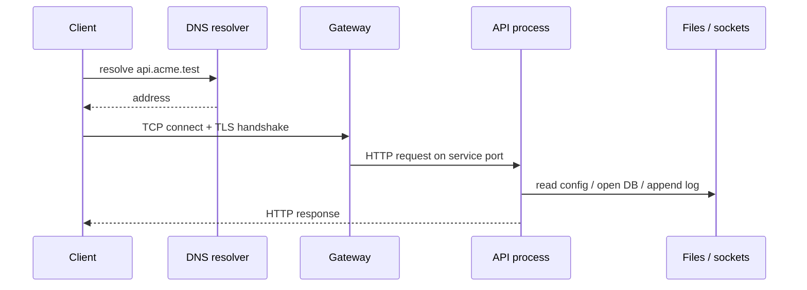
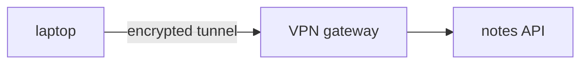
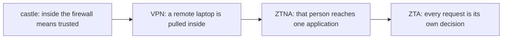
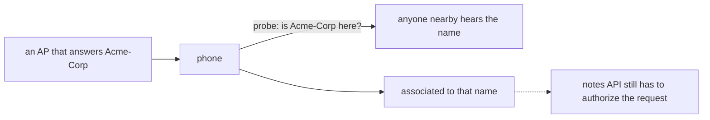
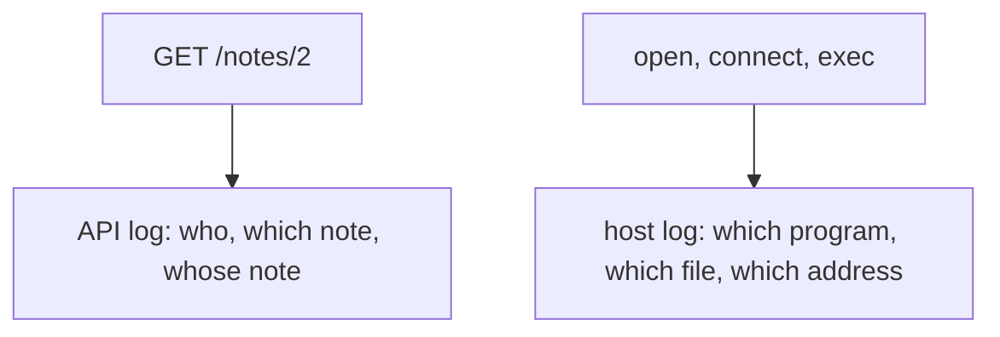

# Module 2 — Network and OS

Two pieces of evidence from the same minute. One is a packet:

```text
IP 127.0.0.1.52814 > 127.0.0.1.8080: Flags [P.], length 142
```

The other is a log line:

```json
{"ts":"2026-09-15T10:00:02.113402Z","event":"cross_user_note_access","service":"notes-api","actor":"alice","note_id":2,"owner":"bob"}
```

Bob’s payroll draft just left the API. Which of these two can prove that?

The packet proves a TCP conversation happened on loopback, and nothing
else. It doesn’t know what a note is. The log line knows the actor, the
object, and the owner, but only because the application chose to write
it, and anyone who can write to that file can write a line just like it.
Neither is “the truth.” Each one proves a different thing, and this module
is about knowing which is which.

## Why it matters to a software engineer

Incidents are reconstructed from packets, processes, files, and logs. If you
cannot explain what a TCP connection, a listening port, a uid, or a timestamp
means, you cannot investigate your own service. Cloud and Kubernetes add
layers; they do not remove Linux or IP.

## Visual overview


```mermaid
sequenceDiagram
  participant C as Client
  participant DNS as DNS resolver
  participant G as Gateway
  participant A as API process
  participant F as Files / sockets
  C->>DNS: resolve api.acme.test
  DNS-->>C: address
  C->>G: TCP connect + TLS handshake
  G->>A: HTTP request on service port
  A->>F: read config / open DB / append log
  A-->>C: HTTP response
```

!!! note "Intuition"
    One HTTP request is really four or five separate systems briefly agreeing
    to cooperate: a name lookup, a network handshake, a process doing file and
    socket I/O, and eventually a human-meaningful response. Each of those
    systems keeps its *own* logs, and none of them alone tells the whole
    story — which is exactly why the "one view usually misses" row below
    matters so much.

```text
user/uid --owns--> process --opens--> socket
                         +--reads--> file / env
                         +--writes-> application log
```

| View | Sees well | Usually misses |
| --- | --- | --- |
| Network | endpoints, timing, bytes, DNS, TLS metadata | encrypted body, object authorization |
| Host | process, uid, files, syscalls, local sockets | upstream intent and full distributed path |
| Application | route, actor, object, decision, business result | kernel activity unless instrumented |

Normal: one DNS answer, TLS session, authorized read, 200. Abnormal: repeated
login failures or API→metadata traffic. Evidence: DNS/network metadata,
gateway access log, process/socket state, application audit event. Improvement:
deny needless egress and join views with UTC timestamps and correlation IDs.

!!! tip "Hint"
    If you can only instrument one layer, instrument the application layer
    first — it is the only one of the three that knows *who* did *what* to
    *which object*. Network and host telemetry tell you a request happened;
    only the app layer tells you whether it should have been allowed.

## Learning objectives

- Explain TCP/IP, DNS, HTTP(S), TLS, routing, ports, proxies, and firewalls
  as they affect service design and visibility.
- Place a VPN, zero trust network access, and a Wi-Fi association on the
  same rule: network location is not authorization.
- Connect processes, files, permissions, users, environment variables,
  system calls, and logs.
- Capture **local** evidence (compose network and container logs) safely.

## Key concepts

**TCP/IP.** Packets are routed by IP. Transport protocols (TCP and UDP)
add ports, and TCP adds a handshake and a byte stream. Your API is a
process bound to `0.0.0.0:8080` inside a container, published to
`127.0.0.1:8080` on the host. That publish path is a trust boundary: only
loopback should reach it in this lab.

**DNS.** Names to addresses. Attacks against DNS (spoofing, cache poisoning,
malicious names in SSRF) are common. In the lab, `mock-imds` is a Docker DNS
name on `labnet`.

**HTTP/S and TLS.** HTTP is the application protocol. TLS provides
confidentiality and integrity of the hop and, with certificates, server
(and optionally client) authentication. Module 6 splits that into key
agreement, authentication, and AEAD-protected data. TLS does not authorize
Alice to read Bob’s note. HTTP methods, paths, headers, and bodies are
your app’s surface.

**Routing, ports, proxies, firewalls.** A firewall or security group is a
packet filter, not an identity system. A reverse proxy may terminate TLS and
add headers (`X-Forwarded-For`) that your app must not trust blindly for
authorization.

**VPN (idea 2).** A virtual private network is an encrypted tunnel that
ends inside a network you operate. After the tunnel, the laptop can route
to notes-api. The API still has to learn who is calling.


```mermaid
flowchart LR
  laptop["laptop"] -->|"encrypted tunnel"| gw["VPN gateway"]
  gw --> api["notes API"]
```

!!! note "Intuition"
    The gateway answers "this packet came through our door." It does not
    answer "this person may read note 2."

```python
# Mistake: a source address on the VPN subnet stands in for an owner check.
def read_note(user: dict, note: dict) -> str:
    if user["ip"].startswith("10.8.0."):
        return note["body"]
    if user["username"] != note["owner"]:
        raise PermissionError("not the owner")
    return note["body"]
```

The address check returns the body before the owner check runs. Secure
mode in `get_note` asks the owner question and ignores where the TCP
connection came from:

```python
if not LAB_MODE and row["owner"] != user["username"] and user["role"] != "admin":
    raise HTTPException(status_code=404, detail="not found")
```

**From the VPN to zero trust (idea 2, continued).** The tunnel above is
one stage in a longer change. Each stage answers a wider question, and
each one leaves the owner check where it was: in the application.


```mermaid
flowchart LR
  castle["castle: inside the firewall means trusted"] --> vpn["VPN: a remote laptop is pulled inside"]
  vpn --> ztna["ZTNA: that person reaches one application"]
  ztna --> zta["ZTA: every request is its own decision"]
```

1. **Castle.** A firewall draws a trusted inside. A host on the inside
   network can open connections to other hosts there.
2. **VPN.** People who are not in the building still need that inside.
   The client joins the subnet through an encrypted tunnel. A stolen
   laptop, or a phished user, is now inside, and lateral movement is
   ordinary routing.
3. **Zero trust network access (ZTNA).** The user is granted notes-api,
   not the subnet. There is no "inside" full of other hosts. This is the
   deployment pattern that replaced "VPN into the LAN" for web and API
   applications. A VPN can remain for a protocol that cannot carry a
   per-request identity. It is no longer the boundary.
4. **Zero trust architecture (ZTA).** The name for the whole strategy,
   not a box you buy. [NIST SP 800-207](https://csrc.nist.gov/publications/detail/sp/800-207/final)
   treats every request as untrusted until policy says otherwise:
   identity, device health, and the specific resource, checked again
   next time. Module 1 defines that rule. ZTNA is one way to build the
   front door. The owner check in `get_note` is the part no front door
   can see.

```python
def allow(request: dict, note: dict) -> bool:
    # Old rule. Corporate network, VPN, or office Wi-Fi all collapse to one bit.
    on_corporate_network = request["on_vpn"] or request["ssid"] == "Acme-Corp"
    if on_corporate_network:
        return True
    return request["user"] == note["owner"]


def allow_zta(request: dict, note: dict) -> bool:
    # Each request. The path that carried it is not an input.
    if request["user"] != note["owner"] and request["role"] != "admin":
        return False
    if request["device_posture"] != "healthy":
        return False
    return True
```

`allow` returns true for anyone who completed the tunnel or joined the
SSID, including someone who is not the owner. `allow_zta` asks who they
are, whether this note is theirs, and whether the device is still one
you accept. A healthy device with Alice's session still cannot read
Bob's note. An unhealthy device cannot read Alice's note either. That
second denial is a policy you chose. The residual, if you drop it, is
a healthy stolen laptop still holding Alice's session.

**Wireless probing (idea 2, the radio version of the same mistake).**
Before a phone joins a network, it asks the air whether a remembered
name is nearby. That question is a probe request. It carries the SSID
the phone hopes to find. Anyone in radio range can hear the name. An
access point that wants those phones to attach answers with that name.


```mermaid
flowchart LR
  phone["phone"] -->|"probe: is Acme-Corp here?"| air["anyone nearby hears the name"]
  rogue["an AP that answers Acme-Corp"] --> phone
  phone --> joined["associated to that name"]
  joined -.-> api["notes API still has to authorize the request"]
```

!!! note "Intuition"
    Association answers "this radio attached to a name." It does not
    answer "this person may read note 2." A probe is the client
    advertising which names it trusts. A rogue access point replies to
    a name your users already remember.

```json
{"event":"wifi_probe","client":"device-17","ssid_sought":"Acme-Corp"}
```

```python
def read_note(user: dict, note: dict) -> str:
    # Same bug as the VPN subnet, with a radio fact in place of an address.
    if user["ssid"] == "Acme-Corp":
        return note["body"]
    if user["username"] != note["owner"]:
        raise PermissionError("not the owner")
    return note["body"]
```

This course does not run a wireless lab. There is no radio in the
compose stack, and no exercise that injects frames. The record above
is the shape of what a wireless controller already logs. The defensive
use of it is to notice a new access point answering `Acme-Corp`, and
to refuse to treat that association as authorization.

**Processes, files, permissions, users.** On Linux, a process runs as a user,
with a filesystem view, environment, and capabilities. Secrets in env vars
are visible to that process and often to anyone who can `docker inspect` or
read `/proc`. File modes (`0600` vs `0644`) still matter for sqlite and keys.

**System calls (idea 3).** User code asks the kernel to do things (`open`,
`connect`, `execve`). An endpoint sensor (EDR is the product category)
watches those calls. You will not run one here. Know which question each
record can answer.


```mermaid
flowchart TB
  req["GET /notes/2"] --> apilog["API log: who, which note, whose note"]
  proc["open, connect, exec"] --> hostlog["host log: which program, which file, which address"]
```

!!! note "Intuition"
    The API log can show Alice read Bob's note. It cannot show that the
    process then opened the sqlite file or connected to the metadata
    address. The host log can show that connection. It cannot show that
    note 2 belongs to Bob.

```json
{"event":"note_read","actor":"alice","note_id":2,"owner":"bob"}
```

```json
{"event":"process_connect","exe":"/usr/local/bin/uvicorn","dst":"169.254.169.254","dst_port":80}
```

“The app made an outbound GET to IMDS” is the second record: a `connect`
plus a write on that socket. The first record never contains the address.

**Logs.** stdout, files, journald, syslog. They are not evidence until they
have timestamps, integrity, and retention you can defend. Container logs
disappear if you `docker compose down -v` carelessly during an investigation.

**Visibility.**

```
 host            docker-proxy         container
 127.0.0.1:8080 ------------------>  0.0.0.0:8080 notes-api
                                         |
                                         +-- connect() --> mock-imds:80
                                         +-- append JSONL  /logs
```

If you only watch an infrastructure dashboard (metrics, optional Grafana
later — not in this compose file), you may miss that the process still has
a network path to metadata.

## Worked scene — is notes-api exposed?

**Hypothesis.** notes-api can only be reached from this machine.

1. *Expect* the listener on `127.0.0.1:8080`. *Got:* `lsof` (or `ss`) shows
   `127.0.0.1:8080`, not `*:8080`. Nothing on your network can connect.
2. *Expect* the container to have no route to the internet, because
   `labnet` is `internal: true`. *Got:* notes-api is also attached to
   `edgenet`, an ordinary bridge. `getaddrinfo('example.com')` may resolve.
3. *Expect* `/fetch` to reach the world, then. *Got:* it doesn’t, but that
   isn’t the network’s doing. The application’s allowlist refuses
   non-lab hosts.

**What that implies.** The first claim holds, for a reason you can point
at. The second one was wrong: “it’s on an internal network” was never the
control. If someone removes the allowlist, the network won’t catch it.
Write down which bulkhead you’re actually relying on, not the one the
diagram suggests.

## Architecture connection

Service mesh, ingress, and NetworkPolicy are filters on this same model.
East-west TLS is hop security. Authorization still belongs in the service
(or a policy engine that the service actually enforces).

## Hands-on lab — local visibility

**AUTHORIZED LAB USE ONLY.** Capture only on the lab compose network or
loopback. Do not scan your campus, cloud, or neighbors.

### Prerequisites

Lab up. Optional: `ss` or `netstat`, `docker logs`.

### Before you run this

Write down three answers before you run anything:

1. Which host address will port 8080 be bound to, and what would it mean if
   it were `0.0.0.0`?
2. Which user does the notes-api process run as inside the container?
3. After one `GET /notes`, which fields will the new log line have, and
   which field would you need to prove *who* read *what*?

Then run the steps. If a result surprises you, which assumption was wrong?

### Steps

1. `./labs/scripts/lab-up.sh`
2. On the host, confirm the bind is loopback:

   ```bash
   # Linux
   ss -ltnp | grep 8080
   # macOS
   lsof -nP -iTCP:8080 -sTCP:LISTEN
   ```

3. `docker inspect lab-notes-api --format '{{json .NetworkSettings.Networks}}'`
   — note `labnet` IP `172.30.0.20`. “Internal” is a **network** property:

   ```bash
   docker network inspect learn-security-labnet --format '{{.Internal}} {{json .IPAM.Config}}'
   ```

4. The slim image may not include `ps`. Use:

   ```bash
   docker exec lab-notes-api id
   docker exec lab-notes-api ls -l /data /logs
   ```

5. Login and generate one event:

   ```bash
   TOKEN=$(curl -s http://127.0.0.1:8080/login -H 'Content-Type: application/json' \
     -d '{"username":"alice","password":"alice-lab-password"}' | python3 -c "import sys,json; print(json.load(sys.stdin)['token'])")
   curl -s http://127.0.0.1:8080/notes -H "Authorization: Bearer $TOKEN"
   ```

6. `docker exec lab-notes-api tail -n 5 /logs/notes-api.jsonl`
7. Optional packets (loopback only):

   ```bash
   # Linux loopback is lo; macOS is lo0. Capture only loopback.
   sudo tcpdump -i lo -n port 8080 -c 20    # Linux
   sudo tcpdump -i lo0 -n port 8080 -c 20   # macOS
   ```

   Stop after 20 packets. You should see TCP to localhost, not to the internet.

8. From inside the API container, resolve the metadata hostname:

   ```bash
   docker exec lab-notes-api python -c "import socket; print(socket.getaddrinfo('mock-imds',80)[0][-1])"
   ```

   notes-api is **also on `edgenet`**, a normal bridge. `getaddrinfo('example.com')`
   may succeed (DNS leak). That does not mean you should contact the public
   internet — do not. The bulkhead that actually blocks `/fetch` to the world
   is the application allowlist, not “the container is on an internal network.”
   See [lab guide](../lab-guide.md) and [How defenders think](../how-defenders-think.md).

### Expected observations

Loopback bind; JSON logs with `ts`, `event`, `trace_id`; process running as
the container user; sqlite file on a volume.

### Security lessons

Publication to `0.0.0.0` on the host would have put the vulnerable API on
every interface. Env-based secrets show up in process listings. Logs need a
volume or they vanish with the container.

### Common mistakes

- Capturing on the wrong interface (your Wi-Fi).
- Trusting `X-Forwarded-For` for allowlists.
- Assuming HTTPS to the load balancer means the app saw a verified client
  identity.

### Cleanup

Stop tcpdump. `./labs/scripts/lab-down.sh` if finished.

## Knowledge check

1. Does TLS between user and ingress authorize object access?
2. Why bind lab ports to `127.0.0.1` rather than `0.0.0.0`?
3. What evidence do you lose if you `down -v` mid-incident?
4. Why is a security group insufficient as the only authorization layer?
5. Where might a JWT secret appear besides application config?

**Answers:** (1) No. (2) Avoid exposing vulnerable lab services on LAN/WAN.
(3) Volume logs, sqlite, cases. (4) It filters packets, not user-to-object
mapping. (5) Env, `docker inspect`, memory, logs if mishandled, CI variables.

## Engineering assignment

For a service you run, list listening ports, identity of the process user,
where logs go, and whether secrets are in env. Propose one visibility
improvement (structured log field or bind-address change). No scanning of
systems you do not own.

## Self-check

Answer before expanding. These are the [assessment](../assessment.md) moves
on this module's Acme Notes lab, not trivia.

??? question "Explain: Why is publishing notes-api on 127.0.0.1:8080 a different trust boundary than 0.0.0.0:8080?"
    Loopback is reachable only from the host. `0.0.0.0` puts the
    intentionally vulnerable API on every interface — LAN/WAN. The
    container still binds `0.0.0.0:8080` *inside* the namespace; the host
    publish mapping is the boundary you chose.

??? question "Predict: What evidence disappears if you `docker compose down -v` in the middle of an investigation?"
    Volume-backed JSONL, sqlite, and soc-lite cases. Container stdout logs
    from the removed instances. A host copy from `preserve-logs.sh` is the
    thing that is supposed to survive.

??? question "Diagnose: labnet is `internal: true`, but `getaddrinfo('example.com')` from notes-api may succeed. What assumption failed?"
    notes-api is dual-homed: edgenet is a normal bridge. Internal labnet
    does not prove the *process* has no DNS or egress. The bulkhead that
    actually blocks `/fetch` to the world is the application allowlist.

??? question "Design: Why is a security group (or compose network) insufficient as the only authorization layer for GET /notes/2?"
    Packet filters decide who can open a TCP connection, not whether Alice
    may read Bob's row. Object AuthZ still belongs in the service.

??? question "Defend: Someone published the lab on a shared Wi-Fi. What do you isolate first, and what remains?"
    Un-publish / bind back to loopback and treat dummy passwords as burned.
    Residual risk: anyone who already reached `:8080` may hold a JWT;
    rotate `JWT_SECRET` and wipe lab volumes after you copy evidence.

## Before you leave

- **Diagnose** — name the failed invariant from this module's telemetry or diagram.
- **Build** — complete the local-visibility lab (bind address, process user, log path, one bulkhead caveat).

How these are graded: [assessment](../assessment.md).

## Further reading

- [RFC 8446 TLS 1.3](https://www.rfc-editor.org/rfc/rfc8446)
- [Linux man-pages: credentials(7), systemd-journald](https://man7.org/linux/man-pages/)
- CISA: [Binding Operational Directive / known exploited vulns](https://www.cisa.gov/known-exploited-vulnerabilities-catalog) as context for why internet-exposed services get hunted
