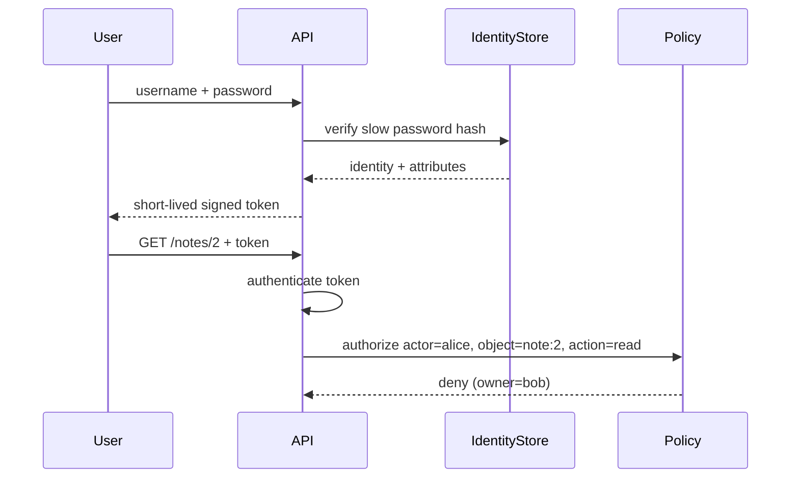
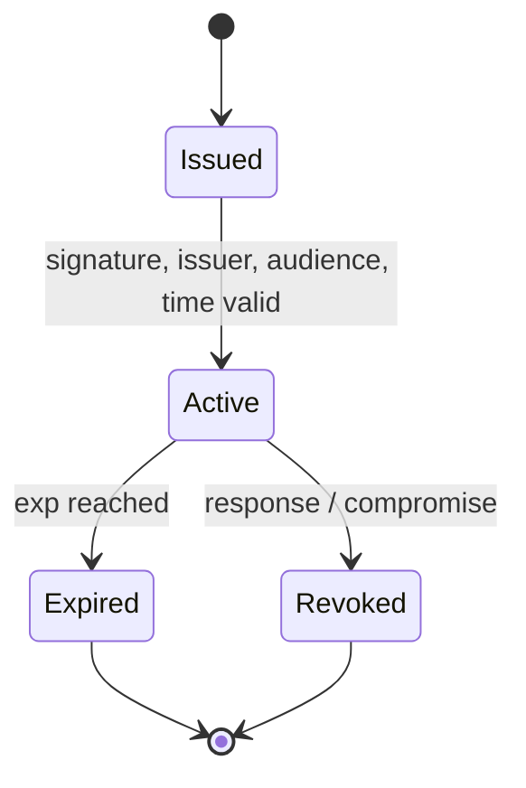
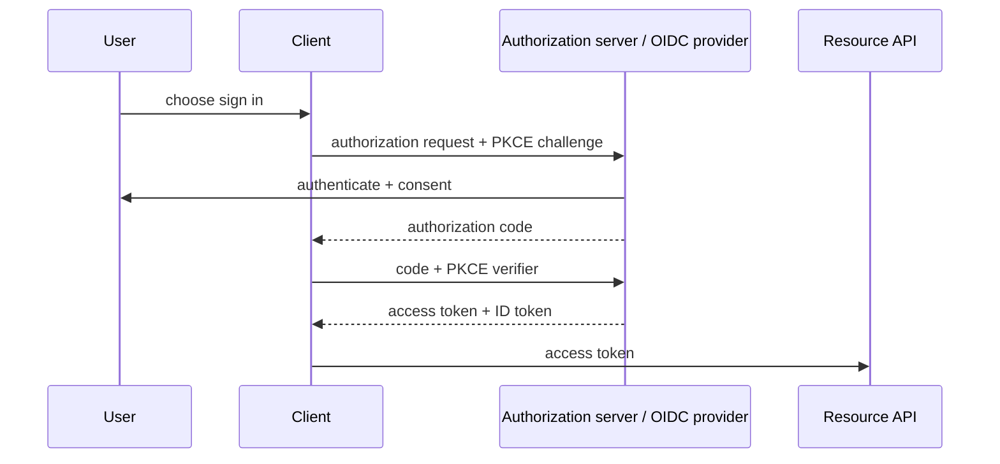

# Module 3 — Identity and access management

Decode Alice’s lab token and you get this:

```json
{"sub": "alice", "role": "user", "iat": 1757930400}
```

Now send that same token to an admin route:

```text
GET /admin/users  →  200  {"users": [{"username":"alice","role":"user"}, {"username":"bob",…}, {"username":"admin","role":"admin"}]}
```

The signature is valid. The token says `role: user`, plainly, in a field
anyone can read. The admin route answered anyway, with every account on
the system. Nobody forged anything. The server knew exactly who Alice was
and never asked what she was allowed to do.

Also notice what the payload doesn’t have: `exp`. That token never
expires. If it leaks, it works forever.

## Why it matters to a software engineer

Almost every serious web incident is an identity incident: a session stolen,
a token over-scoped, a missing authorization check, a service account shared
by twelve microservices. Authentication answers “who is this?” Authorization
answers “what may they do to *this* object, *now*?” Mixing them up produces
`if (loggedIn) return note`.

## Visual overview



!!! note "Intuition"
    Notice the diagram deliberately ends in a **deny**. Authentication proved
    Alice is Alice — that part succeeded. The request still fails, because
    authentication only answers "who are you," never "are you allowed to
    touch *this* object." Treating a valid token as if it were a yes is the
    single most common access-control bug in real APIs (it has its own name:
    BOLA/IDOR, covered in Module 4).



!!! tip "Hint"
    A token's lifecycle has two exits, not one. Teams routinely build the
    `Expired` path (just let `exp` pass) and forget the `Revoked` path
    (actively invalidate a token *before* it would have expired, e.g. on
    logout or after a suspected leak). If your system has no revocation
    story, a stolen long-lived token stays valid until its natural expiry no
    matter what you do.



!!! note "Intuition"
    This is the "log in with..." button, unrolled. The client (your app)
    never sees the user's password — it only ever gets a short-lived
    authorization code, which it then exchanges for a token. PKCE exists
    specifically so that even if the authorization code leaks in transit
    (e.g. via a mobile deep link), the code alone is useless without the
    verifier secret the client generated for itself.

| Authentication | Authorization |
| --- | --- |
| Who/what is calling? | May this identity perform this action on this object now? |
| Password, MFA, certificate, signed token | RBAC, ABAC, ownership, policy |
| Failure: forged/stolen identity | Failure: valid Alice reads Bob's note |

Human identity usually begins with an interactive login and MFA; workload
identity begins with attested runtime context and receives a short-lived,
audience-bound credential. Both need lifecycle, least privilege, audit, and
revocation. A valid token is input to authorization, not proof of permission.

## Learning objectives

- Separate authentication, authorization, sessions, and tokens.
- Explain cookies, bearer tokens, OAuth 2.0 *concepts*, OIDC *concepts*, API
  keys, MFA, RBAC, and ABAC well enough to review a design.
- Identify common implementation failures in the lab JWT flow.
- Describe service-to-service identity better than a shared static key.

## Words for the lab

These are the terms the lab uses. The rest of the vocabulary comes
[after the lab](#the-rest-of-the-vocabulary), once you have seen it in action.

**Authentication (AuthN).** Establishing identity: password, passkey, OIDC
id_token, mTLS certificate, workload identity. In the lab, `/login` returns
a JWT after verifying the seeded lab password (unsalted SHA-256 in
`LAB_MODE` — weak, not fictional).

**Authorization (AuthZ).** A decision: allow or deny an action on a resource.
Must happen on the server for every object. UI hiding a button is not AuthZ.

**JWT (JSON Web Token).** Three segments: header, payload, signature. Signed
(JWS) tokens are *integrity-protected claims*, not automatically confidential.
Anyone who has the token can read claims. `alg=none`, `HS256` with a leaked
secret, missing `exp`, and confusing `aud` are classic failures.

**OAuth 2.0** is a **delegation** framework: an authorization server grants
an access token so a client can call an API as a user or as itself. It is
not “login.” **OpenID Connect** adds an identity layer (id_token) on top of
OAuth. You do not need to implement either in this course; you need to stop
treating a random JWT your app minted as “we use OAuth.”

**RBAC vs ABAC.**

| | RBAC | ABAC |
| --- | --- | --- |
| Decision inputs | Roles (admin, user) | Attributes (owner, tenant, clearance, time) |
| Strength | Simple ops | Fine-grained, policy-as-data |
| Failure | Role explosion; “admin” means everything | Policy complexity; slow reviews |
| Lab | `role=admin` for `/admin/users` | `note.owner == token.sub` |

You usually need **both**: roles for functions, attributes for objects.

**Common implementation failures.**

- AuthN without object AuthZ (IDOR / BOLA).
- Missing function AuthZ (`/admin/*` if logged in).
- Tokens without `exp`/`aud`/`iss`, or accepting `alg=none`.
- Session fixation, cookie without `Secure`.
- Storing passwords with SHA-256 or reversible encryption.
- Logging tokens.
- Confused deputy: API fetches a URL the user supplied (SSRF) using the
  **service’s** identity.

## Worked scene — Alice and the admin route

**Hypothesis.** A `user` token can’t list accounts.

1. *Expect* `/whoami` to say `alice`, `user`. *Got:* exactly that.
   Authentication works.
2. *Expect* `/admin/users` to return 403. *Got:* 200 with every account,
   in `LAB_MODE`. The log line is `broken_function_authz`, with
   `actor: alice` and `endpoint: /admin/users`.
3. *Expect* the fix to be about the token. *Got:* with `LAB_MODE=false` the
   same token gets 403, and the log says `authz_failure`,
   `reason: admin_blocked`. The token didn’t change. A check was added.

**What that implies.** Authentication was never broken. The missing piece
was one line comparing `role` to what the route requires. That is
function-level authorization, and it’s a different decision from the
object-level one in Module 1’s note-2 scene. A service can get one right
and the other wrong.

## Architecture connection

```
user --password--> /login --JWT--> client
client --Bearer JWT--> /notes/2
                         |
                         +-- must check: token valid AND owner==sub
```

Zero-trust service communication looks the same for machines: each request
carries a verifiable identity; the callee authorizes.

## Hands-on lab — review the authentication flow

**AUTHORIZED LAB USE ONLY.**

### Prerequisites

Lab running with `LAB_MODE=true` (default).

### Before you run this

Write down three answers before you run anything:

1. Which claims will Alice’s decoded token contain, and which one that a
   production token needs will be missing?
2. What will `/admin/users` return for Alice’s token in `LAB_MODE`, and
   which event should that write?
3. Can you change `role` to `admin` by editing the decoded payload? Why not?

Then run the steps. If a result surprises you, which assumption was wrong?

### Steps

1. Login as Alice; decode the JWT payload (it is base64, not encryption):

   ```bash
   TOKEN=$(curl -s http://127.0.0.1:8080/login -H 'Content-Type: application/json' \
     -d '{"username":"alice","password":"alice-lab-password"}' \
     | python3 -c "import sys,json; print(json.load(sys.stdin)['token'])")
   export TOKEN
   python3 - <<'PY'
   import os, base64, json

   def b64url(seg: str) -> dict:
       pad = "=" * (-len(seg) % 4)
       return json.loads(base64.urlsafe_b64decode(seg + pad))

   token = os.environ["TOKEN"]
   header, payload, _sig = token.split(".")
   print("header:", json.dumps(b64url(header), indent=2))
   print("payload:", json.dumps(b64url(payload), indent=2))
   PY
   ```

   Decoding is **not** verifying. Anyone with the token can read `sub` and
   `role`. This lab mints its own HS256 JWT; that is **not** OAuth/OIDC.

2. Observe missing `exp` in lab mode (weak session). There is still no
   revocation path — see the unused `Revoked` state in the diagram.
3. Call `/whoami` and `/admin/users` with Alice’s token. In LAB_MODE the
   admin route succeeds — broken function-level authorization.

   ```bash
   curl -s http://127.0.0.1:8080/whoami -H "Authorization: Bearer $TOKEN"
   curl -s http://127.0.0.1:8080/admin/users -H "Authorization: Bearer $TOKEN"
   ```

   Expect `username`/`role` from whoami, and a user list (`alice`, `bob`,
   `admin`) from the admin route.
4. Login as Bob; confirm Bob cannot be Alice by comparing `sub`.
5. Read `issue_token` and `current_user` in `labs/notes-api/app.py`. List
   production fixes (`exp`, `aud`/`iss`, bcrypt, owner checks) — more than
   three is fine.

Do **not** try to brute-force real passwords or reuse this token outside
localhost.

### Expected observations

Payload contains `sub` and `role`, likely no `exp` in LAB_MODE. Alice can
hit `/admin/users` while LAB_MODE is true. Logs show `login_success` and
possibly `broken_function_authz`.

### Security lessons

A valid token is the start of authorization, not the end. Role in a JWT is
a claim you signed; still check it on sensitive functions, and still check
object owners.

### Common mistakes

- Putting PII in JWT and assuming it is secret.
- Checking roles only in the frontend.
- Using the same signing secret across all environments.
- Infinite-lived service tokens “for convenience.”

### Cleanup

If you copied tokens into a scratch file, delete it. `lab-down` optional.

## The rest of the vocabulary

Now that you have run the lab, here is the rest of the language people
will use about it.

**Session vs token.** A session is server-side state (session id in a cookie).
A token is typically client-held claims (JWT). Both can be stolen. Both need
expiry, revocation strategy, and transport security.

**Cookies.** Automatically sent by browsers for a site. Need `Secure`,
`HttpOnly`, `SameSite` in real browser apps. This lab uses `Authorization:
Bearer` instead (typical of APIs and SPAs).

**API keys.** Bearer secrets, often long-lived, often pasted into frontends
by accident. Prefer scoped, rotatable keys or workload identity.

**Secrets.** Anything that grants access: passwords, tokens, signing keys.
Not “the config file.”

**MFA.** Additional factor. Phishing-resistant MFA (passkeys, hardware)
beats OTP that can be phished. MFA does not fix IDOR.

**Service-to-service identity.** Shared `API_KEY=...` in six repos is not
identity. Prefer short-lived credentials: cloud workload identity,
**SPIFFE/SPIRE** (an open standard that issues each workload a short-lived
cryptographic identity document instead of a shared secret), mTLS with
rotation, or OIDC from CI. The mock IMDS in this lab exists because cloud
SDKs historically fetched **instance role keys** from a link-local service —
a powerful identity that SSRF can steal.

## Knowledge check

1. User is logged in and the UI omits the delete button. Is that authorization?
2. Difference between OAuth access token and OIDC id_token (conceptually)?
3. Why does MFA not fix later DET-002 (cross-user note access)?
4. Why is IMDS a service-identity concern?
5. Name one RBAC check and one ABAC check in notes-api when LAB_MODE=false.

**Answers:** (1) No. (2) Access token is for an API; id_token asserts
authentication to the client. (3) Alice is already authenticated; the bug is
AuthZ. (4) It hands out the workload’s cloud credentials to anything that can
HTTP to it. (5) RBAC: admin role for `/admin/users`. ABAC: owner equals
subject for GET note.

## Engineering assignment

Document the AuthN/AuthZ path of a service you know: identity provider,
token type, expiry, where object checks live, how services authenticate.
Note one failure mode. No production credential dumps.

## Self-check

Answer before expanding. These are the [assessment](../assessment.md) moves
on this module's Acme Notes lab, not trivia.

??? question "Explain: Alice presents a valid JWT and GET /notes/2 (Bob's). Which question did authentication answer, and which did it not?"
    Authentication: this caller is Alice (`sub`). Authorization: may Alice
    read note 2 *now*? A missing owner check is an AuthZ failure after
    AuthN succeeded.

??? question "Predict: In LAB_MODE, what is in the JWT payload, and what is missing?"
    You should see `sub` and `role` (and the algorithm in the header).
    Decoding is not verifying. Expect no `exp` in lab mode — a weak
    session, and still no revocation path.

??? question "Diagnose: Alice's token lists `/admin/users` successfully. Which check failed?"
    Function-level authorization: a `role=user` token was treated as
    enough for an admin route. That is DET-004's later evidence
    (`broken_function_authz`), not proof Alice became admin.

??? question "Design: Name a prevention and a detection for missing `exp`."
    Prevention: mint short-lived tokens with `exp` (and a revocation story
    for theft before expiry). Detection: alert on use of tokens with no
    `exp`, or on reuse after logout if you have a denylist. Logging the
    raw token is not a detection.

??? question "Defend: Why does MFA not contain a DET-002-class bug?"
    MFA raises the cost of *becoming* Alice. Once a valid Alice session
    exists, object AuthZ still has to run. Residual risk of "MFA everywhere,
    no owner check" is still Bob's note in the response body.

## Before you leave

- **Diagnose** — name the failed invariant from `/whoami` vs `/admin/users` vs a note read.
- **Build** — complete the identity-flow lab (decode a lab JWT, list production fixes, do not reuse the token off localhost).

How these are graded: [assessment](../assessment.md).

## Further reading

- [OWASP Authentication Cheat Sheet](https://cheatsheetseries.owasp.org/cheatsheets/Authentication_Cheat_Sheet.html)
- [OWASP Authorization Cheat Sheet](https://cheatsheetseries.owasp.org/cheatsheets/Authorization_Cheat_Sheet.html)
- [RFC 6749 OAuth 2.0](https://www.rfc-editor.org/rfc/rfc6749)
- [OpenID Connect Core](https://openid.net/specs/openid-connect-core-1_0.html)
- [NIST SP 800-63-4 Digital Identity](https://pages.nist.gov/800-63-4/)
