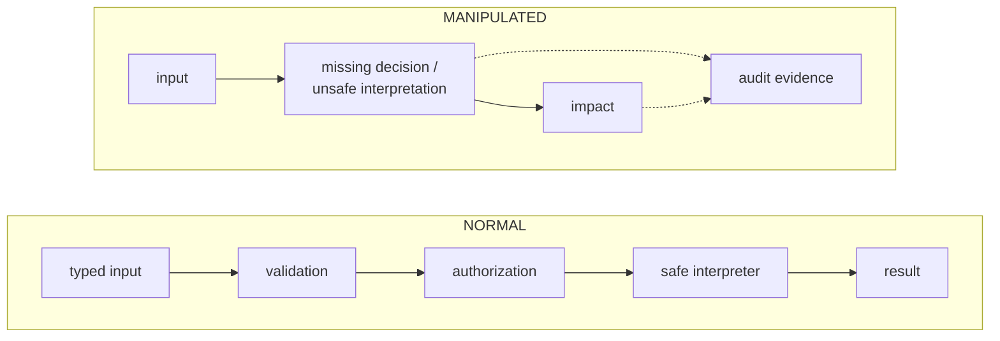

# Module 4 — Application and API security

## Why it matters to a software engineer

This is the module that maps to your pull requests. Broken access control
has been the most serious web risk in OWASP Top 10:2021 and remains
[A01:2025](https://owasp.org/Top10/2025/A01_2025-Broken_Access_Control/).
APIs make it worse: clients are untrusted, object IDs are in the path, and
there is no HTML form to hide fields.

## Visual overview

!!! note "Intuition"
    Nearly every vulnerability class in this module is the *same bug*
    wearing a different costume: data that was supposed to stay inert data
    gets treated as instructions, a destination, or a permission by whatever
    reads it next. Once you see that pattern, you stop needing to memorize a
    dozen unrelated attack names — you just ask "where does untrusted input
    change from *data* to *control* here?"

Use this same frame for injection, BOLA, SSRF, XSS, CSRF, deserialization,
file handling, rate limits, and business-flow abuse:



| Case | Normal path | Manipulated path | Evidence | Primary control |
| --- | --- | --- | --- | --- |
| Injection | value → bound SQL parameter | value becomes SQL syntax | query error, unusual search | parameterization |
| BOLA/IDOR | token → owner check → note | valid token + another id → note | actor/owner mismatch | object authorization |
| SSRF | server fetches allowlisted service | URL selects metadata/internal host | outbound destination, fetch result | egress allowlist + segmentation |
| XSS | text → context encoding | text becomes browser script | stored input, CSP report | contextual output encoding |
| CSRF | intentional state change + token | browser auto-sends cookie cross-site | origin, CSRF failure | SameSite + CSRF token |
| Deserialization | strict data schema | bytes instantiate behavior | parser/type errors | safe parser + allowlisted schema |
| File handling | generated id + isolated storage | name traverses or executable upload runs | path, MIME, scan result | server naming + isolation |

!!! tip "Hint"
    For each row, say out loud what the "authorization" step actually checks.
    For BOLA it's "does this actor own this object" — for SSRF it's "is this
    destination on the allowlist." If you cannot name the exact check, that's
    usually because the check doesn't exist yet, which is the vulnerability.

Attacker view: make data become code, identity become authority, or a server
become a proxy. Defender view: join actor, input class, object, downstream
destination, decision, and response. Repair in `LAB_MODE=false`, replay the
same request, and compare both response and telemetry.

## Learning objectives

- Explain injection, broken access control, SSRF, XSS, CSRF, insecure
  deserialization, file handling, dependency risk, rate limiting, and
  business-logic abuse in engineering terms.
- Use OWASP Top 10:2025 and API Security Top 10:2023 as awareness lists, not
  as complete security programs.
- Exercise the lab app’s intentional flaws and then run it with `LAB_MODE=false`.

## Key concepts

**Input validation.** Check type, length, range, encoding. Validation is not
a substitute for parameterized queries or AuthZ. Allowlists beat blocklists.

**Injection (A05:2025).** Untrusted data becomes interpreted code: SQL,
command, LDAP, template, **prompt**. The lab `/search` concatenates SQL in
LAB_MODE.

**Broken access control (A01:2025).** Missing or wrong AuthZ. Includes IDOR,
forced browsing, CSRF as a confused-user pattern, and SSRF was rolled into
this category in 2025.

**SSRF.** Server fetches a URL the attacker influences, using the **server’s**
network position (metadata, cloud IMDS, internal admin). Lab: `/fetch`.

**XSS.** Attacker script runs in a victim’s browser. Less visible in a JSON
API; fatal if you reflect HTML or if a frontend `dangerouslySetInnerHTML`s
API data.

**CSRF.** Browser automatically sends cookies to a site. Bearer tokens in
headers are not auto-sent by other origins; cookie sessions need `SameSite`
and anti-CSRF tokens.

**Insecure deserialization.** Loading untrusted bytes as objects (Python
pickle, Java serialization, YAML `load`). Can become RCE. Do not pickle
user data.

**File handling.** Path traversal (`../`), unsanitized names, executing
uploads. Not in the default lab routes; still in your mental model.

**Dependency / supply chain (A03:2025).** Compromised packages, build
systems, update channels. Scanning helps; pinning and provenance help more.

**Rate limiting.** Resource and abuse control (API4:2023). The lab login
has no limit — DET-001 exists because of that.

**Business-logic abuse (API6:2023).** Using the feature as designed, too
much: coupon replay, bulk scraping, password reset spam. Not a CWE scanner
finding.

### OWASP Top 10:2025

| ID | Name |
| --- | --- |
| A01:2025 | Broken Access Control |
| A02:2025 | Security Misconfiguration |
| A03:2025 | Software Supply Chain Failures |
| A04:2025 | Cryptographic Failures |
| A05:2025 | Injection |
| A06:2025 | Insecure Design |
| A07:2025 | Authentication Failures |
| A08:2025 | Software or Data Integrity Failures |
| A09:2025 | Security Logging and Alerting Failures |
| A10:2025 | Mishandling of Exceptional Conditions |

Source: [owasp.org/Top10/2025](https://owasp.org/Top10/2025/0x00_2025-Introduction/).

### OWASP API Security Top 10:2023

| ID | Name |
| --- | --- |
| API1:2023 | Broken Object Level Authorization |
| API2:2023 | Broken Authentication |
| API3:2023 | Broken Object Property Level Authorization |
| API4:2023 | Unrestricted Resource Consumption |
| API5:2023 | Broken Function Level Authorization |
| API6:2023 | Unrestricted Access to Sensitive Business Flows |
| API7:2023 | Server Side Request Forgery |
| API8:2023 | Security Misconfiguration |
| API9:2023 | Improper Inventory Management |
| API10:2023 | Unsafe Consumption of APIs |

Source: [OWASP API Security](https://owasp.org/API-Security/editions/2023/en/0x11-t10/).

**Secure coding patterns that actually show up in PRs.**

- Parameterized queries / bind variables.
- Authorize every object id (`note.owner == user` or equivalent policy).
- Allowlist outbound URLs; block IMDS and link-local.
- Explicit output encoding on HTML boundaries.
- Typed DTOs; deny unknown fields (mass assignment).
- Fail closed on AuthZ errors; do not leak existence if that is policy.
- Structured security logs for AuthZ failures (A09).
- Dependency pinning + scan in CI (A03) — not sufficient alone.

## Architecture connection

API gateways can rate-limit and authenticate. They cannot know that note 2
belongs to Bob unless they have that data or they defer to the service.
Put object AuthZ next to the data.

## Hands-on lab — break (lab-only) then fix

**AUTHORIZED LAB USE ONLY.** Local compose only. Benign payloads.

### Prerequisites

`make lab-up`. Python 3.

### Steps

1. Confirm banner: `curl -s http://127.0.0.1:8080/.well-known/lab`
2. Run scenarios one at a time; read the HTTP bodies. They include dummy
   secrets only:

   ```bash
   python3 labs/attack-sim/simulate.py --scenario idor
   python3 labs/attack-sim/simulate.py --scenario admin
   python3 labs/attack-sim/simulate.py --scenario injection
   python3 labs/attack-sim/simulate.py --scenario ssrf
   ```

3. Map each to OWASP (A01/API1, API5, A05, API7/A01).
4. Restart in secure mode:

   ```bash
   cd labs && LAB_MODE=false docker compose up -d --force-recreate notes-api
   ```

   Recreate wipes in-memory nothing; sqlite already has hashes from **previous**
   mode. If login fails, reset: `../labs/scripts/lab-reset.sh` then
   `LAB_MODE=false docker compose up -d --build`.

5. Re-run `idor`, `admin`, `ssrf`, `injection`. Expect 404/403/400 and no
   Bob data, no metadata body, no extra rows.

6. Set `LAB_MODE=true` again if later modules need vulnerable mode, or leave
   false and use reset at the start of module 9.

### Expected observations

LAB_MODE true: Alice reads Bob’s note; admin list leaked; search can return
Bob’s titles with the provided payload; fetch returns dummy IMDS JSON.
LAB_MODE false: those should fail. Safety rail blocks non-lab hosts in both
modes.

### Security lessons

“Logged in” ≠ “allowed.” Parameterize queries. Do not let the app fetch
metadata. Tests that replay these four requests belong in CI.

### Common mistakes

- Running simulate.py against a deployed environment (script should refuse).
- Using additional SQL payloads “to see how far it goes.” Stop at the benign
  demonstration.
- Fixing IDOR in one handler and leaving `/search` concatenated.

### Cleanup

`LAB_MODE=true docker compose up -d --force-recreate notes-api` or
`./labs/scripts/lab-reset.sh` as needed.

## Knowledge check

1. Why is BOLA (API1) so common in JSON APIs?
2. How did OWASP Top 10:2025 change SSRF’s placement relative to 2021?
3. Why is rate limiting a security control and a product control?
4. Give an example of API6 on a notes product.
5. Why is `pickle.loads` on a user blob dangerous?

**Answers:** (1) Object IDs in URLs; clients are untrusted; missing per-object
checks. (2) SSRF rolled into A01 Broken Access Control. (3) Stops abuse and
protects cost/availability (API4). (4) Unbounded export of all notes via an
intended “export” button without per-user quotas. (5) Pickle can invoke
constructors and lead to RCE.

## Engineering assignment

Add a failing-then-passing test file (pytest) that, against LAB_MODE=false,
asserts Alice gets 404 on `/notes/2`. Optional: assert `/fetch` to mock-imds
is blocked. Do not add new exploits.

## Further reading

- [OWASP Top 10:2025](https://owasp.org/Top10/2025/)
- [OWASP API Security Top 10:2023](https://owasp.org/API-Security/editions/2023/en/0x11-t10/)
- [OWASP ASVS](https://owasp.org/www-project-application-security-verification-standard/)
- [CWE Top 25](https://cwe.mitre.org/top25/)
