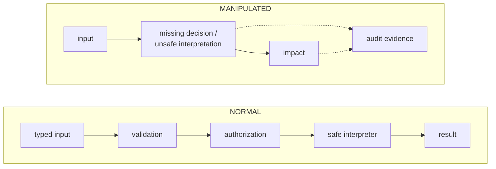
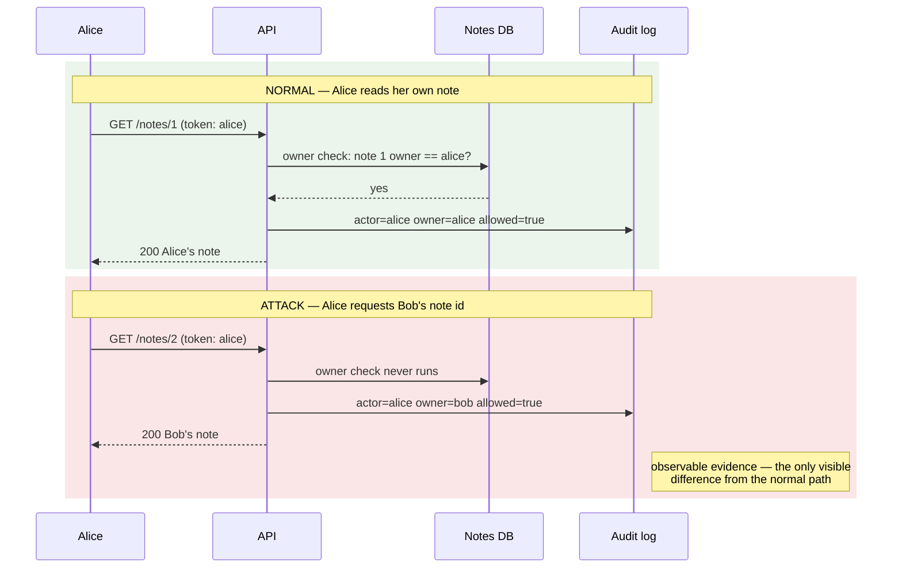

# Module 4 — Application and API security

## Why it matters to a software engineer

This is the module that maps to your pull requests. Broken access control
has been the most serious web risk in OWASP Top 10:2021 and remains
[A01:2025](https://owasp.org/Top10/2025/A01_2025-Broken_Access_Control/).
APIs make it worse: clients are untrusted, object IDs are in the path, and
there is no HTML form to hide fields.

## Visual overview

!!! note "Intuition"
    Most classes in this module share a pattern: data that was supposed to stay
    inert gets treated as instructions, a destination, or a permission.
    Injection, SSRF, XSS, and unsafe deserialization are that pattern.
    BOLA is slightly different — a *missing decision* (no owner check), not
    an interpreter gone wild. Still ask "where did untrusted input become
    control?" and, for BOLA, "which decision never ran?"

Use this same frame for injection, BOLA, SSRF, XSS, CSRF, deserialization,
file handling, rate limits, and business-flow abuse:



| Case | Normal path | Manipulated path | Evidence | Primary control |
| --- | --- | --- | --- | --- |
| Injection | value → bound SQL parameter | value becomes SQL syntax | query error, unusual search | parameterization |
| BOLA/IDOR | token → owner check → note | valid token + another id → note | actor/owner mismatch | object authorization |
| SSRF | server fetches allowlisted service | URL selects metadata/internal host | outbound destination, fetch result | egress allowlist + segmentation |
| XSS | text → context encoding | text becomes browser script | stored input, CSP report | contextual output encoding |
| CSRF | intentional state change + token | browser auto-sends cookie cross-site | origin, CSRF failure | SameSite + CSRF token |
| Deserialization | strict data schema | bytes instantiate behavior | parser/type errors | safe parser + allowlisted schema |
| File handling | generated id + isolated storage | name traverses or executable upload runs | path, MIME, scan result | server naming + isolation |

!!! tip "Hint"
    For each row, say out loud what the "authorization" step actually checks.
    For BOLA it's "does this actor own this object" — for SSRF it's "is this
    destination on the allowlist." If you cannot name the exact check, that's
    usually because the check doesn't exist yet, which is the vulnerability.

Attacker view: make data become code, identity become authority, or a server
become a proxy. Defender view: join actor, input class, object, downstream
destination, decision, and response. Repair in `LAB_MODE=false`, replay the
same request, and compare both response and telemetry.

### Worked example: the security reasoning loop, applied to BOLA

The [module index](README.md#the-security-reasoning-loop) defines an
eight-step loop for reasoning about any weakness. Here it is run in full
against the BOLA row of the table above, on Acme Notes:

1. **Asset.** Alice's and Bob's private notes.
2. **Invariant.** A user may access only objects they own or have
   explicitly been delegated.
3. **Trust boundary.** Between an authenticated-but-untrusted client
   (any holder of a valid token) and the notes API's data layer — the
   `API -->|parameterized SQL| DB` edge in the reference-system diagram.
4. **Violation.** Authentication succeeds (Alice's token is valid), but the
   handler never checks that the requested note's `owner` matches the
   caller — a missing decision, not a broken interpreter.
5. **Evidence:**

   ```text
   actor=alice
   object_owner=bob
   authorization_result=allowed
   http_status=200
   ```

6. **Detection hypothesis.** Alert when a principal successfully accesses
   an object owned by another principal without a recorded delegation.
7. **Response.** Revoke or scope down the session token, and flag the
   accessed objects for the owner to review — reversible, immediate.
8. **Permanent fix.** Server-side, per-object authorization (`note.owner ==
   user`) on every read, not just on the routes someone remembered to
   guard.

!!! note "Why step 8 is not optional"
    A detection rule for step 6 catches this *after* Alice already read
    Bob's note. It cannot substitute for step 8 — it can only shorten how
    long the missing check goes unnoticed.

Same request, two paths, laid out over time — the only difference is one
line in the API's response and one field in its log:



That `owner=bob` line only exists because Module 7's pipeline was built to
carry an `owner` field on every note-access event. If the log only recorded
`actor` and `status`, this violation would be invisible — a 200 to Alice
looks identical whether she read her own note or Bob's.

Evidence quality is not uniform across the stack. The same BOLA violation
looks very different depending on which layer you inspect:

| Layer | Expected evidence for this BOLA |
| --- | --- |
| Application | `actor=alice`, `owner=bob` mismatch, `http_status=200` — the only layer where this is unambiguous |
| Identity | A perfectly valid token, normal login history — nothing wrong here at all |
| Database | A successful, well-formed read — the query itself is legitimate |
| Network | Ordinary HTTPS to a route Alice is allowed to call |
| Host | Likely nothing unusual — no new process, no unusual resource use |

The lesson generalizes past BOLA: most application-security failures do
not look malicious anywhere except the application layer, because that is
the only layer that knows what "owner" means. A network or host-based
detection strategy alone would miss this entirely — which is why Module 7's
insistence on rich application-level fields, not just infrastructure
telemetry, is a security requirement, not a nice-to-have.

### Predict the evidence

Before you look at the "Expected observations" section in the lab below,
answer this: **if the IDOR scenario succeeds, what should appear in the
API log?** What would distinguish Alice reading Bob's note maliciously
from a legitimate admin doing the same read? Write down your prediction,
then compare it against what the lab actually produces.

## Learning objectives

- Explain injection, broken access control, SSRF, XSS, CSRF, insecure
  deserialization, file handling, dependency risk, rate limiting, and
  business-logic abuse in engineering terms.
- Use OWASP Top 10:2025 and API Security Top 10:2023 as awareness lists, not
  as complete security programs.
- Exercise the lab app’s intentional flaws and then run it with `LAB_MODE=false`.

## Key concepts

**Input validation.** Check type, length, range, encoding. Validation is not
a substitute for parameterized queries or AuthZ. Allowlists beat blocklists.

**Injection (A05:2025).** Untrusted data becomes interpreted code: SQL,
command, LDAP, template. **Prompt injection** (untrusted text treated as
instructions by a model) is the same pattern with a different interpreter;
Module 12/15 go deep. The lab `/search` concatenates SQL in LAB_MODE.

This lab uses `Authorization: Bearer` headers, so **CSRF is not the lesson**
(browsers do not auto-send that header across sites). Cookie sessions would
still need `SameSite` and anti-CSRF tokens.

**Broken access control (A01:2025).** Missing or wrong AuthZ. Includes IDOR,
forced browsing, CSRF as a confused-user pattern, and SSRF was rolled into
this category in 2025.

**SSRF.** Server fetches a URL the attacker influences, using the **server’s**
network position (metadata, cloud IMDS, internal admin). Lab: `/fetch`.

**XSS.** Attacker script runs in a victim’s browser. Less visible in a JSON
API; fatal if you reflect HTML or if a frontend `dangerouslySetInnerHTML`s
API data.

**CSRF.** Browser automatically sends cookies to a site. Bearer tokens in
headers are not auto-sent by other origins; cookie sessions need `SameSite`
and anti-CSRF tokens.

**Insecure deserialization.** Loading untrusted bytes as objects (Python
pickle, Java serialization, YAML `load`). Can become RCE. Do not pickle
user data.

**File handling.** Path traversal (`../`), unsanitized names, executing
uploads. Not in the default lab routes; still in your mental model.

**Dependency / supply chain (A03:2025).** Compromised packages, build
systems, update channels. Scanning helps; pinning and provenance help more.

**Rate limiting.** Resource and abuse control (API4:2023). The lab login
has no limit — DET-001 exists because of that.

**Business-logic abuse (API6:2023).** Using the feature as designed, too
much: coupon replay, bulk scraping, password reset spam. Not a CWE scanner
finding.

### OWASP Top 10:2025

| ID | Name |
| --- | --- |
| A01:2025 | Broken Access Control |
| A02:2025 | Security Misconfiguration |
| A03:2025 | Software Supply Chain Failures |
| A04:2025 | Cryptographic Failures |
| A05:2025 | Injection |
| A06:2025 | Insecure Design |
| A07:2025 | Authentication Failures |
| A08:2025 | Software or Data Integrity Failures |
| A09:2025 | Security Logging and Alerting Failures |
| A10:2025 | Mishandling of Exceptional Conditions |

Source: [owasp.org/Top10/2025](https://owasp.org/Top10/2025/0x00_2025-Introduction/).

### OWASP API Security Top 10:2023

| ID | Name |
| --- | --- |
| API1:2023 | Broken Object Level Authorization |
| API2:2023 | Broken Authentication |
| API3:2023 | Broken Object Property Level Authorization |
| API4:2023 | Unrestricted Resource Consumption |
| API5:2023 | Broken Function Level Authorization |
| API6:2023 | Unrestricted Access to Sensitive Business Flows |
| API7:2023 | Server Side Request Forgery |
| API8:2023 | Security Misconfiguration |
| API9:2023 | Improper Inventory Management |
| API10:2023 | Unsafe Consumption of APIs |

Source: [OWASP API Security](https://owasp.org/API-Security/editions/2023/en/0x11-t10/).

**Secure coding patterns that actually show up in PRs.**

- Parameterized queries / bind variables.
- Authorize every object id (`note.owner == user` or equivalent policy).
- Allowlist outbound URLs; block IMDS and link-local.
- Explicit output encoding on HTML boundaries.
- Typed DTOs; deny unknown fields (mass assignment).
- Fail closed on AuthZ errors; do not leak existence if that is policy
  (this lab’s secure-mode IDOR returns **404**, not 403, so Alice cannot
  enumerate Bob’s ids from the status code).
- Structured security logs for AuthZ failures (A09).
- Dependency pinning + scan in CI (A03) — not sufficient alone.

## Architecture connection

API gateways can rate-limit and authenticate. They cannot know that note 2
belongs to Bob unless they have that data or they defer to the service.
Put object AuthZ next to the data.

## Hands-on lab — break (lab-only) then fix

**AUTHORIZED LAB USE ONLY.** Local compose only. Benign payloads.

### Prerequisites

`make lab-up`. Python 3.

### Before you run this

Predict: (1) which evidence appears (2) which does not (3) why.

Then run the steps. Compare with the prediction. If the result differs,
which assumption was wrong?

### Steps

1. Confirm banner: `curl -s http://127.0.0.1:8080/.well-known/lab`
2. Run scenarios one at a time; read the HTTP bodies. They include dummy
   secrets only:

   ```bash
   python3 labs/attack-sim/simulate.py --scenario idor
   python3 labs/attack-sim/simulate.py --scenario admin
   python3 labs/attack-sim/simulate.py --scenario injection
   python3 labs/attack-sim/simulate.py --scenario ssrf
   ```

3. Map each to OWASP (A01/API1, API5, A05, API7/A01).
4. Restart in secure mode:

   ```bash
   cd labs && LAB_MODE=false docker compose up -d --force-recreate notes-api
   ```

   Recreate does not wipe the sqlite volume. Hashes from **previous** mode
   stay. If login fails, from `labs/`: `../labs/scripts/lab-reset.sh` then
   `LAB_MODE=false docker compose up -d --build` (reset deletes volumes,
   then you must re-seed in secure mode). Leftover SHA-256 verifiers used to
   500 on bcrypt; the API now fails those logins as 401.

5. Re-run the four scenarios. Expected **secure-mode** HTTP:

   | Scenario | Status | Body |
   | --- | --- | --- |
   | `idor` `GET /notes/2` | **404** | `not found` (hides whether the note exists) |
   | `admin` | **403** | `forbidden` |
   | `ssrf` to mock-imds | **400** | `destination blocked` |
   | `injection` | **200** | parameterized `LIKE`; the payload is a literal string, usually **no extra owners** |

   Injection is not a 4xx. `/fetch` to `http://soc-lite:8090/` can still
   succeed — secure mode blocks **metadata hosts**, not every SSRF. OpenAPI
   at `/docs` disappears in secure mode (surface reduction).

6. Set `LAB_MODE=true` again if later modules need vulnerable mode, or leave
   false and use reset at the start of module 7 or 9. Always run compose
   commands from `labs/` or pass `-f labs/compose.yaml` from the repo root.

### Expected observations

LAB_MODE true: Alice reads Bob’s note; admin list leaked; the provided
search payload is `LIKE '%' OR owner = 'bob' OR title LIKE '%'`, which
returns **all** titles (Alice, Bob, and admin), not only Bob’s; fetch
returns dummy IMDS JSON (`LABFAKEACCESSKEYID`).
LAB_MODE false: IDOR 404, admin 403, SSRF-to-IMDS 400, injection 200 without
cross-user rows. Safety rail blocks non-lab hosts **and non-allowlisted
ports** in both modes. `/fetch` to other compose services is still possible.

### Security lessons

“Logged in” ≠ “allowed.” Parameterize queries. Do not let the app fetch
metadata. Tests that replay these four requests belong in CI.

### Common mistakes

- Running simulate.py against a deployed environment (script should refuse).
- Using additional SQL payloads “to see how far it goes.” Stop at the benign
  demonstration.
- Fixing IDOR in one handler and leaving `/search` concatenated.

### Cleanup

`LAB_MODE=true docker compose up -d --force-recreate notes-api` or
`./labs/scripts/lab-reset.sh` as needed.

## Knowledge check

1. Why is BOLA (API1) so common in JSON APIs?
2. How did OWASP Top 10:2025 change SSRF’s placement relative to 2021?
3. Why is rate limiting a security control and a product control?
4. Give an example of API6 on a notes product.
5. Why is `pickle.loads` on a user blob dangerous?

**Answers:** (1) Object IDs in URLs; clients are untrusted; missing per-object
checks. (2) SSRF rolled into A01 Broken Access Control. (3) Stops abuse and
protects cost/availability (API4). (4) Unbounded export of all notes via an
intended “export” button without per-user quotas. (5) Pickle can invoke
constructors and lead to RCE.

## Exit criteria

You pass this module when you can meet the course
[pass bar](../assessment.md) (Explain → Predict → Diagnose → Design →
Defend) on this material:

- ✓ Identify the trust boundary each of injection, BOLA, SSRF, XSS, CSRF,
  and deserialization crosses.
- ✓ State the security invariant broken by BOLA in one sentence, without
  using the word "vulnerability."
- ✓ Predict what an IDOR read leaves in the API log before being shown it.
- ✓ Distinguish "authentication succeeded" from "authorization ran" for a
  given request/response pair.
- ✓ Investigate a `LAB_MODE=true` vs `LAB_MODE=false` response diff and
  explain which control changed and why the status code changed with it.
- ✓ Propose an immediate, reversible response to a confirmed cross-user
  access (not just the permanent fix).
- ✓ Explain the permanent architectural fix for BOLA, and why a detection
  rule alone does not replace it.
- ✓ Defend one tradeoff: why secure-mode IDOR returns 404 instead of 403.

## Engineering assignment

Add a failing-then-passing test file (pytest) that, against LAB_MODE=false,
asserts Alice gets 404 on `/notes/2`. Optional: assert `/fetch` to mock-imds
is blocked. Do not add new exploits.

## Further reading

- [OWASP Top 10:2025](https://owasp.org/Top10/2025/)
- [OWASP API Security Top 10:2023](https://owasp.org/API-Security/editions/2023/en/0x11-t10/)
- [OWASP ASVS](https://owasp.org/www-project-application-security-verification-standard/)
- [CWE Top 25](https://cwe.mitre.org/top25/)
