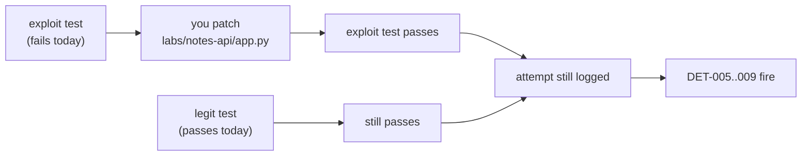

# Module 4b — Secure coding workshop

Module 4 let you watch vulnerabilities and flip a switch to fix them. This
workshop takes the switch away. You get five routes that are vulnerable on
purpose, a test for each that fails today, and one job: **change the code until
the test passes without breaking the feature.**

```text
$ python3 -m pytest labs/workshop -q
FAILED test_exploit_union_injection_cannot_read_other_tables
FAILED test_exploit_stored_script_is_not_rendered_as_markup
FAILED test_exploit_traversal_cannot_read_outside_files_dir
...
7 failed, 5 passed
```

The five that pass are `test_legit_*`. They guard the feature, so a "fix" that
deletes the route does not count.

!!! note "Optional, and outside the course hours"
    This workshop is not part of the core (modules 1–13 plus a capstone), the
    13-week plan, or any [learning path](../learning-paths.md)'s hours. Budget
    about 6–8 hours; that is an estimate, not a measurement. Nothing later in
    the course depends on it, and the 17-module count does not include it.

## Why it matters to a software engineer

Reading about parameterized queries is easy to agree with and easy to get
wrong. The skills that matter are the ones the table in Module 4 cannot give
you: seeing the *shape* of a bug in code, writing the narrowest fix, proving it
with a test, and noticing the same bug when a scanner or a colleague's diff
shows it to you.

## Visual overview



Every route also logs the *attempt*, even when secure mode blocks it. A fix
that stops the attack and hides it from the SOC is half a fix.

## Learning objectives

- Patch injection, output-encoding, path, mass-assignment, and fail-open flaws
  in working code, and prove each fix with a test.
- Explain why each fix works in terms of the invariant it restores.
- Triage static-analysis findings as true positive, false positive, or missed.
- Review a diff for security problems and name the weakness class of each.
- Connect each flaw to the detection that sees it and to the OWASP item it
  belongs to ([coverage matrix](../owasp-coverage.md)).

## Before you start

You need the Python environment from [setup](../setup.md). No Docker is needed
for the exercises; the tests load the API in-process with a throwaway database.

```bash
python3 -m pytest labs/workshop -q                       # your starting point
WORKSHOP_LAB_MODE=false python3 -m pytest labs/workshop -q   # the reference fix: all green
```

The vulnerable code sits behind `if LAB_MODE:` in
[labs/notes-api/app.py](https://github.com/sanketn26/learn-security/blob/main/labs/notes-api/app.py).
The `else` branch is the reference fix. **Do not read it until you have written
your own.** The tests run with `LAB_MODE=true`, so patch the vulnerable branch
itself and leave the switch alone.

!!! warning "AUTHORIZED LAB USE ONLY"
    Payloads are benign and local. The file routes have a safety rail: even in
    `LAB_MODE` they cannot reach outside a sandbox directory. Do not remove it,
    and do not point these techniques at anything you do not own.

**Optional, to see the SOC side.** With the lab running (`make lab-up`), run a
scenario and look for the alert:

```bash
python3 labs/attack-sim/simulate.py --scenario injection_union
make ingest
make alerts
```

## Exercises

For each one, **predict first**: what will the response be, which log event
should appear, and which detection should fire? Then run, then compare.

### 1. UNION-based SQL injection (A05:2025)

`GET /search?q=` concatenates `q` into SQL. Module 4's payload added rows you
already owned. A `UNION` reads **other tables**.

- Run: `--scenario injection_union`.
- First try `UNION SELECT id, username, password_hash FROM users` by hand.
  Read the error in `search_error`. The database just described its own schema
  to you. (That is a second problem, covered in exercise 5.)
- Evidence: `search` and `search_error` events; **DET-005**.
- Goal: `test_exploit_union_injection_cannot_read_other_tables`.

??? tip "Hint"
    A value should never become SQL syntax. SQLite binds values with `?`.

### 2. Stored XSS (A05:2025)

`GET /notes/{id}/page` renders a note as HTML. Store `<script>alert('lab')</script>`
as the note body and the page contains a script element. Nothing runs in this
lab because no browser is involved, but the test parses the response the way a
browser would.

- Run: `--scenario xss`.
- Evidence: `note_render` with `markup` set to `script`, `handler`, or `js-url`;
  **DET-006**. Note that the *viewer* is who gets attacked, not the author.
- Goal: `test_exploit_stored_script_is_not_rendered_as_markup`, while
  `test_legit_page_shows_note_text` keeps passing (text like `a < b & c` must
  still read correctly).
- Think: secure mode also sends `Content-Security-Policy: default-src 'none'`.
  Why is that not a substitute for encoding?

??? tip "Hint"
    Encode for the output context at the point of output.

### 3. Path traversal (A01:2025)

`POST /files` and `GET /files?name=` store and fetch small files. The caller's
string chooses the path, so `../canary.txt` climbs out of the files directory and
an absolute name replaces the base entirely.

- Run: `--scenario traversal`. Then try `/etc/hosts` and read what the **safety
  rail** says. The rail is the lab protecting itself, not your code protecting
  users.
- Evidence: `file_access` with `traversal=yes`; **DET-007**. Look for
  `file_blocked_safety_rail` as well.
- Goals: both `test_exploit_traversal_*` tests, with `test_legit_file_round_trip`
  still green.

??? tip "Hint"
    Two layers: refuse names that are not what you expect, and verify the final
    resolved path is still inside the directory you meant. Separate users from
    each other too.

### 4. Mass assignment (API3:2023)

`PATCH /users/me` is meant to change a display name. It applies whatever fields
the client sends, including `role`.

- Run: `--scenario mass_assign`. Notice your **current token still says `user`**:
  the new role arrives at next login. What does that mean for revocation?
- Evidence: `privileged_field_update` with `applied`; **DET-008**. `applied=false`
  is an attempt; `applied=true` is an incident.
- Goals: `test_exploit_user_cannot_set_own_role`, with
  `test_legit_user_can_set_display_name` green.

??? tip "Hint"
    The client should not decide which columns exist. Describe what *is* allowed,
    and reject the rest.

### 5. Failing open and leaking errors (A10:2025)

`GET /notes/{id}/export` runs an authorization policy that reads an `X-Tenant`
header. A malformed value makes the policy raise. The handler catches the error
and **allows the request**. Separately, asking for an unknown `format` returns a
Python stack trace.

- Run: `--scenario fail_open`, then `--scenario error_leak`.
- Evidence: `authz_fail_open` and `export_error`; **DET-009**. Secure mode logs
  `authz_error_denied` instead: the same crash, the opposite decision.
- Goals: `test_exploit_policy_error_must_deny` and
  `test_exploit_errors_do_not_leak_internals`, with `test_legit_export_own_note`
  green.
- Think: this is the one place the fix is a *decision*, not a function. When a
  security check cannot decide, what is the safe answer, and who pays for it?

??? tip "Hint"
    Catch narrowly, deny on doubt, give the client a reference id, and keep the
    detail in your log.

## 6. Triage a static analyzer

A scanner is another reviewer who is fast, tireless, and sometimes wrong.

```bash
pip install -r requirements-workshop.txt
semgrep --test labs/workshop/semgrep
semgrep --config labs/workshop/semgrep/rules.yml labs/notes-api/app.py
```

The rules are small on purpose. [`rules.py`](https://github.com/sanketn26/learn-security/blob/main/labs/workshop/semgrep/rules.py)
beside them holds three cases:

| Case | What the rule does | Your job |
| --- | --- | --- |
| `true_positive` | Flags it, correctly | Say why it is exploitable |
| `false_positive` | Flags it, wrongly | Decide: suppress with a written reason, or restructure |
| `false_negative` | Misses it | Explain why the rule cannot see it |

Then answer: **the HTML rule did not flag `note_page`. Why not?** (Look at how
the f-string reaches `HTMLResponse`.) A clean scan is evidence about the rules,
not about the code.

Deliverable: a three-column table of finding, verdict, and reason. A verdict
without a reason is a guess.

## 7. Review a pull request

A colleague adds a "share a note" feature. Review the diff as if it were going
to production. List every security concern, name the weakness class, and say
what you would ask for.

```diff
+@app.get("/notes/{note_id}/share")
+def share(note_id: int, token: str, next: str = "/", authorization: str | None = Header(default=None)):
+    user = current_user(authorization)
+    with db() as conn:
+        row = conn.execute("SELECT * FROM notes WHERE id = ?", (note_id,)).fetchone()
+    audit("note_share", actor=user["username"], note_id=note_id, token=token)
+    try:
+        link = make_share_link(row, token)
+    except Exception:
+        link = "/"
+    return RedirectResponse(next + "?link=" + link)
```

Also in the PR: `requests>=2` added to `requirements.txt`.

??? question "Review notes (open after you have a list)"
    1. **No ownership check** on the note (A01, API1). `SELECT *` also returns
       every column, so the body travels further than needed (API3).
    2. **Secret in the URL and in the log**: `token` is a query parameter and is
       written to the audit log (A09, A04). Query strings land in proxy and
       browser history.
    3. **Open redirect**: `next` is unvalidated and concatenated (A01). Pair it
       with phishing (Module 17).
    4. **Swallowed error**: `except Exception` turns a failure into a quiet
       default (A10). Decide whether failing to make a link should fail the
       request.
    5. **`row` can be `None`** for a missing note, so `make_share_link` raises and
       the handler hides it (A10, again).
    6. **The link is concatenated into the redirect URL without encoding**, so a
       value containing `&` or `#` can add or cut parameters (A05).
    7. **A `GET` that creates a share** (if `make_share_link` records one) changes
       state on a "safe" method. Prefetchers, link scanners, and cross-site pages
       can trigger it. Use `POST` and think about CSRF.
    8. **Nothing limits how often links are made** (API4), and the failure path
       logs nothing.
    9. **Loose dependency pin** `requests>=2` (A03). Pin it and let a tool bump it.
    10. **No test.** A security review comment is "add a test that proves it",
        not just "please fix".

    These are one author's list. A colleague will find items this one missed;
    compare notes with a peer before treating it as complete.

## OWASP toolbox

Module 4 named the lists. These are the working tools that go with them.

| Resource | Use it for |
| --- | --- |
| [Cheat Sheet Series](https://cheatsheetseries.owasp.org/) | The fix, written by practitioners. One per row below. |
| [Proactive Controls](https://top10proactive.owasp.org/) | The defensive counterpart to the Top 10: what to build in. |
| [ASVS](https://owasp.org/www-project-application-security-verification-standard/) | A checkable list of requirements; the basis for a review. |
| [Web Security Testing Guide](https://owasp.org/www-project-web-security-testing-guide/) | A test case for each weakness; the source for purple-team scenarios in Module 9. |
| [ZAP](https://www.zaproxy.org/) | A dynamic scanner and intercepting proxy. Point it only at the local lab. |
| [Juice Shop](https://owasp.org/www-project-juice-shop/) and [WebGoat](https://owasp.org/www-project-webgoat/) | More practice targets when you want more repetitions. |

| This workshop | Fix, in the Cheat Sheet Series |
| --- | --- |
| 1. SQL injection | [SQL Injection Prevention](https://cheatsheetseries.owasp.org/cheatsheets/SQL_Injection_Prevention_Cheat_Sheet.html), [Query Parameterization](https://cheatsheetseries.owasp.org/cheatsheets/Query_Parameterization_Cheat_Sheet.html) |
| 2. Stored XSS | [XSS Prevention](https://cheatsheetseries.owasp.org/cheatsheets/Cross_Site_Scripting_Prevention_Cheat_Sheet.html), [Content Security Policy](https://cheatsheetseries.owasp.org/cheatsheets/Content_Security_Policy_Cheat_Sheet.html) |
| 3. Path traversal | [Input Validation](https://cheatsheetseries.owasp.org/cheatsheets/Input_Validation_Cheat_Sheet.html), [File Upload](https://cheatsheetseries.owasp.org/cheatsheets/File_Upload_Cheat_Sheet.html) |
| 4. Mass assignment | [Mass Assignment](https://cheatsheetseries.owasp.org/cheatsheets/Mass_Assignment_Cheat_Sheet.html), [Authorization](https://cheatsheetseries.owasp.org/cheatsheets/Authorization_Cheat_Sheet.html) |
| 5. Fail open, error leaks | [Error Handling](https://cheatsheetseries.owasp.org/cheatsheets/Error_Handling_Cheat_Sheet.html) |

## What this workshop does not cover

Business-logic abuse (race conditions, workflow bypass), CORS and session
misconfiguration, password-reset flaws, JWT algorithm and key confusion,
deserialization, CSRF, and file *upload* of binary content. They appear in
Module 4 as concepts. See the [coverage matrix](../owasp-coverage.md) for what
is and is not exercised.

## Knowledge check

1. Why must a fix keep the `test_legit_*` tests green?
2. Why does secure mode still log a blocked path-traversal attempt?
3. Why is escaping the fix for XSS and a CSP only a second layer?
4. Mass assignment changed a role, but the attacker's token still said `user`.
   Why does that not make it harmless?
5. A static scan reports nothing on your service. What can you conclude?

??? question "Answers"
    1. A fix that removes the feature trivially stops the exploit. The pair of
       tests is what separates fixing from disabling.
    2. Detection is about the attempt. A control that hides probes from the SOC
       leaves you blind to the attacker who is still looking.
    3. Encoding removes the cause (text becomes syntax). A CSP limits what a
       missed injection can do. Defense in depth needs both, in that order.
    4. The role is changed in the database and takes effect at next login or
       token refresh. It is a persistent privilege change that revocation of the
       current token does not undo.
    5. Only that these rules did not match. You cannot conclude the code is safe;
       the false-negative case shows a plain SQL injection that no rule sees.

## Exit criteria

- ✓ **Explain** the invariant each of the five fixes restores.
- ✓ **Predict** the log event and detection for each exploit before running it.
- ✓ **Diagnose** a scanner finding as true, false, or missed, with a reason.
- ✓ **Design** the fix and the detection together, and show the attempt is
  still visible after the fix.
- ✓ **Defend** your fixes with passing `test_exploit_*` *and* `test_legit_*`.

## Engineering assignment

Submit (1) a diff that turns `python3 -m pytest labs/workshop` fully green on
`LAB_MODE=true`, (2) your triage table from exercise 6, and (3) your review
findings from exercise 7. Add one test of your own that would have caught a
bug in exercise 1 *before* the exploit test existed.

## Before you leave

- You fixed code, not a switch.
- Each fix has a test that fails without it.
- You can name the log event that shows the attack attempt.
- You know what a clean scan does and does not prove.

## Further reading

- [OWASP Top 10:2025](https://owasp.org/Top10/2025/)
- [OWASP API Security Top 10:2023](https://owasp.org/API-Security/editions/2023/en/0x11-t10/)
- [Semgrep: testing rules](https://semgrep.dev/docs/writing-rules/testing-rules)
- [OWASP: Path Traversal](https://owasp.org/www-community/attacks/Path_Traversal)
