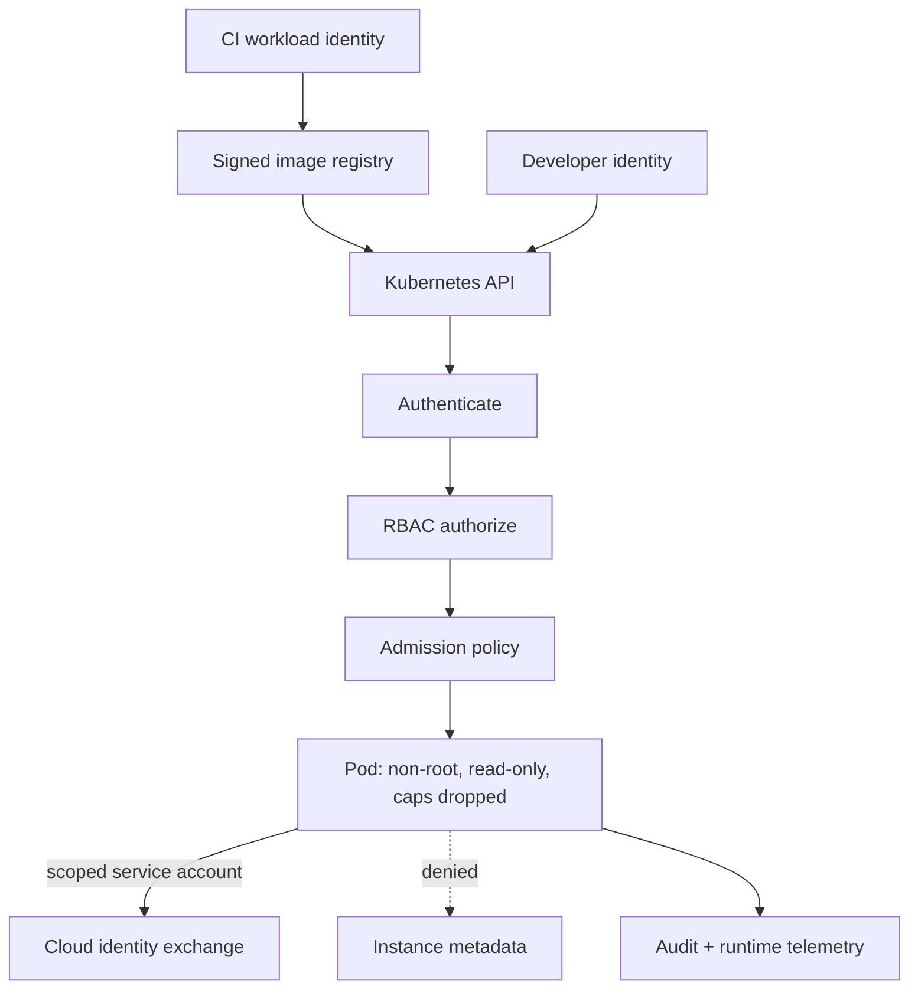

# Module 5 — Cloud, container, and Kubernetes security

There is no public route to the metadata service. Nobody can reach it
from outside. Then Alice sends this:

```text
GET /fetch?url=http://mock-imds/latest/meta-data/iam/security-credentials/lab-role
```

```json
{"Code": "Success", "Type": "AWS-HMAC", "AccessKeyId": "LABFAKEACCESSKEYID", "SecretAccessKey": "lab-fake-secret-access-key-not-real", …}
```

She didn’t reach the metadata service. The API did, on her behalf, from
inside the network where “nobody can reach it” was true. These keys are
fake. In a real cloud they would be the workload’s role, and the role
usually reaches much more than one notes table.

The cloud didn’t take away your AuthZ problem. It added a new one:
everything your workload is allowed to call.

## Why it matters to a software engineer

You do not “move to the cloud” and shed identity problems. You add a metadata
service, a dozen IAM policy languages, object storage that is one ACL away
from public, and a scheduler that will run whatever image you allowed. Shared
responsibility means **you** still own AuthZ, secrets, what your image
contains, and what your workloads can call.

## Visual overview

!!! note "Intuition"
    Follow the dotted line from the pod to instance metadata. In the lab,
    that line isn’t denied at all: `/fetch` crossed it. The provider runs
    the metadata service. Whether your pod can reach it is your
    configuration, the same as RBAC, admission, and which image runs. The
    shared-responsibility table below is where people assume the provider
    drew that line for them. It never does.

| Layer | Provider/platform owns | Engineering team still owns |
| --- | --- | --- |
| Physical / managed control plane | facilities, hardware, defined service plane | configuration and consumption |
| Cluster / workload | scheduler mechanics vary by service | RBAC, admission, images, secrets, network policy |
| Application / data | none of the business rule | AuthZ, classification, retention, audit |



!!! tip "Hint"
    That dotted line to instance metadata is doing a lot of work — it is the
    same SSRF-to-metadata attack from Module 4, just drawn one layer down
    the stack. If an application-layer SSRF bug exists *and* the pod can
    still reach cloud metadata, the two weaknesses chain into full cloud
    credential theft. Blocking metadata access at the pod/network layer is a
    control that survives even if the application bug isn't caught in time.

```text
container process
  +-- namespaces: what it can see
  +-- cgroups: what it can consume
  +-- capabilities/seccomp: what it can ask the kernel to do
  +-- mounts: what host/data it can change
  (shared host kernel: a container is not a VM)
```

Supply chain: developer → source → dependency resolution → CI identity →
artifact → signature/provenance → registry → admission → runtime. A compromise
at any stage can arrive as an apparently normal deployment; provenance,
least-privilege CI, admission, and runtime evidence are complementary.

## Learning objectives

- Explain shared responsibility without pretending the provider secures your
  application.
- Reason about IAM, segmentation, metadata, object storage, security groups,
  audit logs, image provenance, isolation, secrets, admission, and Kubernetes
  RBAC.
- Identify CI/CD and IaC failure modes.
- Secure a small containerized deployment (the lab stack + optional kind).

## Words for the lab

These are the terms the lab uses. The rest of the vocabulary comes
[after the lab](#the-rest-of-the-vocabulary), once you have seen it in action.

**Shared responsibility.** The provider secures the cloud (physical, hypervisor,
managed control plane depending on the service). You secure what you configure
and deploy: identities, network exposure, data, application AuthZ, most
logging. SaaS vs PaaS vs IaaS shifts the line; it never includes “our IDOR.”

**IAM.** Users, roles, policies. Over-broad `*` actions and missing conditions
(`aws:SourceVpce`, audience on OIDC) are the usual findings. Prefer short-lived
roles over access keys in repos.

**Metadata services (IMDS).** Link-local HTTP that issues **temporary cloud
credentials** to the workload so the instance need not bake long-lived keys.
SSRF or a compromised process that can reach IMDS inherits the instance/task
role. Two *different* mitigations:

- **IMDSv2** — the client must `PUT /latest/api/token` and send
  `X-aws-ec2-metadata-token` on later GETs. Naive one-line GET SSRF (this
  lab’s `/fetch`) fails.
- **Hop limit (TTL)** on the token *response* packet — default 1 so the
  packet dies if forwarded. **Containers often need hop limit 2–3** or the
  task cannot use IMDS and may fall back to v1.

This lab’s `mock-imds` is **IMDSv1-style**: unauthenticated GET, dummy keys.
Compose still **allows** notes-api to reach it on labnet; `LAB_MODE=false`
only adds the application block. The dotted “denied” line in the diagram is
the *desired* bulkhead, not what the default stack enforces.

**Containers.** Namespaces, cgroups, union filesystem. **Not** a VM. Root in
a container with host mounts or `privileged` is host root. Run as non-root,
drop capabilities, read-only rootfs where possible, no host PID/net.

**Admission controls.** Policy on what the API server will accept: no
privileged, require non-root, deny `:latest`, require signatures. Gatekeeper/
Kyverno/validating admission policy are implementations.

## Worked scene — what the workload can reach

**Hypothesis.** The API container is an unprivileged process that can only
talk to what it needs.

1. *Expect* a non-root user. *Got:* `docker inspect` reports an empty
   `User`, which means uid 0. That’s a finding.
2. *Expect* metadata to be out of reach. *Got:* in `LAB_MODE`, `/fetch` to
   mock-imds returns the dummy credentials JSON. The API can reach the
   metadata service, and it will do it for any caller.
3. *Expect* the provider to stop that. *Got:* nothing between the pod and
   the metadata endpoint says no. Only the application flag does, and only
   when `LAB_MODE=false`.

**What that implies.** Two bulkheads you own are missing: a non-root
image, and a network path that refuses metadata. Neither is the
provider’s job. The application check is a third, independent layer. It
isn’t a substitute for the first two.

## Architecture connection

```
CI (OIDC) --> registry (signed image)
                |
                v
         kube API (RBAC + admission)
                |
                v
              pod (non-root)
                |
         no route to IMDS / only scoped SA
```

The lab compose file is a tiny version: non-public binds, internal network,
dummy IMDS isolated on labnet.

## Hands-on lab — metadata path and container posture

**AUTHORIZED LAB USE ONLY.** Optional kind is local-only.

### Prerequisites

Default lab. Optional: `kind` or `k3d`, `trivy`.

### Before you run this

Write down three answers before you run anything:

1. What will `/fetch` to mock-imds return in `LAB_MODE=true`, and which
   event will the API log?
2. What will `docker inspect` report for `User`, and what does an empty
   value mean?
3. Which single control would stop the metadata fetch even if the
   application filter had a bug?

Then run the steps. If a result surprises you, which assumption was wrong?

### Steps

1. With `LAB_MODE=true`, run:

   ```bash
   python3 labs/attack-sim/simulate.py --scenario ssrf
   ```

   Read the dummy credentials JSON. Map to T1552.005 conceptually. These
   keys cannot call a cloud.

2. Inspect isolation:

   ```bash
   docker inspect lab-notes-api --format '{{.HostConfig.Privileged}} {{.HostConfig.ReadonlyRootfs}} {{.Config.User}}'
   docker compose -f labs/compose.yaml config | less
   ```

   Empty `User` means uid 0 (root). Record one hardening you would add
   (`USER` in the Dockerfile, cap drop, read-only rootfs). Run compose
   commands from the **repo root** (`-f labs/compose.yaml`).

3. Optional image scan (your local images, not a third-party attack):

   ```bash
   trivy image learn-security-notes-api || true
   ```

4. Optional Kubernetes (skip if RAM < 8 GiB):

   ```bash
   kind create cluster --name learn-sec
   kubectl run notes --image=nginx --port=80
   kubectl auth can-i '*' '*' --as system:serviceaccount:default:default
   kind delete cluster --name learn-sec
   ```

   This optional step **pulls nginx from Docker Hub** (needs internet).
   Default SA typically cannot `*` `*` — that's the good news. The gap is
   that you still created the workload with **no admission policy** to stop
   it in the first place.

5. Write three CI rules you would enforce: pin digest, no privileged, no
   `LAB_MODE` in prod.

### Expected observations

SSRF returns dummy IMDS in LAB_MODE. Compose labnet is internal. Default
container user may be root — that is a finding, not a feature.

### Security lessons

If the app can fetch metadata, the task role is on the attack surface.
Kubernetes RBAC and admission are where platform engineers implement least
privilege for *deployments*, not for *business objects*.

### Common mistakes

- Assigning the same cloud role to every microservice.
- HostPath mounts for convenience.
- Treating Trivy “exit 0” as supply-chain security.
- Hitting real `169.254.169.254` on a cloud VM “to see what happens.” Do not.

### Cleanup

`kind delete cluster --name learn-sec` if created. `make lab-down` as needed.

## The rest of the vocabulary

Now that you have run the lab, here is the rest of the language people
will use about it.

**Network segmentation and security groups.** Packet filters. Necessary,
insufficient. NetworkPolicy in Kubernetes is the analog.

**Object storage.** Public buckets, overly broad identity policies, and
server-side copy between buckets (T1537 class of behavior in ATT&CK) are
recurring breach patterns. Versioning and access logs matter.

**Audit logs.** Cloud trail / admin activity is often the only evidence of
IAM changes. Turn them on; protect them; actually query them.

**Image provenance.** Know what you run: signed images (Sigstore/cosign as
an ecosystem), SBOMs, scan (Trivy/Grype), pin digests not `:latest`. Scanning
without deploy gates is a report, not a control.

**Secrets.** Env vars leak. Prefer tmpfs, native secret stores, short-lived
certs. Never bake secrets into layers (`docker history`).

**Kubernetes RBAC.** `apiGroups`, `resources`, `verbs`, `subjects`. Cluster-admin
bindings to users or CI are a classic blast-radius problem. Service accounts
default-mounted into pods expand SSRF/compromise impact.

**CI/CD and IaC risk.** Self-hosted runners, over-privileged OIDC, unpinned
actions, `curl | sudo bash` in Dockerfiles, secrets in terraform state,
`kubectl` from laptops with cluster-admin. Supply chain is A03:2025.

## Knowledge check

1. Who is responsible for object-level AuthZ in a managed Kubernetes service?
2. Why is IMDSv2 (or hop-limit 1) a mitigation for SSRF?
3. What does a security group not know about Alice and Bob?
4. Why pin image digests?
5. Why is a cluster-admin kubeconfig on a laptop a detection problem as well
   as a prevention problem?

**Answers:** (1) You (the application/platform owner). (2) IMDSv2 requires a
PUT-issued header token, which blocks naive GET SSRF; hop-limit 1 is a
separate TTL control that stops extra hops (and often breaks containers
unless raised). (3) Object ownership. (4) Tags move; digests identify
content. A pin does not make malicious-but-pinned bits safe, and it is not
a signature. (5) Stolen laptop or malware inherits full cluster control; you
need authn logs and short-lived creds.

## Engineering assignment

For your org’s compute (or this lab), write a one-page “workload identity
and metadata” note: how the app gets cloud creds, whether IMDS is reachable
from app containers, and what audit log would show a role assumption.

## Self-check

Answer before expanding. These are the [assessment](../assessment.md) moves
on this module's Acme Notes lab, not trivia.

??? question "Explain: Who owns object-level AuthZ when notes-api runs on a managed Kubernetes service?"
    You. The provider does not implement "Alice may not read Bob's ticket
    row." Shared responsibility never includes the IDOR.

??? question "Predict: In LAB_MODE, `/fetch` to mock-imds returns what, and what must you not do with it?"
    Dummy JSON (`LABFAKEACCESSKEYID`). Map it to T1552.005 conceptually.
    Do not call real `169.254.169.254` on a cloud VM "to compare."

??? question "Diagnose: `docker inspect` shows empty `User` on lab-notes-api. What is the finding?"
    The process is uid 0 (root) in the container. That is a workload
    posture finding, not a feature. Record USER in the Dockerfile, cap
    drop, read-only rootfs — and remember a container is not a VM.

??? question "Design: Name two *independent* controls that still help if application SSRF remains."
    No network route from the app to IMDS (policy / hop-limit / IMDSv2 as
    extra layers) **and** a least-privilege workload role so stolen creds
    cannot do much. The `/fetch` allowlist is another bulkhead; a WAF
    slide is not.

??? question "Defend: Every microservice shares one cloud role. What is residual risk after you block metadata from one pod?"
    SSRF in a sibling still yields the same role. Containment is isolate
    that identity and rotate it; the design fix is per-workload identity.
    Trivy exit 0 does not close this.

## Before you leave

- **Diagnose** — name the failed invariant from metadata reachability or container posture, not from "it's cloud."
- **Build** — complete the metadata and isolation lab (dummy IMDS only; optional kind/trivy).

How these are graded: [assessment](../assessment.md).

## Further reading

- Provider shared-responsibility documentation (AWS/GCP/Azure official).
- Kubernetes docs: [RBAC](https://kubernetes.io/docs/reference/access-authn-authz/rbac/), [Pod Security](https://kubernetes.io/docs/concepts/security/pod-security-admission/)
- [CNCF TAG Security](https://github.com/cncf/tag-security)
- [CISA Kubernetes hardening](https://www.cisa.gov/news-events/news/kubernetes-hardening-guidance)
- ATT&CK: [T1552.005](https://attack.mitre.org/techniques/T1552/005/)
