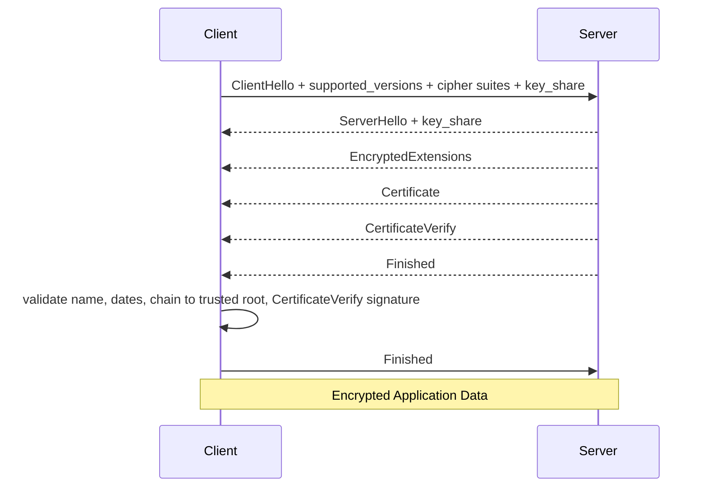
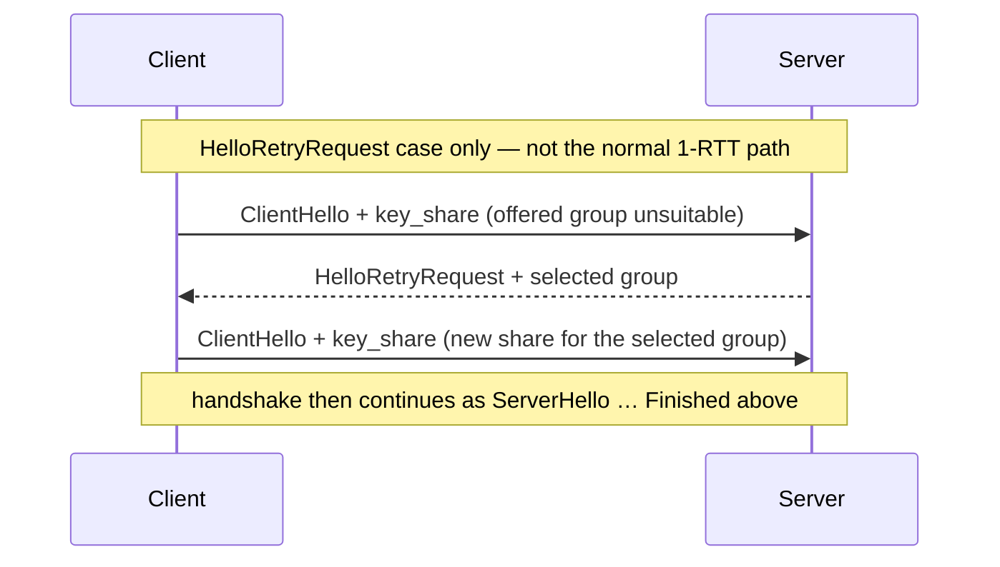

# Module 6 — Cryptography for engineers

## Why it matters to a software engineer

You will not invent a cipher. You will ship TLS, JWT signatures, password
storage, and signed artifacts. Most “crypto failures” in OWASP
[A04:2025](https://owasp.org/Top10/2025/A04_2025-Cryptographic_Failures/) are
**using the wrong primitive, rolling your own, or encrypting instead of
hashing passwords** — not an academic break of AES.

## Visual overview

!!! note "Intuition"
    Skip the math and ask one question per primitive: *"what does possessing
    the key let you prove or do that someone without it can't?"* A hash needs
    no key and proves nothing about origin — it only proves content didn't
    change *if you already trust the hash you're comparing against*. That
    caveat is the whole reason signatures exist.

| Primitive | Visual model | Reversible? | Solves |
| --- | --- | --- | --- |
| Hash | message → fingerprint | No | change detection when expected hash is trusted |
| Encryption | plaintext + key ⇄ ciphertext | Yes, with key | confidentiality |
| MAC | message + shared key → tag | Verification uses same secret | integrity/authenticity among key holders |
| Signature | message + private key → signature; public key verifies | Signature is not decryption | origin/integrity relative to key custody |

```text
Symmetric:                 Alice [same secret K] <---- encrypted bulk data ----> Bob [K]
Asymmetric:                public key may be shared; private key stays with its owner
Hybrid encryption (general): public-key work agrees or wraps a symmetric key; AEAD protects bulk
TLS 1.3 (typical):         (EC)DHE + CertificateVerify + HKDF/AEAD are three jobs, not one
```

!!! note "Mental model"
    TLS is hybrid for a practical reason, not a theoretical one: public-key
    operations are expensive per byte, symmetric AEAD is fast. Every HTTPS
    connection does a small amount of public-key work to agree shared secrets
    and authenticate, then switches to cheap symmetric AEAD for the bytes
    that follow.

!!! note "Simplification"
    The diagram below is the *normal* TLS 1.3 full (EC)DHE handshake
    ([RFC 8446](https://www.rfc-editor.org/rfc/rfc8446) Figure 1): one
    `ClientHello` that already includes `key_share`, the server's flight, then
    the client's `Finished`. Optional messages (`pre_shared_key`,
    `CertificateRequest`, client certificates) are omitted.



TLS 1.3 does this in one round trip: the client's **`key_share` is in the
first `ClientHello`**, so the server can derive a shared secret and start
protecting everything after its `ServerHello` — `EncryptedExtensions`
onward is already record-protected, not just the application data that
follows. (TLS 1.2 took an extra round trip and allowed weaker,
non-forward-secret key exchanges; 1.3 removed those.)

!!! note "Where this stops being true"
    A **second** `ClientHello` / `key_share` is **not** the normal path. It
    happens only after `HelloRetryRequest` (RFC 8446 Figure 2), when the
    client's first offered share is unsuitable (wrong group, or the server
    wants a different one). That is a retry, not how every handshake works.



In a typical TLS 1.3 certificate-based handshake, ephemeral (EC)DHE
establishes shared key material, the certificate and signature authenticate
the server, HKDF derives traffic keys, and symmetric AEAD protects
application data.

That handshake is doing three separable cryptographic jobs, each solving a
different problem:

| Job | Mechanism | Produces |
| --- | --- | --- |
| Key agreement | (EC)DHE via `key_share` (hybrid KEM as standards evolve) | shared secret, fresh per connection |
| Authentication | Certificate + `CertificateVerify` | proof the server holds the private key for that hostname's cert |
| Protected application data | HKDF-derived traffic keys + symmetric AEAD | confidentiality **and** integrity of the actual bytes |

Losing sight of that separation is how people reason incorrectly about
TLS: a valid handshake proves *the server you're talking to controls a
trusted private key*, not that the request is authorized, not that the
data at rest is encrypted, and not that a compromised endpoint is safe to
trust.

```text
leaf certificate -> signed by intermediate CA -> signed by trusted root
hostname + validity + usage + revocation/validation policy must also pass

registration: password + unique salt -> slow password KDF -> stored verifier
login:        candidate + stored salt -> same KDF -> constant-time compare
```

!!! note "Intuition"
    "Slow" is a feature, not a limitation, for password hashing. A fast hash
    (like the ones used for file integrity) lets an attacker with a stolen
    database try billions of password guesses per second. A deliberately slow
    KDF (bcrypt/scrypt/Argon2) makes each guess expensive, which is the actual
    defense — the algorithm choice *is* the control.

Crypto does not authorize Alice to Bob's note, preserve deleted data, stop
SSRF, make a compromised endpoint trustworthy, or repair poor key custody.

## Learning objectives

- Distinguish hashing, MACs, signatures, symmetric/asymmetric encryption,
  key exchange, certificates, TLS, password hashing, randomness, and key
  management.
- State what cryptography cannot solve (AuthZ, availability, bad identity).
- Store a password and sign a message using standard libraries.

## Key concepts

**Hash.** One-way fingerprint (`SHA-256`). Integrity of a known file, not
authentication (anyone can hash). Not for passwords by itself.

**MAC (HMAC).** Hash with a **shared secret**. Authenticity between parties
who share the key. Both sides are equal: the verifier could have forged the
tag.

**Digital signature.** Asymmetric: private key signs, public key verifies.
A valid signature provides evidence that an entity controlling the
corresponding private key produced the signature under the assumed trust
model. Organizational or legal non-repudiation additionally depends on
identity proofing, key custody, revocation, audit evidence, and policy —
it is not an inherent property of the primitive.

**Symmetric encryption.** One key encrypts and decrypts (AES-GCM). Use AEAD
(authenticated encryption). Do not use ECB. Do not invent nonces.

**Asymmetric encryption.** Public encrypts, private decrypts (rarely what
you want for bulk data). Envelope encryption — encrypt a symmetric data
key to a public key — is a different pattern from TLS 1.3, which uses
ephemeral key *agreement*, not "asymmetric encryption creates the
symmetric key."

**Key exchange.** Agree a shared secret over an untrusted network. In TLS
1.3 that is ephemeral (EC)DHE (hybrid KEMs as standards evolve), not a
long-term key wrapping bulk data.

**Certificates and TLS.** A certificate binds a public key to an identity,
signed by a CA you trust. In a typical TLS 1.3 certificate-based
handshake, ephemeral (EC)DHE establishes shared key material, the
certificate and signature authenticate the server, HKDF derives traffic
keys, and symmetric AEAD protects application data. TLS does not mean the
API authorized the request.

**Password hashing.** Slow and salted. **Argon2id** and **scrypt** are
memory-hard (RAM costs hurt GPUs). **bcrypt** is CPU-hard with a small
fixed memory (~4 KiB) — still far better than SHA-256, not in the
memory-hard set. Parameters should hurt attackers. `hashlib.sha256(password)`
is what LAB_MODE does — a teaching anti-pattern. A unique **salt** means
each row hashes differently, so one precomputed rainbow table cannot cover
the whole database. `alice-lab-password` is an unusual string and may not
appear in a public table; the lesson is *fast unsalted hashes invite
precomputation and offline guessing*, not “this exact password is listed.”

**Randomness.** Use `secrets` / OS CSPRNG (`getrandom`), not `random`.
Session ids, tokens, keys, CSRF values.

**Key management.** Generation, storage, rotation, destruction, access
control. The algorithm is not the hard part. KMS/HSM hold keys; apps get
short-lived use. Logging key material is an incident.

**What crypto cannot solve.**

- IDOR (Alice’s valid signature on her token).
- SSRF (HTTPS to IMDS is still IMDS).
- Availability (you can encrypt a deleted disk).
- “The operator pasted the key in Slack.”
- Business-logic abuse.

## Architecture connection

```
password --> Argon2id/bcrypt --> store hash
JWT      --> HS256 with server secret  OR  RS256/EdDSA with private key
artifacts--> minisign/cosign signatures
in transit --> TLS 1.2+ (1.3 preferred)
at rest    --> AEAD with KMS-managed data keys
```

HS256 JWT means every service that verifies can also mint. Asymmetric JWT
lets only the issuer mint. That is an identity-architecture choice.

## Hands-on lab — passwords and signatures

Local Python. No network required. Optional `pynacl`.

### Prerequisites

`python3`. Password and HMAC run without extra packages. `pip install pynacl`
is required only for the Ed25519 half (`nacl` is imported inside that
function so the rest of the demo still runs).

### Before you run this

Predict: (1) which evidence appears (2) which does not (3) why.

Then run the steps. Compare with the prediction. If the result differs,
which assumption was wrong?

### Steps

1. Read `labs/notes-api/app.py` `hash_password` / `verify_password`.
2. Run `python3 labs/crypto/demo.py`.
3. Explain why unsalted SHA-256 invites rainbow tables and fast offline
   guessing. Do **not** build a table. Salt + slowness are the actual
   controls; this specific lab password need not appear in a public list.
4. Inspect a lab JWT **header** (`alg`: HS256). Decode the first segment
   the same way as Module 3 (base64url + padding). Write down what leaks if
   `JWT_SECRET` is in compose env and someone can `docker inspect`: they can
   **mint any token** because HS256 verifiers share the signing secret.
5. Optional: with `LAB_MODE=false` (after reset so hashes match), confirm
   bcrypt hashes in sqlite:

   ```bash
   docker exec lab-notes-api python -c "import sqlite3; c=sqlite3.connect('/data/notes.db'); print(c.execute('select username,password_hash from users').fetchall())"
   ```

   Bcrypt hashes start with `$2`. SHA-256 hex does not.

### Expected observations

Demo prints PBKDF2 (teaching stand-in) and an Ed25519 verify success.
LAB_MODE users table is hex SHA-256; secure mode is bcrypt.

### Security lessons

Encrypting passwords (reversible) is worse than hashing. MACs are not
signatures. TLS is not AuthZ. Key location is part of the threat model.

### Common mistakes

- `md5(password + salt)` “because it’s salted.”
- Implementing AES-CBC with no MAC.
- Disabling certificate verification in httpx/curl “just in the lab” and
  leaving it off.
- Rolling a custom token format.

### Cleanup

None beyond not committing generated keys. Delete any scratch private keys.

## Knowledge check

1. Can HMAC prove which of two sharing parties created a message?
2. Why is bcrypt/argon2 used instead of SHA-256 for passwords?
3. What does `alg=none` on a JWT mean historically?
4. Does HTTPS to `/notes/2` fix IDOR?
5. Why is `random.random()` wrong for reset tokens?
6. In the *normal* TLS 1.3 handshake, when does the client send `key_share`?
7. Does a valid signature by itself give you legal non-repudiation?

**Answers:** (1) No. (2) Slow/salted; resists offline guessing. (3) Some
libraries accepted unsigned tokens as valid. (4) No. (5) Not a CSPRNG;
predictable tokens. (6) In the first `ClientHello`. A second `ClientHello`
/ `key_share` happens only after `HelloRetryRequest`, not on the normal
path. (7) No. It is evidence of private-key control under the assumed
trust model; non-repudiation also needs identity proofing, custody,
revocation, audit evidence, and policy.

## Exit criteria

You pass this module when you can meet the course
[pass bar](../assessment.md) (Explain → Predict → Diagnose → Design →
Defend) on this material:

- ✓ Name which primitive (hash, MAC, signature, symmetric/asymmetric
  encryption) solves a given problem, and which ones a fast unsalted hash
  does *not* solve.
- ✓ State the security invariant TLS gives you ("the server holds the
  private key for this hostname's trusted certificate") and where its
  guarantee stops (the hop, not AuthZ).
- ✓ Separate TLS's three jobs — (EC)DHE key agreement → shared secret;
  certificate + `CertificateVerify` → authentication; HKDF-derived
  traffic keys + AEAD → protected application data — and say which one a
  given failure breaks.
- ✓ Predict that HTTPS to `/notes/2` does not fix IDOR, and explain why in
  terms of the invariant TLS does and does not enforce.
- ✓ Distinguish a valid signature (evidence of private-key control under
  the assumed trust model) from legal non-repudiation (identity proofing,
  custody, revocation, audit, policy) — not a primitive property.
- ✓ Explain why slow, salted password hashing is a control, not a
  formality.
- ✓ Investigate a leaked `JWT_SECRET` and state its blast radius for HS256
  vs RS256/EdDSA issuance.
- ✓ Defend one tradeoff: why KMS/HSM-managed keys with short-lived app
  access beat keys embedded in application config.

## Engineering assignment

Write a 20-line Python function `hash_password` / `verify_password` using
`bcrypt` or `argon2-cffi`. Do not implement PBKDF2 in production code if a
maintained library is available. Document rotation: how you would change
cost parameters later.

## Self-check

Answer before expanding. These are the [assessment](../assessment.md) moves
on this module's Acme Notes lab, not trivia.

??? question "Explain: Why is SHA-256 of the lab passwords the wrong primitive?"
    A fast unsalted hash is for change detection when you already trust the
    digest, not for password verifiers. Offline guessing is cheap. LAB_MODE
    stores hex SHA-256; secure mode uses bcrypt — slow and salted on
    purpose.

??? question "Predict: HTTPS to GET /notes/2. Does IDOR go away?"
    No. TLS authenticates the *server* for this hop and protects the bytes.
    It does not enforce owner == subject. Same invariant as Module 4.

??? question "Diagnose: A JWT header says `alg=none`. What historically broke?"
    Some libraries accepted unsigned tokens as valid. Verification must
    reject `none` and unexpected algs; decoding the payload still proves
    nothing.

??? question "Design: Encrypting passwords vs hashing them — which is the control, and what detection sits beside it?"
    Store a slow salted hash (bcrypt/argon2), never reversible encryption
    of passwords. Detection: audit `login_failure` bursts (DET-001) and
    never log the password or the hash comparison operands.

??? question "Defend: `JWT_SECRET` leaked for this HS256 lab issuer. Blast radius and containment?"
    Anyone can mint Alice or admin tokens until you rotate the secret and
    treat outstanding tokens as burned (no `exp` in LAB_MODE makes this
    worse). RS256/EdDSA issuance would not let the verifier's public key
    mint tokens — different blast radius. Residual: sessions already
    issued.

## Before you leave

- **Predict** — write expected evidence (what appears, what does not, and why) before the next observation.
- **Diagnose** — name the wrong primitive (hash vs MAC vs signature vs encryption) from the failure, not from the algorithm's fame.
- **Build** — complete the password-storage and signature comparison lab (or the hash_password assignment).
- **Defend** — state containment and residual risk in one sentence each.
- **Exit criteria** — meet [this module's list](#exit-criteria) and the course [pass bar](../assessment.md).

## Further reading

- [OWASP Password Storage Cheat Sheet](https://cheatsheetseries.owasp.org/cheatsheets/Password_Storage_Cheat_Sheet.html)
- [OWASP Cryptographic Storage Cheat Sheet](https://cheatsheetseries.owasp.org/cheatsheets/Cryptographic_Storage_Cheat_Sheet.html)
- [NIST SP 800-63B-4](https://pages.nist.gov/800-63-4/sp800-63b.html) (authenticator assurance)
- [RFC 7519 JWT](https://www.rfc-editor.org/rfc/rfc7519) and [RFC 8725 JWT BCP](https://www.rfc-editor.org/rfc/rfc8725)
- [libsodium / PyNaCl docs](https://pynacl.readthedocs.io/)
