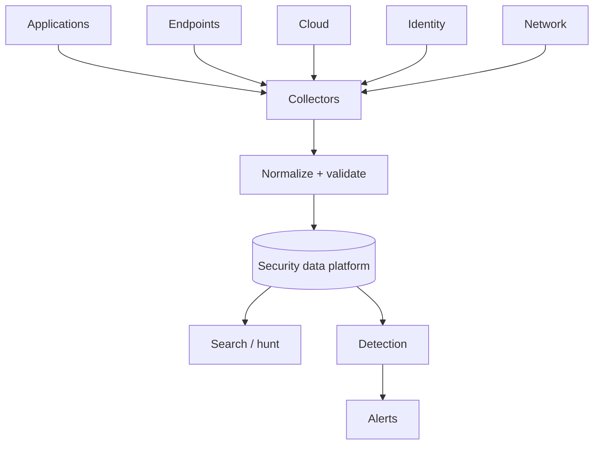

# Module 7 — Security monitoring and logs

## Why it matters to a software engineer

If you did not emit the event, the SOC cannot detect the technique. Logging
is a product feature with privacy, cost, and integrity constraints. OWASP
[A09:2025](https://owasp.org/Top10/2025/A09_2025-Security_Logging_and_Alerting_Failures/)
renamed the category to include **alerting**: great logs with no alert are
a forensic nice-to-have after the breach.

## Visual overview

!!! note "Intuition"
    Treat your logging pipeline like a product with its own users (analysts,
    detections, auditors) and its own quality bar — not an afterthought that
    "just captures what happened." A detection rule is only as good as the
    field it depends on; if that field is sometimes missing, sometimes
    malformed, or arrives five minutes late, the rule silently degrades and
    nobody notices until an incident.



Event = occurrence; log = record; telemetry = measurement stream; evidence =
relevant data plus trustworthy handling; alert = detection output needing
attention; incident = adverse situation requiring coordinated handling.
Test missing fields, malformed JSON, duplicate delivery, clock skew, and a
collector outage—not only the happy path.

!!! tip "Hint"
    Pick one detection rule you care about and trace its one required field
    all the way back to the producing application. If you can't point to the
    exact line of code that emits that field, you don't actually know whether
    the rule will fire when it needs to — you're trusting an assumption, not
    a verified pipeline.

## Learning objectives

- Distinguish events, telemetry, logs, metrics, traces, audit trails, and
  evidence.
- Build for log quality: fields, time, correlation IDs, retention, privacy,
  tamper resistance.
- Collect, parse, and search security logs in the lab pipeline.

## Key concepts

**Event.** Something that happened: `login_failure`.
**Telemetry.** The stream of measurements (logs, metrics, traces, profiles).
**Log.** A record, usually append-only text or JSON.
**Metric.** Aggregated numeric signal (login_failures_total). Cheap, lossy.
**Trace.** Causal chain of spans across services (`trace_id`).
**Audit trail.** Security-relevant records you are willing to show later
(who, what, when, on which object).
**Evidence.** Logs plus preservation process. If you can silently rewrite
them, they are weaker evidence.

**Log quality.** Every security event should include UTC timestamp, event
name, actor, object, result, src, `trace_id`, and a stable schema. Avoid
unstructured `logger.info(f"user {u} got note {n}")` as your only record.

**Normalization.** Mapping vendor fields to a common schema (OCSF, ECS, or
your own). soc-lite cheats by ingesting JSON the app already owns.

**Timestamps.** UTC, monotonic enough to order, NTP sane. Clock skew wrecks
timelines.

**Correlation IDs.** One `trace_id` from ingress through DB. The lab sets a
UUID per event; a production app should propagate the incoming header.

**Retention.** Security vs privacy vs cost. “Keep everything forever” fails
budget and GDPR-like duties. “Keep 24h” fails slow attacks. Define tiers.

**Privacy.** Do not log passwords, tokens, note bodies, or health data. The
lab sometimes logs dummy note access metadata (ids, owners), not full bodies,
in most events — check before you ship this pattern.

**Tamper resistance.** Write to a system the attacker who lands on the app
host cannot easily edit: separate volume, separate account, signed/shipped
off-box quickly. `docker compose down -v` is the lab’s reminder that volumes
are fragile.

**Pipeline.**

```
app JSONL --> soc-lite ingest --> sqlite events --> rules --> alerts --> cases
```

OpenTelemetry is optional: traces for performance and some security (unusual
span graphs), not a SIEM replacement.

## Architecture connection

Security observability is production observability plus: AuthZ denials,
admin actions, secret use, outbound fetches, identity changes. If your
platform already has OpenTelemetry, add **semantic** security events rather
than a second undocumented print.

## Hands-on lab — collect, parse, search

### Prerequisites

Lab up. `curl`, `python3`.

### Steps

1. Generate mixed activity (authorized, local):

   ```bash
   python3 labs/attack-sim/simulate.py --scenario all
   ```

2. Ingest and search:

   ```bash
   curl -s -X POST http://127.0.0.1:8090/ingest | python3 -m json.tool
   curl -s 'http://127.0.0.1:8090/events?event=login_failure' | python3 -m json.tool | head
   curl -s 'http://127.0.0.1:8090/events?q=ssrf_metadata' | python3 -m json.tool | head
   ```

3. Inspect raw JSONL:

   ```bash
   docker exec lab-notes-api sh -c 'tail -n 3 /logs/notes-api.jsonl'
   ```

4. Score one event against a quality checklist: `ts`, `event`, `actor` or
   `username`, `src_ip`, `trace_id`. Note missing fields.
5. Preserve a copy: `./labs/scripts/preserve-logs.sh` (creates
   `labs/cases/evidence-*`). Do not edit the copy.
6. Optional: query with Python/sqlite mentally equivalent to Sigma-like
   “selection: event: login_failure | count by src_ip > 5”.

### Expected observations

Ingest reports new alerts. Events are JSON. Evidence directory contains a
snapshot. Alerts include `technique_id` from `labs/detections/rules.yaml`.

### Security lessons

You cannot hunt fields you never logged. Shipping logs off the app host
before an attacker deletes them is a control. Alerting is part of logging.

### Common mistakes

- Logging Authorization headers.
- Local time without zone.
- Metrics without a raw event when you need an investigation.
- Infinite retention of PII “for security.”

### Cleanup

Keep evidence if you will do module 11; otherwise `lab-reset` later.

## Knowledge check

1. Metric vs log for proving which note id was read?
2. Why UTC?
3. Name two fields you should never log on `/login`.
4. How does A09:2025 differ in emphasis from “we have ELK”?
5. Why copy logs before experimenting with containment?

**Answers:** (1) Log/audit. Metrics lack object id. (2) Order incidents across
regions. (3) Password, token. (4) Alerting and actionability, not storage.
(5) Containment can destroy or flood evidence.

## Engineering assignment

Add one new audit event to notes-api (for example `logout` or `token_rejected`
with reason). Do not log secrets. Show it appearing in `/events`.

## Further reading

- [OWASP Logging Cheat Sheet](https://cheatsheetseries.owasp.org/cheatsheets/Logging_Cheat_Sheet.html)
- [OWASP A09:2025](https://owasp.org/Top10/2025/A09_2025-Security_Logging_and_Alerting_Failures/)
- [OpenTelemetry](https://opentelemetry.io/docs/)
- [OCSF](https://schema.ocsf.io/) (schema effort; optional)
