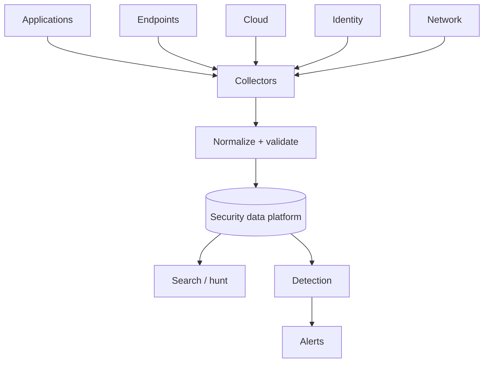

# Module 7 — Security monitoring and logs

At 09:00 the SOC dashboard says **0 alerts in the last 24 hours.**

```text
POST /ingest  →  {"events_added": 0, "new_alerts": []}
```

Either nothing happened, or the collector has been down since yesterday
and nothing *could* have been seen. From the dashboard, those two look
exactly the same. The only way to tell them apart is to know what should
have arrived: which events, with which fields, at roughly what rate.

A quiet SOC and a blind SOC look identical until someone checks the logs
themselves. This module is about the logs.

## Why it matters to a software engineer

If you did not emit the event, the SOC cannot detect the technique. Logging
is a product feature with privacy, cost, and integrity constraints. Great
logs with no alert are only useful for forensics after the breach, which
is why OWASP renamed the category to include **alerting**
([A09:2025](https://owasp.org/Top10/2025/A09_2025-Security_Logging_and_Alerting_Failures/)).

## Visual overview

!!! note "Intuition"
    Put your finger on the arrow from Collectors to Normalize. DET-001 reads
    `src_ip` from every `login_failure`. If one producer starts shipping
    lines without it, soc-lite quietly groups by `username` instead. The
    rule still has the same ID, still fires, and now makes a different
    claim. Nobody gets an error. That’s why a logging pipeline needs a
    quality bar like any product: the detection is only as good as the
    field it reads.



Event = occurrence; log = record; telemetry = measurement stream; evidence =
relevant data plus trustworthy handling; alert = detection output needing
attention; incident = adverse situation requiring coordinated handling.
Test missing fields, malformed JSON, duplicate delivery, clock skew, and a
collector outage—not only the happy path.

!!! tip "Hint"
    Pick one detection rule you care about and trace its one required field
    all the way back to the producing application. If you can't point to the
    exact line of code that emits that field, you don't actually know whether
    the rule will fire when it needs to — you're trusting an assumption, not
    a verified pipeline.

## Learning objectives

- Distinguish events, telemetry, logs, metrics, traces, audit trails, and
  evidence.
- Build for log quality: fields, time, correlation IDs, retention, privacy,
  tamper resistance.
- Collect, parse, and search security logs in the lab pipeline.

## Key concepts

**Event.** Something that happened: `login_failure`.
**Telemetry.** The stream of measurements (logs, metrics, traces, profiles).
**Log.** A record, usually append-only text or JSON.
**Metric.** Aggregated numeric signal (login_failures_total). Cheap, lossy.
**Trace.** Causal chain of spans across services (`trace_id`).
**Audit trail.** Security-relevant records you are willing to show later
(who, what, when, on which object).
**Evidence.** Logs plus preservation process. If you can silently rewrite
them, they are weaker evidence.

**Log quality.** Every security event should include UTC timestamp, event
name, actor, object, result, src, `trace_id`, and a stable schema. Avoid
unstructured `logger.info(f"user {u} got note {n}")` as your only record.

**Normalization.** Mapping vendor fields to a common schema (OCSF, ECS, or
your own). soc-lite cheats by ingesting JSON the app already owns — a real
collector has to parse whatever format each source actually speaks first.

**Vendor event formats you'll actually meet.** Not every source emits
clean JSON. A large share of firewalls, IDS/IPS, and network appliances
still speak formats built for a pre-JSON world:

- **Syslog (RFC 5424)** — the oldest common transport, mostly unstructured
  free text after a standard header (priority, timestamp, hostname).
- **CEF (Common Event Format)** — ArcSight-originated, still a de facto
  standard many SIEMs ingest natively. A syslog-style header followed by
  `CEF:Version|Vendor|Product|Version|SignatureID|Name|Severity|Extension`,
  where `Extension` is `key=value` pairs from a fixed dictionary (`src=`,
  `dst=`, `suser=`, `act=`, with `cs1=`/`cs1Label=` as vendor-specific
  escape hatches when the dictionary doesn't have a field they need):

  ```text
  CEF:0|Acme|NotesGateway|1.0|100|Cross-user object read|7|src=203.0.113.4 suser=alice duser=bob act=blocked
  ```

- **LEEF** — IBM QRadar's near-equivalent to CEF.
- **OCSF / ECS** — modern, JSON-native open schemas most pipelines built
  after ~2020 normalize *into*, superseding CEF/LEEF for anything new.

The reason this matters even in a JSON-native app: **you cannot correlate
or write one detection rule across two sources that don't share field
names.** A real collector's first job is a parser layer that turns
CEF/LEEF/syslog/cloud-API-JSON into one target schema — normalization
(above) is that layer's output, not its input. soc-lite skips this step
because notes-api already emits the target schema directly; a collector
in front of an off-the-shelf firewall would not have that luxury.

**Timestamps.** UTC, monotonic enough to order, NTP sane. Clock skew wrecks
timelines.

**Correlation IDs.** One `trace_id` from ingress through DB. The lab sets a
**new UUID per audit line**, not per request. Related events from one
session do not share an id. Production should propagate an incoming header.

Login events log `username` + `src_ip`; most others log `actor`. Score a
real line against that difference.

**Retention.** Security vs privacy vs cost. “Keep everything forever” fails
budget and GDPR-like duties. “Keep 24h” fails slow attacks. Define tiers.

**Privacy.** Do not log passwords, tokens, note bodies, or health data. The
lab sometimes logs dummy note access metadata (ids, owners), not full bodies,
in most events — check before you ship this pattern.

**Tamper resistance.** Write to a system the attacker who lands on the app
host cannot easily edit: separate volume, separate account, signed/shipped
off-box quickly. `docker compose down -v` is the lab’s reminder that volumes
are fragile.

**Pipeline.**

```
app JSONL --> soc-lite ingest --> sqlite events --> rules --> alerts --> cases
```

OpenTelemetry is optional: traces for performance and some security (unusual
span graphs), not a SIEM replacement.

## Worked scene — who is DET-001 about?

**Hypothesis.** Six bad passwords for Alice will raise an alert about Alice.

1. *Expect* six `login_failure` lines. *Got:* six, each with `ts`,
   `username: alice`, `src_ip`, and a `trace_id`.
2. *Expect* the alert ID `DET-001:alice`. *Got:* something like
   `DET-001:172.30.0.1`. The rule groups by `src_ip`, and in this lab
   every request arrives from the Docker gateway.
3. *Expect* a late ingest to miss the window. *Got:* it still fires. The
   window is measured between events, not from ingest time.

**What that implies.** The alert is about a *source*, not an account.
Behind a shared gateway, every user is one source: one attacker and
fifty people mistyping look the same. And if a producer ever ships a
line without `src_ip`, soc-lite falls back to `username` without telling
you. Same rule ID, different claim.

## Architecture connection

Security observability is production observability plus: AuthZ denials,
admin actions, secret use, outbound fetches, identity changes. If your
platform already has OpenTelemetry, add **semantic** security events rather
than a second undocumented print.

## Hands-on lab — collect, parse, search

### Prerequisites

Lab up. `curl`, `python3`.

### Before you run this

Write down three answers before you run anything:

1. How many `login_failure` events will `simulate.py --scenario all` write,
   and will DET-001 fire?
2. Which field on a `login_failure` line does DET-001 group by, and what
   value will it have in this lab?
3. If you ingest an hour after the failures, does the alert still fire?
   Why?

Then run the steps. If a result surprises you, which assumption was wrong?

### Steps

1. Generate mixed activity (authorized, local):

   ```bash
   python3 labs/attack-sim/simulate.py --scenario all
   ```

2. Ingest and search:

   ```bash
   curl -s -X POST http://127.0.0.1:8090/ingest | python3 -m json.tool
   curl -s 'http://127.0.0.1:8090/events?event=login_failure&order=asc' | python3 -m json.tool | head
   curl -s 'http://127.0.0.1:8090/events?q=ssrf_metadata&order=desc' | python3 -m json.tool | head
   ```

3. Inspect raw JSONL:

   ```bash
   docker exec lab-notes-api sh -c 'tail -n 3 /logs/notes-api.jsonl'
   ```

4. Score one event against a quality checklist: `ts`, `event`, `actor` or
   `username`, `src_ip`, `trace_id`. Note missing fields.
5. Preserve a copy: `./labs/scripts/preserve-logs.sh` (creates
   `labs/evidence/evidence-*` on the host, **not** deleted by `lab-reset`).
   Do not edit the copy.

   DET-001’s window is **event time** (span between first and last
   `login_failure` in the bucket), not “how long ago I ingested.” Delayed
   ingest still fires. Grouping is `src_ip` (often the Docker gateway).
   `GET /alerts` also ingests and evaluates; a later `POST /ingest` may
   report `new_alerts: []` because the alert already exists.

   Write DET-001 as a detection *claim* (see
   [How defenders think](../how-defenders-think.md)): field, window clock,
   grouping key, what happens if the collector is down.
6. Optional: query with Python/sqlite mentally equivalent to Sigma-like
   “selection: event: login_failure | count by src_ip > 5”.

### Expected observations

Ingest reports new alerts. Events are JSON. Evidence directory contains a
snapshot. Alerts include `technique_id` from `labs/detections/rules.yaml`.

### Security lessons

You cannot hunt fields you never logged. Shipping logs off the app host
before an attacker deletes them is a control. Alerting is part of logging.

### Common mistakes

- Logging Authorization headers.
- Local time without zone.
- Metrics without a raw event when you need an investigation.
- Infinite retention of PII “for security.”

### Cleanup

Keep evidence if you will do module 11; otherwise `lab-reset` later.

## Knowledge check

1. Metric vs log for proving which note id was read?
2. Why UTC?
3. Name two fields you should never log on `/login`.
4. How does A09:2025 differ in emphasis from “we have ELK”?
5. Why copy logs before experimenting with containment?

**Answers:** (1) Log/audit. Metrics lack object id. (2) Order incidents across
regions. (3) Password, token. (4) Alerting and actionability, not storage.
(5) Containment can destroy or flood evidence.

## Exit criteria

You pass this module when you can do all of these on this material:

- ✓ Predict what fields a given violation (e.g. cross-user object access)
  should produce in the log, before looking at the pipeline's output.
- ✓ Trace one detection rule's required field back to the exact line of
  application code that emits it.
- ✓ Distinguish event, telemetry, log, metric, trace, audit trail, and
  evidence from each other.
- ✓ Score a real log line against a quality checklist (timestamp, event,
  actor, object, result, source, correlation id) and name what's missing.
- ✓ Read a CEF line and identify which fields would need to move into a
  common schema before it could join a detection rule with a JSON source.
- ✓ Explain why a correlation id assigned per log line instead of per
  request breaks investigation, using this lab's own pipeline as the
  example.
- ✓ State one privacy or retention tradeoff and the residual risk it
  leaves.
- ✓ Write a detection rule as a testable claim (field, window clock,
  grouping key, collector-down behavior) rather than a vague description.
- ✓ Defend one tradeoff: why shipping logs off the app host is a control,
  not just good hygiene.

## Engineering assignment

Add one new audit event to notes-api (for example `logout` or `token_rejected`
with reason). Do not log secrets. Show it appearing in `/events`.

## Self-check

Answer before expanding. These are the [assessment](../assessment.md) moves
on this module's Acme Notes lab, not trivia.

??? question "Explain: Write DET-001 as a detection claim, not a vibe."
    If `login_failure` events share a `src_ip` and their `ts` values span
    ≤120 seconds, five or more of them produce `DET-001`. The clock is
    event time. If `src_ip` is missing, the grouping key is a lie.

??? question "Predict: You GET /alerts (which ingests), then POST /ingest. Why might `new_alerts` be []?"
    Alerts already exist with id `DET-001:<src_ip>`. A later ingest updates
    evidence; it does not mint a second row. Delayed ingest still *fires*
    the first time because the window is not wall clock.

??? question "Diagnose: A metric says `note_read_total{code=200}` went up. Can you prove which note id Alice read?"
    No. Metrics lack object id. You need the audit/log line with `note_id`,
    `actor`, and owner/decision. That is why A09:2025 is logging *and*
    alerting, not "we have a dashboard."

??? question "Design: Name two fields you must never log on `/login`, and one you must."
    Never: password, token. Must: `ts` (UTC), `event`, username or actor,
    `src_ip`, result, `trace_id`. Shipping the file off the app host is a
    control, not hygiene.

??? question "Defend: Why copy logs with preserve-logs.sh before you disable LAB_MODE or reset?"
    Containment and `lab-reset` can wipe or flood the volume. Residual risk
    of containing first: you cannot reconstruct the timeline. The copy is
    not courtroom-grade; you still hash it.

## Before you leave

- **Diagnose** — name the missing field or wrong clock from a quiet detection, not from "ingest failed."
- **Build** — ingest, search events, preserve a copy, write DET-001 as a claim.
- **Exit criteria** — meet [this module’s list](#exit-criteria).

How these are graded: [assessment](../assessment.md).

## Further reading

- [OWASP Logging Cheat Sheet](https://cheatsheetseries.owasp.org/cheatsheets/Logging_Cheat_Sheet.html)
- [OWASP A09:2025](https://owasp.org/Top10/2025/A09_2025-Security_Logging_and_Alerting_Failures/)
- [OpenTelemetry](https://opentelemetry.io/docs/)
- [OCSF](https://schema.ocsf.io/) (schema effort; optional)
