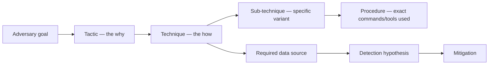

# Module 8 — MITRE ATT&CK

## Why it matters to a software engineer

ATT&CK is how red, blue, intel, and engineering can name the same behavior
without a 40-page email. It is also how organizations fake progress: coloring
cells on a matrix. You will learn to map **observed events** to techniques
with confidence, and to treat coverage as a hypothesis about telemetry.

## Visual overview

!!! note "Intuition"
    Read ATT&CK bottom-up in practice, even though it's drawn top-down here.
    You rarely start from "the adversary's goal" — you start from a
    suspicious *procedure* you observed, work out which technique it maps to,
    and only then reason about tactic-level intent. The framework is a shared
    vocabulary for comparing notes with other defenders, not a checklist to
    fill in from the top.

Red uses ATT&CK to name authorized emulation; blue to organize observations
and controls; analysts to classify with uncertainty; hunters to form testable
hypotheses; detection engineers to state telemetry requirements. A green
matrix cell proves none of prevention, detection fidelity, or response quality.

!!! tip "Hint"
    "We have a detection mapped to this technique" and "we would actually
    catch this technique in production" are different claims. The matrix
    cell only proves the first one. Module 9's replay loop is how you test
    the second.

## Learning objectives

- Explain tactics, techniques, sub-techniques, procedures, software, groups,
  data sources, and mitigations.
- Relate Enterprise ATT&CK to other domains without merging them.
- Map a lab alert to ATT&CK and state limitations.
- Draft a small coverage matrix for the capstone.

## Key concepts

See also [COURSE.md section 6](../course.md).

**ATT&CK is a knowledge base**, maintained by MITRE, of adversary behavior
drawn from public reporting. [attack.mitre.org](https://attack.mitre.org/).
It is not PCI, not a NIST control catalog, not a product requirement list.

**Tactic.** Goal at that step: Initial Access, Execution, Persistence,
Privilege Escalation, Defense Evasion, Credential Access, Discovery, Lateral
Movement, Collection, Command and Control, Exfiltration, Impact (Enterprise
columns; confirm current list on the site).

**Technique / sub-technique.** How, at two levels of granularity. IDs like
`T1190`, `T1552.005`.

**Procedure.** The concrete implementation. Lab: Alice `GET /notes/2`.

**Software / groups.** Real-world names. We do not emulate named malware.

**Data sources.** What you would need to see it (application logs, process
creation, cloud audit). If you lack the data source, you do not “cover” the
technique.

**Mitigations.** Control classes (restrict web-based content, network
segmentation, …). Mapping a mitigation is not implementing it.

**Enterprise vs other matrices.** Enterprise includes platform-specific
techniques (Windows, Linux, cloud, containers). Mobile, ICS, and
[ATLAS](https://atlas.mitre.org/) for AI are siblings. A prompt-injection
against an agent may map better to ATLAS/OWASP LLM than to T1059.

**Red use:** adversary emulation plans (“we will attempt T1110.001 against
the lab login”). **Blue use:** detections, hunts, gap analysis. **SOC use:**
alert classification and prioritization — with the caveat that the first
mapping is often wrong.

**Limitations.** Coverage ≠ security; techniques are ambiguous; mappings
need context; version drift; paper coverage.

**The Pyramid of Pain (David Bianco).** A ranking of indicator types by how
much it costs an *attacker* to change them when you detect on that type —
and therefore how durable your detection is:

| Indicator (bottom → top) | Cost for attacker to change | Detection durability |
| --- | --- | --- |
| Hash values | Trivial — recompile, repack | Almost none |
| IP addresses | Easy — new host/proxy | Low |
| Domain names | Simple — register another | Low–medium |
| Network/host artifacts | Annoying — rework tooling | Medium |
| Tools | Challenging — rewrite/replace the tool | High |
| TTPs (technique/procedure) | Tough — relearn a new approach | Highest |

ATT&CK gives teams a vocabulary for the TTPs near the top of the pyramid; the
framework itself is not a pyramid layer. A behavioral detection for
T1110.001 password guessing can survive a changed IP or tool **if** its logic
uses durable behavior and sufficient context. A rule tied to one procedure's
fields can still be brittle even when it carries a technique tag. Hash- or
IP-only detections are usually cheaper for an attacker to evade, so combine
them with behavior and test the concrete procedures your telemetry can see.

## Architecture connection

Detections should cite: data source → event → rule → technique (confidence).
That is the same chain as “we emit this log because hunters asked for T1552.005
visibility.”

## Hands-on lab — map five detections

**AUTHORIZED LAB USE ONLY.**

### Prerequisites

Modules 4 and 7. Lab up. `LAB_MODE=true`.

### Steps

1. `python3 labs/attack-sim/simulate.py --scenario all`
2. `curl -s -X POST http://127.0.0.1:8090/ingest`
3. `curl -s http://127.0.0.1:8090/alerts`
4. For each alert, open `labs/detections/rules.yaml` and
   [attack.mitre.org](https://attack.mitre.org/) (or your notes). Fill:

   | Rule | Event observed | Tactic | Technique | Confidence | Why it might be wrong |
   | --- | --- | --- | --- | --- | --- |
   | DET-001 | | | | | |
   | DET-002 | | | | | |
   | DET-003 | | | | | |
   | DET-004 | | | | | |
   | DET-005 | | | | | |

5. Copy the table into `docs/capstone/attack-coverage.md` (create when you start
   the capstone; a stub is provided).
6. Add a **gap** row: a behavior the sim does not generate (for example
   persistence). Write “no data source” rather than painting the cell.

### Expected observations

Five rule IDs. Suggested mappings in YAML are starting points: T1110.001,
T1213 (+ T1190), T1552.005, T1087, T1190. You may disagree; write why.

### Security lessons

Map from evidence, not from the vulnerability name. IDOR is OWASP; the
behavior is collection or discovery depending on what was taken.

### Common mistakes

- Tagging every web bug as T1190 only.
- Claiming 100% Enterprise coverage.
- Mapping T1059 Command and Scripting Interpreter because “they used curl.”
  Curl from the attacker laptop is not execution on the victim host.

### Cleanup

Keep the lab if continuing to module 9.

## Knowledge check

1. Difference between technique and procedure?
2. Why might DET-002 be T1213 rather than T1005?
3. What does a green cell in a coverage matrix not prove?
4. Name a tactic that this lab barely touches.
5. Should prompt injection be forced into Enterprise ATT&CK?

**Answers:** (1) Technique is the general method; procedure is the instance.
(2) T1005 is data from local *host* filesystem; here it is app repository
data. (3) That a real adversary would be stopped or even seen. (4)
Persistence / lateral movement / C2. (5) Prefer ATLAS/OWASP; only map
Enterprise if a specific technique truly fits the observed host/API
behavior.

## Engineering assignment

Pick one production alert type you have seen (or invent from notes-api).
Write a mapping with confidence and an alternative ID. One paragraph.

## Further reading

- [MITRE ATT&CK](https://attack.mitre.org/)
- [ATT&CK for Cloud](https://attack.mitre.org/matrices/enterprise/cloud/)
- [MITRE D3FEND](https://d3fend.mitre.org/) (defensive counterpart; optional)
- [MITRE ATLAS](https://atlas.mitre.org/)
- [The Pyramid of Pain](https://detect-respond.blogspot.com/2013/03/the-pyramid-of-pain.html)
