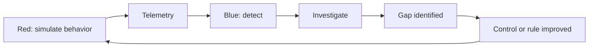

# Module 9 — Red Team, Blue Team, and Purple Team

## Why it matters to a software engineer

You will sit on all three sides without changing jobs: writing a feature
(blue), thinking “how will this be abused” in a design review (red), and
validating a detection after a bug bash (purple). Professional red teaming
is **authorized, scoped, evidenced, and reported**. This module practices
that discipline in the lab.

## Visual overview



!!! note "Intuition"
    This is a loop, not a one-time exercise — notice the arrow returns to
    Red at the end. Purple teaming isn't a separate team so much as a
    discipline: red and blue deliberately closing the loop together instead
    of working in isolation and comparing reports months later.

| Red | Blue | Purple |
| --- | --- | --- |
| Authorized path finding under RoE | Prevent, detect, respond, recover | Hypothesis-driven validation together |
| Produces path, evidence, impact | Produces controls, alerts, cases, recovery | Produces measured coverage delta |
| Failure: scope creep | Failure: alert theatre | Failure: mapping without replay |

The safe experiment is: predict DET-003 → simulate local SSRF → inspect event
and alert → block metadata → replay → add visibility for the blocked attempt.

!!! tip "Hint"
    Notice the experiment doesn't stop at "block metadata." The last step —
    replay, and confirm you now have visibility into the *blocked* attempt —
    is the part people skip. A control that blocks silently is one incident
    away from someone removing it because "nothing ever happens," since no
    one can see it working.

## Learning objectives

- Describe adversary-style phases without turning them into a cookbook for
  real attacks.
- State rules of engagement, scope, and reporting.
- Write or improve a detection from an emulation.
- Run one purple-team loop: emulate → detect → map → improve.

## Key concepts

**Adversarial thinking (authorized).** For a compromised web service, a
relevant adversary might: find the app, use a valid account (phished or
guessed), exploit IDOR, fetch metadata, collect notes, leave. We **simulate**
HTTP for those steps locally. We do not persist malware, we do not pivot to
your LAN, we do not disable logging for real.

**Illustrative kill-chain language** (aligned with ATT&CK tactics, not a
mandate to execute them):

| Phase | Lab stand-in | Not in this course |
| --- | --- | --- |
| Reconnaissance | Read `/health` and, in `LAB_MODE`, `/docs` + `/openapi.json` (FastAPI leaves these on — that **is** surface) | Scanning the internet |
| Initial access | Known lab password (sim logs in as Alice) / later T1190 on SSRF or injection. Telemetry looks like **valid accounts**, not theft | Phishing your coworkers |
| Execution | HTTP from the **attacker laptop** — do not map that as T1059 on the victim host | Dropping payloads |
| Persistence | *gap* (discuss only) | Implanting services |
| Privilege escalation | *not what `/admin/users` is* — Alice never becomes admin | Kernel exploits |
| Broken function AuthZ | `GET /admin/users` as user → DET-004 / T1087 Discovery | — |
| Discovery | list users, notes ids | AD enumeration |
| Lateral movement | *gap* | SSH to other hosts |
| Collection | GET Bob’s note | Mailbox dump |
| C2 | *none* | Real C2 |
| Exfiltration | response body to sim process | Uploading to attacker infra |
| Impact | *not simulated* | Ransomware |

**Rules of engagement (RoE).** Written scope, allowed techniques, forbidden
actions (exfil of real data, destructive tests), time window, emergency
stop, evidence handling, who is authorized. The lab RoE is: compose stack, loopback, `simulate.py` and curl against
`127.0.0.1` lab ports, no extra tools against other hosts.

**Reporting.** Path, evidence (request ids, screenshots of local HTTP),
impact, mapped techniques, recommended fixes, **not** a dump of exploits.

**Blue team.** Harden, prevent, log, detect, hunt, IR, forensics, recover,
lessons learned. Prioritize by **business impact** (payroll notes > grocery
list), not by CVSS alone.

**Purple team.** Hypothesis: “If an authenticated user reads another user’s
note, DET-002 fires within 60s.” Run sim, check alert, if miss then fix
log or rule, re-run. Measure: true positive, time to alert, extra noise.

## Architecture connection

The closed loop is a product development loop:

```
hypothesis --> emulate (red) --> telemetry (platform) --> detect (blue)
     ^                                                     |
     +---------------- improve control or rule -------------+
```

## Hands-on lab — purple loop

**AUTHORIZED LAB USE ONLY.** Isolated lab. Benign sim.

### Prerequisites

Lab up, `LAB_MODE=true`.

### Before you run this

Predict: (1) which evidence appears (2) which does not (3) why.

Then run the steps. Compare with the prediction. If the result differs,
which assumption was wrong?

### Steps

1. Write a hypothesis in your notes: *DET-003 fires when `/fetch` hits
   mock-imds, maps to T1552.005, severity critical.*
2. Snapshot current alerts: `curl -s http://127.0.0.1:8090/alerts > /tmp/before.json`
3. `python3 labs/attack-sim/simulate.py --scenario ssrf`
4. `curl -s -X POST http://127.0.0.1:8090/ingest`
5. Confirm DET-003 exists. Open a case:

   ```bash
   curl -s -X POST http://127.0.0.1:8090/cases -H 'Content-Type: application/json' \
     -d '{"title":"SSRF metadata","alert_ids":["DET-003:alice"],"severity":"critical"}'
   ```

   If the alert id grouping key differs, copy it from `/alerts`.
6. **Improve a control:** from repo root, reset so hashes match the new mode,
   then bring the API up secure:

   ```bash
   ./labs/scripts/lab-reset.sh
   cd labs && LAB_MODE=false docker compose up -d --build && cd ..
   ```

   Recreate-without-reset leaves SHA-256 hashes in sqlite. Re-run SSRF sim.
   Expect HTTP 400 and event `ssrf_blocked` (not `ssrf_metadata_access`).
   `/docs` should also be gone — surface reduction.
7. Re-ingest. Note: DET-003 may not fire if the event name changed to
   `ssrf_blocked`. **That is a detection gap for the *blocked* attempt** —
   add a rule or record it as “prevention worked, hunt for attempts still
   useful.”
8. Write a 10-line purple report: hypothesis, result, mapping, control
   change, residual gap.

### Expected observations

Before fix: dummy IMDS body + DET-003. After fix: blocked fetch. Possible
missing alert on blocked attempts.

### Security lessons

Prevention can make the old detection go silent. Purple team updates both
sides: detect attempts *and* successes.

### Common mistakes

- Changing many variables at once.
- Declaring victory because the matrix cell is green.
- Skipping RoE (“I’ll just nmap my office”).

### Keep for the capstone

Save the 10-line report as `docs/capstone/work/purple-report.md`, using the
[purple-team template](../capstone/purple-report.md). This file becomes the
capstone’s M7 item.

### Cleanup

`LAB_MODE=true` restore or `lab-reset` before module 10 if you want a dirty
SOC again. Document which state you left.

## Knowledge check

1. What makes a test a red-team exercise vs a crime?
2. Why report procedures, not only technique IDs?
3. Give a purple hypothesis that can fail.
4. Name a tactic you will *not* emulate in this course and why.
5. How should blue prioritize two IDOR bugs: grocery list vs payroll draft?

**Answers:** (1) Authorization, scope, RoE. (2) Detections match procedures
and data sources. (3) “DET-001 fires after 5 failures in 120s from one IP.”
(4) C2 / malware persistence — out of ethics and environment. (5) Impact
(data classification), not only identical CWE.

## Engineering assignment

Write a one-page RoE for testing notes-api as if it were an internal app:
scope, forbidden, contacts, evidence, stop conditions.

## Self-check

Answer before expanding. These are the [assessment](../assessment.md) moves
on this module's Acme Notes lab, not trivia.

??? question "Explain: What makes this module's HTTP sim a purple exercise rather than a crime?"
    Written authorization, loopback-only target, synthetic data, and the
    course RoE. `simulate.py` refuses non-local bases. "I was learning" is
    not scope.

??? question "Predict: After LAB_MODE=false, what happens to DET-003 on a metadata fetch?"
    The success event `ssrf_metadata_access` should not appear; the
    control worked. The old alert goes silent. That is a detection gap for
    the *attempt* unless you add a blocked-path rule.

??? question "Diagnose: The matrix cell is green but the blocked fetch left no alert. What failed?"
    You changed prevention and did not purple the new procedure. Victory
    from a green cell is the common mistake. Record "prevention worked,
    hunt for attempts still useful."

??? question "Design: Write a purple hypothesis that can fail."
    "If an authenticated user reads another user's note, DET-002 fires
    within 60s." Or: "DET-001 fires after 5 failures in 120s from one IP."
    A hypothesis that cannot fail is a slogan.

??? question "Defend: Two IDOR bugs — grocery list vs payroll draft. How does blue prioritize, and what is out of ethics here?"
    Impact (data class), not identical CWE. Do not emulate C2, malware
    persistence, or scan off-lab. Residual after one purple loop: other
    handlers you did not replay.

## Before you leave

- **Predict** — write expected evidence (what appears, what does not, and why) before the next observation.
- **Diagnose** — name the miss (log, rule, or grouping key) when the hypothesis fails.
- **Build** — run one purple loop (emulate → detect → map → improve) and a 10-line report.
- **Defend** — state containment and residual risk in one sentence each.
- **Exit criteria** — the course [pass bar](../assessment.md): Explain → Predict → Diagnose → Design → Defend.

## Further reading

- [MITRE ATT&CK “Get Started”](https://attack.mitre.org/resources/)
- [NIST SP 800-115 technical security testing](https://csrc.nist.gov/publications/detail/sp/800-115/final) (authorized testing)
- [CISA red team / assessments](https://www.cisa.gov/resources-tools/services) (organizational, not a how-to attack)
