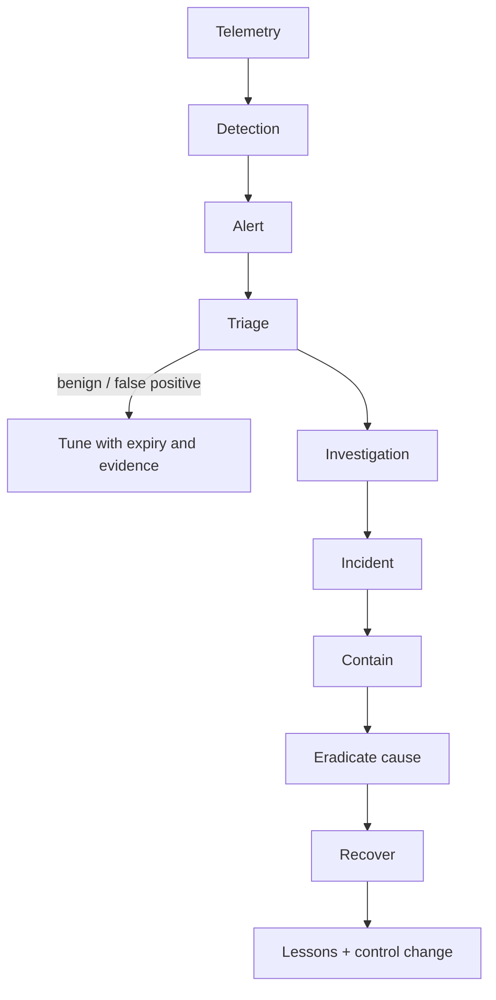

# Module 10 — Security Operations Center (SOC)

## Why it matters to a software engineer

When your service pages at 2 a.m., the people on the other side of the
ticket speak “alerts, cases, severity, containment.” If you cannot walk an
event from log line to case to fix, you will either ignore the SOC or drown
it. This module is the operating model.

## Visual overview



!!! note "Intuition"
    The `TUNE` branch is easy to skim past but it's where most SOCs quietly
    fail: every alert triaged as a false positive is a fork in the road. Take
    the lazy fork (silently dismiss) enough times and you get alert fatigue;
    take the disciplined fork (tune the rule, with an expiry so the exception
    doesn't outlive its reason) and the signal-to-noise ratio actually
    improves over time instead of decaying.

| SIEM | EDR | NDR | SOAR |
| --- | --- | --- | --- |
| Correlates stored events | Endpoint behavior and response | Network behavior/metadata | Orchestrates defined workflows |
| Broad context, data-cost risk | Host depth, agent dependency | Useful where host visibility is weak | Speeds repetition, amplifies bad logic |

Measure MTTD/MTTA/MTTR with explicit start/end definitions, plus fidelity,
investigation quality, and control effectiveness. Ticket closure alone rewards
the wrong behavior and contributes to fatigue.

!!! tip "Hint"
    Before quoting an MTTR number, ask "detected-to-contained, or
    reported-to-closed?" Teams that optimize the metric instead of the
    outcome tend to gravitate toward whichever start/end pair makes the
    number look best, which is exactly the "ticket closure rewards the wrong
    behavior" trap the last sentence is warning about.

## Learning objectives

- Explain why a SOC exists and how work flows through tiers.
- Use SIEM/EDR/NDR/SOAR as categories, not as shopping lists.
- Name metrics and how they are abused.
- Run a simple SOC workflow on soc-lite.

## Key concepts

Full narrative and comparison tables: [COURSE.md section 5](../course.md).

**Why a SOC.** Prevention is incomplete; someone correlates identity + app +
cloud; someone is accountable for detection SLAs; someone coordinates IR.

**Tiers (typical, not mandatory).**

| Tier | Job | Timebox |
| --- | --- | --- |
| L1 | Triage: duplicate? obvious FP? enough to page? | minutes |
| L2 | Investigate, enrich, contain with playbook | tens of minutes to hours |
| L3 / IR | Novel, severe, or failed playbooks | hours to days |
| Detection engineering | Rules as code, tuning, purple tests | sprint cadence |
| You (service owner) | Fix the system, confirm recovery | parallel |

**Flow.** Alert → triage → enrich → investigate → escalate → contain →
eradicate → recover → post-incident review.

**SIEM, EDR, NDR, SOAR, TI, cases, VM, detection engineering** — see COURSE
tables. soc-lite is a toy SIEM + case system.

**Alert fatigue.** Too many low-fidelity alerts. Humans learn to click
“close.” Fix: fewer, better detections; enrichment; suppression with expiry;
staffing honesty.

**False positives.** A cost paid in analyst hours and missed true positives.
Track them as defects in detection-as-code.

**Burnout.** Shift work + hostility + un-actionable queues. Metrics that
only count closed tickets make this worse.

**Metrics.** MTTD, MTTA, MTTR, dwell time, fidelity, investigation quality,
control effectiveness. Define MTTR as *respond* or *recover* explicitly.

## Architecture connection

```
services --> logs --> detections --> alert queue --> case --> owners
                                      |               |
                                      +--> playbooks  +--> change ticket
```

The SOC does not own your service. You own the fix. The SOC owns the
process to notice and coordinate.

## Hands-on lab — mini SOC workflow

**AUTHORIZED LAB USE ONLY.**

### Prerequisites

Dirty lab with alerts (run simulate + ingest if empty).

### Steps

1. `curl -s -X POST http://127.0.0.1:8090/ingest`
2. List alerts. Pick the **critical** SSRF one if present, else IDOR.
3. Triage notes (write them down):
   - What asset? notes-api
   - What identity? alice
   - True positive vs lab-generated? both: it is a real TP on a simulated
     attack
   - Severity vs business: dummy payroll note → treat as high for practice
4. Enrich: `GET /alerts/{id}`, `GET /events?q=alice`, `GET /playbooks/ssrf-metadata.md`
5. Open a case linking alert ids.
6. Add a timeline note via `POST /cases/{id}/update` with a hypothesis.
7. Simulated containment (still no production change):

   ```bash
   curl -s http://127.0.0.1:8090/actions/simulate -H 'Content-Type: application/json' \
     -d '{"action":"snapshot_logs","target":"notes-api","approval":"APPROVE","actor":"l2-analyst"}'
   ```

   Try once **without** APPROVE; expect 403.
8. Record MTTA-like time: wall clock from first alert `created_at` to case
   open. This is a toy measurement.

### Expected observations

Alerts have statuses `new` then `cased`. Audit rows exist for actions.
Approval gate refuses missing APPROVE.

### Security lessons

Triage is a decision under uncertainty. Playbooks beat heroics. Approval on
response actions is a SOC control, not bureaucracy.

### Common mistakes

- Closing as FP because “it’s the lab.”
- Paging on every DET-005 regex hit without impact.
- Measuring only ticket volume.

### Cleanup

Leave cases for module 11 or reset.

## Knowledge check

1. SIEM vs EDR in one sentence each.
2. Why can MTTD go down while risk goes up?
3. What is L1 not supposed to do?
4. Name one SOAR failure mode.
5. Who fixes the IDOR, SOC or engineering?

**Answers:** (1) SIEM correlates logs; EDR watches endpoints/processes.
(2) You detect only noisy easy alerts and miss slow data theft. (3) Novel
containment without a playbook / destroying evidence. (4) Auto-close or
auto-block on a bad IOC list. (5) Engineering owns the code; SOC coordinates
the incident.

## Engineering assignment

Draft an L1 playbook card (half page) for DET-002: when to escalate, what
to never do, who owns the service.

## Further reading

- [NIST SP 800-61 Rev. 3](https://csrc.nist.gov/pubs/sp/800/61/r3/final) (IR as CSF 2.0 community profile)
- [NIST CSF 2.0](https://www.nist.gov/cyberframework)
- [FIRST](https://www.first.org/) (CSIRT community, TLP, CVSS)
- [CISA incident response resources](https://www.cisa.gov/incident-response)
