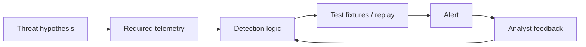

# Module 11 — Detection engineering and incident response

## Why it matters to a software engineer

Detections are code. They have false positives, owners, tests, and decay.
Incident response is a project under time pressure: preserve evidence,
decide severity, contain, eradicate, recover, communicate. NIST now frames
IR inside CSF 2.0 ([SP 800-61 Rev. 3](https://csrc.nist.gov/pubs/sp/800/61/r3/final)).
Many SOCs still teach the Rev. 2 loop (prepare → detect/analyze →
contain/eradicate/recover → post-incident). Use both: the loop for muscle
memory, CSF for “IR is not only the IR team.”

## Visual overview



!!! note "Intuition"
    A detection rule is code, and code without tests degrades silently. The
    `TEST` node is not optional polish — it's the difference between "I wrote
    a rule that I believe detects SSRF" and "I have a fixture that proves
    this rule fires on SSRF and stays quiet on normal traffic."

```text
Detection -> validate -> scope -> contain -> eradicate -> recover -> learn
```

| Signature/IOC | Anomaly | Behavior |
| --- | --- | --- |
| Known value/pattern | Deviation from baseline | Meaningful sequence/action |
| Precise but brittle | Finds novelty but can be noisy | More resilient, needs context |

Preserve originals, inventory evidence, state competing hypotheses, build a
UTC timeline, separate root cause from contributing controls, and verify
recovery by replay. Sigma expresses log-query ideas portably; YARA describes
content patterns. Neither is a complete investigation.

!!! tip "Hint"
    "State competing hypotheses" is the step most people skip under time
    pressure, and it's the one most likely to save you from an embarrassing
    correction later. Write down the boring explanation ("scheduled job,"
    "known test traffic") alongside the alarming one before you start
    digging — it costs one sentence and it is often the answer.

## Learning objectives

- Write detection logic as rules with thresholds and stated assumptions.
- Explain Sigma-like portability and YARA at a conceptual level.
- Investigate a simulated account-compromise / data-exposure case.
- Produce a timeline, incident report, RCA, and remediation plan.

## Key concepts

**Detection logic.** Boolean or statistical conditions on telemetry.
**Thresholds.** 5 failures / 120s — arbitrary until purple-tested.
**Baselines.** “Unusual” needs a usual. Hard in tiny labs; crucial in prod.
**Behavioral analytics.** Sequences and outliers, not a single IOC.
**Detection-as-code.** Rules in git (`labs/detections/rules.yaml`), reviewed,
tested with replayed JSONL, versioned with ATT&CK tags.

**Sigma.** An open generic signature format for logs, convertible to SIEM
queries. Our YAML is *Sigma-like* (event, fields, threshold), not a full
Sigma backend.

**YARA.** Pattern language for files/memory (malware hunting). You do not
need YARA for JSON API logs. Do not download malware to “try YARA.”

**Queries.** `/events?q=` is a toy. Production: constrain time, index, cost.

**Correlation.** Joining multiple *individually weak* events — across
sources, across time, sharing an actor or asset — into one higher-
confidence story, instead of paging an analyst once per event. This is a
different idea from Module 7's correlation ID (which threads *one
request* through *one system*): correlation here threads *one actor or
asset* through *many independent events*, possibly minutes or hours apart,
possibly from rules that don't know about each other. Concretely in this
lab: DET-001 (password-guessing burst) and DET-002 (cross-user note
access) are independent rules, each firing its own alert. A real SIEM's
correlation layer would ask "did the same `actor`/`src_ip` trigger both,
within one window?" and — if so — raise one case with higher severity
("credential guessing immediately followed by data access") instead of
two disconnected low-context alerts an analyst has to notice are related
by hand. Correlation is what turns a pile of alerts into an incident
narrative before a human even opens the case.

**Threat intelligence.** External data about what's known-bad, consumed
as an *enrichment* input to correlation and triage, never as ground truth
on its own. Concretely: a feed is typically a list of indicators (IPs,
domains, hashes, or higher-level "this actor's known TTPs") with a
confidence score and an age. Two things make intel different from your
own telemetry:

- **It answers a question your own data structurally cannot.** Your logs
  can show `src_ip=203.0.113.4` connected; only external data can tell you
  that IP is a known Tor exit node or was flagging phishing infrastructure
  last week.
- **It decays, and it can be wrong.** An IP flagged bad six months ago may
  be reassigned to an innocent host today; a feed vendor's false positive
  becomes *your* false positive if you treat a match as fact. Use intel to
  raise or lower a detection's *confidence* and *priority* — "this alert
  also matched a known-bad indicator, escalate it" — not to auto-decide
  guilt. That is the entire content of "without treating intel as gospel"
  above.

The lab has no intel feed to query — practice the judgment on paper: if
DET-001's `src_ip` (the password-guessing burst) matched a public feed's
"known scanner" indicator, how would that change your triage of the
*same* evidence you already have — and what would NOT change (the
underlying missing-rate-limit root cause still needs fixing either way)?

**Worked example: one alert through the full pipe.** Trace a single
password-guessing attempt from raw event to a correlated, prioritized
case:

1. **Collection.** notes-api emits a raw JSON line for one failed login:
   `{"ts":"2026-08-24T10:02:11Z","event":"login_failure","username":"alice","src_ip":"203.0.113.4"}`.
   If this had come from a legacy edge firewall instead of notes-api, it
   might have arrived as
   `CEF:0|VendorX|EdgeFW|1.0|4001|Auth failure|3|src=203.0.113.4 suser=alice`
   — same fact, different shape.
2. **Normalization.** Both forms get mapped to the same schema field names
   (`actor`, `src_ip`, `event`) so a rule written once can match either
   source. This is the step that makes step 1's two formats interchangeable.
3. **Enrichment.** The normalized event is joined with: internal context
   (alice's account is a regular user, not an admin) and external context
   (a threat-intel lookup on `203.0.113.4` — say it matches a "known
   credential-stuffing infrastructure" indicator, confidence medium, seen
   14 days ago).
4. **Correlation.** Five more `login_failure` events from the same
   `src_ip` land in the next 90 seconds (DET-001's actual threshold in
   this lab: 5 in 120s), then — 40 seconds after the fifth failure — a
   `cross_user_note_access` event fires for `actor=alice`. Correlated by
   shared actor within one short window, these become **one case**:
   "credential-guessing burst immediately followed by cross-user data
   access from the same identity," not two disconnected low-context
   alerts.
5. **Detection / prioritization.** DET-001 alone, with no intel match and
   no follow-on access, might be routine noise a real SOC auto-tunes down
   (scanners guess passwords constantly). The same DET-001 correlated with
   DET-002 *and* an intel match on the source is a different-severity
   incident entirely — same underlying facts, but the pipe's later stages
   are what turned "one low-value alert" into "escalate now."

Notice what did **not** change anywhere in that pipe: the actual fix is
still the missing rate limit (Module 16) and the missing per-object
authorization check (Module 4). Intel and correlation change how fast you
notice and how you prioritize — never what the permanent repair is.

**The Diamond Model.** A structuring tool for one intrusion event, not a
replacement for the timeline: every event has an **adversary** using a
**capability** over some **infrastructure** against a **victim**.

```text
        Adversary
        /        \
Capability ---- Infrastructure
        \        /
         Victim
```

Fill in what you actually know and mark the rest unknown — for DET-002 in
this lab: adversary = "Alice's session, attribution unknown"; capability =
"a valid token plus another user's object id, no exploit tooling";
infrastructure = "the notes-api itself, no external C2"; victim = "Bob's
note." An empty adversary corner is normal and honest; guessing to fill it
is not. Pivoting along one edge (same infrastructure, different victim;
same capability, different adversary) is how you find related activity you
were not already looking for.

**Incident severity.** Combine impact (data class, blast radius) and
urgency (active vs historical). Dummy payroll note → practice as high.

**Evidence preservation and chain of custody.** Copy, hash, write who/when,
do not edit originals. Lab: `preserve-logs.sh` writes
`labs/evidence/evidence-*` (survives `lab-reset`). The script copies; **you**
hash (`shasum labs/evidence/evidence-*/**`). This is not courtroom-grade
forensics; it teaches the habit.

**Quarantine vs eradicate.** Isolate the suspected identity or egress path
*while you still have the evidence* — disable `LAB_MODE` or block `/fetch`
to metadata without `down -v`. Eradicate after you know the cause (owner
check, rotate JWT). See [How defenders think](../how-defenders-think.md).

**Containment / eradication / recovery.**
Contain: stop the bleeding (disable LAB_MODE, rotate JWT secret).
Eradicate: remove the weakness and any persistence (none in lab).
Recover: restore service, watch for recurrence.
Communicate: who needs to know (in the lab: your report readers).

**Classic IR loop (still useful operationally).**
Prepare; detect & analyze; contain, eradicate, recover; post-incident.
Rev. 3 asks you to also **govern and identify** continuously so IR is not
a surprise.

## Architecture connection

```
rule in git --> deploy to soc-lite --> fire on JSONL
incident --> preserve --> timeline --> RCA --> new rule or patch --> retest
```

## Hands-on lab — investigate simulated exposure

**AUTHORIZED LAB USE ONLY.** Use the lab sim as the “attacker.”

### Prerequisites

Prefer a fresh story:

```bash
./labs/scripts/lab-reset.sh
./labs/scripts/lab-up.sh
python3 labs/attack-sim/simulate.py --scenario all
curl -s -X POST http://127.0.0.1:8090/ingest
./labs/scripts/preserve-logs.sh   # writes labs/evidence/, survives lab-reset
```

### Before you run this

Predict: (1) which evidence appears (2) which does not (3) why.

Then run the steps. Compare with the prediction. If the result differs,
which assumption was wrong?

### Steps

1. List alerts; open one case for “possible account misuse / data exposure.”
2. Build a **timeline** (table: time, event, actor, object, source). Default
   `GET /events` is **newest-first** (`order=desc`). For a chronology:

   ```bash
   curl -s 'http://127.0.0.1:8090/events?order=asc&limit=500'
   ```

   Or query one event type at a time (`?event=cross_user_note_access&order=asc`)
   and sort `ts` yourself. Default limit is 100. Include login_success,
   cross_user_note_access, ssrf_metadata_access, login_failure bursts.

   The sim concatenates six failures **and then** real logins for other
   scenarios. H2 (“password guessed then success”) will *look* supported.
   The true lab story is H3 (you ran `simulate.py`). In production you would
   need MFA/device evidence you do not have here.
3. Hypotheses:
   - H1: Alice is malicious insider
   - H2: Alice’s dummy password was guessed (DET-001 then success?)
   - H3: Lab operator ran simulate.py (true in this course)
   Record what evidence would distinguish H1/H2 in production (MFA, device
   posture, mail) that you **do not have** here. Sketch each hypothesis as a
   Diamond Model quad — H1 and H2 share victim and infrastructure but differ
   in adversary and capability, which is exactly why the telemetry alone
   cannot resolve them.
4. Impact: which notes, dummy IMDS keys treated as burned.
5. Containment (simulated): snapshot_logs, revoke_token_notice,
   disable_lab_mode via compose recreate with `LAB_MODE=false` **after**
   evidence copy.
6. Write `incidents/lab-incident.md` (you create) with:
   summary, severity, timeline, ATT&CK, RCA (root = missing object AuthZ
   and an application that would fetch metadata; the **lab safety rail**
   allowlist is always on — do not call that the missing control), fix,
   residual risk, detection gaps.
7. Purple: reset, bring the API up with `LAB_MODE=false` so hashes match,
   re-run idor; confirm **404** (not 403 — existence hiding). Blocked IDOR
   logs `authz_failure` / `idor_blocked`, not `cross_user_note_access`. Note
   whether an **attempt** detection exists (it does not, unless you add one).

### Expected observations

Ordered JSON events. Preserve dir untouched. After disable, IDOR fails.
Report distinguishes sim operator vs real Alice.

### Extra: tuning a threshold rule (false positives and false negatives)

Take a rule shaped like DET-001 but written more aggressively: *alert if a
user accesses more than 100 records in five minutes.* Work through it on
paper, then check your answers against the reasoning below.

1. What legitimate workflow would trigger this? (A bulk export feature, an
   admin running a data-quality report, a paginated "load all" UI action —
   any of these produce a burst of reads with no bad intent.)
2. How would an attacker avoid the threshold? (Stay under 100 in five
   minutes — 90 records every five minutes forever is invisible to this
   rule and just as damaging over a day.)
3. What additional signal would improve precision without just raising the
   number? (Object diversity — 100 reads of *your own* notes is normal;
   100 reads spanning 80 different owners is not. Group by
   `(actor, owner)` pairs, not just `actor`.)
4. What happens if you raise the threshold to 500 to kill the false
   positives from step 1? A new false negative appears: an attacker who
   paces themselves at 400 records per five-minute window now clears
   every 100-owner span undetected, and you have made the *real* attack
   slower to catch in exchange for fewer paged analysts.

The general lesson: a threshold alone trades false positives for false
negatives along one dial. The fix is usually a better *grouping key* or
added *context* (object diversity, actor's normal baseline, whether the
actor is delegated to the objects touched) — not a bigger or smaller
number on the same dial. This is also why the capstone rubric asks for
"documented FPs," not zero FPs: a detection with no recorded false
positives has usually never been run against real traffic.

### Extra: investigating with incomplete evidence

Real investigations rarely hand you a complete, well-formed timeline.
Before your next investigation (this lab's or a real one), assume at least
one of these is true, and decide how it changes your confidence:

- **A field is missing.** The `owner` field is absent from some
  `note_read` events (an older app version, a partial rollout). Can you
  still tell BOLA from a normal read? (No — without `owner`, a `note_read`
  event alone cannot prove or disprove cross-user access. State that gap
  explicitly rather than assuming innocence.)
- **Timestamps disagree.** The collector's ingest time and the event's
  own `ts` differ by minutes. Which do you trust for ordering the
  timeline, and what do you write in the report when they conflict?
- **One log source is down for part of the window.** `login_failure`
  events exist for the first half of the incident, then stop. Do you
  conclude the attacker stopped, or that the collector did?
- **Legitimate admin activity is mixed in.** An admin ran a bulk export
  during the same window as the suspicious reads. Which events are
  attributable to which actor, and where does your evidence actually
  distinguish them (hint: `actor`, not just timing)?

In every case, the correct move is the same: state what you know, state
what you cannot know from the available evidence, and do not fill the gap
with the more dramatic explanation by default. A root-cause analysis that
silently assumes complete evidence is a common, avoidable way investigations
go wrong under time pressure.

### Security lessons

Timeline before containment when possible. RCA names a systemic cause
(AuthZ missing) not “Alice was naughty.” Recovery includes tests.

### Common mistakes

- Skipping preservation.
- Declaring root cause “the attacker.”
- Publishing dummy IMDS keys into a public gist.

### Cleanup

`lab-reset` after you export the report.

## Knowledge check

1. What is detection-as-code’s main benefit?
2. Sigma vs YARA?
3. Why might threshold 5/120s miss a slow guesser?
4. Contain vs eradicate for SSRF-to-IMDS in cloud (conceptual)?
5. What does chain of custody protect against?

**Answers:** (1) Review, test, history. (2) Sigma ~ log rules; YARA ~ file
patterns. (3) Spread-out attempts stay under threshold. (4) Contain: block
IMDS/path, rotate role creds; eradicate: fix SSRF, reduce role. (5) Silent
alteration or disputed origin of evidence.

## Exit criteria

You pass this module when you can meet the course
[pass bar](../assessment.md) (Explain → Predict → Diagnose → Design →
Defend) on this material:

- ✓ Turn a threat hypothesis into a detection rule backed by a fixture that
  proves it fires on the abnormal case and stays quiet on the normal one.
- ✓ State a detection threshold's tradeoff: what legitimate behavior it
  might catch, and what slow/spread-out attack it might miss.
- ✓ Build a UTC timeline from ordered evidence and state at least two
  competing hypotheses before picking one.
- ✓ Distinguish quarantine (reversible, evidence-preserving) from eradicate
  (removes the weakness) for a given incident.
- ✓ Write a root-cause statement that names a systemic cause, not "the
  attacker."
- ✓ Preserve evidence before containment, and explain what containing first
  would have destroyed.
- ✓ Investigate an incident with incomplete telemetry and say what evidence
  would resolve it that you don't currently have.
- ✓ Explain how correlation differs from a per-request correlation ID, and
  combine two independently-firing rules into one prioritized case by a
  shared actor and time window.
- ✓ Use a threat-intel match to change an alert's priority without treating
  it as proof, and say what a false intel match would cost you.
- ✓ Defend one tradeoff: why a Sigma-style `falsepositives` field is part of
  the rule, not an afterthought.

## Engineering assignment

Convert DET-002 into a one-page Sigma-inspired rule (title, logsource,
detection, falsepositives, level, tags). You do not need a Sigma compiler.

## Further reading

- [NIST SP 800-61 Rev. 3](https://csrc.nist.gov/pubs/sp/800/61/r3/final)
- [NIST CSF 2.0](https://www.nist.gov/cyberframework)
- [Sigma](https://github.com/SigmaHQ/sigma)
- [YARA](https://yara.readthedocs.io/) (conceptual; no malware lab)
- [FIRST TLP](https://www.first.org/tlp/)
- [The Diamond Model of Intrusion Analysis (Caltagirone, Pendergast, Betz)](https://www.activeresponse.org/wp-content/uploads/2013/07/diamond.pdf)
