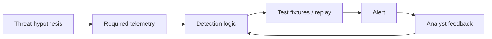

# Module 11 — Detection engineering and incident response

## Why it matters to a software engineer

Detections are code. They have false positives, owners, tests, and decay.
Incident response is a project under time pressure: preserve evidence,
decide severity, contain, eradicate, recover, communicate. NIST now frames
IR inside CSF 2.0 ([SP 800-61 Rev. 3](https://csrc.nist.gov/pubs/sp/800/61/r3/final)).
Many SOCs still teach the Rev. 2 loop (prepare → detect/analyze →
contain/eradicate/recover → post-incident). Use both: the loop for muscle
memory, CSF for “IR is not only the IR team.”

## Visual overview



!!! note "Intuition"
    A detection rule is code, and code without tests degrades silently. The
    `TEST` node is not optional polish — it's the difference between "I wrote
    a rule that I believe detects SSRF" and "I have a fixture that proves
    this rule fires on SSRF and stays quiet on normal traffic."

```text
Detection -> validate -> scope -> contain -> eradicate -> recover -> learn
```

| Signature/IOC | Anomaly | Behavior |
| --- | --- | --- |
| Known value/pattern | Deviation from baseline | Meaningful sequence/action |
| Precise but brittle | Finds novelty but can be noisy | More resilient, needs context |

Preserve originals, inventory evidence, state competing hypotheses, build a
UTC timeline, separate root cause from contributing controls, and verify
recovery by replay. Sigma expresses log-query ideas portably; YARA describes
content patterns. Neither is a complete investigation.

!!! tip "Hint"
    "State competing hypotheses" is the step most people skip under time
    pressure, and it's the one most likely to save you from an embarrassing
    correction later. Write down the boring explanation ("scheduled job,"
    "known test traffic") alongside the alarming one before you start
    digging — it costs one sentence and it is often the answer.

## Learning objectives

- Write detection logic as rules with thresholds and stated assumptions.
- Explain Sigma-like portability and YARA at a conceptual level.
- Investigate a simulated account-compromise / data-exposure case.
- Produce a timeline, incident report, RCA, and remediation plan.

## Key concepts

**Detection logic.** Boolean or statistical conditions on telemetry.
**Thresholds.** 5 failures / 120s — arbitrary until purple-tested.
**Baselines.** “Unusual” needs a usual. Hard in tiny labs; crucial in prod.
**Behavioral analytics.** Sequences and outliers, not a single IOC.
**Detection-as-code.** Rules in git (`labs/detections/rules.yaml`), reviewed,
tested with replayed JSONL, versioned with ATT&CK tags.

**Sigma.** An open generic signature format for logs, convertible to SIEM
queries. Our YAML is *Sigma-like* (event, fields, threshold), not a full
Sigma backend.

**YARA.** Pattern language for files/memory (malware hunting). You do not
need YARA for JSON API logs. Do not download malware to “try YARA.”

**Queries.** `/events?q=` is a toy. Production: constrain time, index, cost.

**Enrichment.** Add owner, asset criticality, geo, intel — without treating
intel as gospel.

**The Diamond Model.** A structuring tool for one intrusion event, not a
replacement for the timeline: every event has an **adversary** using a
**capability** over some **infrastructure** against a **victim**.

```text
        Adversary
        /        \
Capability ---- Infrastructure
        \        /
         Victim
```

Fill in what you actually know and mark the rest unknown — for DET-002 in
this lab: adversary = "Alice's session, attribution unknown"; capability =
"a valid token plus another user's object id, no exploit tooling";
infrastructure = "the notes-api itself, no external C2"; victim = "Bob's
note." An empty adversary corner is normal and honest; guessing to fill it
is not. Pivoting along one edge (same infrastructure, different victim;
same capability, different adversary) is how you find related activity you
were not already looking for.

**Incident severity.** Combine impact (data class, blast radius) and
urgency (active vs historical). Dummy payroll note → practice as high.

**Evidence preservation and chain of custody.** Copy, hash, write who/when,
do not edit originals. Lab: `preserve-logs.sh`. This is not courtroom-grade
forensics; it teaches the habit.

**Containment / eradication / recovery.**
Contain: stop the bleeding (disable LAB_MODE, rotate JWT secret).
Eradicate: remove the weakness and any persistence (none in lab).
Recover: restore service, watch for recurrence.
Communicate: who needs to know (in the lab: your report readers).

**Classic IR loop (still useful operationally).**
Prepare; detect & analyze; contain, eradicate, recover; post-incident.
Rev. 3 asks you to also **govern and identify** continuously so IR is not
a surprise.

## Architecture connection

```
rule in git --> deploy to soc-lite --> fire on JSONL
incident --> preserve --> timeline --> RCA --> new rule or patch --> retest
```

## Hands-on lab — investigate simulated exposure

**AUTHORIZED LAB USE ONLY.** Use the lab sim as the “attacker.”

### Prerequisites

Prefer a fresh story:

```bash
./labs/scripts/lab-reset.sh
./labs/scripts/lab-up.sh
python3 labs/attack-sim/simulate.py --scenario all
curl -s -X POST http://127.0.0.1:8090/ingest
./labs/scripts/preserve-logs.sh
```

### Steps

1. List alerts; open one case for “possible account misuse / data exposure.”
2. Build a **timeline** (table: time, event, actor, object, source). Use
   `/events` ordered by `ts`. Include login_success, cross_user_note_access,
   ssrf_metadata_access, login_failure bursts.
3. Hypotheses:
   - H1: Alice is malicious insider
   - H2: Alice’s dummy password was guessed (DET-001 then success?)
   - H3: Lab operator ran simulate.py (true in this course)
   Record what evidence would distinguish H1/H2 in production (MFA, device
   posture, mail) that you **do not have** here. Sketch each hypothesis as a
   Diamond Model quad — H1 and H2 share victim and infrastructure but differ
   in adversary and capability, which is exactly why the telemetry alone
   cannot resolve them.
4. Impact: which notes, dummy IMDS keys treated as burned.
5. Containment (simulated): snapshot_logs, revoke_token_notice,
   disable_lab_mode via compose recreate with `LAB_MODE=false` **after**
   evidence copy.
6. Write `incidents/lab-incident.md` (you create) with:
   summary, severity, timeline, ATT&CK, RCA (root = missing object AuthZ
   + fetch allowlist), fix, residual risk, detection gaps.
7. Purple: re-run idor against LAB_MODE=false; confirm 404; note whether
   an **attempt** detection exists.

### Expected observations

Ordered JSON events. Preserve dir untouched. After disable, IDOR fails.
Report distinguishes sim operator vs real Alice.

### Security lessons

Timeline before containment when possible. RCA names a systemic cause
(AuthZ missing) not “Alice was naughty.” Recovery includes tests.

### Common mistakes

- Skipping preservation.
- Declaring root cause “the attacker.”
- Publishing dummy IMDS keys into a public gist.

### Cleanup

`lab-reset` after you export the report.

## Knowledge check

1. What is detection-as-code’s main benefit?
2. Sigma vs YARA?
3. Why might threshold 5/120s miss a slow guesser?
4. Contain vs eradicate for SSRF-to-IMDS in cloud (conceptual)?
5. What does chain of custody protect against?

**Answers:** (1) Review, test, history. (2) Sigma ~ log rules; YARA ~ file
patterns. (3) Spread-out attempts stay under threshold. (4) Contain: block
IMDS/path, rotate role creds; eradicate: fix SSRF, reduce role. (5) Silent
alteration or disputed origin of evidence.

## Engineering assignment

Convert DET-002 into a one-page Sigma-inspired rule (title, logsource,
detection, falsepositives, level, tags). You do not need a Sigma compiler.

## Further reading

- [NIST SP 800-61 Rev. 3](https://csrc.nist.gov/pubs/sp/800/61/r3/final)
- [NIST CSF 2.0](https://www.nist.gov/cyberframework)
- [Sigma](https://github.com/SigmaHQ/sigma)
- [YARA](https://yara.readthedocs.io/) (conceptual; no malware lab)
- [FIRST TLP](https://www.first.org/tlp/)
- [The Diamond Model of Intrusion Analysis (Caltagirone, Pendergast, Betz)](https://www.activeresponse.org/wp-content/uploads/2013/07/diamond.pdf)
