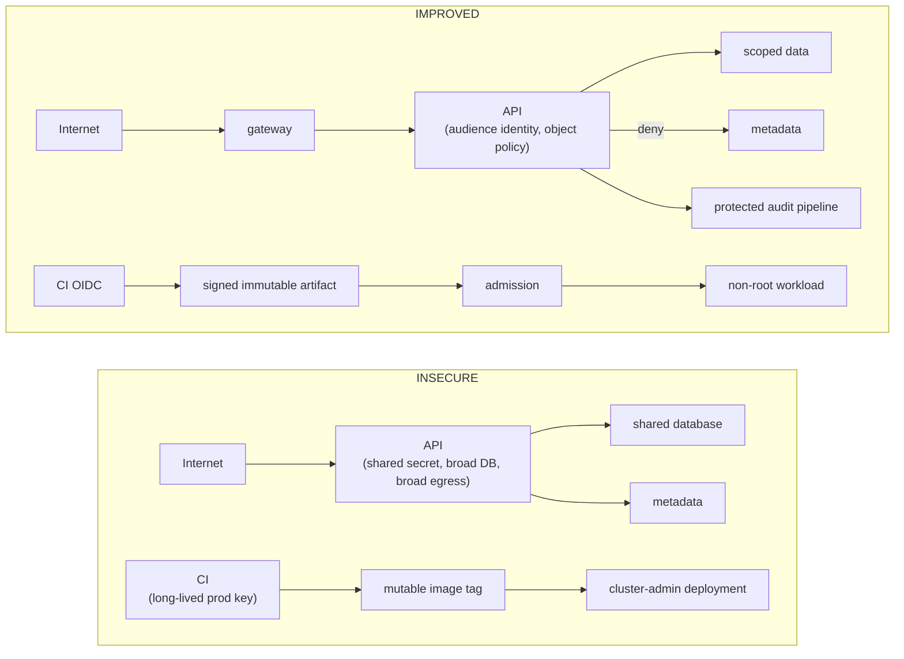
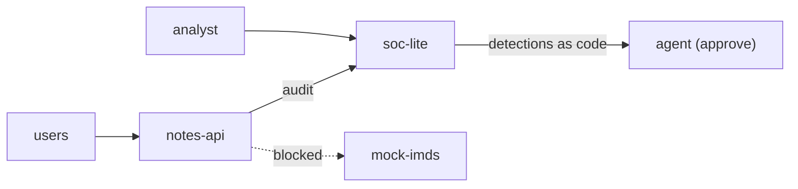

# Module 13 — Security architecture for software engineers

## Why it matters to a software engineer

Architecture is the set of defaults that remain when you are not looking:
how services authenticate, where secrets live, what CI will sign, what the
SOC can see. Tools do not substitute for this. Compliance does not either.

## Visual overview

!!! note "Intuition"
    Notice every line in `IMPROVED` is narrower than its counterpart in
    `INSECURE` — broad database access becomes scoped data, a long-lived key
    becomes short-lived OIDC, a mutable tag becomes a signed immutable
    artifact. "More secure" in this course almost always means "the same
    capability, with a tighter, more specific, more revocable boundary
    around it" — not an extra product bolted on top.

Annotate every production diagram with trust boundaries, identity paths,
data classification, allowed network paths, enforcement points, telemetry,
and owners. State trade-offs: aggressive blocking vs availability;
centralized authorization vs failure domain; logging vs privacy/cost;
encryption vs inspection; isolation vs operability; least privilege vs
delivery speed. The output is a decision with residual risk, not "add WAF."

!!! tip "Hint"
    If a design review's conclusion is a product name instead of a sentence
    about residual risk, the review didn't finish. "Add a WAF" doesn't say
    what risk remains after adding it, for whom, or under what failure mode —
    "add a WAF, which reduces but doesn't eliminate injection risk, and does
    nothing for BOLA" does.

## Learning objectives

- Design a service with explicit identity, secrets, segmentation, and
  observability.
- Place threat modeling in design reviews and tests in CI.
- State distributed-systems security trade-offs (consistency, blast radius,
  replay, poison-pill messages).

## Key concepts

**Secure service design.** Every service: authenticated callers, authorized
objects, least-privilege outbound, structured audit events, fail closed,
timeouts, bounded retries (so you do not amplify incidents).

**Safety-minded design (bulkheads and surface).** Read
[How defenders think](../how-defenders-think.md) before this review. For
every box ask: if it is wrong or compromised, what is the largest thing it
still *cannot* do? Independent answers (object AuthZ, no IMDS route, logs
off-box, approval on respond tools) are bulkheads. “Add a WAF” is not.

Prefer deleting `/fetch` or `/docs` to detecting their abuse. Prefer a
quarantine switch (disable this identity, this tenant, this egress, this
agent tool) to a single “turn the API off” lever. Audience (`aud`) per
callee beats a shared JWT among services: a stolen notes-api token should
not mint calls to the SOC.

Pinning a digest verifies **bytes**. It does not prove a good signer, and
it does not make malicious-but-pinned content safe. Signing + admission is
a different bulkhead.

**Secrets management.** Generate, distribute, rotate, revoke. Runtime
injection beats images. Separate prod from lab. JWT_SECRET in compose is
acceptable only as a lab smell you would ticket.

**Identity-aware service communication.** mTLS or JWT/OIDC between services
with `aud` per callee. No “VPC = trusted.”

**Network segmentation.** Still useful to reduce SSRF and ransomware blast
radius. Not a replacement for AuthZ.

**Supply-chain security.** Pin, verify, provenance (SLSA as a *framework
of levels*, not a certificate), signed images, review GitHub Actions
permissions, do not `latest`.

**Third-party and vendor trust.** Every SaaS integration, payment processor,
and third-party library is a trust boundary you drew a diagram for in
Module 1, whether or not you actually drew it. Ask the same questions:
what data crosses to them, what can they push back to you (webhooks,
callbacks, SDK code that runs in your process), and what happens to your
system if their credential or their service is compromised. A vendor
security questionnaire is not a substitute for naming that boundary on
your own architecture diagram.

**Secure SDLC.** Threat model on design; code review including AuthZ;
dependency scan; SAST as a *helper*; DAST/API tests for IDOR; deploy gates;
production security observability. None of these is complete.

**Distributed-systems trade-offs.**

| Decision | Security implication |
| --- | --- |
| Shared database vs per-service DB | Shared DB makes object AuthZ and blast radius worse |
| Sync vs async | Poisoned messages persist; consumers need AuthN of producers |
| Caches | Stale AuthZ; cache poisoning |
| Retries | Credential stuffing looks like your own retry storm |
| Multi-tenant isolation | One missing `tenant_id` predicate is a breach class |
| Feature flags | Flags that skip AuthZ in “emergency” become the incident |

## Architecture connection

Capstone platform:

Your design review should say which arrows are allowed.

## Hands-on lab — security review of the platform

### Prerequisites

You have run modules 4–12 once.

### Before you write this

Predict: (1) which findings you will file (2) which residual risks remain
after a recommendation (3) why.

Then read the compose file. Compare with your list. If you missed a
finding, which assumption was wrong?

### Steps

1. Read `labs/compose.yaml` and list trust boundaries.
2. File five findings in a table: severity, location, rec, residual risk.
   Suggested: default LAB_MODE true; JWT in env; container user possibly
   root; no rate limit; agent LLM optional data path.
3. Propose a production-shaped variant: LAB_MODE off, OIDC login, parameterized
   SQL, IMDS blocked at three layers (app, network, hop limit), signed
   images, detections in CI replay.
4. Write “what we will not automate”: e.g. disabling user accounts without
   human approval.

### Expected observations

A findings list that a staff engineer could action. Not a vendor pitch.

### Security lessons

Defense in depth is independent mechanisms. Observability is part of the
architecture diagram, not an add-on slide.

### Common mistakes

- “We’ll put it on the service mesh” as the entire AuthZ story.
- Secrets in IaC state with no rotation.
- CI with write to prod.

### Keep for the capstone

Put the five findings and your “what we will not automate” list in
`docs/capstone/work/architecture-review.md`, starting from the
[architecture-review template](../capstone/architecture-review.md). Write the
engineering assignment’s decision record in
`docs/capstone/work/security-decision-record.md`, starting from the
[decision-record template](../capstone/security-decision-record.md).
Together they make the capstone’s M9 item.

### Cleanup

None.

## Knowledge check

1. Why is VPC-only exposure not object AuthZ?
2. Name two independent controls against SSRF-to-IMDS.
3. What does pinning a digest not protect against?
4. Why are retries a security concern?
5. Where should threat modeling sit in an SDLC?

**Answers:** (1) Any workload in the VPC can call you. (2) Count two
*independent* controls: application allowlist **and** no network route to
IMDS (IMDSv2 + least-privilege role are additional layers). (3) A digest pin
does not stop malicious-but-pinned bits; compromised *signer* is a
provenance/signing problem the pin does not claim to solve. (4) Amplification
and confusion with attacks. (5) Design review, before code freeze, updated
when threats change.

## Engineering assignment

One-page architecture decision record: “How notes-api will authenticate
service callers in production.” Options, choice, residual risk.

## Self-check

Answer before expanding. These are the [assessment](../assessment.md) moves
on this module's Acme Notes lab, not trivia.

??? question "Explain: Why is VPC-only (or labnet-only) exposure not object AuthZ?"
    Any workload on that network can call you. Alice vs Bob is still a
    per-object decision. "We'll put it on the service mesh" is not the
    AuthZ story.

??? question "Predict: Name two independent bulkheads against SSRF-to-IMDS on this platform."
    Application allowlist **and** no network route to IMDS. IMDSv2 and a
    least-privilege role are extra layers. Prefer deleting `/fetch` to
    detecting its abuse.

??? question "Diagnose: notes-api and soc-lite share one JWT secret / audience. What blast radius did you just draw?"
    A stolen notes-api token mints calls the SOC would accept. `aud` per
    callee is the bulkhead. Shared DB and feature flags that skip AuthZ
    are the same class of "one compromise is everywhere."

??? question "Design: What does pinning an image digest not protect against?"
    Malicious-but-pinned bits, and a compromised signer. Pinning verifies
    bytes. Signing + admission is a different bulkhead. `latest` is not a
    pin.

??? question "Defend: Residual risk after you delete `/docs` in production and add a WAF."
    You shrunk surface (good) but a WAF in front of remaining IDOR is
    theatre. Containment still needs a quarantine switch (this identity,
    this egress, this agent tool) rather than one "turn the API off"
    lever. Retries can still amplify stuffing.

## Before you leave

- **Predict** — write expected findings (what appears, what does not, and why) before you write the review.
- **Diagnose** — name the missing bulkhead from the platform diagram.
- **Build** — complete the architecture review (findings a staff engineer could action, plus the ADR assignment).
- **Defend** — state containment and residual risk in one sentence each.
- **Exit criteria** — the course [pass bar](../assessment.md): Explain → Predict → Diagnose → Design → Defend.

## Further reading

- [CISA Secure by Design](https://www.cisa.gov/securebydesign)
- [NIST SSDF SP 800-218](https://csrc.nist.gov/pubs/sp/800/218/final)
- [SLSA](https://slsa.dev/)
- [CNCF software supply chain](https://github.com/cncf/tag-security)
- [OWASP ASVS](https://owasp.org/www-project-application-security-verification-standard/)
