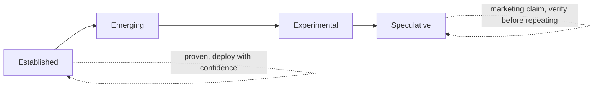

# Module 14 — The future of cybersecurity

A vendor slide: *“Autonomous SOC: resolves 95% of alerts with no human
in the loop.”*

The lab’s agent, the one you ran in Module 12, refuses to do anything
without `approval: APPROVE`, and it takes its ATT&CK mapping from a lookup
table, not from the model.

Both can be true at once. The slide might describe triage of known-benign
noise. The lab might be more careful than it needs to be. What you need is
a way to sort claims like this into *established*, *emerging*, and
*speculative* before you bet a team on one.

## Why it matters to a software engineer

Tool names churn. Fundamentals compound. This module separates **established
practice**, **emerging architecture**, and **speculation**. No timeline
promises. You will leave with a short list of skills worth investing in.

## Visual overview



!!! note "Intuition"
    Confidence labels are a discipline for reading vendor and news claims,
    not just an academic exercise. When you hear "AI will replace the SOC,"
    the useful question isn't agree/disagree — it's "which column does this
    claim actually belong in, and what evidence would move it one column to
    the left?"

| Established | Emerging | Experimental | Speculative |
| --- | --- | --- | --- |
| least privilege, threat modeling, detection-as-code, supply-chain controls | agent-assisted investigation, AI-app security practice, security data platforms | bounded autonomous containment in narrow environments, privacy-preserving analytic prototypes | broad unsupervised SOC replacement, precise quantum timelines |

```text
new component: model / vector store / agent / tool
        |
        v
same questions: identity? authority? untrusted input? evidence? failure mode?
        (companion to onboarding's five questions — this set is for new boxes)
```

AI may change attacker cost and defender workflow; dependencies, identities,
cloud-native control planes, deepfakes, fraud, privacy analytics, and
post-quantum migration all change at different rates. Recheck authoritative
sources before acting. Ten years from now, boundaries, least privilege,
secure defaults, evidence quality, incident learning, and clear risk decisions
will still matter.

!!! tip "Hint"
    Run that five-question checklist on Module 12's agentic SOC diagram —
    it's the same checklist, applied. That's not a coincidence: it's meant
    to show you the "new component" box in this diagram is the same box as
    `AGENT` a few modules ago, and the questions don't change just because
    the component is newer.

## Learning objectives

- Discuss AI-assisted offense/defense without hype.
- Place agentic SOC, supply chain, identity-centric cloud, security data
  platforms, and AI-app security on a “established vs emerging” map.
- Identify durable skills and over-automation risks.

## Words for the lab

These are the terms the lab uses. The rest of the vocabulary comes
[after the lab](#the-rest-of-the-vocabulary), once you have seen it in action.

**AI-assisted attacks and defense (emerging, already observed in parts).**
Models lower the cost of phishing copy, code review for bugs, and alert
summaries. They also add prompt injection and data leakage. They do not
repeal AuthZ. MITRE ATLAS tracks AI-related adversary techniques; treat it
as a knowledge base like ATT&CK, not fate.

**Agentic security operations (emerging).** Useful for enrichment and draft
work. Dangerous for unbounded tools. Human-agent trust exploitation (ASI09)
and rogue agents (ASI10) are documented risk classes, not science fiction
catalogs of today’s every product.

**Security for AI applications (emerging, standards forming).** OWASP LLM
Top 10 2026: prompt injection, sensitive information disclosure, excessive
agency, supply chain, data/model poisoning, unbounded consumption,
misinformation, hidden context exposure, vector/embedding weaknesses,
improper output handling. RAG and tool-using agents expand the attack
surface to **every document and API you connect**.

**Skills that keep paying.** Threat modeling; AuthN vs AuthZ; reading logs;
incident timelines; writing tests for security properties; least privilege
for humans, machines, and agents; communicating residual risk.

**Over-automation and concentrated decision-making.** One policy engine or
one model that can isolate hosts org-wide is a single failure domain
(ASI08 cascading failures). Keep humans on irreversible actions. Keep
evaluations.

## Worked scene — sorting one claim

**Claim.** “Agents will contain incidents without a human.”

1. *What the lab shows.* The Module 12 agent proposes containment, and a
   human has to type `APPROVE`. Tool use behind a policy engine is real and
   works today.
2. *What the claim adds.* Removing the human. That needs evidence the
   agent’s proposals are right often enough, on your data, with a rollback
   when they aren’t.
3. *Column.* Tool-using agents behind approval: **emerging**. Unattended
   containment: **speculative**, until someone shows error rates.
4. *What would move it left.* Published false-containment rates, and a
   rollback that has actually been exercised.

**What that implies.** You didn’t have to agree or disagree. You named
the column and the evidence that would change it.

## Architecture connection

Future you will still draw trust boundaries. The new boxes are models,
vector DBs, tool gateways, and agents. They are APIs with memory.

## Hands-on lab — judgment memo

No extra containers.

### Before you write this

Predict: (1) what you will automate (2) what you will not (3) why.

Then write the memo. Compare with that prediction. If they differ, which
assumption was wrong?

### Steps

1. Write one page: *What I will automate in a SOC in the next two years,
   what I will not, and how I will evaluate it.* Use lab agent as the
   example.
2. Classify each item: established / emerging / speculative.
3. List three fundamentals you will practice monthly (e.g. threat model one
   PR, read one ATT&CK technique, replay one detection).

### Expected observations

A memo that could survive a staff-engineer review: no vendor names required,
risks named, no “AGI will SOC itself.”

### Security lessons

Uncertainty is allowed. Unbounded agency is not.

### Common mistakes

- Treating a 2026 OWASP list as eternal.
- Ignoring supply chain because “AI is the topic.”
- Skipping PQC inventory because it feels distant.

### Cleanup

None.

## The rest of the vocabulary

Now that you have run the lab, here is the rest of the language people
will use about it.

**Software supply-chain and dependency attacks (established and growing).**
A03:2025 elevated this. Build identity, provenance, and pin. You already
live this in npm/PyPI/GitHub Actions.

**Cloud-native and identity-centric security (established direction).**
Perimeter shrinks; identity (human and workload) becomes the control plane.
Zero trust as strategy, not SKU.

**Detection engineering and security data platforms (established practice,
evolving vendors).** Log cost, schema (OCSF), detections as code, data lakes
for security. The lab’s sqlite is the idea in miniature.

**Deepfakes, social engineering, automated fraud (ongoing).** Technical
controls (phishing-resistant MFA, out-of-band verify for money movement)
matter more than “spot the fake” training alone.

**Privacy-preserving security analytics (emerging).** Aggregation, tokenization,
query restriction. Tension with investigation needs. Do not claim a homomorphic
miracle; state the trade-off.

**Post-quantum cryptography (planning is established; migration is work).**
NIST has selected PQC algorithms; inventories of where you use RSA/ECC
(TLS, SSH, signed artifacts, JWTs) are the engineering job. Hybrid TLS is
appearing. Do not “wait until quantum computers exist” to start inventory.
Do not panic-rip TLS tomorrow without a plan. Check [NIST PQC](https://csrc.nist.gov/projects/post-quantum-cryptography)
for current selections — they evolve.

## Knowledge check

1. Name one established practice and one emerging idea from this module.
2. Why is pinning dependencies still relevant in an AI future?
3. What is a cascading failure in an agentic SOC?
4. What PQC work can you do before algorithms finish shaking out?
5. Why might privacy-preserving analytics conflict with IR?

**Answers:** (1) e.g. detection-as-code vs autonomous containment. (2) Models
and tools are still software with publishers. (3) One bad enrichment auto-
triggers isolation across regions. (4) Inventory crypto use, track NIST,
plan hybrid TLS. (5) Investigators need record-level evidence; aggregation
hides it.

## Engineering assignment

The memo above *is* the assignment. Keep it.

## Self-check

Answer before expanding. These are the [assessment](../assessment.md) moves
on this module's Acme Notes lab, not trivia.

??? question "Explain: Put 'AI will replace the SOC' and 'detection-as-code' in the established/emerging/speculative table."
    Detection-as-code is established. Broad unsupervised SOC replacement
    is speculative. Agent-assisted investigation is emerging. The useful
    move is labeling the claim, not agreeing with a vendor timeline.

??? question "Predict: Why does pinning dependencies still matter in an 'AI future'?"
    Models and tools are still software with publishers. A compromised
    planner package is the same supply-chain path as Module 5.

??? question "Diagnose: One bad enrichment auto-isolates workloads across regions. What class of failure is that?"
    Cascading failure in an agentic SOC — unbounded agency plus automated
    containment. Experimental bounded containment in a *narrow*
    environment is not this.

??? question "Design: What PQC work can you do before algorithms finish shaking out?"
    Inventory crypto use (TLS, JWT, at-rest), track NIST, plan hybrid TLS.
    Do not skip the inventory because the date feels distant.

??? question "Defend: How do privacy-preserving analytics conflict with IR, and what is residual if you pick only one?"
    Investigators need record-level evidence; aggregation hides it.
    Residual of analytics-only: you cannot build the Module 11 timeline.
    Residual of keep-everything: retention and legal exposure from
    Module 7.

## Before you leave

- **Predict** — write which column a future-facing claim belongs in before you repeat it.
- **Diagnose** — name the unbounded agency or supply-chain miss in the memo's risk list.
- **Build** — write the judgment memo (established / emerging / speculative, no "AGI will SOC itself").

How these are graded: [assessment](../assessment.md).

## Further reading

- [NIST AI RMF](https://www.nist.gov/itl/ai-risk-management-framework)
- [NIST PQC](https://csrc.nist.gov/projects/post-quantum-cryptography)
- [OWASP GenAI](https://genai.owasp.org/)
- [MITRE ATLAS](https://atlas.mitre.org/)
- [CISA Secure by Design](https://www.cisa.gov/securebydesign)
