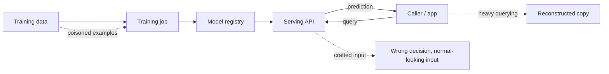

# Module 15 — ML/AI system security

Acme Notes ships a “related notes” feature. Alice opens her grocery list and
sees a suggestion:

> **You might also like:** *Bob payroll draft*

The similarity model never showed Alice the body. It only said the two
notes were close. But the title leaked, and the fact that Bob has a payroll
note leaked. Anyone can write a note designed to land near someone else’s.
The owner check you added in Module 4 guards `GET /notes/{id}`. It doesn’t
guard the index.

A model is a new asset with new ways in, and the Module 1 method still
works on it: assets, boundaries, controls, residual risk.

## Why it matters to a software engineer

Module 12 taught you to secure an **application that calls an LLM**. This
module flips the lens: the model, its training data, and its serving
pipeline are now the **asset** you are defending, using the exact same
trust-boundary and asset/threat/risk/control vocabulary from Module 1. If
you build or ship models — recommendation, classification, embeddings,
fraud scoring, or an LLM — this is the module that treats them as production
systems with their own attack surface, not as a black box someone else
secures.

## Visual overview

!!! note "Intuition"
    Redraw this as Module 5's supply-chain diagram with different labels —
    `developer→source→CI→artifact→registry→runtime` becomes
    `data→training→registry→serving`. The shapes of the attacks are
    familiar too: poisoning is tampering with the "source," extraction is
    theft via the public "runtime" API, and a crafted input is Module 4's
    "data becomes code" pattern with the model as the unsafe interpreter.

| Attack | Targets | Looks like | Prevent / raise cost | Detect / attribute |
| --- | --- | --- | --- | --- |
| Data poisoning | Training pipeline integrity | A backdoored or biased model, discovered late | Provenance + eval on trusted held-out data | Eval drift, canary triggers |
| Model extraction | Confidentiality/availability of the model | A very active, very ordinary-looking API client | Authn, quotas, rate limits, restrict high-information outputs | Query auditing, behavioral detection, fingerprinting, watermarking where applicable |
| Adversarial input | Serving-time integrity | A normal-looking input, wrong output | Robustness testing, not encryption | Anomalous-input / decision monitoring |
| Excessive agency | Blast radius of a wrong output | A correct-sounding action with real consequences | Tool-scoped policy + human approval (Module 12) | Tool-call audit |

!!! tip "Hint"
    "Encrypt the model file" answers a question nobody asked. Model
    extraction only requires **query access** to a public API — the file
    never has to leave the server. Do **not** treat rate limits, auditing,
    and watermarking as one "query path defense." Raise the cost of copying
    (authentication, quotas, rate limits, restrict high-information outputs)
    separately from detecting or attributing it (query audit, fingerprinting,
    watermarking). Neither list is the other.

## Learning objectives

- Apply the Module 1 asset/boundary/threat/control lens to a model instead
  of an API.
- Distinguish attacks on training data, the model artifact, and the serving
  API, and for extraction name both a prevent/raise-cost control and a
  detect/attribute control (they are not the same).
- Explain why a model's outputs are untrusted input to whatever reads them
  next — the same "data becomes code" pattern from Module 4.
- Review a tool-using agent's configuration for supply-chain and
  excessive-agency risk without adding new lab infrastructure.

## Words for the lab

These are the terms the lab uses. The rest of the vocabulary comes
[after the lab](#the-rest-of-the-vocabulary), once you have seen it in action.

**The ML pipeline has the same shape as any other supply chain.** Data
source → collection → labeling → training → evaluation → registry →
serving → monitoring. Module 5's supply-chain diagram (developer → source →
CI identity → artifact → signature → registry → runtime) maps directly:
swap "source code" for "training data" and "build" for "training run." A
compromise at any stage can arrive as an apparently normal deployment.

**Training-data poisoning.** An attacker who can influence training or
fine-tuning data biases the model's future behavior — a backdoor trigger
phrase, a systematically mislabeled class, a skewed recommendation. The
defense is provenance (know where every training example came from) and
evaluation on held-out, trusted data before promotion, the same "verify
before trust" instinct as signature checking in Module 5.

**Model theft / extraction.** An adversary with only query access can
reconstruct a close approximation of a model by querying it heavily and
training a copy on the input/output pairs. That is primarily a
**confidentiality** problem (the model is the secret). Heavy querying can
also become unbounded consumption (availability). Encrypting the model
*file* still matters against registry/backup theft — a different path.
Query-access extraction is not solved by at-rest encryption.

Controls for this split into two different jobs, and confusing them is how
"add rate limiting" ends up as the entire security review:

- **Prevent / raise extraction cost** (make copying expensive, not
  impossible): authentication, per-caller quotas, rate limits, and
  restricting high-information outputs (e.g. truncating raw
  logits/probabilities).
- **Detect / attribute** (assume some extraction succeeds, and catch it):
  query auditing for systematic probing, behavioral detection on query
  volume/diversity, response fingerprinting, and watermarking where
  applicable.

Neither list substitutes for the other. Rate limits are not watermarking:
raising cost slows a patient attacker but does not tell you copying
happened; detection/attribution tells you it happened but does not stop
the first successful run.

**Excessive agency and tool misuse.** Covered operationally in Module 12;
here, review it as a design-time control. A model that can only *read* is a
different risk than one that can *write*, *delete*, or *call other
services*. The blast radius of a wrong model output is bounded by what its
tools are allowed to do, not by how accurate the model usually is.

**Model/data confidentiality vs business value.** A model trained on
sensitive data can leak fragments of that data through its outputs
(membership inference, verbatim regurgitation). Treat "the model has seen
this data" as an additional **probabilistic exposure surface**, not as a
second conventional access path. That changes classification and
retention decisions from Module 7.

A trained model may memorize and expose training information, creating a
**probabilistic read path** to sensitive data — not a deterministic one.
For threat modelling, treat model memorization as a potential data-exposure
surface rather than as a conventional database. You cannot `SELECT` a
specific record out of it, query it with guaranteed recall, delete one row
from it on request, or reason about its access control the way you would a
database table. That difference matters operationally: "the model saw this
data" does not tell you *which* queries will surface it, and "we deleted
the row" does not mean the model has forgotten it. Plan retention and
deletion requests around the model's training/retraining cycle, not around
a single row's lifecycle.

## Worked scene — auditing one tool

Take `block_actor` from `labs/agentic-soc/policy.yaml`.

1. *What it does.* It records a simulated block of an identity. It
   requires `APPROVE`.
2. *Worst case if the planner is manipulated.* An attacker gets
   instruction-like text into evidence, and the summary blames an analyst.
   The agent proposes blocking the analyst who is investigating.
3. *What stops it today.* The action needs a human. The injection check
   replaces evidence containing the most obvious phrases, but its regex is
   narrow. The human is the real control.
4. *A control that doesn’t touch the model.* Never let `block_actor` target
   an identity that appears in the current case’s analyst list. That is a
   policy check outside the model.

**What that implies.** The question isn’t “can the model be tricked?” It
can. It’s “what is the worst tool it can reach, and what sits between the
two?”

## Architecture connection

Draw the same trust-boundary diagram as Module 1, with **four** new boxes:
`Training data` → `Training job` → `Model registry` → `Serving API`. Ask the
Module 1 questions at each boundary: what would hurt if this were disclosed,
changed, or unavailable; who can write to it; what does a caller's token
actually authorize once it reaches the model.

## Hands-on lab — threat-model an added model, audit an existing agent

No new containers. This lab reuses Module 1's method and Module 12's real
lab files — the point is to prove the framework transfers, not to stand up
new ML infrastructure.

### Prerequisites

Completed Module 1 (trust-boundary diagram) and Module 12 (agentic SOC lab).

### Before you write this

Predict: (1) which trust boundaries the smart-search feature adds (2)
which tool in `policy.yaml` has the worst blast radius (3) why.

Then do the steps. Compare with your notes. If you missed a boundary or a
tool, which assumption was wrong?

### Steps

1. **Design exercise.** Acme Notes is adding a "smart search" feature: notes
   are embedded and a similarity model suggests related notes. Draw the
   trust-boundary diagram for this addition: where do embeddings get
   written, who can query the similarity index, does it cross the
   `IMDS`/egress boundary from Module 1's reference diagram if the embedding
   model is a hosted API.
2. Using the STRIDE categories from Module 1, list one concrete threat per
   category for the smart-search feature (e.g. Tampering: a note author
   poisons their own note text to manipulate what gets suggested to other
   users).
3. **Audit exercise.** Open `labs/agentic-soc/policy.yaml` and
   `labs/agentic-soc/agent.py`. For each tool the policy allows, write one
   sentence: what is the worst thing this tool could do if the planner
   chose it based on a manipulated summary. Compare against Module 12's
   "excessive agency" note.
4. Propose one control for the highest-severity item you found in step 3
   that does **not** involve changing the model or prompt (e.g. narrowing
   the policy allowlist, adding an approval gate, capping call frequency).

### Expected observations

A written trust-boundary diagram and STRIDE table for smart search,
matching Module 1's format. A short audit note per tool in
`policy.yaml` naming a concrete worst case, not a generic "could be
misused."

### Security lessons

The lab is the smart-search diagram plus the tool audit: a model can
create a probabilistic read path into memorized training information,
while a tool-using agent can additionally become an actor. Bound the
search feature by who can write embeddings and who can query them; bound
the agent by what `policy.yaml` allows, not by model accuracy. Extraction
prevent vs detect (quotas vs watermarking) belongs in the model-theft
concept above — this lab never runs an extraction client. The Module 4
pattern (untrusted input crossing an interpreter) did not change; the
interpreter did.

### Common mistakes

- Treating "the model is a black box" as a reason to skip the trust-
  boundary exercise instead of a reason to do it more carefully.
- Proposing "make the model more accurate" as a security control. Accuracy
  and safety are different properties; a highly accurate model with
  unbounded tool access is still a high-severity design.
- Confusing model theft (confidentiality/availability of the model) with
  data poisoning (integrity of training data) — they need different
  controls.

### Cleanup

None.

## The rest of the vocabulary

Now that you have run the lab, here is the rest of the language people
will use about it.

**Adversarial examples.** Inputs crafted to be misclassified while looking
normal to a human (or normal-looking log lines crafted to look like
instructions to an LLM — this is Module 12's prompt injection, restated:
the same "interpretation crosses a boundary" pattern from Module 4, with
the model as the unsafe interpreter).

## Knowledge check

1. Why doesn't encrypting a model file stop model extraction?
2. Name the ML-pipeline equivalent of Module 5's "signed artifact."
3. How is a poisoned training example different from a prompt-injected log
   line, and how are they the same?
4. What bounds the blast radius of a wrong model output?
5. Why does "the model has seen this data" change a data-classification
   decision?
6. Why is watermarking not the same kind of control as a rate limit?

**Answers:** (1) The model is served through a public API; extraction only
needs query access, not the file. (2) A trained model with recorded
provenance and an evaluation signoff before it enters the registry.
(3) Different injection point (training time vs. inference time), same
pattern: untrusted content shapes future behavior. (4) The tool permissions
granted to whatever acts on the model's output, not the model's accuracy.
(5) The data now has an additional *probabilistic* read path (memorized
training information in the model's outputs) — not a conventional database
you can query or delete a row from. (6) Rate limits (with authn, quotas,
and restricted high-information outputs) raise extraction cost.
Watermarking, query auditing, and fingerprinting detect or attribute
copying after queries already succeeded.

## Engineering assignment

Extend your Module 1 trust-boundary diagram to include the smart-search
addition from step 1. Submit it alongside one paragraph naming the two
highest-severity threats and their controls.

## Self-check

Answer before expanding. These are the [assessment](../assessment.md) moves
on this module's Acme Notes lab, not trivia.

??? question "Explain: Why doesn't encrypting the model file stop query-access extraction?"
    Extraction needs the serving API, not the registry file. At-rest
    encryption still matters against backup theft — a different path.

??? question "Predict: How is a poisoned training example different from a prompt-injected log line, and how is it the same?"
    Different injection point (training vs inference). Same Module 4
    pattern: untrusted content shapes future behavior. Accuracy is not the
    control.

??? question "Diagnose: `simulate_action` is the only respond tool in policy.yaml. What is the worst case if the planner trusts a manipulated summary?"
    It can still request an allowlisted action (disable_lab_mode,
    revoke_token_notice, block_actor, snapshot_logs). Approval must fail
    closed. The blast radius is the tool list, not model quality.

??? question "Design: Name one prevent/raise-cost control and one detect/attribute control for extraction — and why they are not interchangeable."
    Prevent: authn, quotas, rate limits, truncated logits. Detect:
    query audit, watermarking, fingerprinting. Rate limits do not tell you
    copying happened; watermarks do not stop the first successful run.

??? question "Defend: Residual risk of 'the model has seen this notes corpus.'"
    A probabilistic read path remains after you delete a sqlite row.
    Containment is restrict who can query, log queries, retrain on a
    cycle — not `DELETE FROM notes`. "Make the model more accurate" does
    not bound that surface.

## Before you leave

- **Predict** — write expected findings (what appears, what does not, and why) before the threat-model and tool audit.
- **Diagnose** — name the interpreter or tool-permission miss, not "the model is a black box."
- **Build** — smart-search trust-boundary diagram plus one worst-case sentence per allowlisted tool.

How these are graded: [assessment](../assessment.md).

## Further reading

- [MITRE ATLAS](https://atlas.mitre.org/)
- [OWASP Machine Learning Security Top 10](https://owasp.org/www-project-machine-learning-security-top-10/)
- [NIST AI RMF](https://www.nist.gov/itl/ai-risk-management-framework)
- [OWASP GenAI LLM Top 10 2026](https://genai.owasp.org/resource/owasp-genai-llm-top-10-2026/)
