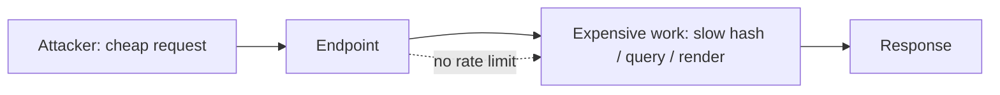

# Module 16 — Availability and denial of service

## Why it matters to a software engineer

Module 1's asset question asks what would hurt if something is
"disclosed, changed, or **unavailable**" — the third leg of the CIA triad
gets one line in most courses and then disappears. This module gives it a
proper pass: resource exhaustion, volumetric abuse, and asymmetric-cost
attacks, using the same lab you already ran for Module 9's brute-force
scenario, viewed through a different lens.

## Visual overview



!!! note "Intuition"
    Module 1's asset question already named "unavailable" as a first-class
    harm, next to "disclosed" and "changed" — this module finally spends
    time on it. The interesting failure isn't always a flood of traffic;
    it's one request that costs the attacker a cent and costs your server a
    dollar. Scaling out doesn't fix a bad cost ratio — it just makes losing
    money at a bigger scale.

```text
Volumetric:         many cheap requests -> exhaust bandwidth/connections
Asymmetric-cost:     few expensive requests -> exhaust CPU/memory per request
                      (e.g. a login endpoint's slow password hash runs on
                       every attempt, valid or not)
```

!!! tip "Hint"
    A rate limit placed *after* the expensive work already ran only stops
    the next request, not the cost of this one. Ask "what runs before I can
    even say no" — that's where the limit has to sit.

The same telemetry — a burst of `login_failure` events — can mean password
guessing (Modules 8–9 credential-access / DET-001) or an availability attack
(this module's lens). The fix (rate limiting) helps both; the incident
response does not.

## Learning objectives

- Distinguish volumetric denial of service from asymmetric-cost (algorithmic
  complexity) denial of service.
- Explain why a login endpoint using a deliberately slow KDF (Module 6) is
  also, unavoidably, a resource-exhaustion target.
- Identify the missing control in the lab app and name the standard controls
  that would add it back.
- Read the same telemetry event stream through an availability lens instead
  of a credential-access lens.

## Key concepts

**Availability is a property of the whole path, not just the server.**
DNS, gateway, application process, and database can each be the bottleneck.
Module 2's "follow one request" diagram is the map: an attacker only needs
to exhaust the narrowest point on that path, not every point.

**Volumetric vs algorithmic-complexity attacks.** Volumetric: overwhelm
capacity with sheer request or packet volume (classic DDoS). Algorithmic-
complexity / asymmetric-cost: send a small number of *expensive* requests
that cost the attacker little and the server a lot — a regex with
catastrophic backtracking, an uncapped file upload, or, concretely in this
lab, a login attempt that forces a full slow-KDF computation (Module 6)
for every guess, correct or not.

**Asymmetric cost is the interesting case for engineers.** A volumetric
flood is an infrastructure/capacity problem (rate limiting, autoscaling,
upstream scrubbing). An asymmetric-cost attack is an *application design*
problem: something in your own request-handling logic costs disproportionately
more for the server than for the caller, and no amount of horizontal scaling
fixes a design where each attacker dollar buys more of your compute than
theirs.

**Missing controls compound.** The lab's `/login` route has no rate limit,
no lockout, and no CAPTCHA-equivalent challenge — the same gap Module 9
exploited to demonstrate credential access (DET-001) is, independently, an
availability gap: nothing stops an attacker from sending attempt 7, 700, or
7000.

**Detection overlaps but the response differs.** DET-001 (password
guessing) and an availability incident can share the exact same telemetry
signature — a burst of `login_failure` events from one source — but the
correct response differs: credential-access response is "was any password
correct, rotate if so"; availability response is "can the service still
serve legitimate users, and where do we throttle."

**Disaster recovery is a different property than surviving an attack.**
Everything above defends *uptime while under load*. DR defends the case
where the service goes down anyway — attack, operator error, or plain
hardware failure — and asks whether you can come back. Two numbers make
this concrete instead of aspirational:

- **RPO (recovery point objective):** how much data you can afford to
  lose, measured in time since the last good backup. "We back up nightly"
  means an RPO of up to 24 hours, whether or not anyone said so on purpose.
- **RTO (recovery time objective):** how long you can afford to be down
  while restoring.

A backup you have never restored is a belief, not a control — the same
"controls fail, plan for that" idea from Module 1 applies to backups
themselves: the failure mode isn't "we forgot to back up," it's "we backed
up for two years and the restore script silently broke in month three."

## Architecture connection

Rate limiting, backoff, and circuit breakers belong at the same trust
boundary as authentication (Module 3) — the gateway or the endpoint itself —
because by the time a request reaches business logic, the expensive work
(password hashing, database query, downstream call) has already happened.
"Authenticate, then rate-limit" is backwards; the limit has to apply to
*attempts*, not just successes.

## Hands-on lab — measure the cost of an unthrottled login

### Prerequisites

Docker/Compose and `curl`. This experiment requires secure mode because the
default teaching mode deliberately uses fast SHA-256. Resetting below deletes
lab-only alerts, cases, and data; preserve anything you need first.

### Steps

1. Start from a clean database and run the stack with bcrypt enabled:

   ```bash
   make lab-reset
   cd labs
   LAB_MODE=false docker compose up -d --build
   cd ..
   curl -s http://127.0.0.1:8080/health
   ```

   Confirm the health response contains `"lab_mode":false`. Do not continue
   if it reports true; otherwise this experiment measures fast SHA-256 and
   cannot demonstrate the intended cost.

2. Time a single successful login:

   ```bash
   time curl -s -X POST http://127.0.0.1:8080/login \
     -H 'Content-Type: application/json' \
     -d '{"username":"alice","password":"alice-lab-password"}' >/dev/null
   ```

3. Time a single *failed* login for the **known user `alice`** with an
   obviously wrong password, using the
   same command with a bad password. Compare the wall-clock time to a
   trivial rejection (a malformed JSON body, which fails before hashing
   runs). The failed-but-well-formed attempt should cost close to the same
   as the successful one — the slow KDF from Module 6 runs either way.

   Time a failed login for a **non-existent user**. In this app, missing
   users skip bcrypt (`row is None` short-circuit) — cheaper, and a
   user-enumeration oracle. That is why step 3 specifies `alice`. A
   production login should dummy-hash on unknown users. Confirm
   `"lab_mode"` is JSON `false` (spacing may vary; look at the field).
4. Run the existing six-request brute-force scenario and calculate its
   approximate requests per second from the elapsed time:

   ```bash
   time python3 labs/attack-sim/simulate.py --scenario brute_force
   ```

5. Ingest, then query `soc-lite` for the resulting `login_failure` events:

   ```bash
   curl -s -X POST http://127.0.0.1:8090/ingest | python3 -m json.tool
   curl -s 'http://127.0.0.1:8090/events?event=login_failure' | python3 -m json.tool
   ```

   Note the timestamps. Ask: at what request rate would this endpoint's CPU
   become the bottleneck for *legitimate* logins, given the per-attempt cost
   you measured in step 3?
6. Read `labs/notes-api/app.py`'s `/login` route. Confirm there is no rate
   limit, lockout counter, or per-source throttle — every attempt, valid or
   not, pays the full authentication cost.

### Expected observations

In confirmed secure mode, failed and successful logins for the known user
cost roughly the same wall-clock time because both run bcrypt; a malformed
request is rejected far faster. Exact timings vary by laptop and one sample
is noisy, so repeat each measurement several times before comparing it.
DET-001 fires on the same burst that would, at higher volume, start
starving legitimate logins of CPU.

### Security lessons

A slow password hash is the correct control against offline cracking
(Module 6) and simultaneously an availability liability against online
attempts — there is no single control that solves both; you need the slow
hash *and* a rate limit, not one instead of the other.

### Common mistakes

- Concluding "rate limiting is a DevOps/infra problem" and stopping there —
  the asymmetric-cost half of this module is an application-logic decision
  (what work happens before rejection is possible) that infra alone cannot
  fix.
- Testing only the volumetric case and missing that a handful of well-
  placed expensive requests can be worse than a large number of cheap ones.
- Adding a rate limit only on `/login` success, which does nothing for the
  cost already paid on every failure.
- Treating "we take backups" as a finished control without ever running a
  restore drill — an RPO/RTO nobody has tested is a guess, not a number.

### Cleanup

Restore the default course state:

```bash
make lab-reset
make lab-up
```

Confirm `/health` reports `"lab_mode":true`. This removes the secure-mode
database whose bcrypt hashes are incompatible with the default teaching mode.

## Knowledge check

1. What is the difference between a volumetric and an algorithmic-
   complexity denial-of-service attack?
2. Why does a deliberately slow password hash create an availability
   trade-off?
3. Where should a rate limit sit relative to the expensive work it's meant
   to prevent?
4. Why can DET-001's telemetry signature mean two different incidents?
5. Why doesn't horizontal autoscaling fix an asymmetric-cost design flaw?

**Answers:** (1) Volumetric overwhelms capacity with sheer volume; algorithmic-
complexity makes each individual request disproportionately expensive to
process. (2) The same slow KDF that defeats offline cracking (Module 6)
also means every online attempt, valid or not, costs real server CPU.
(3) Before the expensive work runs, not after — otherwise the limit itself
arrives too late to save the cost. (4) A burst of `login_failure` events
can be credential-access reconnaissance or an availability attack; the
response differs even though the detection is identical. (5) More servers
still each do more expensive work per attacker-controlled request than per
legitimate one — the cost ratio, not total capacity, is the problem.

## Engineering assignment

Design (do not implement) a rate-limit and lockout policy for `/login`:
what is counted, what the window and threshold are, what happens on
breach, and how a legitimate user recovers. State one trade-off your policy
accepts (e.g. a shared-IP office network briefly locking out real users).

State an RPO and RTO for `notes-api`'s sqlite file, and one sentence on how
you would actually verify the restore works, not just that the backup file
exists.

## Further reading

- [OWASP API4:2023 Unrestricted Resource Consumption](https://owasp.org/API-Security/editions/2023/en/0xa4-unrestricted-resource-consumption/)
- [OWASP Denial of Service Cheat Sheet](https://cheatsheetseries.owasp.org/cheatsheets/Denial_of_Service_Cheat_Sheet.html)
- [NIST SP 800-61r3](https://csrc.nist.gov/pubs/sp/800/61/r3/final)
- [CISA Data Backup Options](https://www.cisa.gov/sites/default/files/publications/data_backup_options.pdf)
