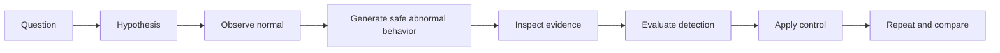
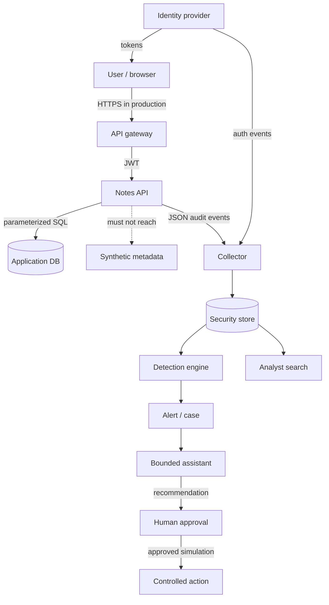

# Modules

Work in order. Each file is a complete lesson: a **Visual overview**
(diagrams, intuition, and hints — read this first), then precise
terminology, concepts, a hands-on lab, knowledge checks, an assignment, and
authoritative reading.

Every module's Visual overview is a picture of the same fictional system,
**Acme Notes**, implemented by the local `notes-api` lab — one system, many
lenses. The two diagrams below and the reading key apply to every module
that follows.

!!! tip "How to read the diagrams"
    - **Flowchart** (`flowchart`) — boxes are components or data; arrows show
      how a request, credential, or piece of data moves between them. Read it
      as "what talks to what," not as a sequence in time.
    - **Sequence diagram** (`sequenceDiagram`) — the same idea unrolled over
      time, top to bottom. Each arrow is one message; read it like a chat log
      between the participants named across the top.
    - **State diagram** (`stateDiagram-v2`) — the lifecycle of one thing (a
      token, an incident). Boxes are states it can be in; arrows are the
      events that move it from one state to the next.
    - A dotted arrow (`-.->`) always means "this should be blocked" or "this
      is the abnormal/attacker path" — it is the thing your controls exist to
      prevent, not a happy-path step.

## The repeated learning loop

!!! note "Intuition"
    This is the scientific method applied to a system instead of a lab bench.
    You cannot recognize "abnormal" until you have actually watched "normal"
    happen and written down what it looks like. Most security intuition is
    built by doing this loop dozens of times on the same small system, not by
    reading about attacks in the abstract.

For every lab, record the question, expected evidence, actual evidence,
control change, and before/after result in the
[experiment record worksheet](../exercises.md#experiment-record-worksheet).
A command completing successfully is not the learning outcome; explaining
the changed system behavior is.

## The reference system

!!! note "Intuition"
    Acme Notes is deliberately boring: it is a note-taking API, not a bank.
    That is the point — the same handful of shapes (a gateway, an identity
    provider, a database, a place things must *not* reach, a telemetry
    pipeline, and a human-approved response loop) recur in almost every real
    system you will ever secure. Learn to see these six shapes and you can
    orient yourself in an unfamiliar architecture diagram on day one of a new
    job.

Trust changes at user→gateway, gateway→API, API→data, workload→metadata,
producer→collector, and agent→tool. Credentials exist in the user session,
workload identity, database connection, CI identity, and agent tool grant.
Those boundaries and identities remain visible throughout the course.

!!! tip "Hint"
    Every time a module's diagram introduces a box you have not seen before,
    ask two questions before moving on: *"What credential does this box
    present to its neighbor?"* and *"What happens if that credential is
    stolen or forged?"* Those two questions are the fast path to spotting the
    interesting part of almost any architecture.

## Module list

| # | Module |
| --- | --- |
| 01 | [Security foundations](01-security-foundations.md) |
| 02 | [Networking and OS](02-network-and-os.md) |
| 03 | [Identity and access](03-identity-and-access.md) |
| 04 | [Application and API](04-application-and-api.md) |
| 05 | [Cloud, containers, Kubernetes](05-cloud-containers-k8s.md) |
| 06 | [Cryptography](06-cryptography.md) |
| 07 | [Monitoring and logs](07-monitoring-and-logs.md) |
| 08 | [MITRE ATT&CK](08-mitre-attack.md) |
| 09 | [Red, blue, purple](09-red-blue-purple.md) |
| 10 | [SOC](10-soc.md) |
| 11 | [Detection engineering and IR](11-detection-and-ir.md) |
| 12 | [Agentic SOC](12-agentic-soc.md) |
| 13 | [Security architecture](13-security-architecture.md) |
| 14 | [The future of cybersecurity](14-future.md) |
| 15 | [ML/AI system security](15-ml-ai-security.md) |
| 16 | [Availability and denial of service](16-availability-and-dos.md) |
| 17 | [Phishing, social engineering, insider risk](17-human-factor-attacks.md) |
