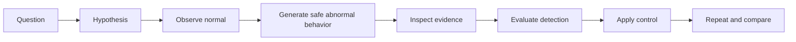
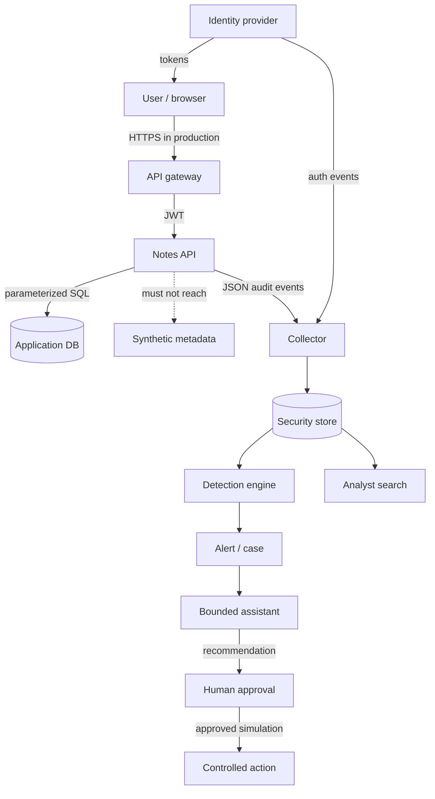
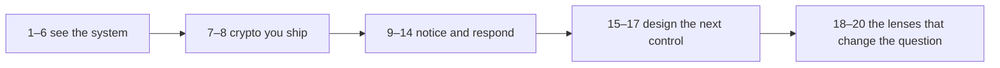

# Modules

Work in order. Each file is a complete lesson: a **Visual overview**
(diagrams, intuition, and hints — read this first), then precise
terminology, concepts, a hands-on lab, knowledge checks, an assignment, and
authoritative reading.

Every module's Visual overview is a picture of the same fictional system,
**Acme Notes**, implemented by the local `notes-api` lab — one system, many
lenses. The two diagrams below and the reading key apply to every module
that follows.

!!! tip "How to read the diagrams"
    - **Flowchart** (`flowchart`) — boxes are components or data; arrows show
      how a request, credential, or piece of data moves between them. Read it
      as "what talks to what," not as a sequence in time.
    - **Sequence diagram** (`sequenceDiagram`) — the same idea unrolled over
      time, top to bottom. Each arrow is one message; read it like a chat log
      between the participants named across the top.
    - **State diagram** (`stateDiagram-v2`) — the lifecycle of one thing (a
      token, an incident). Boxes are states it can be in; arrows are the
      events that move it from one state to the next.
    - A dotted arrow (`-.->`) always means "this should be blocked" or "this
      is the abnormal/attacker path" — it is the thing your controls exist to
      prevent, not a happy-path step.

## The repeated learning loop

```mermaid
flowchart LR
  Q[Question] --> H[Hypothesis]
  H --> N[Observe normal]
  N --> A[Generate safe abnormal behavior]
  A --> E[Inspect evidence]
  E --> D[Evaluate detection]
  D --> C[Apply control]
  C --> R[Repeat and compare]
```

!!! note "Intuition"
    This is the scientific method applied to a system instead of a lab bench.
    You cannot recognize "abnormal" until you have actually watched "normal"
    happen and written down what it looks like. Most security intuition is
    built by doing this loop dozens of times on the same small system, not by
    reading about attacks in the abstract.

For every lab, record the question, expected evidence, actual evidence,
control change, and before/after result in the
[experiment record worksheet](../exercises.md#experiment-record-worksheet).
A command completing successfully is not the learning outcome; explaining
the changed system behavior is.

When a module tells you *what* to run, also open
[How defenders think](../how-defenders-think.md): invert the path, name the
blast radius, write the detection as a testable claim, and ask whether a
bulkhead or a smaller surface would have beaten a smarter alert.

## The security reasoning loop

The learning loop above is *how you experiment*. Before you run a lab,
use the same predict → run → compare → explain block as
[How defenders think](../how-defenders-think.md) and
[Assessment](../assessment.md): predict which evidence appears, which
does not, and why; run it; explain any difference by naming the wrong
assumption.

This is *how you reason about any specific weakness*, once you have one
in front of you — the question sequence every module below applies to its
own material, and the one the exit-criteria checklist at the end of each
module checks you against. Those checklists instantiate the course pass
bar: **Explain → Predict → Diagnose → Design → Defend**.

1. **Asset or capability.** What does an attacker actually want here?
2. **Security invariant.** What must always be true, in one sentence
   ("a user may access only objects they own or have been delegated")?
3. **Trust boundary.** Where does an untrusted actor meet a trusted
   component — the same boundaries named in the reference-system diagram
   below?
4. **Violation.** How can the invariant be broken without tripping a check
   that isn't there?
5. **Evidence.** If the invariant is violated, what does that leave behind
   in a log, a token, a database row, a network flow?
6. **Detection.** Can that evidence be turned into a testable claim — and
   does that claim survive a fixture and a replay?
7. **Response.** What immediate, reversible action limits damage once the
   evidence is confirmed?
8. **Repair.** What permanent architectural change removes the weakness,
   rather than only catching it?

Mapped onto the pass bar: **Explain** is steps 1–3 (asset, invariant, trust
boundary); **Predict** is step 5 (expected evidence); **Diagnose** is
reading the violation from telemetry (steps 4–6); **Design** is prevention
(step 8) plus detection (step 6); **Defend** is containment (step 7) plus
the residual risk you still have to name.

!!! note "Intuition"
    Steps 5–7 (evidence, detection, response) are how you catch a violation
    of the invariant after the fact. Step 8 is how you stop needing to catch
    it at all. A course — and a real security program — needs both, but they
    are not substitutes for each other: a detection rule for cross-user
    access does not fix the missing authorization check that let it happen.

Module 4 (application/API) walks this loop in full against a single
concrete invariant. Later modules invoke it by name rather than
re-deriving it.

## The reference system

```mermaid
flowchart TB
  U[User / browser] -->|HTTPS in production| G[API gateway]
  G -->|JWT| API[Notes API]
  IDP[Identity provider] -->|tokens| U
  API -->|parameterized SQL| DB[(Application DB)]
  API -. must not reach .-> IMDS[Synthetic metadata]
  API -->|JSON audit events| COL[Collector]
  IDP -->|auth events| COL
  COL --> STORE[(Security store)]
  STORE --> DET[Detection engine]
  STORE --> SEARCH[Analyst search]
  DET --> ALERT[Alert / case]
  ALERT --> AGENT[Bounded assistant]
  AGENT -->|recommendation| HUMAN[Human approval]
  HUMAN -->|approved simulation| ACTION[Controlled action]
```

!!! note "Intuition"
    Acme Notes is deliberately boring: it is a note-taking API, not a bank.
    That is the point — the same handful of shapes (a gateway, an identity
    provider, a database, a place things must *not* reach, a telemetry
    pipeline, and a human-approved response loop) recur in almost every real
    system you will ever secure. Learn to see these six shapes and you can
    orient yourself in an unfamiliar architecture diagram on day one of a new
    job.

Trust changes at user→gateway, gateway→API, API→data, workload→metadata,
producer→collector, and agent→tool. Credentials exist in the user session,
workload identity, database connection, CI identity, and agent tool grant.
Those boundaries and identities remain visible throughout the course.

!!! tip "Hint"
    Every time a module's diagram introduces a box you have not seen before,
    ask two questions before moving on: *"What credential does this box
    present to its neighbor?"* and *"What happens if that credential is
    stolen or forged?"* Those two questions are the fast path to spotting the
    interesting part of almost any architecture.

## Module list

| # | Module |
| --- | --- |
| 01 | [Security foundations](01-security-foundations.md) |
| 02 | [Network and OS](02-network-and-os.md) |
| 03 | [Identity and access](03-identity-and-access.md) |
| 04 | [Application and API](04-application-and-api.md) |
| 04b | [Secure coding workshop](04b-secure-coding-workshop.md) |
| 05 | [Cloud, containers, Kubernetes](05-cloud-containers-k8s.md) |
| 06 | [Cryptography](06-cryptography.md) |
| 07 | [Monitoring and logs](07-monitoring-and-logs.md) |
| 08 | [MITRE ATT&CK](08-mitre-attack.md) |
| 09 | [Red, blue, and purple](09-red-blue-purple.md) |
| 10 | [Security operations center](10-soc.md) |
| 11 | [Detection and incident response](11-detection-and-ir.md) |
| 12 | [Agentic SOC](12-agentic-soc.md) |
| 12b | [Agent security workshop](12b-agent-security-workshop.md) |
| 13 | [Security architecture](13-security-architecture.md) |
| 14 | [Future directions](14-future.md) |
| 15 | [ML/AI system security](15-ml-ai-security.md) |
| 16 | [Availability and denial of service](16-availability-and-dos.md) |
| 17 | [Phishing, social engineering, insider risk](17-human-factor-attacks.md) |

## Twenty ideas, in the order you meet them

Module numbers stay 01–17. The list below is a different count: twenty
defensive ideas, numbered in the order this course teaches them. A public
list of twelve interview steps, or of fifty domain names, splits one idea
across several labels and numbers the pieces in another order. Use these
numbers when you ask “have we covered this?”

```mermaid
flowchart LR
  A["1–6 see the system"] --> B["7–8 crypto you ship"]
  B --> C["9–14 notice and respond"]
  C --> D["15–17 design the next control"]
  D --> E["18–20 the lenses that change the question"]
```

| # | Idea | Where you learn it |
| --- | --- | --- |
| 1 | Name the risk that remains after a control. A framework checkbox is not that sentence. | [Module 1](01-security-foundations.md) |
| 2 | See the network. A VPN, then zero trust access, and what a Wi-Fi probe leaks. | [Module 2](02-network-and-os.md) |
| 3 | See the host: process, file, and connection. | [Module 2](02-network-and-os.md) |
| 4 | Decide who the caller is, and what they may touch. | [Module 3](03-identity-and-access.md) |
| 5 | Hold the application to one invariant. | [Module 4](04-application-and-api.md) |
| 6 | Treat the cloud workload as an identity with a network position. | [Module 5](05-cloud-containers-k8s.md) |
| 7 | Pick the tool: encoding, hash, encryption, signature, TLS. | [Module 6](06-cryptography.md) |
| 8 | Tell quantum key distribution from a post-quantum migration. | [Module 6](06-cryptography.md), judged in [Module 14](14-future.md) |
| 9 | Make logs usable, and know what an intrusion sensor adds. | [Module 7](07-monitoring-and-logs.md) |
| 10 | Name the behavior, then hunt for it in data you have. | [Module 8](08-mitre-attack.md) |
| 11 | Test the defense on purpose. | [Module 9](09-red-blue-purple.md) |
| 12 | Run the queue: triage, a playbook, a metric you can define. | [Module 10](10-soc.md) |
| 13 | Investigate, and keep the evidence intact. | [Module 11](11-detection-and-ir.md) |
| 14 | Watch sensitive data leave. A gate on the way out is one control. | [Module 11](11-detection-and-ir.md) |
| 15 | Let an assistant draft. A person still decides. | [Module 12](12-agentic-soc.md) |
| 16 | Find a weakness, rank it for *this* system, fix it, retest. Design the lifecycle around that loop. | [Module 13](13-security-architecture.md) |
| 17 | Sort a future claim into established, emerging, or speculative. | [Module 14](14-future.md) |
| 18 | The model and its data are an asset. | [Module 15](15-ml-ai-security.md) |
| 19 | Stay up under load: one source or many, cheap floods or expensive requests, and how far back a restore reaches. | [Module 16](16-availability-and-dos.md) |
| 20 | The person holding a valid credential. Training changes the start of some attacks. | [Module 17](17-human-factor-attacks.md) |
