# Visual learning guide — one system, seventeen security lenses

Use this guide **before** the detailed notes for each module. It is the visual
spine of the course: every picture is another view of the same fictional
system, **Acme Notes**, implemented by the local `notes-api` lab.

!!! tip "How to read the diagrams"
    - **Flowchart** (`flowchart`) — boxes are components or data; arrows show
      how a request, credential, or piece of data moves between them. Read it
      as "what talks to what," not as a sequence in time.
    - **Sequence diagram** (`sequenceDiagram`) — the same idea unrolled over
      time, top to bottom. Each arrow is one message; read it like a chat log
      between the participants named across the top.
    - **State diagram** (`stateDiagram-v2`) — the lifecycle of one thing (a
      token, an incident). Boxes are states it can be in; arrows are the
      events that move it from one state to the next.
    - A dotted arrow (`-.->`) always means "this should be blocked" or "this
      is the abnormal/attacker path" — it is the thing your controls exist to
      prevent, not a happy-path step.

The repeated learning loop is:

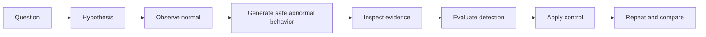

!!! note "Intuition"
    This is the scientific method applied to a system instead of a lab bench.
    You cannot recognize "abnormal" until you have actually watched "normal"
    happen and written down what it looks like. Most security intuition is
    built by doing this loop dozens of times on the same small system, not by
    reading about attacks in the abstract.

For every lab, record the question, expected evidence, actual evidence,
control change, and before/after result. A command completing successfully is
not the learning outcome; explaining the changed system behavior is.

## The reference system

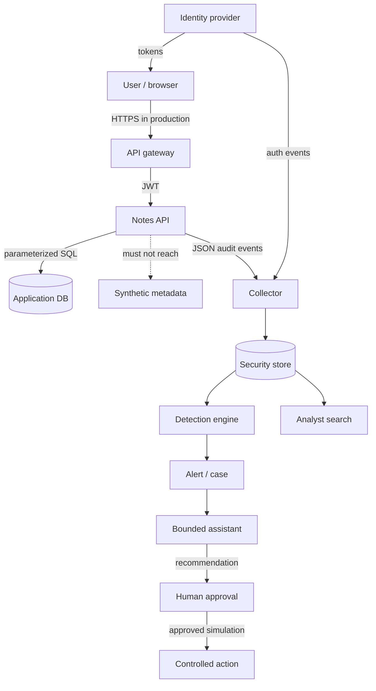

!!! note "Intuition"
    Acme Notes is deliberately boring: it is a note-taking API, not a bank.
    That is the point — the same handful of shapes (a gateway, an identity
    provider, a database, a place things must *not* reach, a telemetry
    pipeline, and a human-approved response loop) recur in almost every real
    system you will ever secure. Learn to see these six shapes and you can
    orient yourself in an unfamiliar architecture diagram on day one of a new
    job.

Trust changes at user→gateway, gateway→API, API→data, workload→metadata,
producer→collector, and agent→tool. Credentials exist in the user session,
workload identity, database connection, CI identity, and agent tool grant.
Those boundaries and identities remain visible throughout the course.

!!! tip "Hint"
    Every time a new diagram in this guide introduces a box you have not seen
    before, ask two questions before moving on: *"What credential does this
    box present to its neighbor?"* and *"What happens if that credential is
    stolen or forged?"* Those two questions are the fast path to spotting the
    interesting part of almost any architecture.

## 1 — Foundations: see trust before terminology

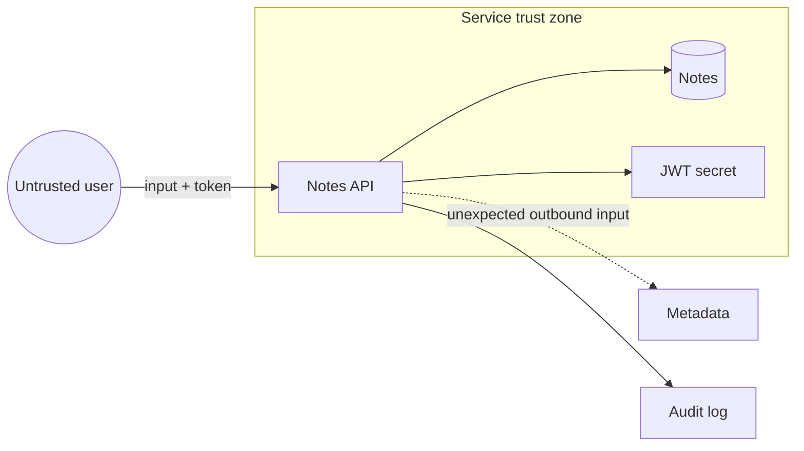

!!! note "Intuition"
    Before you learn the vocabulary (asset, threat, risk...), learn to see
    the picture: an untrusted arrow coming in, a trusted zone it lands in,
    and a dotted line showing where that zone should *not* be able to reach.
    Almost every vulnerability in this course is a version of "an arrow that
    should have stopped at the boundary didn't."

| Lens | Concrete question |
| --- | --- |
| Asset | What would hurt if disclosed, changed, or unavailable? |
| Attack surface | Which routes, dependencies, identities, and admin paths are reachable? |
| Boundary | Where does trust or ownership change? |
| Vulnerability | Which weakness exists? |
| Threat | Who or what could cause harm? |
| Risk | How likely and harmful is that scenario here? |
| Control | What changes likelihood or impact? |
| Residual risk | What remains after the control? |

```text
Before: Internet --> API (LAB_MODE) --> every note + metadata + broad secret
After:  Internet --> gateway --> authorized object only
                              +--> metadata denied
                              +--> scoped identity + protected audit stream
```

!!! tip "Hint"
    Walk the table top to bottom on any system you look at, in order. Skipping
    straight to "what's the vulnerability?" without first naming the asset and
    the boundary is the single most common way people misjudge how serious a
    finding actually is — you cannot rate risk on something you haven't first
    identified as an asset.

Attacker view: find an input whose implied trust exceeds the caller's actual
authority. Defender view: observe identity, object, decision, source, and
outcome. Engineering lesson: a trust boundary without an enforced decision is
only a line on a diagram.

## 2 — Network and OS: follow one request

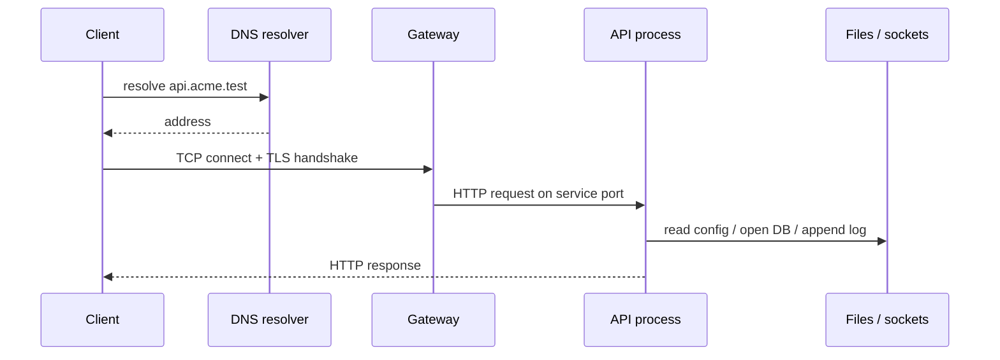

!!! note "Intuition"
    One HTTP request is really four or five separate systems briefly agreeing
    to cooperate: a name lookup, a network handshake, a process doing file and
    socket I/O, and eventually a human-meaningful response. Each of those
    systems keeps its *own* logs, and none of them alone tells the whole
    story — which is exactly why the "one view usually misses" row below
    matters so much.

```text
user/uid --owns--> process --opens--> socket
                         +--reads--> file / env
                         +--writes-> application log
```

| View | Sees well | Usually misses |
| --- | --- | --- |
| Network | endpoints, timing, bytes, DNS, TLS metadata | encrypted body, object authorization |
| Host | process, uid, files, syscalls, local sockets | upstream intent and full distributed path |
| Application | route, actor, object, decision, business result | kernel activity unless instrumented |

Normal: one DNS answer, TLS session, authorized read, 200. Abnormal: repeated
login failures or API→metadata traffic. Evidence: DNS/network metadata,
gateway access log, process/socket state, application audit event. Improvement:
deny needless egress and join views with UTC timestamps and correlation IDs.

!!! tip "Hint"
    If you can only instrument one layer, instrument the application layer
    first — it is the only one of the three that knows *who* did *what* to
    *which object*. Network and host telemetry tell you a request happened;
    only the app layer tells you whether it should have been allowed.

## 3 — Identity: every request is two decisions

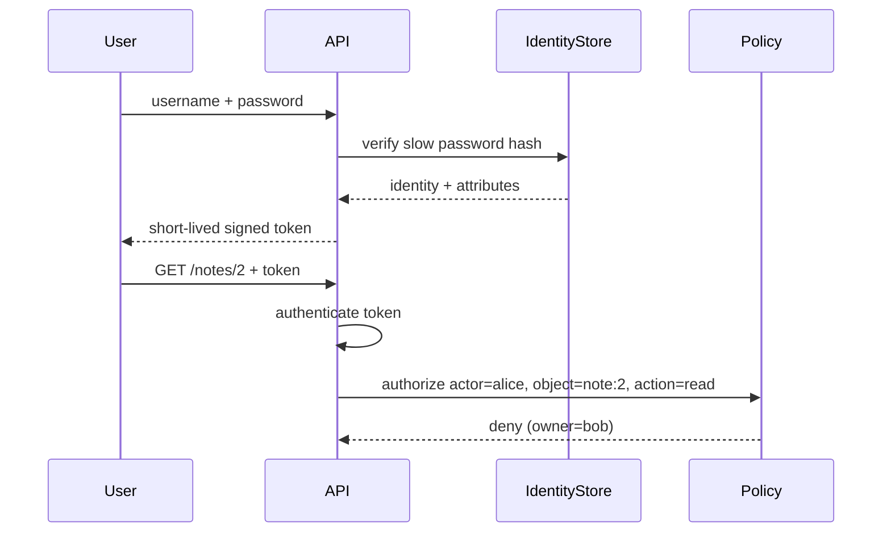

!!! note "Intuition"
    Notice the diagram deliberately ends in a **deny**. Authentication proved
    Alice is Alice — that part succeeded. The request still fails, because
    authentication only answers "who are you," never "are you allowed to
    touch *this* object." Treating a valid token as if it were a yes is the
    single most common access-control bug in real APIs (it has its own name:
    BOLA/IDOR, covered in section 4).

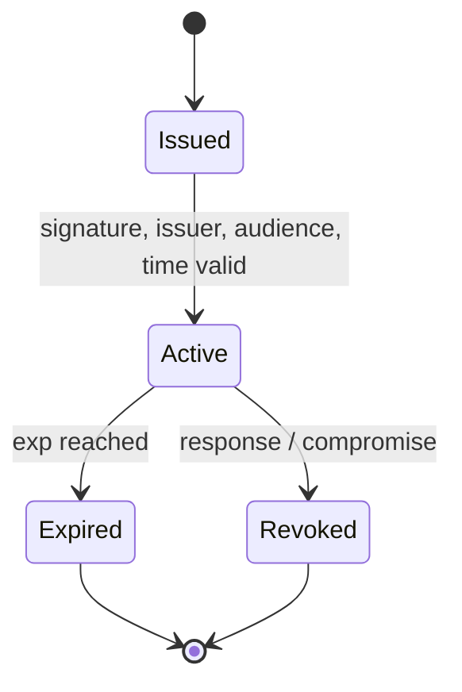

!!! tip "Hint"
    A token's lifecycle has two exits, not one. Teams routinely build the
    `Expired` path (just let `exp` pass) and forget the `Revoked` path
    (actively invalidate a token *before* it would have expired, e.g. on
    logout or after a suspected leak). If your system has no revocation
    story, a stolen long-lived token stays valid until its natural expiry no
    matter what you do.

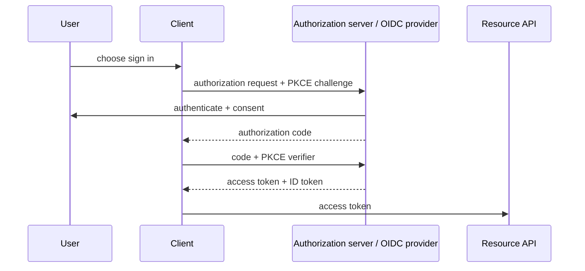

!!! note "Intuition"
    This is the "log in with..." button, unrolled. The client (your app)
    never sees the user's password — it only ever gets a short-lived
    authorization code, which it then exchanges for a token. PKCE exists
    specifically so that even if the authorization code leaks in transit
    (e.g. via a mobile deep link), the code alone is useless without the
    verifier secret the client generated for itself.

| Authentication | Authorization |
| --- | --- |
| Who/what is calling? | May this identity perform this action on this object now? |
| Password, MFA, certificate, signed token | RBAC, ABAC, ownership, policy |
| Failure: forged/stolen identity | Failure: valid Alice reads Bob's note |

Human identity usually begins with an interactive login and MFA; workload
identity begins with attested runtime context and receives a short-lived,
audience-bound credential. Both need lifecycle, least privilege, audit, and
revocation. A valid token is input to authorization, not proof of permission.

## 4 — Applications and APIs: interpretation crosses a boundary

!!! note "Intuition"
    Nearly every vulnerability class in this section is the *same bug* wearing
    a different costume: data that was supposed to stay inert data gets
    treated as instructions, a destination, or a permission by whatever reads
    it next. Once you see that pattern, you stop needing to memorize a dozen
    unrelated attack names — you just ask "where does untrusted input change
    from *data* to *control* here?"

Use this same frame for injection, BOLA, SSRF, XSS, CSRF, deserialization,
file handling, rate limits, and business-flow abuse:

```text
NORMAL:      typed input -> validation -> authorization -> safe interpreter -> result
MANIPULATED: input ------> missing decision / unsafe interpretation -------> impact
                                      |                         |
                                      +---- audit evidence -----+
```

| Case | Normal path | Manipulated path | Evidence | Primary control |
| --- | --- | --- | --- | --- |
| Injection | value → bound SQL parameter | value becomes SQL syntax | query error, unusual search | parameterization |
| BOLA/IDOR | token → owner check → note | valid token + another id → note | actor/owner mismatch | object authorization |
| SSRF | server fetches allowlisted service | URL selects metadata/internal host | outbound destination, fetch result | egress allowlist + segmentation |
| XSS | text → context encoding | text becomes browser script | stored input, CSP report | contextual output encoding |
| CSRF | intentional state change + token | browser auto-sends cookie cross-site | origin, CSRF failure | SameSite + CSRF token |
| Deserialization | strict data schema | bytes instantiate behavior | parser/type errors | safe parser + allowlisted schema |
| File handling | generated id + isolated storage | name traverses or executable upload runs | path, MIME, scan result | server naming + isolation |

!!! tip "Hint"
    For each row, say out loud what the "authorization" step actually checks.
    For BOLA it's "does this actor own this object" — for SSRF it's "is this
    destination on the allowlist." If you cannot name the exact check, that's
    usually because the check doesn't exist yet, which is the vulnerability.

Attacker view: make data become code, identity become authority, or a server
become a proxy. Defender view: join actor, input class, object, downstream
destination, decision, and response. Repair in `LAB_MODE=false`, replay the
same request, and compare both response and telemetry.

## 5 — Cloud, containers, Kubernetes, and supply chain

!!! note "Intuition"
    The shared-responsibility table below is the most-skipped, most
    expensive-to-skip idea in cloud security. Nobody gets breached because
    AWS's hypervisor had a bug; people get breached because "the platform
    handles security" quietly became "nobody configured RBAC, admission, or
    network policy," and the provider was never responsible for those in the
    first place.

| Layer | Provider/platform owns | Engineering team still owns |
| --- | --- | --- |
| Physical / managed control plane | facilities, hardware, defined service plane | configuration and consumption |
| Cluster / workload | scheduler mechanics vary by service | RBAC, admission, images, secrets, network policy |
| Application / data | none of the business rule | AuthZ, classification, retention, audit |

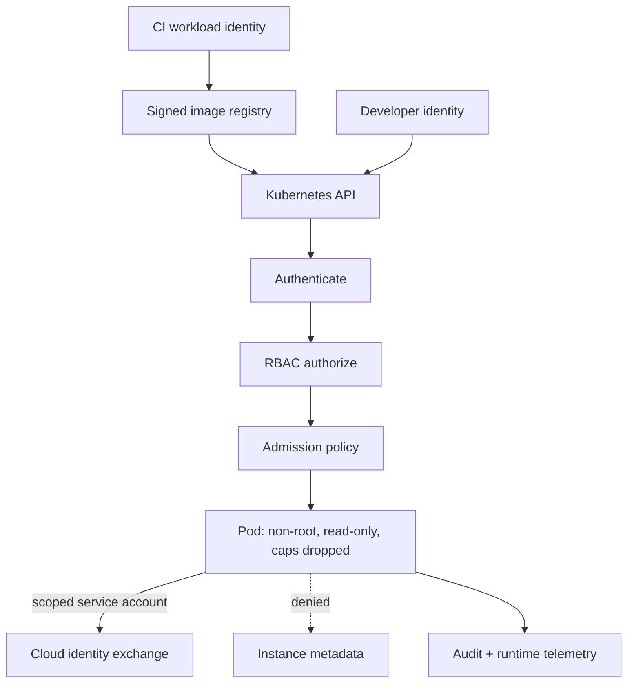

!!! tip "Hint"
    That dotted line to instance metadata is doing a lot of work — it is the
    same SSRF-to-metadata attack from section 4, just drawn one layer down
    the stack. If an application-layer SSRF bug exists *and* the pod can
    still reach cloud metadata, the two weaknesses chain into full cloud
    credential theft. Blocking metadata access at the pod/network layer is a
    control that survives even if the application bug isn't caught in time.

```text
container process
  +-- namespaces: what it can see
  +-- cgroups: what it can consume
  +-- capabilities/seccomp: what it can ask the kernel to do
  +-- mounts: what host/data it can change
  (shared host kernel: a container is not a VM)
```

Supply chain: developer → source → dependency resolution → CI identity →
artifact → signature/provenance → registry → admission → runtime. A compromise
at any stage can arrive as an apparently normal deployment; provenance,
least-privilege CI, admission, and runtime evidence are complementary.

## 6 — Cryptography: keys define who can do what

!!! note "Intuition"
    Skip the math and ask one question per primitive: *"what does possessing
    the key let you prove or do that someone without it can't?"* A hash needs
    no key and proves nothing about origin — it only proves content didn't
    change *if you already trust the hash you're comparing against*. That
    caveat is the whole reason signatures exist.

| Primitive | Visual model | Reversible? | Solves |
| --- | --- | --- | --- |
| Hash | message → fingerprint | No | change detection when expected hash is trusted |
| Encryption | plaintext + key ⇄ ciphertext | Yes, with key | confidentiality |
| MAC | message + shared key → tag | Verification uses same secret | integrity/authenticity among key holders |
| Signature | message + private key → signature; public key verifies | Signature is not decryption | origin/integrity relative to key custody |

```text
Symmetric:   Alice [same secret K] <---- encrypted bulk data ----> Bob [K]
Asymmetric:  public key may be shared; private key stays with its owner
Hybrid:      asymmetric exchange authenticates/derives a symmetric session key
```

!!! tip "Hint"
    TLS is hybrid for a practical reason, not a theoretical one: asymmetric
    crypto is slow and expensive per byte, symmetric crypto is fast. So every
    HTTPS connection you make does a small amount of expensive asymmetric
    work once, just to safely agree on a symmetric key, then switches to
    cheap symmetric encryption for the actual data. That's what the handshake
    below is doing.

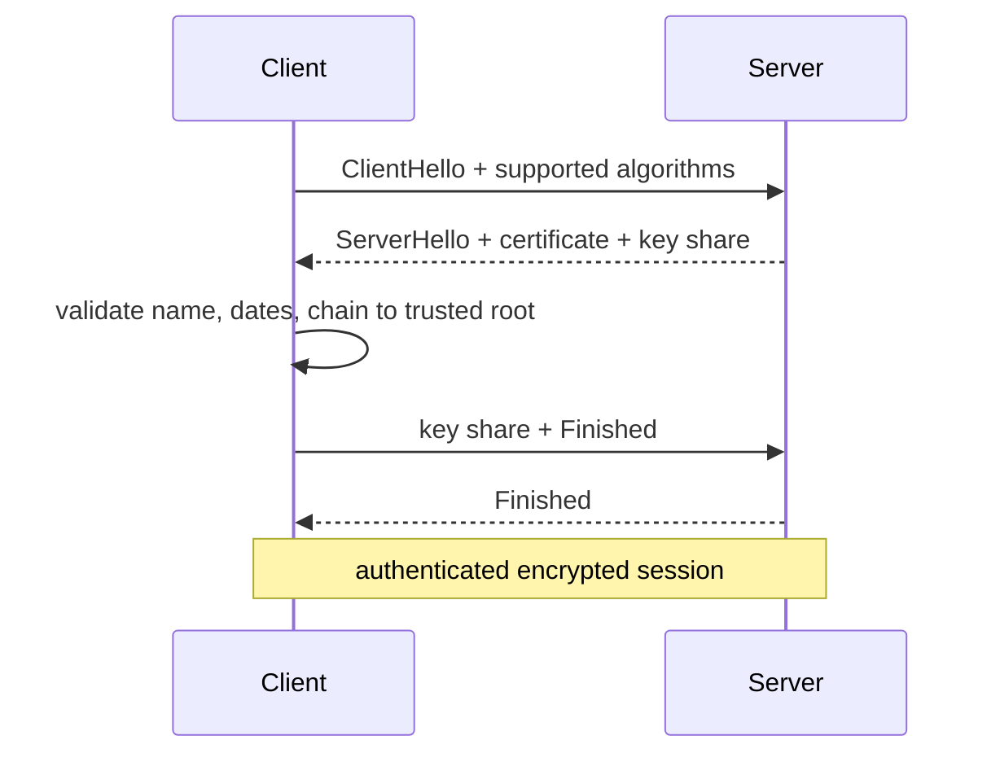

```text
leaf certificate -> signed by intermediate CA -> signed by trusted root
hostname + validity + usage + revocation/validation policy must also pass

registration: password + unique salt -> slow password KDF -> stored verifier
login:        candidate + stored salt -> same KDF -> constant-time compare
```

!!! note "Intuition"
    "Slow" is a feature, not a limitation, for password hashing. A fast hash
    (like the ones used for file integrity) lets an attacker with a stolen
    database try billions of password guesses per second. A deliberately slow
    KDF (bcrypt/scrypt/Argon2) makes each guess expensive, which is the actual
    defense — the algorithm choice *is* the control.

Crypto does not authorize Alice to Bob's note, preserve deleted data, stop
SSRF, make a compromised endpoint trustworthy, or repair poor key custody.

## 7 — Telemetry: evidence is an engineered data product

!!! note "Intuition"
    Treat your logging pipeline like a product with its own users (analysts,
    detections, auditors) and its own quality bar — not an afterthought that
    "just captures what happened." A detection rule is only as good as the
    field it depends on; if that field is sometimes missing, sometimes
    malformed, or arrives five minutes late, the rule silently degrades and
    nobody notices until an incident.

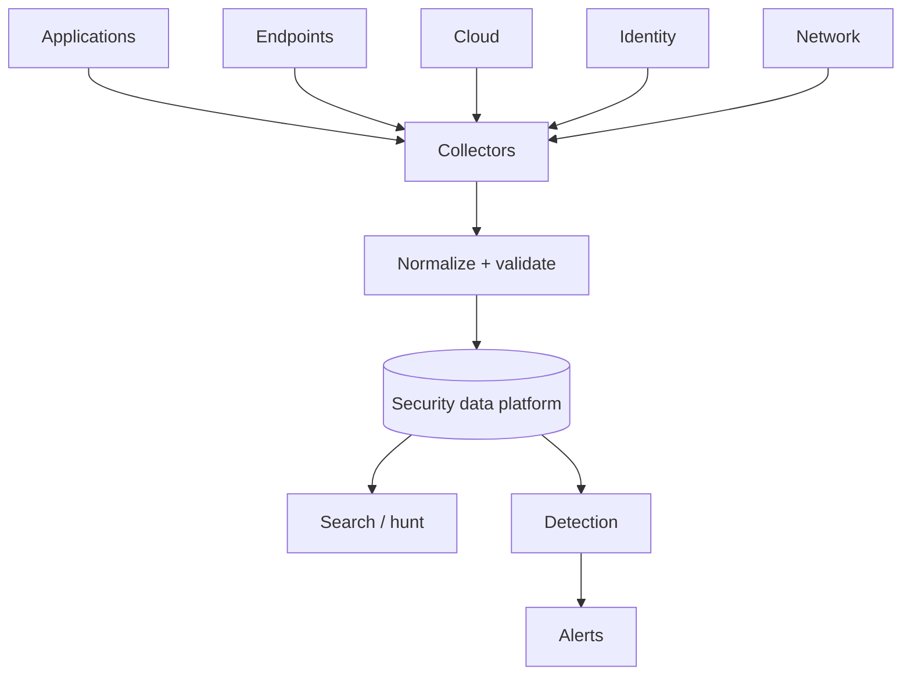

Event = occurrence; log = record; telemetry = measurement stream; evidence =
relevant data plus trustworthy handling; alert = detection output needing
attention; incident = adverse situation requiring coordinated handling.
Test missing fields, malformed JSON, duplicate delivery, clock skew, and a
collector outage—not only the happy path.

!!! tip "Hint"
    Pick one detection rule you care about and trace its one required field
    all the way back to the producing application. If you can't point to the
    exact line of code that emits that field, you don't actually know whether
    the rule will fire when it needs to — you're trusting an assumption, not
    a verified pipeline.

## 8 — ATT&CK: map behavior to evidence

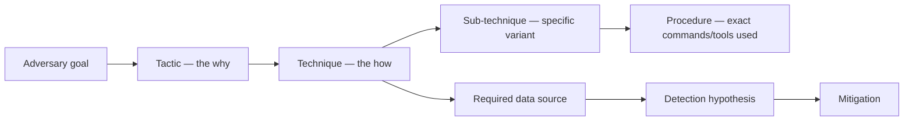

!!! note "Intuition"
    Read ATT&CK bottom-up in practice, even though it's drawn top-down here.
    You rarely start from "the adversary's goal" — you start from a
    suspicious *procedure* you observed, work out which technique it maps to,
    and only then reason about tactic-level intent. The framework is a shared
    vocabulary for comparing notes with other defenders, not a checklist to
    fill in from the top.

Red uses ATT&CK to name authorized emulation; blue to organize observations
and controls; analysts to classify with uncertainty; hunters to form testable
hypotheses; detection engineers to state telemetry requirements. A green
matrix cell proves none of prevention, detection fidelity, or response quality.

!!! tip "Hint"
    "We have a detection mapped to this technique" and "we would actually
    catch this technique in production" are different claims. The matrix
    cell only proves the first one. Section 9's replay loop is how you test
    the second.

## 9 — One compromised service, three team views

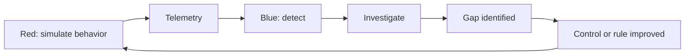

!!! note "Intuition"
    This is a loop, not a one-time exercise — notice the arrow returns to
    Red at the end. Purple teaming isn't a separate team so much as a
    discipline: red and blue deliberately closing the loop together instead
    of working in isolation and comparing reports months later.

| Red | Blue | Purple |
| --- | --- | --- |
| Authorized path finding under RoE | Prevent, detect, respond, recover | Hypothesis-driven validation together |
| Produces path, evidence, impact | Produces controls, alerts, cases, recovery | Produces measured coverage delta |
| Failure: scope creep | Failure: alert theatre | Failure: mapping without replay |

The safe experiment is: predict DET-003 → simulate local SSRF → inspect event
and alert → block metadata → replay → add visibility for the blocked attempt.

!!! tip "Hint"
    Notice the experiment doesn't stop at "block metadata." The last step —
    replay, and confirm you now have visibility into the *blocked* attempt —
    is the part people skip. A control that blocks silently is one incident
    away from someone removing it because "nothing ever happens," since no
    one can see it working.

## 10 — SOC: turn signals into accountable decisions

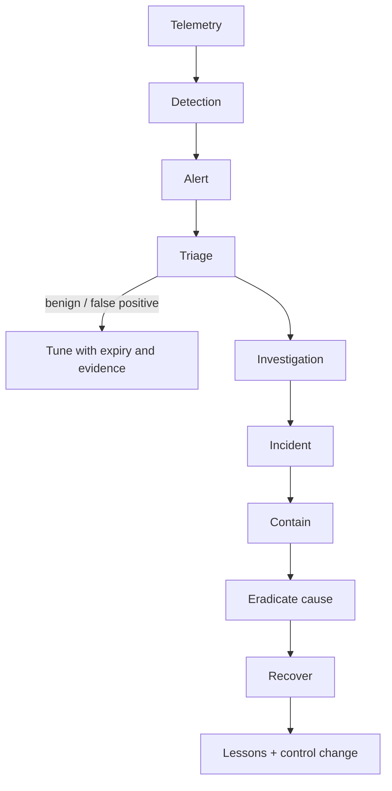

!!! note "Intuition"
    The `TUNE` branch is easy to skim past but it's where most SOCs quietly
    fail: every alert triaged as a false positive is a fork in the road. Take
    the lazy fork (silently dismiss) enough times and you get alert fatigue;
    take the disciplined fork (tune the rule, with an expiry so the exception
    doesn't outlive its reason) and the signal-to-noise ratio actually
    improves over time instead of decaying.

| SIEM | EDR | NDR | SOAR |
| --- | --- | --- | --- |
| Correlates stored events | Endpoint behavior and response | Network behavior/metadata | Orchestrates defined workflows |
| Broad context, data-cost risk | Host depth, agent dependency | Useful where host visibility is weak | Speeds repetition, amplifies bad logic |

Measure MTTD/MTTA/MTTR with explicit start/end definitions, plus fidelity,
investigation quality, and control effectiveness. Ticket closure alone rewards
the wrong behavior and contributes to fatigue.

!!! tip "Hint"
    Before quoting an MTTR number, ask "detected-to-contained, or
    reported-to-closed?" Teams that optimize the metric instead of the
    outcome tend to gravitate toward whichever start/end pair makes the
    number look best, which is exactly the "ticket closure rewards the wrong
    behavior" trap the last sentence is warning about.

## 11 — Detection and incident response: hypotheses become code

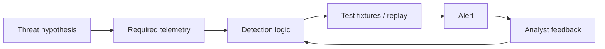

!!! note "Intuition"
    A detection rule is code, and code without tests degrades silently. The
    `TEST` node is not optional polish — it's the difference between "I wrote
    a rule that I believe detects SSRF" and "I have a fixture that proves
    this rule fires on SSRF and stays quiet on normal traffic."

```text
Detection -> validate -> scope -> contain -> eradicate -> recover -> learn
```

| Signature/IOC | Anomaly | Behavior |
| --- | --- | --- |
| Known value/pattern | Deviation from baseline | Meaningful sequence/action |
| Precise but brittle | Finds novelty but can be noisy | More resilient, needs context |

Preserve originals, inventory evidence, state competing hypotheses, build a
UTC timeline, separate root cause from contributing controls, and verify
recovery by replay. Sigma expresses log-query ideas portably; YARA describes
content patterns. Neither is a complete investigation.

!!! tip "Hint"
    "State competing hypotheses" is the step most people skip under time
    pressure, and it's the one most likely to save you from an embarrassing
    correction later. Write down the boring explanation ("scheduled job,"
    "known test traffic") alongside the alarming one before you start
    digging — it costs one sentence and it is often the answer.

## 12 — Agentic SOC: separate reasoning from authority

```text
Chatbot -> copilot -> workflow automation -> tool-using agent -> bounded autonomy
          increasing tools, state, and delegated decision scope ---------->
```

!!! note "Intuition"
    This spectrum is really a spectrum of *blast radius if the reasoning is
    wrong*, not a spectrum of how smart the system is. A chatbot that gives a
    bad answer wastes an analyst's time. A tool-using agent that gives a bad
    answer and can also act on it can cause an incident. The diagram below
    exists because the fix isn't "make the model smarter" — it's "put a
    policy engine and a human between reasoning and any action with
    consequences."

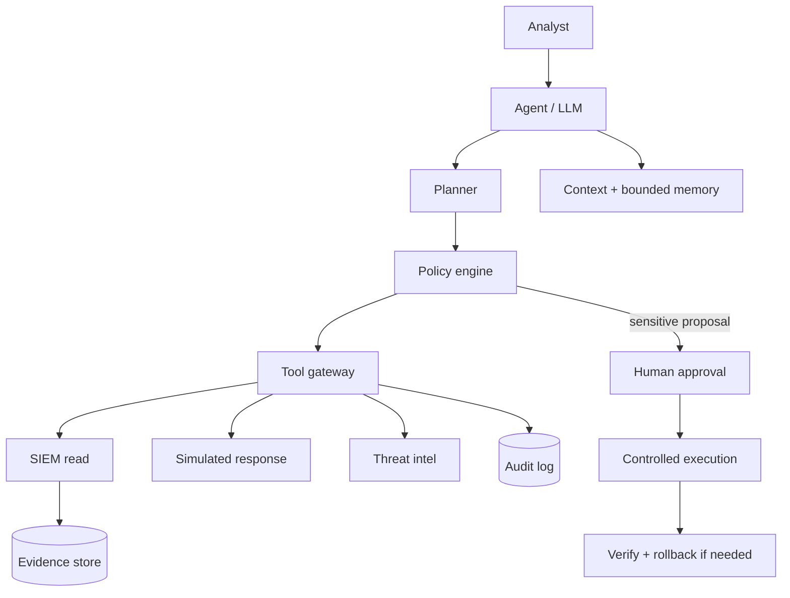

| Rule automation | LLM copilot | Bounded agent |
| --- | --- | --- |
| Deterministic steps | Drafts/summarizes for a human | Selects allowed tools within policy |
| Predictable, brittle | Flexible language, may hallucinate | Larger blast radius; needs audit and approvals |

Treat logs, retrieved documents, playbooks, and tool output as differently
trusted inputs. Evaluate precision, recall, groundedness, action correctness,
containment safety, latency, and cost. Test prompt injection in a synthetic
log, unavailable enrichment, misleading evidence, denied approval, tool
failure, verification failure, and rollback.

!!! tip "Hint"
    The vulnerable input in "test prompt injection in a synthetic log" is
    easy to underestimate: it means a *log line itself* — content an
    attacker already controls, like a username or user-agent string — can
    contain text crafted to look like an instruction to the model reading
    it. This is section 4's "data becomes code" pattern again, just with an
    LLM as the interpreter instead of a SQL engine or a browser.

## 13 — Security architecture: compare before and after

```text
INSECURE
Internet -> API (shared secret, broad DB, broad egress) -> shared database
              +---------------------------------------> metadata
CI (long-lived prod key) -> mutable image tag -> cluster-admin deployment

IMPROVED
Internet -> gateway -> API (audience identity, object policy) -> scoped data
                       +--deny--> metadata
                       +-------> protected audit pipeline
CI OIDC -> signed immutable artifact -> admission -> non-root workload
```

!!! note "Intuition"
    Notice every line in `IMPROVED` is narrower than its counterpart in
    `INSECURE` — broad database access becomes scoped data, a long-lived key
    becomes short-lived OIDC, a mutable tag becomes a signed immutable
    artifact. "More secure" in this course almost always means "the same
    capability, with a tighter, more specific, more revocable boundary
    around it" — not an extra product bolted on top.

Annotate every production diagram with trust boundaries, identity paths,
data classification, allowed network paths, enforcement points, telemetry,
and owners. State trade-offs: aggressive blocking vs availability;
centralized authorization vs failure domain; logging vs privacy/cost;
encryption vs inspection; isolation vs operability; least privilege vs
delivery speed. The output is a decision with residual risk, not "add WAF."

!!! tip "Hint"
    If a design review's conclusion is a product name instead of a sentence
    about residual risk, the review didn't finish. "Add a WAF" doesn't say
    what risk remains after adding it, for whom, or under what failure mode —
    "add a WAF, which reduces but doesn't eliminate injection risk, and does
    nothing for BOLA" does.

## 14 — Future: confidence labels prevent hype

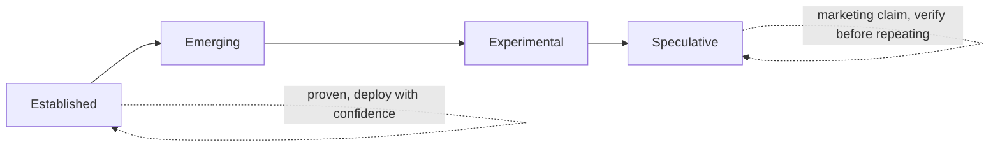

!!! note "Intuition"
    Confidence labels are a discipline for reading vendor and news claims,
    not just an academic exercise. When you hear "AI will replace the SOC,"
    the useful question isn't agree/disagree — it's "which column does this
    claim actually belong in, and what evidence would move it one column to
    the left?"

| Established | Emerging | Experimental | Speculative |
| --- | --- | --- | --- |
| least privilege, threat modeling, detection-as-code, supply-chain controls | agent-assisted investigation, AI-app security practice, security data platforms | bounded autonomous containment in narrow environments, privacy-preserving analytic prototypes | broad unsupervised SOC replacement, precise quantum timelines |

```text
new component: model / vector store / agent / tool
        |
        v
same questions: identity? authority? untrusted input? evidence? failure mode?
```

AI may change attacker cost and defender workflow; dependencies, identities,
cloud-native control planes, deepfakes, fraud, privacy analytics, and
post-quantum migration all change at different rates. Recheck authoritative
sources before acting. Ten years from now, boundaries, least privilege,
secure defaults, evidence quality, incident learning, and clear risk decisions
will still matter.

!!! tip "Hint"
    Run that five-question checklist on the *agentic SOC* diagram in
    section 12 — it's the same checklist, applied. That's not a coincidence:
    it's meant to show you the "new component" box in this diagram is the
    same box as `AGENT` two sections ago, and the questions don't change just
    because the component is newer.

## 15 — ML/AI system security: the model is the asset now

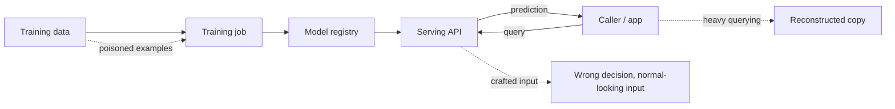

!!! note "Intuition"
    Redraw this as Module 5's supply-chain diagram with different labels —
    `developer→source→CI→artifact→registry→runtime` becomes
    `data→training→registry→serving`. The shapes of the attacks are
    familiar too: poisoning is tampering with the "source," extraction is
    theft via the public "runtime" API, and a crafted input is section 4's
    "data becomes code" pattern with the model as the unsafe interpreter.

| Attack | Targets | Looks like | Primary control |
| --- | --- | --- | --- |
| Data poisoning | Training pipeline integrity | A backdoored or biased model, discovered late | Provenance + eval on trusted held-out data |
| Model extraction | Confidentiality/availability of the model | A very active, very ordinary-looking API client | Rate limiting + query auditing |
| Adversarial input | Serving-time integrity | A normal-looking input, wrong output | Robustness testing, not encryption |
| Excessive agency | Blast radius of a wrong output | A correct-sounding action with real consequences | Tool-scoped policy + human approval (Module 12) |

!!! tip "Hint"
    "Encrypt the model file" answers a question nobody asked. Model
    extraction only requires **query access** to a public API — the file
    never has to leave the server. Defend the query path (rate limits,
    auditing, watermarking), not the artifact at rest.

## 16 — Availability: the third leg of the CIA triad

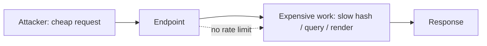

!!! note "Intuition"
    Section 1's asset question already named "unavailable" as a first-class
    harm, next to "disclosed" and "changed" — this is the section that
    finally spends time on it. The interesting failure isn't always a flood
    of traffic; it's one request that costs the attacker a cent and costs
    your server a dollar. Scaling out doesn't fix a bad cost ratio — it just
    makes losing money at a bigger scale.

```text
Volumetric:         many cheap requests -> exhaust bandwidth/connections
Asymmetric-cost:     few expensive requests -> exhaust CPU/memory per request
                      (e.g. a login endpoint's slow password hash runs on
                       every attempt, valid or not)
```

!!! tip "Hint"
    A rate limit placed *after* the expensive work already ran only stops
    the next request, not the cost of this one. Ask "what runs before I can
    even say no" — that's where the limit has to sit.

The same telemetry — a burst of `login_failure` events — can mean password
guessing (Module 3's credential-access lens) or an availability attack
(this section's lens). The fix (rate limiting) helps both; the incident
response does not.

## 17 — The human holding the credential

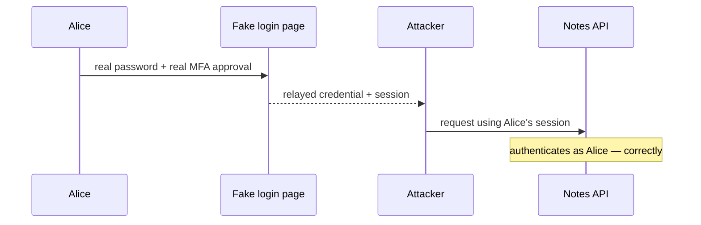

!!! note "Intuition"
    Every arrow after "Fake-->>Attacker" is indistinguishable, at the API,
    from Alice using her own account. This is why Module 3's "a valid token
    is input to authorization, not proof of permission" line matters so
    much here: authentication succeeding is not evidence the *request*
    reflects what Alice intended.

| Scenario | Access was | Detected by | Fixed by |
| --- | --- | --- | --- |
| Phishing | Never legitimately authorized | Unusual source/pattern for a known identity | Credential rotation, phishing-resistant MFA |
| Insider misuse | Legitimately authorized | Access with no business justification | Least privilege, audit review — not a technical control |

!!! tip "Hint"
    The same alert can be either row of that table. Keep both hypotheses
    open (Module 11) until evidence — not the alert — tells you which one
    you're in; picking the wrong response (rotating a credential that was
    never stolen, or missing an insider because "the login looked normal")
    wastes the response window.

## Module experiment record

Copy this for every module:

| Field | Your record |
| --- | --- |
| Question | |
| Hypothesis | |
| Scope and safety boundary | local compose + loopback only |
| Starting state | LAB_MODE, running services, clean/dirty logs |
| Normal observation | response + relevant telemetry |
| Safe abnormal stimulus | provided simulator/scenario only |
| Expected evidence/detection | event fields + rule id |
| Actual result | |
| Control applied | |
| Replay comparison | |
| Failure mode tested | missing/malformed/delayed/duplicate/unsafe recommendation/etc. |
| Cleanup / rollback | command and resulting state |
| Engineering decision | production change + residual risk |
